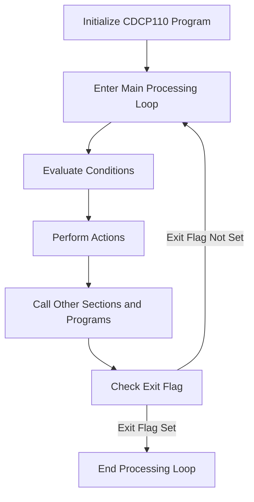

This document will cover the CDCP110 Program Flow, which includes:

1. Initializing the program
2. Entering the main processing loop
3. Evaluating conditions and performing actions
4. Calling other sections and programs.

Technical document: <SwmLink doc-title="CDCP110 Program Flow">[CDCP110 Program Flow](/.swm/cdcp110-program-flow.zik4x06w.sw.md)</SwmLink>

# Initializing the Program

The CDCP110 program begins with an initialization phase. During this phase, the system sets up all necessary parameters and prepares the environment for the main processing loop. This ensures that all subsequent operations have the required context and resources to execute correctly.

# Entering the Main Processing Loop

After initialization, the program enters the main processing loop. This loop is the core of the CDCP110 program, where it continuously evaluates various conditions and performs corresponding actions. The loop continues to run until an exit flag is set, indicating that the program should terminate.

# Evaluating Conditions and Performing Actions

Within the main processing loop, the program evaluates several conditions to determine the appropriate actions to take. These conditions include:

- **Centralizing Data**: If the centralization flag is set, the program centralizes the data to ensure consistency across the system.
- **Printing Reports**: If the printer flag is set, the program generates and prints reports based on the current data.
- **Loading Lists**: The program loads various lists required for processing, ensuring that all necessary data is available.
- **Verifying Access**: The program checks user access levels to ensure that only authorized users can perform certain actions.

Each of these actions is crucial for maintaining the integrity and functionality of the system.

# Calling Other Sections and Programs

The CDCP110 program also calls other sections and programs to handle specific tasks. One such section is CHAMA-ALTERACAO, which prepares data and calls the CHP013T program to handle specific alterations. This involves moving data into a string and then using a call statement to invoke the CHP013T program. This modular approach allows for better organization and separation of concerns within the system.

# Checking the Exit Flag

At the end of each iteration of the main processing loop, the program checks an exit flag. If the exit flag is set, the program terminates the loop and ends the processing. If the exit flag is not set, the program continues to evaluate conditions and perform actions in the next iteration of the loop. This mechanism ensures that the program runs continuously until a specific condition signals that it should stop.

&nbsp;

*This is an auto-generated document by Swimm AI 🌊 and has not yet been verified by a human*

<SwmMeta version="3.0.0" repo-id="Z2l0aHViJTNBJTNBa2VsbG8lM0ElM0Fzd2ltbWlv" repo-name="kello">Powered by [Swimm](/)</SwmMeta>
