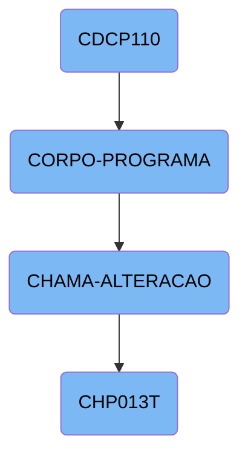

In this document, we will explain the flow of the <SwmToken path="src/cdcp110.cbl" pos="3:6:6" line-data="       PROGRAM-ID. CDCP110.">`CDCP110`</SwmToken> program. The process involves initializing the program, entering the main processing loop, evaluating various conditions, performing corresponding actions, and calling other sections and programs.

The flow starts with the initialization of the <SwmToken path="src/cdcp110.cbl" pos="3:6:6" line-data="       PROGRAM-ID. CDCP110.">`CDCP110`</SwmToken> program. Once initialized, it enters the main processing loop, where it continuously evaluates different conditions and performs actions based on those conditions. These actions include centralizing data, printing reports, loading lists, verifying access, and calling other sections like <SwmToken path="src/cdcp110.cbl" pos="562:1:3" line-data="       CHAMA-ALTERACAO SECTION.">`CHAMA-ALTERACAO`</SwmToken>. The <SwmToken path="src/cdcp110.cbl" pos="562:1:3" line-data="       CHAMA-ALTERACAO SECTION.">`CHAMA-ALTERACAO`</SwmToken> section prepares data and calls the <SwmToken path="src/cdcp110.cbl" pos="575:4:4" line-data="           CALL   &quot;CHP013T&quot; USING PARAMETROS-W PASSAR-STRING-1">`CHP013T`</SwmToken> program to handle specific alterations. This process continues until an exit flag is set, signaling the end of the main processing loop.

# Flow drill down



<SwmSnippet path="/src/cdcp110.cbl" line="229">

---

## <SwmToken path="src/cdcp110.cbl" pos="3:6:6" line-data="       PROGRAM-ID. CDCP110.">`CDCP110`</SwmToken>

The <SwmToken path="src/cdcp110.cbl" pos="3:6:6" line-data="       PROGRAM-ID. CDCP110.">`CDCP110`</SwmToken> function initializes the program and then enters the main processing loop by performing the <SwmToken path="src/cdcp110.cbl" pos="231:3:5" line-data="           PERFORM CORPO-PROGRAMA UNTIL GS-EXIT-FLG-TRUE.">`CORPO-PROGRAMA`</SwmToken> section until the exit flag is set.

```cobol
       MAIN-PROCESS SECTION.
           PERFORM INICIALIZA-PROGRAMA.
           PERFORM CORPO-PROGRAMA UNTIL GS-EXIT-FLG-TRUE.
```

---

</SwmSnippet>

<SwmSnippet path="/src/cdcp110.cbl" line="349">

---

## <SwmToken path="src/cdcp110.cbl" pos="349:1:3" line-data="       CORPO-PROGRAMA SECTION.">`CORPO-PROGRAMA`</SwmToken>

The <SwmToken path="src/cdcp110.cbl" pos="349:1:3" line-data="       CORPO-PROGRAMA SECTION.">`CORPO-PROGRAMA`</SwmToken> section evaluates various conditions and performs corresponding actions. It handles tasks such as centralizing data, printing reports, loading lists, verifying access, and calling other sections like <SwmToken path="src/cdcp110.cbl" pos="562:1:3" line-data="       CHAMA-ALTERACAO SECTION.">`CHAMA-ALTERACAO`</SwmToken>.

```cobol
       CORPO-PROGRAMA SECTION.
           EVALUATE TRUE
               WHEN GS-CENTRALIZA-TRUE
                   PERFORM CENTRALIZAR
               WHEN GS-PRINTER-FLG-TRUE
                    COPY IMPRESSORA.CHAMA.
                    IF LNK-MAPEAMENTO <> SPACES
                       MOVE GS-ACP-CONTA         TO CONTA-REL
                       MOVE GS-DESC-CONTA        TO NOME-CONTA-REL
                       MOVE GS-FORMA-PAG         TO FORMA-PGTO-REL
                       MOVE GS-RECEBEDOR         TO RECEBEDOR-REL

                       IF GS-OPCAO = 1
                          PERFORM IMPRIME-RELATORIO
                       ELSE
                          PERFORM IMPRIME-RELATORIO2
                       END-IF
                    END-IF
               WHEN GS-GRAVA-WORK-FLG-TRUE
                    PERFORM GRAVA-WORK
                    IF GS-OPCAO = 1
```

---

</SwmSnippet>

<SwmSnippet path="/src/cdcp110.cbl" line="562">

---

### Calling <SwmToken path="src/cdcp110.cbl" pos="575:4:4" line-data="           CALL   &quot;CHP013T&quot; USING PARAMETROS-W PASSAR-STRING-1">`CHP013T`</SwmToken>

The <SwmToken path="src/cdcp110.cbl" pos="562:1:3" line-data="       CHAMA-ALTERACAO SECTION.">`CHAMA-ALTERACAO`</SwmToken> section prepares data and calls the <SwmToken path="src/cdcp110.cbl" pos="575:4:4" line-data="           CALL   &quot;CHP013T&quot; USING PARAMETROS-W PASSAR-STRING-1">`CHP013T`</SwmToken> program to handle specific alterations. It moves data into a string and then uses the <SwmToken path="src/cdcp110.cbl" pos="575:1:1" line-data="           CALL   &quot;CHP013T&quot; USING PARAMETROS-W PASSAR-STRING-1">`CALL`</SwmToken> statement to invoke <SwmToken path="src/cdcp110.cbl" pos="575:4:4" line-data="           CALL   &quot;CHP013T&quot; USING PARAMETROS-W PASSAR-STRING-1">`CHP013T`</SwmToken>.

```cobol
       CHAMA-ALTERACAO SECTION.
           IF GS-LINDET = SPACES
              MOVE ZEROS TO GS-LINDET.

           MOVE GS-LINDET(150: 8) TO PASSAR-STRING-1(1: 8)
                                     DATA-MOVTO-CH10
                                     DATA-MOVTO-WK
           MOVE GS-LINDET(158: 4) TO PASSAR-STRING-1(10: 4)
                                     SEQ-CH10
                                     SEQ-WK.
           MOVE USUARIO-W         TO PASSAR-STRING-1(20: 5)
           MOVE COD-USUARIO-W     TO PASSAR-STRING-1(26: 3)

           CALL   "CHP013T" USING PARAMETROS-W PASSAR-STRING-1
           CANCEL "CHP013T".
```

---

</SwmSnippet>

<SwmSnippet path="/src/chp/Chp013t.cbl" line="114">

---

## <SwmToken path="src/cdcp110.cbl" pos="575:4:4" line-data="           CALL   &quot;CHP013T&quot; USING PARAMETROS-W PASSAR-STRING-1">`CHP013T`</SwmToken>

The <SwmToken path="src/cdcp110.cbl" pos="575:4:4" line-data="           CALL   &quot;CHP013T&quot; USING PARAMETROS-W PASSAR-STRING-1">`CHP013T`</SwmToken> function starts by performing its initialization section. This sets up the necessary environment and variables for the program to run.

```cobol
       MAIN-PROCESS SECTION.
           PERFORM INICIALIZA-PROGRAMA.
```

---

</SwmSnippet>

&nbsp;

*This is an auto-generated document by Swimm AI 🌊 and has not yet been verified by a human*

<SwmMeta version="3.0.0" repo-id="Z2l0aHViJTNBJTNBa2VsbG8lM0ElM0Fzd2ltbWlv" repo-name="kello"><sup>Powered by [Swimm](/)</sup></SwmMeta>
