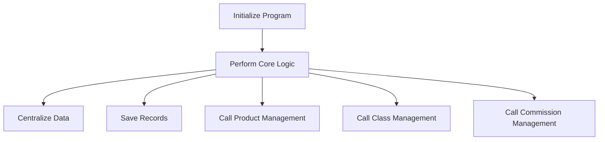

This document will cover the COP040 process, which includes:

1. Initializing the program
2. Performing core logic repeatedly
3. Calling various sections to handle specific tasks.

Technical document: <SwmLink doc-title="Overview of COP040 Process">[Overview of COP040 Process](/.swm/overview-of-cop040-process.odahywrk.sw.md)</SwmLink>

# Initializing the Program

The COP040 process begins with initializing the program. This step sets up the necessary environment and prepares the system for executing the core logic. It ensures that all required resources are available and that the system is in a ready state to perform subsequent operations.

# Performing Core Logic Repeatedly

After initialization, the COP040 process enters a loop where it performs the main program logic repeatedly. This core logic includes evaluating various conditions and performing actions based on those conditions. For example, it centralizes data, saves records, and calls other sections to handle specific tasks. This loop continues until an exit condition is met, ensuring that the core business operations are continuously managed.

# Centralizing Data

One of the key actions within the core logic is centralizing data. This involves gathering data from various sources and consolidating it into a central repository. This step ensures that all relevant data is available in one place, making it easier to manage and analyze.

# Saving Records

Another important action is saving records. This involves storing the current state of data into the system's database. It ensures that any changes made during the execution of the core logic are persisted and can be retrieved later. This step is crucial for maintaining data integrity and consistency.

# Calling Product Management

The COP040 process also calls specific sections to handle product management tasks. For example, it calls the CHAMAR-PRODUTO section to manage product-related operations. This section prepares the necessary data and calls the COP045 function to perform the actual product management tasks. This modular approach ensures that product management is handled efficiently and separately from other business operations.

# Calling Class Management

Similarly, the COP040 process calls the CHAMAR-TURMA section to handle class management tasks. This section prepares the necessary parameters and calls the COP041X function to manage class-related operations. This separation of concerns ensures that class management is handled independently and efficiently.

# Calling Commission Management

Lastly, the COP040 process calls the CHAMAR-COMISSAO section to handle commission management tasks. This section calls the CGP010X program using specific parameters to manage commission-related operations. This modular approach ensures that commission management is handled separately and efficiently.

&nbsp;

*This is an auto-generated document by Swimm AI 🌊 and has not yet been verified by a human*

<SwmMeta version="3.0.0" repo-id="Z2l0aHViJTNBJTNBa2VsbG8lM0ElM0Fzd2ltbWlv" repo-name="kello">Powered by [Swimm](/)</SwmMeta>
