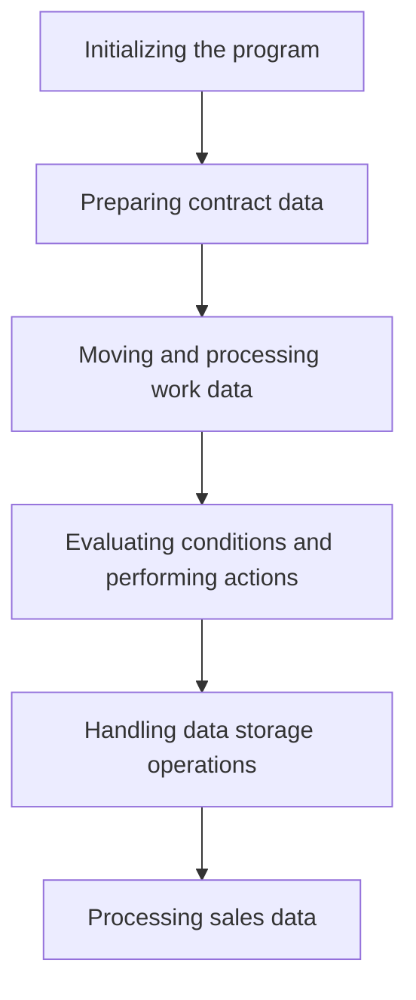

This document will cover the COP104 flow, which includes:

1. Initializing the program
2. Preparing contract data
3. Moving and processing work data
4. Evaluating conditions and performing actions
5. Handling data storage operations
6. Processing sales data.

Technical document: <SwmLink doc-title="Overview of COP104 Flow">[Overview of COP104 Flow](/.swm/overview-of-cop104-flow.0260kbeb.sw.md)</SwmLink>

# Initializing the program

The COP104 program begins by setting up necessary parameters and initializing the environment. This includes accepting parameters from the command line, copying essential data, and setting initial values for various data blocks. This step ensures that the program has all the required information and is in a ready state to process further tasks.

# Preparing contract data

In this step, the program prepares contract data by formatting date values and reading records from the COD040 file. It processes each record to update contract information. If certain conditions are met, it triggers the next step to move and process work data. This ensures that all contract data is correctly formatted and up-to-date before further processing.

# Moving and processing work data

This step involves initializing work records and processing contract data. The program searches for status, reads city and region information, calculates various metrics, and updates work records. This is crucial for transforming data into a format that can be used for further processing in the flow.

# Evaluating conditions and performing actions

During this step, the program evaluates various conditions and performs corresponding actions. For example, if a certain flag is true, it prompts the user with a message and, based on the response, calls the function to handle data storage operations. This step ensures that the program can dynamically respond to different conditions and user inputs.

# Handling data storage operations

In this step, the program handles data storage operations by checking the status of work data, performing file operations, and calling functions to process sales or contract data based on specific conditions. This ensures that all processed data is correctly stored and can be retrieved or used for further operations.

# Processing sales data

The final step involves processing sales data. The program initializes records, performs various data moves and calls, and evaluates conditions to execute specific procedures related to sales. It also handles file operations and computes various metrics related to sales. This step ensures that all sales data is accurately processed and stored.

&nbsp;

*This is an auto-generated document by Swimm AI 🌊 and has not yet been verified by a human*

<SwmMeta version="3.0.0" repo-id="Z2l0aHViJTNBJTNBa2VsbG8lM0ElM0Fzd2ltbWlv" repo-name="kello">Powered by [Swimm](/)</SwmMeta>
