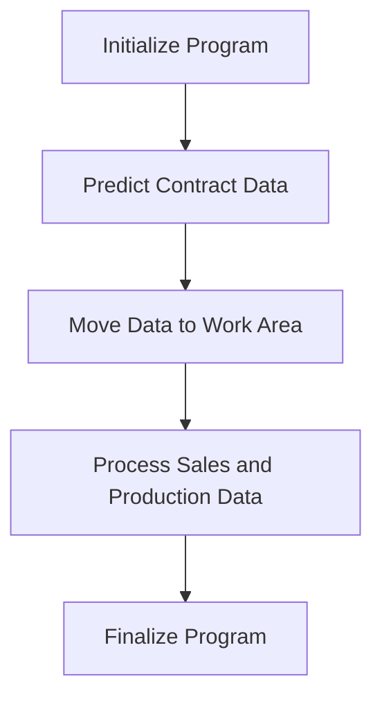

This document will cover the COP104 Program Flow, which includes:

1. Initializing the Program
2. Predicting Contract Data
3. Moving Data to the Work Area
4. Processing Sales and Production Data
5. Finalizing the Program

Technical document: <SwmLink doc-title="Overview of COP104 Program Flow">[Overview of COP104 Program Flow](/.swm/overview-of-cop104-program-flow.cbakl3td.sw.md)</SwmLink>

# Initializing the Program

The initialization phase sets up the environment for the COP104 program. It begins by accepting parameters from the command line, which allows the program to be configured based on user input or other external factors. This phase also involves setting up necessary data structures and preparing the system for the main processing tasks. This ensures that the program has all the required information and resources to function correctly.

# Predicting Contract Data

In this phase, the program predicts contract data by reading initial and final month-year values and processing records from the COD040 file. This step is crucial for forecasting and planning purposes, as it helps in understanding future contract obligations and opportunities. The program updates contract information based on the records it processes, ensuring that the data is current and accurate.

# Moving Data to the Work Area

This step involves transferring relevant data to a designated work area for further processing. The program reads various records, updates fields such as city, region, and representative, and performs calculations for commissions and sponsorships. This ensures that all necessary data is organized and ready for subsequent operations, facilitating smooth and efficient processing.

# Processing Sales and Production Data

During this phase, the program handles sales and production data by initializing records, converting dates, and managing auxiliary files. It evaluates data options to perform specific tasks like calculating commissions, updating records, and preparing data for reports. This step ensures that sales and production data are accurately processed and integrated with other system components, providing valuable insights for business operations.

# Finalizing the Program

The finalization phase involves performing any necessary cleanup tasks and ensuring that all data has been correctly processed and stored. This includes closing files, releasing resources, and preparing the system for the next run. This step is essential for maintaining data integrity and ensuring that the program can be executed again without issues.

&nbsp;

*This is an auto-generated document by Swimm AI 🌊 and has not yet been verified by a human*

<SwmMeta version="3.0.0" repo-id="Z2l0aHViJTNBJTNBa2VsbG8lM0ElM0Fzd2ltbWlv" repo-name="kello">Powered by [Swimm](/)</SwmMeta>
