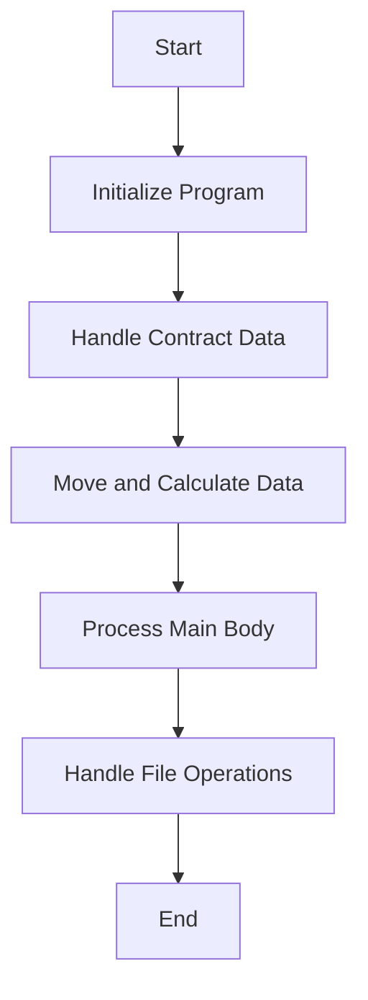

This document will cover the COP104 Program Flow, which includes:

1. Initializing the Program
2. Handling Contract Data
3. Moving and Calculating Data
4. Processing the Main Body of the Program
5. Handling File Operations and Data Processing

Technical document: <SwmLink doc-title="Overview of COP104 Program Flow">[Overview of COP104 Program Flow](/.swm/overview-of-cop104-program-flow.e19qgrra.sw.md)</SwmLink>

# Initializing the Program

The program begins by initializing itself and accepting parameters from the command line. This step sets up the necessary environment for the program to run. It involves setting initial values, loading necessary data, and preparing the system for further operations. This ensures that the program starts with the correct configuration and data.

# Handling Contract Data

In this step, the program processes contract-related data. It reads records from the contract file and performs necessary operations to ensure that the contract data is correctly handled. This includes moving initial and final month-year values and reading records until a specific condition is met. This step is crucial for ensuring that all contract data is accurately processed and available for further operations.

# Moving and Calculating Data

This step involves initializing work registers and performing various data movements and calculations. The program reads data from multiple files, processes city and region information, calculates commissions, and prepares data for further processing. This ensures that all necessary data is correctly moved and calculated for subsequent operations, which is essential for accurate data processing and reporting.

# Processing the Main Body of the Program

The main body of the program evaluates different conditions and performs corresponding actions. For example, if a specific flag is true, it displays a message and, based on the user's response, performs the necessary operations. This step is crucial for determining the flow of operations based on various conditions and user inputs, ensuring that the program runs smoothly and efficiently.

# Handling File Operations and Data Processing

This step handles file operations and data processing. The program checks the status of the work file, performs file operations like closing, deleting, and opening the work file, and then decides whether to process sales or production data based on specific conditions. This ensures that all file operations are correctly handled and that the necessary data is processed accurately.

&nbsp;

*This is an auto-generated document by Swimm AI 🌊 and has not yet been verified by a human*

<SwmMeta version="3.0.0" repo-id="Z2l0aHViJTNBJTNBa2VsbG8lM0ElM0Fzd2ltbWlv" repo-name="kello">Powered by [Swimm](/)</SwmMeta>
