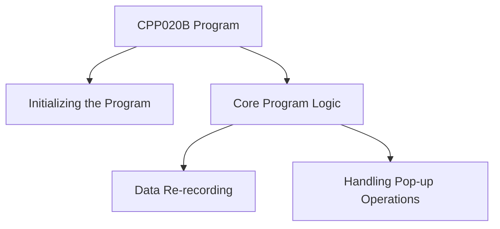

This document will cover the CPP020B Program, which includes:

1. Initializing the Program
2. Core Program Logic
3. Data Re-recording
4. Handling Pop-up Operations

Technical document: <SwmLink doc-title="Overview of CPP020B Program">[Overview of CPP020B Program](/.swm/overview-of-cpp020b-program.wvpppes3.sw.md)</SwmLink>

# Initializing the Program

The CPP020B program begins by setting up necessary parameters and initial states. This step ensures that all required variables and configurations are correctly initialized before any further operations are performed. This initialization is crucial for the program to function correctly and avoid any runtime errors.

# Core Program Logic

The core logic of the CPP020B program involves evaluating various conditions and executing corresponding actions. This section handles different flags such as `SAVE`, `LOAD`, and `EXCLUDE`. Each flag triggers a specific operation, like saving data, loading data, or excluding records. This logic ensures that the program performs the correct actions based on the current state and user inputs.

# Data Re-recording

The data re-recording section is responsible for saving data, validating date limits, and logging operation details. This step ensures that all data changes are correctly recorded and validated. If the data rewrite is successful, the operation details such as user, date, time, and program name are logged. This logging is essential for maintaining an audit trail and ensuring data integrity.

# Handling Pop-up Operations

The pop-up operations section handles interactions with external modules based on user selections. It performs different actions such as loading supplier data and calling various external programs. This section is crucial for updating the main program's state with data retrieved from these external modules, ensuring that the program has the most up-to-date information.

&nbsp;

*This is an auto-generated document by Swimm AI 🌊 and has not yet been verified by a human*

<SwmMeta version="3.0.0" repo-id="Z2l0aHViJTNBJTNBa2VsbG8lM0ElM0Fzd2ltbWlv" repo-name="kello">Powered by [Swimm](/)</SwmMeta>
