In this document, we will explain the flow of the <SwmToken path="src/kello/cpp022a.cbl" pos="3:6:6" line-data="       PROGRAM-ID. CPP022a.">`CPP022a`</SwmToken> program. The process involves initializing the program, executing the main logic, and calling other programs for specific tasks.

The flow starts with the initialization of the <SwmToken path="src/kello/cpp022a.cbl" pos="3:6:6" line-data="       PROGRAM-ID. CPP022a.">`CPP022a`</SwmToken> program, setting up the necessary environment. Then, it moves to the main processing section where various conditions are evaluated, and corresponding actions are performed, such as saving data and updating records. Finally, it calls another program, <SwmToken path="src/kello/cpp022a.cbl" pos="1158:4:4" line-data="           CALL &quot;CXP020T&quot; USING PASSAR-PARAMETROS">`CXP020T`</SwmToken>, to handle specific tasks and reads the updated code before completing the process.

# Flow drill down

```mermaid
graph TD;
      subgraph src/kello
bf9b90a29fd85bddbfe7bfc7a36a2810634e7a7822f74bf8de791d2af287b646(CPP022a):::mainFlowStyle --> 6c9a5705e90514dcdcb6f57f2e45fce7643f8fc46331ef8a9e56ddfde9d53a17(CORPO-PROGRAMA):::mainFlowStyle
end

subgraph src/kello
6c9a5705e90514dcdcb6f57f2e45fce7643f8fc46331ef8a9e56ddfde9d53a17(CORPO-PROGRAMA):::mainFlowStyle --> 5616eccb97bfcb16672e17568d8ef47e49f277467faf1320698fc2a65c9e5faa(CHAMAR-APURACAO):::mainFlowStyle
end

subgraph src/kello
5616eccb97bfcb16672e17568d8ef47e49f277467faf1320698fc2a65c9e5faa(CHAMAR-APURACAO):::mainFlowStyle --> 50518e3031fd1bb8e53d707aa6046d787959e6027e111759e97ca65df1080b6b(CXP020T):::mainFlowStyle
end


      classDef mainFlowStyle color:#000000,fill:#7CB9F4
classDef rootsStyle color:#000000,fill:#00FFF4
classDef Style1 color:#000000,fill:#00FFAA
classDef Style2 color:#000000,fill:#FFFF00
classDef Style3 color:#000000,fill:#AA7CB9

%% Swimm:
%% graph TD;
%%       subgraph <SwmPath>[src/kello/](src/kello/)</SwmPath>
%% bf9b90a29fd85bddbfe7bfc7a36a2810634e7a7822f74bf8de791d2af287b646(CPP022a):::mainFlowStyle --> 6c9a5705e90514dcdcb6f57f2e45fce7643f8fc46331ef8a9e56ddfde9d53a17(CORPO-PROGRAMA):::mainFlowStyle
%% end
%% 
%% subgraph <SwmPath>[src/kello/](src/kello/)</SwmPath>
%% 6c9a5705e90514dcdcb6f57f2e45fce7643f8fc46331ef8a9e56ddfde9d53a17(CORPO-PROGRAMA):::mainFlowStyle --> 5616eccb97bfcb16672e17568d8ef47e49f277467faf1320698fc2a65c9e5faa(CHAMAR-APURACAO):::mainFlowStyle
%% end
%% 
%% subgraph <SwmPath>[src/kello/](src/kello/)</SwmPath>
%% 5616eccb97bfcb16672e17568d8ef47e49f277467faf1320698fc2a65c9e5faa(CHAMAR-APURACAO):::mainFlowStyle --> 50518e3031fd1bb8e53d707aa6046d787959e6027e111759e97ca65df1080b6b(CXP020T):::mainFlowStyle
%% end
%% 
%% 
%%       classDef mainFlowStyle color:#000000,fill:#7CB9F4
%% classDef rootsStyle color:#000000,fill:#00FFF4
%% classDef Style1 color:#000000,fill:#00FFAA
%% classDef Style2 color:#000000,fill:#FFFF00
%% classDef Style3 color:#000000,fill:#AA7CB9
```



<SwmSnippet path="/src/kello/cpp022a.cbl" line="604">

---

## <SwmToken path="src/kello/cpp022a.cbl" pos="3:6:6" line-data="       PROGRAM-ID. CPP022a.">`CPP022a`</SwmToken>

The <SwmToken path="src/kello/cpp022a.cbl" pos="3:6:6" line-data="       PROGRAM-ID. CPP022a.">`CPP022a`</SwmToken> function initializes the program and sets up the main processing section. This is where the flow begins.

```cobol
       MAIN-PROCESS SECTION.
           PERFORM INICIALIZA-PROGRAMA.
           PERFORM CORPO-PROGRAMA UNTIL CPP020-EXIT-FLG-TRUE.
           GO FINALIZAR-PROGRAMA.

       INICIALIZA-PROGRAMA SECTION.
```

---

</SwmSnippet>

<SwmSnippet path="/src/kello/cpp022a.cbl" line="852">

---

## <SwmToken path="src/kello/cpp022a.cbl" pos="852:1:3" line-data="       CORPO-PROGRAMA SECTION.">`CORPO-PROGRAMA`</SwmToken>

The <SwmToken path="src/kello/cpp022a.cbl" pos="852:1:3" line-data="       CORPO-PROGRAMA SECTION.">`CORPO-PROGRAMA`</SwmToken> function handles the main logic of the program. It evaluates various conditions and performs corresponding actions, such as saving data, updating records, and handling errors.

```cobol
       CORPO-PROGRAMA SECTION.
           EVALUATE TRUE
               WHEN CPP020-CENTRALIZA-TRUE
                   PERFORM CENTRALIZAR
               WHEN CPP020-SAVE-FLG-TRUE
                   CLOSE    CPD020 CPD021 CPD022 PFD010 CBD100 CPD023
                            LOG003 LOG001 LOG002 CPD024
                   OPEN I-O CPD020 CPD021 CPD022 PFD010 CBD100 CPD023
                            LOG003 LOG001 LOG002 CPD024
                   IF CPP020-PARCELA = 1
                      PERFORM GRAVA-PARCELAS
                   ELSE
                    PERFORM SALVAR-DADOS
                    IF CPP020-TIPO-GRAVACAO = 1
                       PERFORM REGRAVA-DADOS
                    ELSE
                       PERFORM GRAVA-DADOS
                    END-IF
                    IF CPP020-ACP-BANCO > 0
                       MOVE CPP020-COD-FORN    TO FORNEC-CP22
                       MOVE SEQ-CP21           TO SEQ-CP22
```

---

</SwmSnippet>

<SwmSnippet path="/src/kello/cpp022a.cbl" line="1157">

---

### Calling <SwmToken path="src/kello/cpp022a.cbl" pos="1158:4:4" line-data="           CALL &quot;CXP020T&quot; USING PASSAR-PARAMETROS">`CXP020T`</SwmToken>

The <SwmToken path="src/kello/cpp022a.cbl" pos="1157:1:3" line-data="       CHAMAR-APURACAO SECTION.">`CHAMAR-APURACAO`</SwmToken> function calls the <SwmToken path="src/kello/cpp022a.cbl" pos="1158:4:4" line-data="           CALL &quot;CXP020T&quot; USING PASSAR-PARAMETROS">`CXP020T`</SwmToken> program using the <SwmToken path="src/kello/cpp022a.cbl" pos="1158:9:11" line-data="           CALL &quot;CXP020T&quot; USING PASSAR-PARAMETROS">`PASSAR-PARAMETROS`</SwmToken> and then performs the <SwmToken path="src/kello/cpp022a.cbl" pos="1161:3:7" line-data="           PERFORM LE-COD-APURACAO.">`LE-COD-APURACAO`</SwmToken> function to read the updated code.

```cobol
       CHAMAR-APURACAO SECTION.
           CALL "CXP020T" USING PASSAR-PARAMETROS
           CANCEL "CXP020T"
           MOVE PASSAR-STRING-1(52: 5) TO CPP020-COD-APURACAO
           PERFORM LE-COD-APURACAO.
```

---

</SwmSnippet>

<SwmSnippet path="/src/kello/cxp020t.cbl" line="72">

---

## <SwmToken path="src/kello/cxp020t.cbl" pos="74:9:9" line-data="           PERFORM CORPO-PROGRAMA UNTIL CXP020T-EXIT-FLG-TRUE.">`CXP020T`</SwmToken>

The <SwmToken path="src/kello/cxp020t.cbl" pos="74:9:9" line-data="           PERFORM CORPO-PROGRAMA UNTIL CXP020T-EXIT-FLG-TRUE.">`CXP020T`</SwmToken> function initializes its own program and processes its main logic until the exit flag is set.

```cobol
       MAIN-PROCESS SECTION.
           PERFORM INICIALIZA-PROGRAMA.
           PERFORM CORPO-PROGRAMA UNTIL CXP020T-EXIT-FLG-TRUE.
           GO FINALIZAR-PROGRAMA.
```

---

</SwmSnippet>

<SwmSnippet path="/src/kello/cxp020t.cbl" line="94">

---

### Main Processing in <SwmToken path="src/kello/cxp020t.cbl" pos="96:3:3" line-data="               WHEN CXP020T-CENTRALIZA-TRUE">`CXP020T`</SwmToken>

The <SwmToken path="src/kello/cxp020t.cbl" pos="94:1:3" line-data="       CORPO-PROGRAMA SECTION.">`CORPO-PROGRAMA`</SwmToken> section in <SwmToken path="src/kello/cxp020t.cbl" pos="96:3:3" line-data="               WHEN CXP020T-CENTRALIZA-TRUE">`CXP020T`</SwmToken> evaluates various conditions and performs actions such as centralizing data, locating words, and handling errors. This section is crucial for the business logic as it processes the core functionalities of the <SwmToken path="src/kello/cxp020t.cbl" pos="96:3:3" line-data="               WHEN CXP020T-CENTRALIZA-TRUE">`CXP020T`</SwmToken> program.

```cobol
       CORPO-PROGRAMA SECTION.
           EVALUATE TRUE
               WHEN CXP020T-CENTRALIZA-TRUE
                    PERFORM CENTRALIZAR
               WHEN CXP020T-CARREGA-LIST-BOX-TRUE
                    PERFORM CARREGA-ULTIMOS
               WHEN CXP020T-ITEM-SELECIONADO-TRUE
                    PERFORM ITEM-SELECIONADO
               WHEN CXP020T-LOCALIZA-TRUE
                    PERFORM LOCALIZA-PALAVRA
               WHEN CXP020T-PROXIMA-TRUE
                    PERFORM LOCALIZA-PROXIMA-PALAVRA
           END-EVALUATE.
           PERFORM CLEAR-FLAGS.
           PERFORM CALL-DIALOG-SYSTEM.

       CENTRALIZAR SECTION.
          move-object-handle principal handle8
          move handle8 to wHandle
          invoke Window "fromHandleWithClass" using wHandle Window
                 returning janelaPrincipal
```

---

</SwmSnippet>

&nbsp;

*This is an auto-generated document by Swimm AI 🌊 and has not yet been verified by a human*

<SwmMeta version="3.0.0" repo-id="Z2l0aHViJTNBJTNBa2VsbG8lM0ElM0Fzd2ltbWlv" repo-name="kello"><sup>Powered by [Swimm](/)</sup></SwmMeta>
