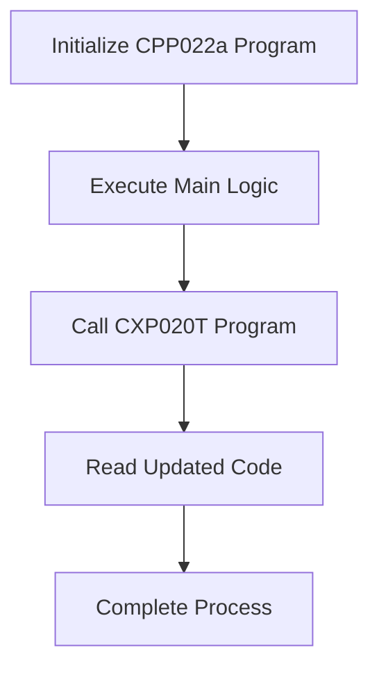

This document will cover the flow of the CPP022a program, which includes:

1. Initializing the program
2. Executing the main logic
3. Calling other programs for specific tasks.

Technical document: <SwmLink doc-title="CPP022a Program Flow">[CPP022a Program Flow](/.swm/cpp022a-program-flow.2dalfs47.sw.md)</SwmLink>

# Initializing the Program

The CPP022a program begins by setting up the necessary environment. This involves preparing the system to handle the upcoming tasks efficiently. This step ensures that all required resources and configurations are in place before the main processing begins. For the end user, this means that the system is ready to perform its tasks without any interruptions or errors.

# Executing the Main Logic

In this step, the program evaluates various conditions and performs corresponding actions. These actions include saving data, updating records, and handling errors. For example, if a certain flag is set, the program will save the data to the database. If another flag is set, it will update existing records. This ensures that the data is always current and accurate. For the end user, this means that their data is processed correctly and any updates are reflected in real-time.

# Calling Other Programs for Specific Tasks

The CPP022a program calls another program, CXP020T, to handle specific tasks. This is done by passing parameters to the CXP020T program and then reading the updated code. This step is crucial for performing specialized operations that are beyond the scope of the CPP022a program. For the end user, this means that the system can handle complex tasks efficiently by delegating them to specialized programs.

# Reading the Updated Code

After calling the CXP020T program, the CPP022a program reads the updated code to ensure that all changes have been applied correctly. This step involves verifying that the data processed by the CXP020T program is accurate and up-to-date. For the end user, this means that they can trust the system to provide accurate and reliable information.

# Completing the Process

Finally, the CPP022a program completes the process by finalizing any remaining tasks and ensuring that the system is in a stable state. This involves closing any open files, releasing resources, and updating the system status. For the end user, this means that the system is ready for the next set of tasks and that their data is safe and secure.

&nbsp;

*This is an auto-generated document by Swimm AI 🌊 and has not yet been verified by a human*

<SwmMeta version="3.0.0" repo-id="Z2l0aHViJTNBJTNBa2VsbG8lM0ElM0Fzd2ltbWlv" repo-name="kello">Powered by [Swimm](/)</SwmMeta>
