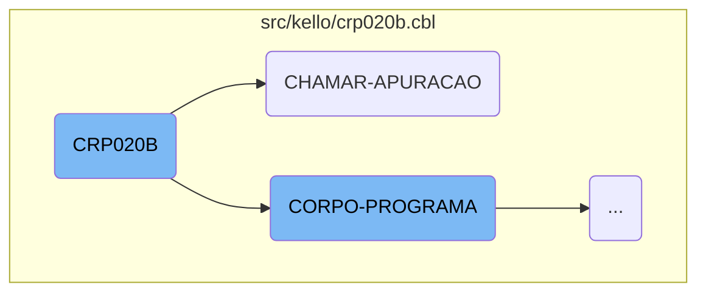
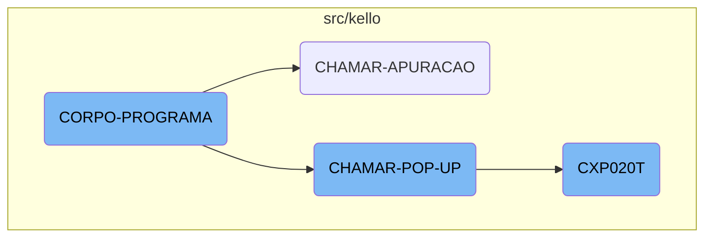

<SwmToken path="src/kello/crp020b.cbl" pos="3:6:6" line-data="       PROGRAM-ID. CRP020B.">`CRP020B`</SwmToken> is a crucial function within the Kello Imagens system, responsible for initializing the program, processing <SwmToken path="src/kello/crp020b.cbl" pos="167:11:13" line-data="      *    ACCEPT PARAMETROS-W FROM COMMAND-LINE.">`COMMAND-LINE`</SwmToken> parameters, and handling various business logic operations. It interacts with other functions and programs to ensure the smooth execution of business processes.

The <SwmToken path="src/kello/crp020b.cbl" pos="3:6:6" line-data="       PROGRAM-ID. CRP020B.">`CRP020B`</SwmToken> function starts by initializing the program and processing any <SwmToken path="src/kello/crp020b.cbl" pos="167:11:13" line-data="      *    ACCEPT PARAMETROS-W FROM COMMAND-LINE.">`COMMAND-LINE`</SwmToken> parameters provided. It then moves on to handle various business logic operations, such as moving object handles and calling other programs like <SwmToken path="src/kello/crp020b.cbl" pos="667:4:4" line-data="           CALL &quot;CXP020T&quot; USING PARAMETROS-W PASSAR-PARAMETROS">`CXP020T`</SwmToken>. The function also manipulates data fields to ensure that the necessary information is processed correctly. Throughout its execution, <SwmToken path="src/kello/crp020b.cbl" pos="3:6:6" line-data="       PROGRAM-ID. CRP020B.">`CRP020B`</SwmToken> interacts with other functions like <SwmToken path="src/kello/crp020b.cbl" pos="163:3:5" line-data="           PERFORM CORPO-PROGRAMA UNTIL GS-EXIT-FLG-TRUE.">`CORPO-PROGRAMA`</SwmToken>, <SwmToken path="src/kello/crp020b.cbl" pos="344:5:7" line-data="               WHEN GS-CHAMAR-APURACAO-TRUE">`CHAMAR-APURACAO`</SwmToken>, and <SwmToken path="src/kello/crp020b.cbl" pos="671:1:5" line-data="       CHAMAR-POP-UP SECTION.">`CHAMAR-POP-UP`</SwmToken> to perform specific tasks based on the current state and user interactions. This ensures that the appropriate business logic is executed, and relevant <SwmToken path="src/kello/crp020b.cbl" pos="671:3:5" line-data="       CHAMAR-POP-UP SECTION.">`POP-UP`</SwmToken> windows are displayed for user interactions.

Here is a high level diagram of the flow, showing only the most important functions:

```mermaid
graph TD;
      subgraph src/kello
8e0fc241c74f98fd67382d101673e68ae85b08983831701b026d32ab1616f51e(CRP020B):::mainFlowStyle --> 1993602387d2a5dafdc817d3ce73527469b6943a1c382f2a00eed1fd873be623(CHAMAR-APURACAO)
end

subgraph src/kello
8e0fc241c74f98fd67382d101673e68ae85b08983831701b026d32ab1616f51e(CRP020B):::mainFlowStyle --> 5dd249e375968c0aa3f608071ca2f4db0da2a575925a0a9b3c0ee495e2114c0e(CORPO-PROGRAMA):::mainFlowStyle
end

subgraph src/kello
5dd249e375968c0aa3f608071ca2f4db0da2a575925a0a9b3c0ee495e2114c0e(CORPO-PROGRAMA):::mainFlowStyle --> 1993602387d2a5dafdc817d3ce73527469b6943a1c382f2a00eed1fd873be623(CHAMAR-APURACAO)
end

subgraph src/kello
5dd249e375968c0aa3f608071ca2f4db0da2a575925a0a9b3c0ee495e2114c0e(CORPO-PROGRAMA):::mainFlowStyle --> 08fd230d4aa52414b9c4f24ef49e9fad22bffce01cf0cbcde38d83fed4a3215c(CHAMAR-POP-UP):::mainFlowStyle
end

subgraph src/kello
08fd230d4aa52414b9c4f24ef49e9fad22bffce01cf0cbcde38d83fed4a3215c(CHAMAR-POP-UP):::mainFlowStyle --> 50518e3031fd1bb8e53d707aa6046d787959e6027e111759e97ca65df1080b6b(CXP020T):::mainFlowStyle
end


      classDef mainFlowStyle color:#000000,fill:#7CB9F4
classDef rootsStyle color:#000000,fill:#00FFF4
classDef Style1 color:#000000,fill:#00FFAA
classDef Style2 color:#000000,fill:#FFFF00
classDef Style3 color:#000000,fill:#AA7CB9

%% Swimm:
%% graph TD;
%%       subgraph <SwmPath>[src/kello/](src/kello/)</SwmPath>
%% 8e0fc241c74f98fd67382d101673e68ae85b08983831701b026d32ab1616f51e(CRP020B):::mainFlowStyle --> 1993602387d2a5dafdc817d3ce73527469b6943a1c382f2a00eed1fd873be623(CHAMAR-APURACAO)
%% end
%% 
%% subgraph <SwmPath>[src/kello/](src/kello/)</SwmPath>
%% 8e0fc241c74f98fd67382d101673e68ae85b08983831701b026d32ab1616f51e(CRP020B):::mainFlowStyle --> 5dd249e375968c0aa3f608071ca2f4db0da2a575925a0a9b3c0ee495e2114c0e(CORPO-PROGRAMA):::mainFlowStyle
%% end
%% 
%% subgraph <SwmPath>[src/kello/](src/kello/)</SwmPath>
%% 5dd249e375968c0aa3f608071ca2f4db0da2a575925a0a9b3c0ee495e2114c0e(CORPO-PROGRAMA):::mainFlowStyle --> 1993602387d2a5dafdc817d3ce73527469b6943a1c382f2a00eed1fd873be623(CHAMAR-APURACAO)
%% end
%% 
%% subgraph <SwmPath>[src/kello/](src/kello/)</SwmPath>
%% 5dd249e375968c0aa3f608071ca2f4db0da2a575925a0a9b3c0ee495e2114c0e(CORPO-PROGRAMA):::mainFlowStyle --> 08fd230d4aa52414b9c4f24ef49e9fad22bffce01cf0cbcde38d83fed4a3215c(CHAMAR-POP-UP):::mainFlowStyle
%% end
%% 
%% subgraph <SwmPath>[src/kello/](src/kello/)</SwmPath>
%% 08fd230d4aa52414b9c4f24ef49e9fad22bffce01cf0cbcde38d83fed4a3215c(CHAMAR-POP-UP):::mainFlowStyle --> 50518e3031fd1bb8e53d707aa6046d787959e6027e111759e97ca65df1080b6b(CXP020T):::mainFlowStyle
%% end
%% 
%% 
%%       classDef mainFlowStyle color:#000000,fill:#7CB9F4
%% classDef rootsStyle color:#000000,fill:#00FFF4
%% classDef Style1 color:#000000,fill:#00FFAA
%% classDef Style2 color:#000000,fill:#FFFF00
%% classDef Style3 color:#000000,fill:#AA7CB9
```



# Flow drill down

First, we'll zoom into this section of the flow:



<SwmSnippet path="/src/kello/crp020b.cbl" line="159">

---

## <SwmToken path="src/kello/crp020b.cbl" pos="3:6:6" line-data="       PROGRAM-ID. CRP020B.">`CRP020B`</SwmToken>

The <SwmToken path="src/kello/crp020b.cbl" pos="3:6:6" line-data="       PROGRAM-ID. CRP020B.">`CRP020B`</SwmToken> function initializes the program, processes <SwmToken path="src/kello/crp020b.cbl" pos="167:11:13" line-data="      *    ACCEPT PARAMETROS-W FROM COMMAND-LINE.">`COMMAND-LINE`</SwmToken> parameters, and handles various business logic operations. It performs tasks such as moving object handles, calling other programs like <SwmToken path="src/kello/crp020b.cbl" pos="399:4:4" line-data="           CALL &quot;CGP020T&quot; USING PARAMETROS-W PASSAR-PARAMETROS.">`CGP020T`</SwmToken>, and manipulating data fields like <SwmToken path="src/kello/crp020b.cbl" pos="405:3:7" line-data="           MOVE DATA-MOVTO-CR20         TO DATA-MOVTO-CR13">`DATA-MOVTO-CR20`</SwmToken> and <SwmToken path="src/kello/crp020b.cbl" pos="461:3:9" line-data="           MOVE GS-DATA-COMPRA-D        TO DATA-INV">`GS-DATA-COMPRA-D`</SwmToken>.

```cobol
       PROCEDURE DIVISION USING PARAMETROS-W STRING-1.

       MAIN-PROCESS SECTION.
           PERFORM INICIALIZA-PROGRAMA.
           PERFORM CORPO-PROGRAMA UNTIL GS-EXIT-FLG-TRUE.
           GO FINALIZAR-PROGRAMA.

       INICIALIZA-PROGRAMA SECTION.
      *    ACCEPT PARAMETROS-W FROM COMMAND-LINE.
           MOVE STRING-1(20: 5) TO USUARIO-W.
           ACCEPT DATA6-W FROM DATE.
           ACCEPT HORA-BRA FROM TIME.
           MOVE DATA6-W TO DATA-INV(3: 6).
           MOVE DATA6-W(1: 2) TO ANO-V.
           IF ANO-V > 80 MOVE "19" TO DATA-INV(1: 2)
           ELSE MOVE "20" TO DATA-INV(1: 2).
           MOVE DATA-INV TO DATA-DIA-I.
           CALL "GRIDAT1" USING DATA-INV.
           MOVE DATA-INV TO DATA-MOVTO-W.
           MOVE ZEROS TO PAGE-COUNT ERRO-W.
           INITIALIZE GS-DATA-BLOCK
```

---

</SwmSnippet>

<SwmSnippet path="/src/kello/crp020b.cbl" line="667">

---

## <SwmToken path="src/kello/crp020b.cbl" pos="344:5:7" line-data="               WHEN GS-CHAMAR-APURACAO-TRUE">`CHAMAR-APURACAO`</SwmToken>

The <SwmToken path="src/kello/crp020b.cbl" pos="344:5:7" line-data="               WHEN GS-CHAMAR-APURACAO-TRUE">`CHAMAR-APURACAO`</SwmToken> function calls the <SwmToken path="src/kello/crp020b.cbl" pos="667:4:4" line-data="           CALL &quot;CXP020T&quot; USING PARAMETROS-W PASSAR-PARAMETROS">`CXP020T`</SwmToken> program using specific parameters, cancels the call, and then moves a substring of <SwmToken path="src/kello/crp020b.cbl" pos="669:3:7" line-data="           MOVE PASSAR-STRING-1(52: 5) TO GS-COD-APURACAO">`PASSAR-STRING-1`</SwmToken> to <SwmToken path="src/kello/crp020b.cbl" pos="669:17:21" line-data="           MOVE PASSAR-STRING-1(52: 5) TO GS-COD-APURACAO">`GS-COD-APURACAO`</SwmToken>. It also performs the <SwmToken path="src/kello/crp020b.cbl" pos="670:3:7" line-data="           PERFORM LE-COD-APURACAO.">`LE-COD-APURACAO`</SwmToken> operation, which likely involves reading or processing the code.

```cobol
           CALL "CXP020T" USING PARAMETROS-W PASSAR-PARAMETROS
           CANCEL "CXP020T"
           MOVE PASSAR-STRING-1(52: 5) TO GS-COD-APURACAO
           PERFORM LE-COD-APURACAO.
       CHAMAR-POP-UP SECTION.
```

---

</SwmSnippet>

Now, lets zoom into this section of the flow:



<SwmSnippet path="/src/kello/crp020b.cbl" line="304">

---

## <SwmToken path="src/kello/crp020b.cbl" pos="163:3:5" line-data="           PERFORM CORPO-PROGRAMA UNTIL GS-EXIT-FLG-TRUE.">`CORPO-PROGRAMA`</SwmToken>

The <SwmToken path="src/kello/crp020b.cbl" pos="163:3:5" line-data="           PERFORM CORPO-PROGRAMA UNTIL GS-EXIT-FLG-TRUE.">`CORPO-PROGRAMA`</SwmToken> function is a central control structure that evaluates various conditions and performs corresponding actions. It handles different flags such as <SwmToken path="src/kello/crp020b.cbl" pos="305:3:7" line-data="               WHEN GS-CENTRALIZA-TRUE">`GS-CENTRALIZA-TRUE`</SwmToken>, <SwmToken path="src/kello/crp020b.cbl" pos="307:3:9" line-data="               WHEN GS-SAVE-FLG-TRUE">`GS-SAVE-FLG-TRUE`</SwmToken>, and <SwmToken path="src/kello/crp020b.cbl" pos="310:3:9" line-data="               WHEN GS-EXCLUI-FLG-TRUE">`GS-EXCLUI-FLG-TRUE`</SwmToken>, among others, to execute specific procedures like <SwmToken path="src/kello/crp020b.cbl" pos="306:3:3" line-data="                    PERFORM CENTRALIZAR">`CENTRALIZAR`</SwmToken>, <SwmToken path="src/kello/crp020b.cbl" pos="308:3:5" line-data="                    PERFORM SALVAR-DADOS">`SALVAR-DADOS`</SwmToken>, and <SwmToken path="src/kello/crp020b.cbl" pos="310:5:5" line-data="               WHEN GS-EXCLUI-FLG-TRUE">`EXCLUI`</SwmToken>. This function ensures that the appropriate business logic is executed based on the current state and user interactions.

```cobol
           EVALUATE TRUE
               WHEN GS-CENTRALIZA-TRUE
                    PERFORM CENTRALIZAR
               WHEN GS-SAVE-FLG-TRUE
                    PERFORM SALVAR-DADOS
                    PERFORM GRAVA-ANOTACAO
               WHEN GS-EXCLUI-FLG-TRUE
                    MOVE 3 TO SITUACAO-CR20
                    PERFORM EXCLUI
               WHEN GS-CANCELA-FLG-TRUE
                    IF SITUACAO-CR20 = 4
                       MOVE "Título Cancelado, Deseja Reverter o Cancela
      -                     "mento ? " TO MENSAGEM
                       MOVE "Q" TO TIPO-MSG
                       PERFORM EXIBIR-MENSAGEM
                       IF RESP-MSG = "S"
                          MOVE 0 TO SITUACAO-CR20
                          PERFORM CANCELA
                       END-IF
                    ELSE
                       MOVE "Deseja Cancelar esse Título? " TO MENSAGEM
```

---

</SwmSnippet>

<SwmSnippet path="/src/kello/crp020b.cbl" line="672">

---

## <SwmToken path="src/kello/crp020b.cbl" pos="671:1:5" line-data="       CHAMAR-POP-UP SECTION.">`CHAMAR-POP-UP`</SwmToken>

The <SwmToken path="src/kello/crp020b.cbl" pos="671:1:5" line-data="       CHAMAR-POP-UP SECTION.">`CHAMAR-POP-UP`</SwmToken> function is responsible for handling different <SwmToken path="src/kello/crp020b.cbl" pos="672:7:9" line-data="           EVALUATE GS-OPCAO-POP-UP">`POP-UP`</SwmToken> options based on the value of <SwmToken path="src/kello/crp020b.cbl" pos="672:3:9" line-data="           EVALUATE GS-OPCAO-POP-UP">`GS-OPCAO-POP-UP`</SwmToken>. It performs actions such as loading client or vendor pop-ups, and calling external programs like <SwmToken path="src/kello/crp020b.cbl" pos="675:8:8" line-data="             WHEN 3 CALL &quot;CAP018T&quot; USING PARAMETROS-W PASSAR-PARAMETROS">`CAP018T`</SwmToken>, <SwmToken path="src/kello/crp020b.cbl" pos="679:8:8" line-data="             WHEN 4 CALL   &quot;CXP020T&quot; USING PARAMETROS-W PASSAR-STRING-1">`CXP020T`</SwmToken>, and <SwmToken path="src/kello/crp020b.cbl" pos="684:8:8" line-data="             WHEN 5 CALL &quot;CRP001T&quot; USING PARAMETROS-W PASSAR-PARAMETROS">`CRP001T`</SwmToken>. This function facilitates user interactions by displaying relevant <SwmToken path="src/kello/crp020b.cbl" pos="672:7:9" line-data="           EVALUATE GS-OPCAO-POP-UP">`POP-UP`</SwmToken> windows and processing the selected options.

```cobol
           EVALUATE GS-OPCAO-POP-UP
             WHEN 1 PERFORM CARREGA-POP-UP-CLIENTE
             WHEN 2 PERFORM CARREGA-POP-UP-VENDEDOR
             WHEN 3 CALL "CAP018T" USING PARAMETROS-W PASSAR-PARAMETROS
                    CANCEL "CAP018T"
                    MOVE PASSAR-STRING-1(1: 30) TO GS-DESCR-PORTADOR
                    MOVE PASSAR-STRING-1(33: 4) TO GS-PORTADOR
             WHEN 4 CALL   "CXP020T" USING PARAMETROS-W PASSAR-STRING-1
                    CANCEL "CXP020T"
                    MOVE PASSAR-STRING-1(52: 5) TO GS-COD-APURACAO
                    PERFORM LE-COD-APURACAO
                    MOVE DESCRICAO-CX20 TO GS-DESCR-APURACAO
             WHEN 5 CALL "CRP001T" USING PARAMETROS-W PASSAR-PARAMETROS
                    CANCEL "CRP001T"
                    MOVE PASSAR-STRING-1(1: 30) TO GS-DESCR-SITUACAO-TIT
                    MOVE PASSAR-STRING-1(33: 2) TO GS-SITUACAO-TIT
           END-EVALUATE.
       CARREGA-POP-UP-CLIENTE SECTION.
```

---

</SwmSnippet>

<SwmSnippet path="/src/kello/cxp020t.cbl" line="2">

---

## <SwmToken path="src/kello/cxp020t.cbl" pos="3:6:6" line-data="       PROGRAM-ID. CXP020T.">`CXP020T`</SwmToken>

The <SwmToken path="src/kello/cxp020t.cbl" pos="3:6:6" line-data="       PROGRAM-ID. CXP020T.">`CXP020T`</SwmToken> function is a comprehensive program that includes various sections for initializing the program, processing the main logic, and finalizing the program. It handles tasks such as centralizing data, locating words, and managing error messages. This function ensures the smooth execution of the program's core functionalities and user interactions.

```cobol
       IDENTIFICATION DIVISION.
       PROGRAM-ID. CXP020T.
      * AUTORA: MARELI AMÂNCIO VOLPATO
      * DATA: 28/08/1998
      * FUNCAO: CONSULTA POP-UP CONTAS APURACAO DE RESULTADOS
       ENVIRONMENT DIVISION.
       SPECIAL-NAMES.
       DECIMAL-POINT IS COMMA.
       class-control.
           Window             is class "wclass".

       INPUT-OUTPUT SECTION.
       FILE-CONTROL.
           COPY CXPX020.

       DATA DIVISION.
       FILE SECTION.
       COPY CXPW020.
       WORKING-STORAGE SECTION.
           COPY "CXP020T.CPB".
           COPY "CXP020T.CPY".
```

---

</SwmSnippet>

# Where is this flow used?

This flow is used multiple times in the codebase as represented in the following diagram:

```mermaid
graph TD;
      subgraph src/kello
4e103c6a4c17d485535f50b30a89f03d86ae5a493e3a9f3c38afdfe4af2130c4(CRP051):::rootsStyle --> 0cc99c7bdac37df8cb90adc18dbdf3aa1da3113e122b2b956e3f0693370ff4c6(CORPO-PROGRAMA)
end

subgraph src/kello
0cc99c7bdac37df8cb90adc18dbdf3aa1da3113e122b2b956e3f0693370ff4c6(CORPO-PROGRAMA) --> 0d645c689827d433948d57727043def4cfbb5da6a98bdc852e3e27f8f8b3ae5c(CHAMA-ALTERACAO)
end

subgraph src/kello
0d645c689827d433948d57727043def4cfbb5da6a98bdc852e3e27f8f8b3ae5c(CHAMA-ALTERACAO) --> 8e0fc241c74f98fd67382d101673e68ae85b08983831701b026d32ab1616f51e(CRP020B):::mainFlowStyle
end

subgraph src/kello
fef4eafc900e50e4d09635087b314ac3e3a92c1ee81015cdfe73b4d39038a6d9(CRP052):::rootsStyle --> ce540184c7b9b55aa7ce4d64f55e25edb08061bcf3be74618352ad3fec81bf78(CORPO-PROGRAMA)
end

subgraph src/kello
ce540184c7b9b55aa7ce4d64f55e25edb08061bcf3be74618352ad3fec81bf78(CORPO-PROGRAMA) --> 249e561a6f401db5f5b163d259a099b0bbfd266c45711d424df2bed2eb0c79bf(CHAMA-ALTERACAO)
end

subgraph src/kello
249e561a6f401db5f5b163d259a099b0bbfd266c45711d424df2bed2eb0c79bf(CHAMA-ALTERACAO) --> 8e0fc241c74f98fd67382d101673e68ae85b08983831701b026d32ab1616f51e(CRP020B):::mainFlowStyle
end

subgraph src/kello
60c76edec5b4ba2eaaf536b18e76e087083929a753f4f4d18b4a67e5fd30100c(MAIN-PROCESS):::rootsStyle --> 0cc99c7bdac37df8cb90adc18dbdf3aa1da3113e122b2b956e3f0693370ff4c6(CORPO-PROGRAMA)
end

subgraph src/kello
60c76edec5b4ba2eaaf536b18e76e087083929a753f4f4d18b4a67e5fd30100c(MAIN-PROCESS):::rootsStyle --> ce540184c7b9b55aa7ce4d64f55e25edb08061bcf3be74618352ad3fec81bf78(CORPO-PROGRAMA)
end


      classDef mainFlowStyle color:#000000,fill:#7CB9F4
classDef rootsStyle color:#000000,fill:#00FFF4
classDef Style1 color:#000000,fill:#00FFAA
classDef Style2 color:#000000,fill:#FFFF00
classDef Style3 color:#000000,fill:#AA7CB9

%% Swimm:
%% graph TD;
%%       subgraph <SwmPath>[src/kello/](src/kello/)</SwmPath>
%% 4e103c6a4c17d485535f50b30a89f03d86ae5a493e3a9f3c38afdfe4af2130c4(CRP051):::rootsStyle --> 0cc99c7bdac37df8cb90adc18dbdf3aa1da3113e122b2b956e3f0693370ff4c6(CORPO-PROGRAMA)
%% end
%% 
%% subgraph <SwmPath>[src/kello/](src/kello/)</SwmPath>
%% 0cc99c7bdac37df8cb90adc18dbdf3aa1da3113e122b2b956e3f0693370ff4c6(CORPO-PROGRAMA) --> 0d645c689827d433948d57727043def4cfbb5da6a98bdc852e3e27f8f8b3ae5c(CHAMA-ALTERACAO)
%% end
%% 
%% subgraph <SwmPath>[src/kello/](src/kello/)</SwmPath>
%% 0d645c689827d433948d57727043def4cfbb5da6a98bdc852e3e27f8f8b3ae5c(CHAMA-ALTERACAO) --> 8e0fc241c74f98fd67382d101673e68ae85b08983831701b026d32ab1616f51e(CRP020B):::mainFlowStyle
%% end
%% 
%% subgraph <SwmPath>[src/kello/](src/kello/)</SwmPath>
%% fef4eafc900e50e4d09635087b314ac3e3a92c1ee81015cdfe73b4d39038a6d9(CRP052):::rootsStyle --> ce540184c7b9b55aa7ce4d64f55e25edb08061bcf3be74618352ad3fec81bf78(CORPO-PROGRAMA)
%% end
%% 
%% subgraph <SwmPath>[src/kello/](src/kello/)</SwmPath>
%% ce540184c7b9b55aa7ce4d64f55e25edb08061bcf3be74618352ad3fec81bf78(CORPO-PROGRAMA) --> 249e561a6f401db5f5b163d259a099b0bbfd266c45711d424df2bed2eb0c79bf(CHAMA-ALTERACAO)
%% end
%% 
%% subgraph <SwmPath>[src/kello/](src/kello/)</SwmPath>
%% 249e561a6f401db5f5b163d259a099b0bbfd266c45711d424df2bed2eb0c79bf(CHAMA-ALTERACAO) --> 8e0fc241c74f98fd67382d101673e68ae85b08983831701b026d32ab1616f51e(CRP020B):::mainFlowStyle
%% end
%% 
%% subgraph <SwmPath>[src/kello/](src/kello/)</SwmPath>
%% 60c76edec5b4ba2eaaf536b18e76e087083929a753f4f4d18b4a67e5fd30100c(MAIN-PROCESS):::rootsStyle --> 0cc99c7bdac37df8cb90adc18dbdf3aa1da3113e122b2b956e3f0693370ff4c6(CORPO-PROGRAMA)
%% end
%% 
%% subgraph <SwmPath>[src/kello/](src/kello/)</SwmPath>
%% 60c76edec5b4ba2eaaf536b18e76e087083929a753f4f4d18b4a67e5fd30100c(MAIN-PROCESS):::rootsStyle --> ce540184c7b9b55aa7ce4d64f55e25edb08061bcf3be74618352ad3fec81bf78(CORPO-PROGRAMA)
%% end
%% 
%% 
%%       classDef mainFlowStyle color:#000000,fill:#7CB9F4
%% classDef rootsStyle color:#000000,fill:#00FFF4
%% classDef Style1 color:#000000,fill:#00FFAA
%% classDef Style2 color:#000000,fill:#FFFF00
%% classDef Style3 color:#000000,fill:#AA7CB9
```



&nbsp;

*This is an auto-generated document by Swimm AI 🌊 and has not yet been verified by a human*

<SwmMeta version="3.0.0" repo-id="Z2l0aHViJTNBJTNBa2VsbG8lM0ElM0Fzd2ltbWlv" repo-name="kello"><sup>Powered by [Swimm](/)</sup></SwmMeta>
