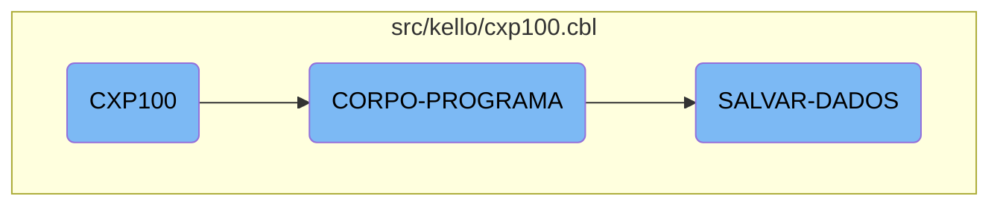

In this document, we will explain the flow and core logic of the <SwmToken path="src/kello/cxp100.cbl" pos="579:3:3" line-data="               WHEN CXP100-CENTRALIZA-TRUE">`CXP100`</SwmToken> program. The program handles various business operations, including data saving and condition evaluation.

The flow starts with the main section called <SwmToken path="src/kello/cxp100.cbl" pos="577:1:3" line-data="       CORPO-PROGRAMA SECTION.">`CORPO-PROGRAMA`</SwmToken>, which evaluates different conditions and performs actions based on those conditions. For example, if a certain flag is true, it will save data by performing the <SwmToken path="src/kello/cxp100.cbl" pos="587:3:5" line-data="                    PERFORM SALVAR-DADOS">`SALVAR-DADOS`</SwmToken> section. This section ensures that all necessary data is saved correctly and logged, maintaining data integrity.

# Flow drill down



<SwmSnippet path="/src/kello/cxp100.cbl" line="577">

---

## <SwmToken path="src/kello/cxp100.cbl" pos="577:1:3" line-data="       CORPO-PROGRAMA SECTION.">`CORPO-PROGRAMA`</SwmToken>

The <SwmToken path="src/kello/cxp100.cbl" pos="577:1:3" line-data="       CORPO-PROGRAMA SECTION.">`CORPO-PROGRAMA`</SwmToken> section is the core logic of the <SwmToken path="src/kello/cxp100.cbl" pos="579:3:3" line-data="               WHEN CXP100-CENTRALIZA-TRUE">`CXP100`</SwmToken> flow. It evaluates various conditions and performs corresponding actions. For example, if <SwmToken path="src/kello/cxp100.cbl" pos="586:3:9" line-data="               WHEN CXP100-SAVE-FLG-TRUE">`CXP100-SAVE-FLG-TRUE`</SwmToken> is true, it performs the <SwmToken path="src/kello/cxp100.cbl" pos="587:3:5" line-data="                    PERFORM SALVAR-DADOS">`SALVAR-DADOS`</SwmToken> section to save data. This section ensures that the appropriate actions are taken based on the current state and flags.

```cobol
       CORPO-PROGRAMA SECTION.
           EVALUATE TRUE
               WHEN CXP100-CENTRALIZA-TRUE
                   PERFORM CRIAR-LISTVIEW-CHEQUE
                   PERFORM CRIAR-LISTVIEW-RECEBER
                   PERFORM CENTRALIZAR
               WHEN CXP100-VERIF-EMPRESTIMO-TRUE
      *             PERFORM VERIFICA-EMPRESTIMO
                    PERFORM VERIFICA-PRE-DATADO
               WHEN CXP100-SAVE-FLG-TRUE
                    PERFORM SALVAR-DADOS
                    PERFORM LIMPAR-DADOS
                    PERFORM CARREGA-ULTIMOS
                    PERFORM ACHAR-SEQUENCIA
                    PERFORM MOSTRA-ULT-SEQUENCIA
                    ENABLE-OBJECT D-CONTAPART
                    ENABLE-OBJECT D-TIPO-LCTO
               WHEN CXP100-LOAD-FLG-TRUE
                    PERFORM CARREGAR-DADOS
                    MOVE "SET-POSICAO-CURSOR" TO DS-PROCEDURE
               WHEN CXP100-EXCLUI-FLG-TRUE
```

---

</SwmSnippet>

<SwmSnippet path="/src/kello/cxp100.cbl" line="2165">

---

## <SwmToken path="src/kello/cxp100.cbl" pos="2165:1:3" line-data="       SALVAR-DADOS SECTION.">`SALVAR-DADOS`</SwmToken>

The <SwmToken path="src/kello/cxp100.cbl" pos="2165:1:3" line-data="       SALVAR-DADOS SECTION.">`SALVAR-DADOS`</SwmToken> section handles the data-saving logic. It initializes various fields, checks conditions, and performs operations like writing records and updating logs. This section is crucial for ensuring that all necessary data is correctly saved and logged, maintaining data integrity and consistency.

```cobol
       SALVAR-DADOS SECTION.
           IF CXP100-ALTERACAO = "S"
              MOVE ZEROS TO I
              PERFORM VARYING I FROM 1 BY 1 UNTIL I > 50
                   MOVE ZEROS TO SEQ-SELECIONADA(I)
              END-PERFORM
              MOVE ZEROS TO I
              PERFORM VARYING I FROM 1 BY 1 UNTIL I > 200
                   INITIALIZE CXP100-DOCTO-GR(I)
                              CXP100-VALOR-PGTO-GR(I)
                              CXP100-PARCIAL-GR(I)
                              CXP100-JUROS-GR(I)
                              CXP100-MULTA-GR(I)
                              CXP100-DESCONTO-GR(I)
                              CXP100-VALOR-TOTAL-GR(I)
              END-PERFORM

              MOVE ZEROS TO I CXP100-TOT-VALOR-SELECIONADO

              IF CXP100-TIPO-LCTO = 2 OR 3 OR 6 OR 31
                 MOVE CXP100-VALOR        TO AUX-VALOR
```

---

</SwmSnippet>

&nbsp;

*This is an auto-generated document by Swimm AI 🌊 and has not yet been verified by a human*

<SwmMeta version="3.0.0" repo-id="Z2l0aHViJTNBJTNBa2VsbG8lM0ElM0Fzd2ltbWlv" repo-name="kello"><sup>Powered by [Swimm](/)</sup></SwmMeta>
