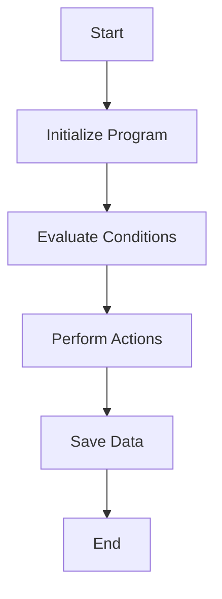

This document will cover the CXP100 Program Flow, which includes:

1. Initializing the Program
2. Evaluating Conditions and Performing Actions
3. Saving Data

Technical document: <SwmLink doc-title="CXP100 Program Flow">[CXP100 Program Flow](/.swm/cxp100-program-flow.tzu95nm2.sw.md)</SwmLink>

# Initializing the Program

The CXP100 program begins by initializing itself. This involves setting up the necessary environment and accepting parameters from the command line. These parameters dictate how the program will operate during its execution. For example, parameters might specify the type of data to process or the specific actions to perform. This step ensures that the program has all the information it needs to proceed with its tasks.

# Evaluating Conditions and Performing Actions

Once initialized, the program evaluates various conditions to determine the actions it needs to perform. This is done through a series of checks:

1. **Checking for Loan Verification**: If the program needs to verify loans, it performs the necessary checks to ensure all loan-related data is accurate.
2. **Saving Data**: If there are changes to be saved, the program proceeds to save the data.
3. **Clearing Data**: If the program needs to clear certain data, it performs the necessary actions to do so.
4. **Loading Data**: If data needs to be loaded, the program retrieves the required data from the database.
5. **Issuing Checks and Payments**: The program handles specific cases like issuing checks and making payments via home banking. This involves processing transactions and updating records accordingly.

These actions ensure that the program operates smoothly and performs all necessary tasks based on the conditions evaluated.

# Saving Data

The final step in the CXP100 program flow is saving data. This involves several sub-steps:

1. **Checking for Alterations**: The program first checks if any alterations are needed. If changes are required, it proceeds to the next steps.
2. **Processing Transactions**: The program processes various types of transactions, such as updating records or issuing payments. For example, if a payment needs to be issued, the program ensures that all necessary details are recorded and the payment is processed correctly.
3. **Updating Records**: The program updates the relevant records in the database to reflect the changes made. This ensures that all data is current and accurate.

By saving data, the program ensures that all changes are recorded and the system remains up-to-date. This step is crucial for maintaining data integrity and ensuring that all operations are accurately reflected in the system.

&nbsp;

*This is an auto-generated document by Swimm AI 🌊 and has not yet been verified by a human*

<SwmMeta version="3.0.0" repo-id="Z2l0aHViJTNBJTNBa2VsbG8lM0ElM0Fzd2ltbWlv" repo-name="kello">Powered by [Swimm](/)</SwmMeta>
