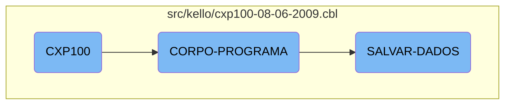

In this document, we will explain the flow of the <SwmToken path="src/kello/cxp100-08-06-2009.cbl" pos="424:3:3" line-data="               WHEN CXP100-VERIF-EMPRESTIMO-TRUE">`CXP100`</SwmToken> program. The <SwmToken path="src/kello/cxp100-08-06-2009.cbl" pos="424:3:3" line-data="               WHEN CXP100-VERIF-EMPRESTIMO-TRUE">`CXP100`</SwmToken> program is responsible for initializing the system, evaluating various conditions, and performing corresponding actions such as saving data, clearing data, and loading data.

The flow starts with the initialization of the program, where initial setup tasks are performed. Then, the program evaluates different conditions and takes actions based on those conditions. For example, if a save flag is set, it will save data to the database. If a load flag is set, it will load data from the database. The program handles various flags and executes specific sections to perform tasks like saving, clearing, and loading data.

# Flow drill down



<SwmSnippet path="/src/kello/cxp100-08-06-2009.cbl" line="212">

---

## <SwmToken path="src/kello/cxp100-08-06-2009.cbl" pos="424:3:3" line-data="               WHEN CXP100-VERIF-EMPRESTIMO-TRUE">`CXP100`</SwmToken>

The <SwmToken path="src/kello/cxp100-08-06-2009.cbl" pos="424:3:3" line-data="               WHEN CXP100-VERIF-EMPRESTIMO-TRUE">`CXP100`</SwmToken> function initializes the program by performing the <SwmToken path="src/kello/cxp100-08-06-2009.cbl" pos="213:3:5" line-data="           PERFORM INICIALIZA-PROGRAMA.">`INICIALIZA-PROGRAMA`</SwmToken> section.

```cobol
       MAIN-PROCESS SECTION.
           PERFORM INICIALIZA-PROGRAMA.
```

---

</SwmSnippet>

<SwmSnippet path="/src/kello/cxp100-08-06-2009.cbl" line="422">

---

## <SwmToken path="src/kello/cxp100-08-06-2009.cbl" pos="422:1:3" line-data="       CORPO-PROGRAMA SECTION.">`CORPO-PROGRAMA`</SwmToken>

The <SwmToken path="src/kello/cxp100-08-06-2009.cbl" pos="422:1:3" line-data="       CORPO-PROGRAMA SECTION.">`CORPO-PROGRAMA`</SwmToken> function evaluates various conditions and performs corresponding actions. It handles different flags such as <SwmToken path="src/kello/cxp100-08-06-2009.cbl" pos="427:3:9" line-data="               WHEN CXP100-SAVE-FLG-TRUE">`CXP100-SAVE-FLG-TRUE`</SwmToken>, <SwmToken path="src/kello/cxp100-08-06-2009.cbl" pos="433:3:9" line-data="               WHEN CXP100-LOAD-FLG-TRUE">`CXP100-LOAD-FLG-TRUE`</SwmToken>, and <SwmToken path="src/kello/cxp100-08-06-2009.cbl" pos="436:3:9" line-data="               WHEN CXP100-EXCLUI-FLG-TRUE">`CXP100-EXCLUI-FLG-TRUE`</SwmToken>, among others, to execute specific sections like <SwmToken path="src/kello/cxp100-08-06-2009.cbl" pos="428:3:5" line-data="                    PERFORM SALVAR-DADOS">`SALVAR-DADOS`</SwmToken>, <SwmToken path="src/kello/cxp100-08-06-2009.cbl" pos="429:3:5" line-data="                    PERFORM LIMPAR-DADOS">`LIMPAR-DADOS`</SwmToken>, and <SwmToken path="src/kello/cxp100-08-06-2009.cbl" pos="434:3:5" line-data="                    PERFORM CARREGAR-DADOS">`CARREGAR-DADOS`</SwmToken>.

```cobol
       CORPO-PROGRAMA SECTION.
           EVALUATE TRUE
               WHEN CXP100-VERIF-EMPRESTIMO-TRUE
      *             PERFORM VERIFICA-EMPRESTIMO
                    PERFORM VERIFICA-PRE-DATADO
               WHEN CXP100-SAVE-FLG-TRUE
                    PERFORM SALVAR-DADOS
                    PERFORM LIMPAR-DADOS
                    PERFORM CARREGA-ULTIMOS
                    PERFORM ACHAR-SEQUENCIA
                    PERFORM MOSTRA-ULT-SEQUENCIA
               WHEN CXP100-LOAD-FLG-TRUE
                    PERFORM CARREGAR-DADOS
                    MOVE "SET-POSICAO-CURSOR" TO DS-PROCEDURE
               WHEN CXP100-EXCLUI-FLG-TRUE
                    PERFORM EXCLUI-RECORD
                    PERFORM LIMPAR-DADOS
                    PERFORM CARREGA-ULTIMOS
                    PERFORM ACHAR-SEQUENCIA
                    PERFORM MOSTRA-ULT-SEQUENCIA
               WHEN CXP100-CLR-FLG-TRUE
```

---

</SwmSnippet>

<SwmSnippet path="/src/kello/cxp100-08-06-2009.cbl" line="1028">

---

### Saving Data

The <SwmToken path="src/kello/cxp100-08-06-2009.cbl" pos="1028:1:3" line-data="       SALVAR-DADOS SECTION.">`SALVAR-DADOS`</SwmToken> function is responsible for saving data. It checks if an alteration flag is set, processes various types of transactions, and writes records to the database. It also handles errors and logs the operations performed.

```cobol
       SALVAR-DADOS SECTION.
           IF CXP100-ALTERACAO = "S"
              MOVE ZEROS TO I
              PERFORM VARYING I FROM 1 BY 1 UNTIL I > 10
                 MOVE ZEROS TO SEQ-SELECIONADA(I)
              END-PERFORM
              MOVE ZEROS TO I CXP100-TOT-VALOR-SELECIONADO

              IF CXP100-TIPO-LCTO = 2 OR 31
                 MOVE SEQ-CX100           TO SEQ-CAIXA-CP20
                 MOVE DATA-MOV-CX100      TO DATA-PGTO-CP20
                 START CPD020 KEY IS = ALT6-CP20 INVALID KEY
                    MOVE "Docto não consta no Contas a Pagar, verifique"
                    TO CXP100-MENSAGEM-ERRO
                    MOVE "EXIBE-ERRO-GRAVACAO" TO DS-PROCEDURE
                    PERFORM CALL-DIALOG-SYSTEM
                 NOT INVALID KEY
                    PERFORM UNTIL ST-CPD020 = "10"
                        READ CPD020 NEXT RECORD AT END
                             MOVE "10" TO ST-CPD020
                        NOT AT END
```

---

</SwmSnippet>

&nbsp;

*This is an auto-generated document by Swimm AI 🌊 and has not yet been verified by a human*

<SwmMeta version="3.0.0" repo-id="Z2l0aHViJTNBJTNBa2VsbG8lM0ElM0Fzd2ltbWlv" repo-name="kello"><sup>Powered by [Swimm](/)</sup></SwmMeta>
