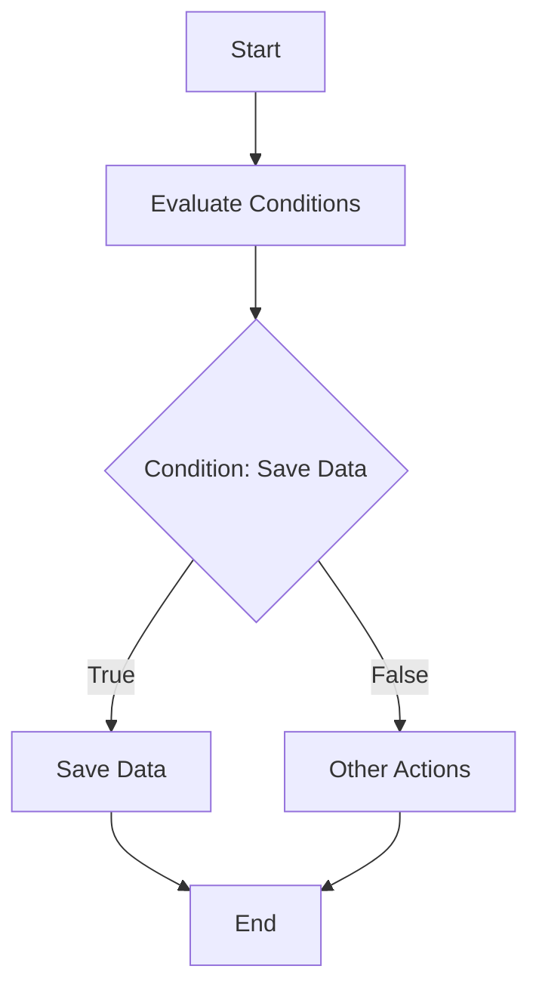

This document will cover the flow and core logic of the CXP100 program, which includes:

1. Evaluating conditions and performing actions
2. Saving data and maintaining data integrity.

Technical document: <SwmLink doc-title="CXP100 Program Flow">[CXP100 Program Flow](/.swm/cxp100-program-flow.310vyggg.sw.md)</SwmLink>

# Evaluating Conditions and Performing Actions

The CXP100 program begins by evaluating various conditions to determine the appropriate actions to take. This is done in the CORPO-PROGRAMA section. For example, if the flag CXP100-SAVE-FLG-TRUE is set to true, the program will proceed to save data. This ensures that the program responds dynamically based on the current state and flags, allowing for flexible business operations.

# Saving Data and Maintaining Data Integrity

When the condition to save data is met, the program enters the SALVAR-DADOS section. This section is responsible for initializing various fields, checking conditions, and performing operations such as writing records and updating logs. This process is crucial for ensuring that all necessary data is correctly saved and logged, maintaining data integrity and consistency. For example, if the alteration flag CXP100-ALTERACAO is set to 'S', the program will initialize specific fields and perform necessary data-saving operations.

&nbsp;

*This is an auto-generated document by Swimm AI 🌊 and has not yet been verified by a human*

<SwmMeta version="3.0.0" repo-id="Z2l0aHViJTNBJTNBa2VsbG8lM0ElM0Fzd2ltbWlv" repo-name="kello">Powered by [Swimm](/)</SwmMeta>
