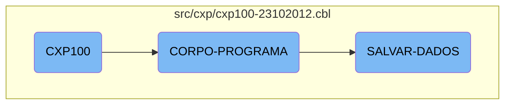

In this document, we will explain the flow of the <SwmToken path="src/cxp/cxp100-23102012.cbl" pos="320:9:9" line-data="           PERFORM CORPO-PROGRAMA UNTIL CXP100-EXIT-FLG-TRUE.">`CXP100`</SwmToken> program. The program is designed to handle various business operations, including initializing the program, processing core logic, and saving data.

The flow of the <SwmToken path="src/cxp/cxp100-23102012.cbl" pos="320:9:9" line-data="           PERFORM CORPO-PROGRAMA UNTIL CXP100-EXIT-FLG-TRUE.">`CXP100`</SwmToken> program starts with initializing the program, where variables are set up and the environment is prepared. Then, the main processing logic takes over, evaluating different conditions and performing actions like creating list views, verifying data, and handling user interactions. Finally, the program saves any modified data, ensuring all changes are recorded and logs are updated.

# Flow drill down



<SwmSnippet path="/src/cxp/cxp100-23102012.cbl" line="318">

---

## Initializing the Program

The <SwmToken path="src/cxp/cxp100-23102012.cbl" pos="319:3:5" line-data="           PERFORM INICIALIZA-PROGRAMA.">`INICIALIZA-PROGRAMA`</SwmToken> section is responsible for setting up the initial state of the program. This includes initializing variables and preparing the environment for the main processing logic.

```cobol
       MAIN-PROCESS SECTION.
           PERFORM INICIALIZA-PROGRAMA.
           PERFORM CORPO-PROGRAMA UNTIL CXP100-EXIT-FLG-TRUE.
           GO FINALIZAR-PROGRAMA.

       INICIALIZA-PROGRAMA SECTION.
```

---

</SwmSnippet>

<SwmSnippet path="/src/cxp/cxp100-23102012.cbl" line="574">

---

## Main Processing Logic

The <SwmToken path="src/cxp/cxp100-23102012.cbl" pos="574:1:3" line-data="       CORPO-PROGRAMA SECTION.">`CORPO-PROGRAMA`</SwmToken> section contains the core logic of the <SwmToken path="src/cxp/cxp100-23102012.cbl" pos="576:3:3" line-data="               WHEN CXP100-CENTRALIZA-TRUE">`CXP100`</SwmToken> flow. It evaluates various conditions and performs corresponding actions such as creating list views, verifying data, saving data, and handling user interactions. This section orchestrates the main business logic by calling different subroutines based on the evaluated conditions.

```cobol
       CORPO-PROGRAMA SECTION.
           EVALUATE TRUE
               WHEN CXP100-CENTRALIZA-TRUE
                   PERFORM CRIAR-LISTVIEW-CHEQUE
                   PERFORM CRIAR-LISTVIEW-RECEBER
                   PERFORM CENTRALIZAR
               WHEN CXP100-VERIF-EMPRESTIMO-TRUE
      *             PERFORM VERIFICA-EMPRESTIMO
                    PERFORM VERIFICA-PRE-DATADO
               WHEN CXP100-SAVE-FLG-TRUE
                    PERFORM SALVAR-DADOS
                    PERFORM LIMPAR-DADOS
                    PERFORM CARREGA-ULTIMOS
                    PERFORM ACHAR-SEQUENCIA
                    PERFORM MOSTRA-ULT-SEQUENCIA
                    ENABLE-OBJECT D-CONTAPART
                    ENABLE-OBJECT D-TIPO-LCTO
               WHEN CXP100-LOAD-FLG-TRUE
                    PERFORM CARREGAR-DADOS
                    MOVE "SET-POSICAO-CURSOR" TO DS-PROCEDURE
               WHEN CXP100-EXCLUI-FLG-TRUE
```

---

</SwmSnippet>

<SwmSnippet path="/src/cxp/cxp100-23102012.cbl" line="2098">

---

### Saving Data

The <SwmToken path="src/cxp/cxp100-23102012.cbl" pos="2098:1:3" line-data="       SALVAR-DADOS SECTION.">`SALVAR-DADOS`</SwmToken> section handles the data persistence logic. It checks if there are any modifications to be saved, processes the data accordingly, and writes it to the appropriate storage. This section ensures that all changes are correctly recorded and any necessary logs are updated.

```cobol
       SALVAR-DADOS SECTION.
           IF CXP100-ALTERACAO = "S"
              MOVE ZEROS TO I
              PERFORM VARYING I FROM 1 BY 1 UNTIL I > 10
                 MOVE ZEROS TO SEQ-SELECIONADA(I)
              END-PERFORM
              MOVE ZEROS TO I CXP100-TOT-VALOR-SELECIONADO

              IF CXP100-TIPO-LCTO = 2 OR 31
                 INITIALIZE REG-CPD020
                 MOVE SEQ-CX100           TO SEQ-CAIXA-CP20
                 MOVE DATA-MOV-CX100      TO DATA-PGTO-CP20
                 START CPD020 KEY IS NOT LESS ALT6-CP20 INVALID KEY
                    MOVE "Docto não consta no Contas a Pagar, verifique"
                    TO CXP100-MENSAGEM-ERRO
                    MOVE "EXIBE-ERRO-GRAVACAO" TO DS-PROCEDURE
                    PERFORM CALL-DIALOG-SYSTEM
                 NOT INVALID KEY
                    PERFORM UNTIL ST-CPD020 = "10"
                        READ CPD020 NEXT RECORD AT END
                             MOVE "10" TO ST-CPD020
```

---

</SwmSnippet>

&nbsp;

*This is an auto-generated document by Swimm AI 🌊 and has not yet been verified by a human*

<SwmMeta version="3.0.0" repo-id="Z2l0aHViJTNBJTNBa2VsbG8lM0ElM0Fzd2ltbWlv" repo-name="kello"><sup>Powered by [Swimm](/)</sup></SwmMeta>
