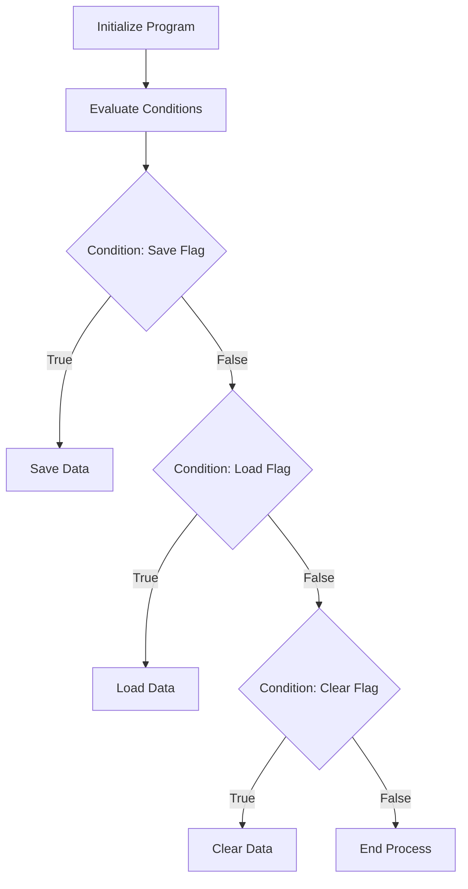

This document will cover the flow of the CXP100 program, which includes:

1. Initializing the program
2. Evaluating conditions and performing actions
3. Saving data
4. Loading data
5. Clearing data

Technical document: <SwmLink doc-title="CXP100 Program Flow">[CXP100 Program Flow](/.swm/cxp100-program-flow.74yxhr2c.sw.md)</SwmLink>

# Initializing the Program

The CXP100 program begins with an initialization phase. During this phase, the system sets up necessary configurations and prepares the environment for subsequent operations. This step ensures that all required resources are available and that the system is in a ready state to process further actions.

# Evaluating Conditions and Performing Actions

After initialization, the program evaluates various conditions to determine the next steps. These conditions are based on specific flags that indicate whether certain actions need to be performed. For example, if the save flag is set, the program will proceed to save data. Similarly, if the load flag is set, it will load data from the database. This evaluation ensures that the program executes the correct actions based on the current state and requirements.

# Saving Data

When the save flag is set, the program enters the data-saving phase. During this phase, the system checks if any alterations have been made that need to be saved. It processes various types of transactions and writes the necessary records to the database. This step is crucial for ensuring that all changes are recorded and that the data remains consistent and up-to-date. Additionally, the program handles any errors that may occur during this process and logs the operations performed for future reference.

# Loading Data

If the load flag is set, the program proceeds to load data from the database. This involves retrieving the necessary records and making them available for use within the system. This step is essential for ensuring that the program has access to the most current data, which is necessary for accurate processing and decision-making.

# Clearing Data

When the clear flag is set, the program performs data clearing operations. This involves removing unnecessary or outdated data from the system to maintain optimal performance and data integrity. Clearing data helps in managing storage efficiently and ensures that the system does not retain irrelevant information.

&nbsp;

*This is an auto-generated document by Swimm AI 🌊 and has not yet been verified by a human*

<SwmMeta version="3.0.0" repo-id="Z2l0aHViJTNBJTNBa2VsbG8lM0ElM0Fzd2ltbWlv" repo-name="kello">Powered by [Swimm](/)</SwmMeta>
