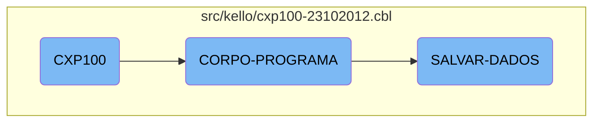

In this document, we will explain the flow and functionality of the <SwmToken path="src/kello/cxp100-23102012.cbl" pos="320:9:9" line-data="           PERFORM CORPO-PROGRAMA UNTIL CXP100-EXIT-FLG-TRUE.">`CXP100`</SwmToken> program. The program initializes the environment, handles core logic, and manages data saving operations.

The flow starts with the initialization of the program, setting up the environment for subsequent operations. The core logic handler then evaluates various conditions and performs corresponding actions such as creating list views, saving data, loading data, and handling user interactions. Finally, the data saving process checks for modifications, processes the data, and writes it to the database, ensuring data integrity and logging the operations performed.

# Flow drill down



<SwmSnippet path="/src/kello/cxp100-23102012.cbl" line="318">

---

## <SwmToken path="src/kello/cxp100-23102012.cbl" pos="320:9:9" line-data="           PERFORM CORPO-PROGRAMA UNTIL CXP100-EXIT-FLG-TRUE.">`CXP100`</SwmToken>

The <SwmToken path="src/kello/cxp100-23102012.cbl" pos="320:9:9" line-data="           PERFORM CORPO-PROGRAMA UNTIL CXP100-EXIT-FLG-TRUE.">`CXP100`</SwmToken> function initializes the program and sets up the main process section. It prepares the environment for subsequent operations by setting initial values and states.

```cobol
       MAIN-PROCESS SECTION.
           PERFORM INICIALIZA-PROGRAMA.
           PERFORM CORPO-PROGRAMA UNTIL CXP100-EXIT-FLG-TRUE.
           GO FINALIZAR-PROGRAMA.

       INICIALIZA-PROGRAMA SECTION.
```

---

</SwmSnippet>

<SwmSnippet path="/src/kello/cxp100-23102012.cbl" line="574">

---

## <SwmToken path="src/kello/cxp100-23102012.cbl" pos="574:1:3" line-data="       CORPO-PROGRAMA SECTION.">`CORPO-PROGRAMA`</SwmToken>

The <SwmToken path="src/kello/cxp100-23102012.cbl" pos="574:1:3" line-data="       CORPO-PROGRAMA SECTION.">`CORPO-PROGRAMA`</SwmToken> function is the core logic handler. It evaluates various conditions and performs corresponding actions such as creating list views, saving data, loading data, and handling user interactions. This function ensures that the appropriate operations are executed based on the current state and user inputs.

```cobol
       CORPO-PROGRAMA SECTION.
           EVALUATE TRUE
               WHEN CXP100-CENTRALIZA-TRUE
                   PERFORM CRIAR-LISTVIEW-CHEQUE
                   PERFORM CRIAR-LISTVIEW-RECEBER
                   PERFORM CENTRALIZAR
               WHEN CXP100-VERIF-EMPRESTIMO-TRUE
      *             PERFORM VERIFICA-EMPRESTIMO
                    PERFORM VERIFICA-PRE-DATADO
               WHEN CXP100-SAVE-FLG-TRUE
                    PERFORM SALVAR-DADOS
                    PERFORM LIMPAR-DADOS
                    PERFORM CARREGA-ULTIMOS
                    PERFORM ACHAR-SEQUENCIA
                    PERFORM MOSTRA-ULT-SEQUENCIA
                    ENABLE-OBJECT D-CONTAPART
                    ENABLE-OBJECT D-TIPO-LCTO
               WHEN CXP100-LOAD-FLG-TRUE
                    PERFORM CARREGAR-DADOS
                    MOVE "SET-POSICAO-CURSOR" TO DS-PROCEDURE
               WHEN CXP100-EXCLUI-FLG-TRUE
```

---

</SwmSnippet>

<SwmSnippet path="/src/kello/cxp100-23102012.cbl" line="2098">

---

### Saving Data

The <SwmToken path="src/kello/cxp100-23102012.cbl" pos="2098:1:3" line-data="       SALVAR-DADOS SECTION.">`SALVAR-DADOS`</SwmToken> function handles the data saving process. It checks if there are any modifications, processes the data accordingly, and writes it to the database. This function ensures data integrity and logs the operations performed.

```cobol
       SALVAR-DADOS SECTION.
           IF CXP100-ALTERACAO = "S"
              MOVE ZEROS TO I
              PERFORM VARYING I FROM 1 BY 1 UNTIL I > 10
                 MOVE ZEROS TO SEQ-SELECIONADA(I)
              END-PERFORM
              MOVE ZEROS TO I CXP100-TOT-VALOR-SELECIONADO

              IF CXP100-TIPO-LCTO = 2 OR 31
                 INITIALIZE REG-CPD020
                 MOVE SEQ-CX100           TO SEQ-CAIXA-CP20
                 MOVE DATA-MOV-CX100      TO DATA-PGTO-CP20
                 START CPD020 KEY IS NOT LESS ALT6-CP20 INVALID KEY
                    MOVE "Docto não consta no Contas a Pagar, verifique"
                    TO CXP100-MENSAGEM-ERRO
                    MOVE "EXIBE-ERRO-GRAVACAO" TO DS-PROCEDURE
                    PERFORM CALL-DIALOG-SYSTEM
                 NOT INVALID KEY
                    PERFORM UNTIL ST-CPD020 = "10"
                        READ CPD020 NEXT RECORD AT END
                             MOVE "10" TO ST-CPD020
```

---

</SwmSnippet>

&nbsp;

*This is an auto-generated document by Swimm AI 🌊 and has not yet been verified by a human*

<SwmMeta version="3.0.0" repo-id="Z2l0aHViJTNBJTNBa2VsbG8lM0ElM0Fzd2ltbWlv" repo-name="kello"><sup>Powered by [Swimm](/)</sup></SwmMeta>
