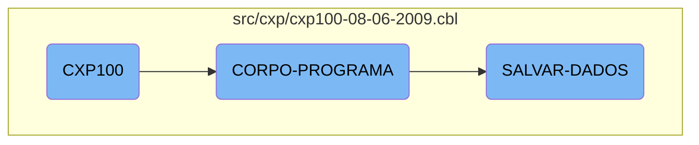

In this document, we will explain the <SwmToken path="src/cxp/cxp100-08-06-2009.cbl" pos="424:3:3" line-data="               WHEN CXP100-VERIF-EMPRESTIMO-TRUE">`CXP100`</SwmToken> program, which is a COBOL-85 program used for business operations management. The program handles various tasks such as initializing the program, evaluating conditions to perform specific actions, and saving data.

The <SwmToken path="src/cxp/cxp100-08-06-2009.cbl" pos="424:3:3" line-data="               WHEN CXP100-VERIF-EMPRESTIMO-TRUE">`CXP100`</SwmToken> program starts by initializing itself and accepting parameters from the command line. It then evaluates different conditions to decide what actions to perform, such as saving data, clearing data, or loading data. When saving data, it checks if any changes are needed, processes transactions, and updates records accordingly. The program also handles specific cases like issuing checks and making payments via home banking.

# Flow drill down



<SwmSnippet path="/src/cxp/cxp100-08-06-2009.cbl" line="212">

---

## <SwmToken path="src/cxp/cxp100-08-06-2009.cbl" pos="424:3:3" line-data="               WHEN CXP100-VERIF-EMPRESTIMO-TRUE">`CXP100`</SwmToken>

The <SwmToken path="src/cxp/cxp100-08-06-2009.cbl" pos="424:3:3" line-data="               WHEN CXP100-VERIF-EMPRESTIMO-TRUE">`CXP100`</SwmToken> function initializes the program by performing the <SwmToken path="src/cxp/cxp100-08-06-2009.cbl" pos="213:3:5" line-data="           PERFORM INICIALIZA-PROGRAMA.">`INICIALIZA-PROGRAMA`</SwmToken> section, which accepts parameters from the command line.

```cobol
       MAIN-PROCESS SECTION.
           PERFORM INICIALIZA-PROGRAMA.
```

---

</SwmSnippet>

<SwmSnippet path="/src/cxp/cxp100-08-06-2009.cbl" line="422">

---

## <SwmToken path="src/cxp/cxp100-08-06-2009.cbl" pos="422:1:3" line-data="       CORPO-PROGRAMA SECTION.">`CORPO-PROGRAMA`</SwmToken>

The <SwmToken path="src/cxp/cxp100-08-06-2009.cbl" pos="422:1:3" line-data="       CORPO-PROGRAMA SECTION.">`CORPO-PROGRAMA`</SwmToken> function evaluates various conditions and performs corresponding actions. It handles different flags such as <SwmToken path="src/cxp/cxp100-08-06-2009.cbl" pos="427:3:9" line-data="               WHEN CXP100-SAVE-FLG-TRUE">`CXP100-SAVE-FLG-TRUE`</SwmToken>, <SwmToken path="src/cxp/cxp100-08-06-2009.cbl" pos="433:3:9" line-data="               WHEN CXP100-LOAD-FLG-TRUE">`CXP100-LOAD-FLG-TRUE`</SwmToken>, and <SwmToken path="src/cxp/cxp100-08-06-2009.cbl" pos="436:3:9" line-data="               WHEN CXP100-EXCLUI-FLG-TRUE">`CXP100-EXCLUI-FLG-TRUE`</SwmToken>, among others, to execute specific sections like <SwmToken path="src/cxp/cxp100-08-06-2009.cbl" pos="428:3:5" line-data="                    PERFORM SALVAR-DADOS">`SALVAR-DADOS`</SwmToken>, <SwmToken path="src/cxp/cxp100-08-06-2009.cbl" pos="429:3:5" line-data="                    PERFORM LIMPAR-DADOS">`LIMPAR-DADOS`</SwmToken>, and <SwmToken path="src/cxp/cxp100-08-06-2009.cbl" pos="434:3:5" line-data="                    PERFORM CARREGAR-DADOS">`CARREGAR-DADOS`</SwmToken>.

```cobol
       CORPO-PROGRAMA SECTION.
           EVALUATE TRUE
               WHEN CXP100-VERIF-EMPRESTIMO-TRUE
      *             PERFORM VERIFICA-EMPRESTIMO
                    PERFORM VERIFICA-PRE-DATADO
               WHEN CXP100-SAVE-FLG-TRUE
                    PERFORM SALVAR-DADOS
                    PERFORM LIMPAR-DADOS
                    PERFORM CARREGA-ULTIMOS
                    PERFORM ACHAR-SEQUENCIA
                    PERFORM MOSTRA-ULT-SEQUENCIA
               WHEN CXP100-LOAD-FLG-TRUE
                    PERFORM CARREGAR-DADOS
                    MOVE "SET-POSICAO-CURSOR" TO DS-PROCEDURE
               WHEN CXP100-EXCLUI-FLG-TRUE
                    PERFORM EXCLUI-RECORD
                    PERFORM LIMPAR-DADOS
                    PERFORM CARREGA-ULTIMOS
                    PERFORM ACHAR-SEQUENCIA
                    PERFORM MOSTRA-ULT-SEQUENCIA
               WHEN CXP100-CLR-FLG-TRUE
```

---

</SwmSnippet>

<SwmSnippet path="/src/cxp/cxp100-08-06-2009.cbl" line="1028">

---

## <SwmToken path="src/cxp/cxp100-08-06-2009.cbl" pos="1028:1:3" line-data="       SALVAR-DADOS SECTION.">`SALVAR-DADOS`</SwmToken>

The <SwmToken path="src/cxp/cxp100-08-06-2009.cbl" pos="1028:1:3" line-data="       SALVAR-DADOS SECTION.">`SALVAR-DADOS`</SwmToken> function is responsible for saving data. It checks if alterations are needed, processes various types of transactions, and updates records accordingly. It also handles specific cases like issuing checks and payments via home banking.

```cobol
       SALVAR-DADOS SECTION.
           IF CXP100-ALTERACAO = "S"
              MOVE ZEROS TO I
              PERFORM VARYING I FROM 1 BY 1 UNTIL I > 10
                 MOVE ZEROS TO SEQ-SELECIONADA(I)
              END-PERFORM
              MOVE ZEROS TO I CXP100-TOT-VALOR-SELECIONADO

              IF CXP100-TIPO-LCTO = 2 OR 31
                 MOVE SEQ-CX100           TO SEQ-CAIXA-CP20
                 MOVE DATA-MOV-CX100      TO DATA-PGTO-CP20
                 START CPD020 KEY IS = ALT6-CP20 INVALID KEY
                    MOVE "Docto não consta no Contas a Pagar, verifique"
                    TO CXP100-MENSAGEM-ERRO
                    MOVE "EXIBE-ERRO-GRAVACAO" TO DS-PROCEDURE
                    PERFORM CALL-DIALOG-SYSTEM
                 NOT INVALID KEY
                    PERFORM UNTIL ST-CPD020 = "10"
                        READ CPD020 NEXT RECORD AT END
                             MOVE "10" TO ST-CPD020
                        NOT AT END
```

---

</SwmSnippet>

&nbsp;

*This is an auto-generated document by Swimm AI 🌊 and has not yet been verified by a human*

<SwmMeta version="3.0.0" repo-id="Z2l0aHViJTNBJTNBa2VsbG8lM0ElM0Fzd2ltbWlv" repo-name="kello"><sup>Powered by [Swimm](/)</sup></SwmMeta>
