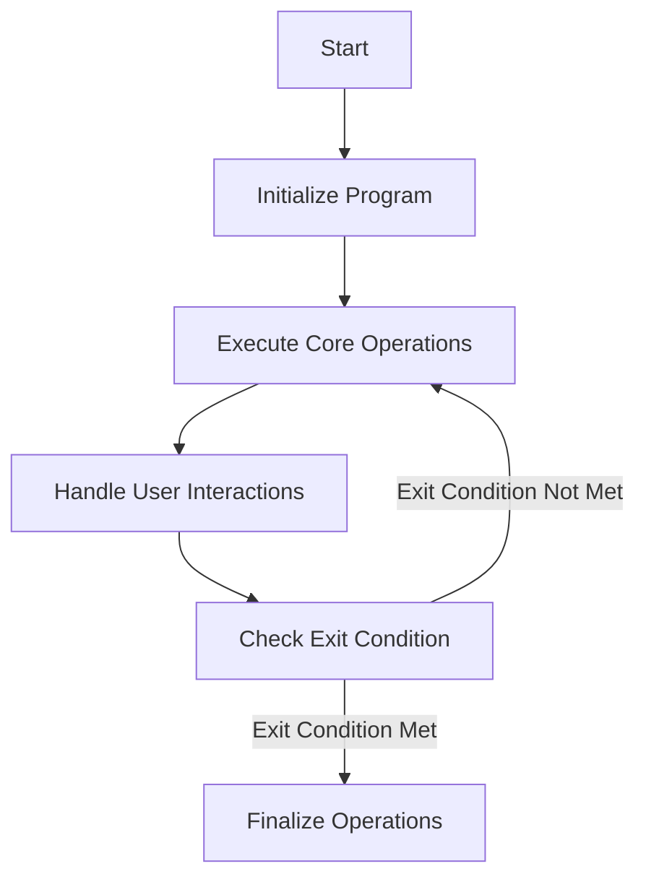

This document will cover the flow and functionality of the CPP020A program, which includes:

1. Initializing the program
2. Executing core operations
3. Handling user interactions through pop-up windows.

Technical document: <SwmLink doc-title="Flow and Functionality of CPP020A">[Flow and Functionality of CPP020A](/.swm/flow-and-functionality-of-cpp020a.qdyn3uco.sw.md)</SwmLink>

# Initializing the Program

The CPP020A program begins by initializing necessary variables and setting up the environment. This step ensures that all required parameters are in place and the system is ready for subsequent operations. This initialization is crucial for the smooth execution of the program, as it prepares the system to handle data and user interactions effectively.

# Executing Core Operations

Once the initialization is complete, the program enters its main body, where it evaluates various conditions and performs corresponding actions. These actions include centralizing data, saving/loading data, managing records, and verifying different entities. For example, the program might centralize data to ensure consistency across different modules or save data to preserve user inputs. Each action is performed based on specific conditions, ensuring that the program responds appropriately to different scenarios.

# Handling User Interactions

The program also handles user interactions by displaying different pop-up windows based on user selections. These pop-ups allow users to input or modify data, which the program then processes to update its state. For instance, if a user selects a specific option, the program might display a pop-up to gather additional information, which is then used to update records or perform other actions. This interactive feature ensures that users can effectively communicate their needs to the system, enhancing the overall user experience.

# Checking Exit Condition

The program continues its operations in a loop until a specific exit condition is met. This condition acts as a signal for the program to finalize its operations. For example, the exit condition might be triggered when all necessary data has been processed or when the user indicates that they have completed their tasks. Once the exit condition is met, the program proceeds to finalize its operations, ensuring that all processes are properly concluded.

# Finalizing Operations

In the final step, the program performs any necessary cleanup and concludes its operations. This might involve saving final data states, releasing resources, or performing other tasks to ensure that the system is left in a stable state. Finalizing operations is crucial for maintaining data integrity and ensuring that the program can be restarted without issues in the future.

&nbsp;

*This is an auto-generated document by Swimm AI 🌊 and has not yet been verified by a human*

<SwmMeta version="3.0.0" repo-id="Z2l0aHViJTNBJTNBa2VsbG8lM0ElM0Fzd2ltbWlv" repo-name="kello">Powered by [Swimm](/)</SwmMeta>
