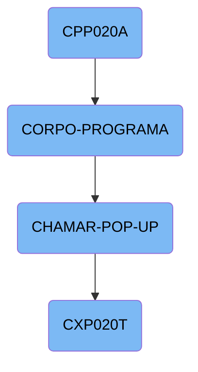

This document explains the flow and functionality of the <SwmToken path="src/cpp/cpp020a.cbl" pos="210:9:9" line-data="           PERFORM CORPO-PROGRAMA UNTIL CPP020A-EXIT-FLG-TRUE.">`CPP020A`</SwmToken> program. The program is responsible for initializing, executing core operations, and handling user interactions through <SwmToken path="src/cpp/cpp020a.cbl" pos="486:7:9" line-data="           EVALUATE CPP020A-OPCAO-POP-UP">`POP-UP`</SwmToken> windows.

The <SwmToken path="src/cpp/cpp020a.cbl" pos="210:9:9" line-data="           PERFORM CORPO-PROGRAMA UNTIL CPP020A-EXIT-FLG-TRUE.">`CPP020A`</SwmToken> program starts by initializing necessary variables and setting up the environment. It then enters the main body of the program, where it evaluates various conditions and performs corresponding actions such as centralizing data, saving/loading data, and managing records. Additionally, it handles user interactions by displaying different <SwmToken path="src/cpp/cpp020a.cbl" pos="486:7:9" line-data="           EVALUATE CPP020A-OPCAO-POP-UP">`POP-UP`</SwmToken> windows based on user selections and updating the program's state accordingly. The program continues this cycle until a specific exit condition is met, after which it finalizes the operations.

# Flow drill down



<SwmSnippet path="/src/cpp/cpp020a.cbl" line="209">

---

## <SwmToken path="src/cpp/cpp020a.cbl" pos="210:9:9" line-data="           PERFORM CORPO-PROGRAMA UNTIL CPP020A-EXIT-FLG-TRUE.">`CPP020A`</SwmToken>

The function <SwmToken path="src/cpp/cpp020a.cbl" pos="210:9:9" line-data="           PERFORM CORPO-PROGRAMA UNTIL CPP020A-EXIT-FLG-TRUE.">`CPP020A`</SwmToken> initializes the program by performing the <SwmToken path="src/cpp/cpp020a.cbl" pos="209:3:5" line-data="           PERFORM INICIALIZA-PROGRAMA.">`INICIALIZA-PROGRAMA`</SwmToken> routine. This sets up necessary variables and prepares the environment for the subsequent operations.

```cobol
           PERFORM INICIALIZA-PROGRAMA.
           PERFORM CORPO-PROGRAMA UNTIL CPP020A-EXIT-FLG-TRUE.
           GO FINALIZAR-PROGRAMA.

       INICIALIZA-PROGRAMA SECTION.
      *    ACCEPT PARAMETROS-W FROM COMMAND-LINE.
```

---

</SwmSnippet>

<SwmSnippet path="/src/cpp/cpp020a.cbl" line="406">

---

## <SwmToken path="src/cpp/cpp020a.cbl" pos="210:3:5" line-data="           PERFORM CORPO-PROGRAMA UNTIL CPP020A-EXIT-FLG-TRUE.">`CORPO-PROGRAMA`</SwmToken>

The <SwmToken path="src/cpp/cpp020a.cbl" pos="210:3:5" line-data="           PERFORM CORPO-PROGRAMA UNTIL CPP020A-EXIT-FLG-TRUE.">`CORPO-PROGRAMA`</SwmToken> function evaluates various conditions and performs corresponding actions. It handles tasks such as centralizing data, saving and loading data, excluding records, suspending or canceling operations, and verifying different entities. This function is crucial for managing the core logic and operations of the program.

```cobol
           EVALUATE TRUE
               WHEN CPP020A-CENTRALIZA-TRUE
                   PERFORM CENTRALIZAR
               WHEN CPP020A-SAVE-FLG-TRUE
                   PERFORM REGRAVA-DADOS
               WHEN CPP020A-LOAD-FLG-TRUE
                   PERFORM CARREGAR-DADOS
                   MOVE "SET-POSICAO-CURSOR1" TO DS-PROCEDURE
               WHEN CPP020A-EXCLUI-FLG-TRUE
                   MOVE FORNEC-CP20 TO FORNEC-W
                   MOVE NR-DOCTO-CP20 TO DOCTO-W
                   MOVE 3 TO SITUACAO-CP20
                   PERFORM EXCLUI
               WHEN CPP020A-SUSPENDE-FLG-TRUE
                   IF CPP020A-SITUACAO = 0 MOVE 1 TO SITUACAO-CP20
                   ELSE MOVE 0 TO SITUACAO-CP20
                   END-IF
                   MOVE FORNEC-CP20 TO FORNEC-W
                   MOVE NR-DOCTO-CP20 TO DOCTO-W
                   PERFORM SUSPENDE-CANCELA
               WHEN CPP020A-CANCELA-FLG-TRUE
```

---

</SwmSnippet>

<SwmSnippet path="/src/cpp/cpp020a.cbl" line="486">

---

## <SwmToken path="src/cpp/cpp020a.cbl" pos="462:5:9" line-data="               WHEN CPP020A-CHAMAR-POP-UP-TRUE">`CHAMAR-POP-UP`</SwmToken>

The <SwmToken path="src/cpp/cpp020a.cbl" pos="462:5:9" line-data="               WHEN CPP020A-CHAMAR-POP-UP-TRUE">`CHAMAR-POP-UP`</SwmToken> function handles the logic for displaying different <SwmToken path="src/cpp/cpp020a.cbl" pos="486:7:9" line-data="           EVALUATE CPP020A-OPCAO-POP-UP">`POP-UP`</SwmToken> windows based on the user's selection. It calls various subprograms and processes the parameters to update the main program's state accordingly.

```cobol
           EVALUATE CPP020A-OPCAO-POP-UP
             WHEN 1 PERFORM CARREGA-POP-UP-FORNEC
      *             CALL "CGP001T" USING PASSAR-PARAMETROS
      *             CANCEL "CGP001T"
      *             MOVE PASSAR-STRING-1(33: 6) TO CPP020A-COD-FORN
             WHEN 2 CALL   "CAP019T" USING PARAMETROS-W
                                           PASSAR-PARAMETROS
                    CANCEL "CAP019T"
                    MOVE PASSAR-STRING-1(1: 30) TO
                         CPP020A-DESCR-TIPO-FORN
                    MOVE PASSAR-STRING-1(33: 2) TO CPP020A-TIPO-FORN
             WHEN 3 CALL "CAP018T" USING PARAMETROS-W
                                         PASSAR-PARAMETROS
                    CANCEL "CAP018T"
                   MOVE PASSAR-STRING-1(1: 30) TO CPP020A-DESCR-PORTADOR
                   MOVE PASSAR-STRING-1(33: 4) TO CPP020A-PORTADOR
             WHEN 4
      *             PERFORM CARREGA-POP-UP-APURACAO
                    CALL "CXP020T" USING PARAMETROS-W PASSAR-PARAMETROS
                    CANCEL "CXP020T"
                    MOVE PASSAR-PARAMETROS(52: 5)TO CPP020A-COD-APURACAO
```

---

</SwmSnippet>

<SwmSnippet path="/src/cxp/cxp020t.cbl" line="72">

---

## <SwmToken path="src/cxp/cxp020t.cbl" pos="74:9:9" line-data="           PERFORM CORPO-PROGRAMA UNTIL CXP020T-EXIT-FLG-TRUE.">`CXP020T`</SwmToken>

The <SwmToken path="src/cxp/cxp020t.cbl" pos="74:9:9" line-data="           PERFORM CORPO-PROGRAMA UNTIL CXP020T-EXIT-FLG-TRUE.">`CXP020T`</SwmToken> function is responsible for the main processing loop of the program. It initializes the program, performs the core processing until a specific exit condition is met, and then finalizes the program.

```cobol
       MAIN-PROCESS SECTION.
           PERFORM INICIALIZA-PROGRAMA.
           PERFORM CORPO-PROGRAMA UNTIL CXP020T-EXIT-FLG-TRUE.
           GO FINALIZAR-PROGRAMA.
```

---

</SwmSnippet>

# Where is this flow used?

This flow is used multiple times in the codebase as represented in the following diagram:

```mermaid
graph TD;
      subgraph src/cpp
caa5cc7fa8abc7644454196259f856f22c774a0f2de16d19a44a13e57a0671b1(CPP061):::rootsStyle --> 5839885104a48acbed1339e21f1cf2ca24e75fda9dd3b2a9261eeea21cebe0ce(CORPO-PROGRAMA)
end

subgraph src/cpp
5839885104a48acbed1339e21f1cf2ca24e75fda9dd3b2a9261eeea21cebe0ce(CORPO-PROGRAMA) --> 9eced50f4f709be87af1ee7e140d795e222d59d6a0fa0d1f93f1e656845a9ec3(CHAMA-ALTERACAO)
end

subgraph src/cpp
9eced50f4f709be87af1ee7e140d795e222d59d6a0fa0d1f93f1e656845a9ec3(CHAMA-ALTERACAO) --> f9c55c5ea181f783946e100a007e318ade7202134de4af2992b376817c92d14c(CPP020A):::mainFlowStyle
end

subgraph src/cpp
4e92fe020d94f5d022510589951b66df78fa336a3d76b1b9284f6ef506893a2c(CPP056):::rootsStyle --> 85e27cb88f27e077aa6ede9c173fdabf08a235238bcb8a9907c059006f8635e5(CORPO-PROGRAMA)
end

subgraph src/cpp
85e27cb88f27e077aa6ede9c173fdabf08a235238bcb8a9907c059006f8635e5(CORPO-PROGRAMA) --> fae354e6b50d5ebb718b79ddd19f09926c399a72abce096789ad325cf89bfe0d(CHAMA-ALTERACAO)
end

subgraph src/cpp
fae354e6b50d5ebb718b79ddd19f09926c399a72abce096789ad325cf89bfe0d(CHAMA-ALTERACAO) --> f9c55c5ea181f783946e100a007e318ade7202134de4af2992b376817c92d14c(CPP020A):::mainFlowStyle
end

subgraph src/cpp
60c76edec5b4ba2eaaf536b18e76e087083929a753f4f4d18b4a67e5fd30100c(MAIN-PROCESS):::rootsStyle --> 5839885104a48acbed1339e21f1cf2ca24e75fda9dd3b2a9261eeea21cebe0ce(CORPO-PROGRAMA)
end

subgraph src/cpp
60c76edec5b4ba2eaaf536b18e76e087083929a753f4f4d18b4a67e5fd30100c(MAIN-PROCESS):::rootsStyle --> 85e27cb88f27e077aa6ede9c173fdabf08a235238bcb8a9907c059006f8635e5(CORPO-PROGRAMA)
end


      classDef mainFlowStyle color:#000000,fill:#7CB9F4
classDef rootsStyle color:#000000,fill:#00FFF4
classDef Style1 color:#000000,fill:#00FFAA
classDef Style2 color:#000000,fill:#FFFF00
classDef Style3 color:#000000,fill:#AA7CB9

%% Swimm:
%% graph TD;
%%       subgraph <SwmPath>[src/cpp/](src/cpp/)</SwmPath>
%% caa5cc7fa8abc7644454196259f856f22c774a0f2de16d19a44a13e57a0671b1(CPP061):::rootsStyle --> 5839885104a48acbed1339e21f1cf2ca24e75fda9dd3b2a9261eeea21cebe0ce(CORPO-PROGRAMA)
%% end
%% 
%% subgraph <SwmPath>[src/cpp/](src/cpp/)</SwmPath>
%% 5839885104a48acbed1339e21f1cf2ca24e75fda9dd3b2a9261eeea21cebe0ce(CORPO-PROGRAMA) --> 9eced50f4f709be87af1ee7e140d795e222d59d6a0fa0d1f93f1e656845a9ec3(CHAMA-ALTERACAO)
%% end
%% 
%% subgraph <SwmPath>[src/cpp/](src/cpp/)</SwmPath>
%% 9eced50f4f709be87af1ee7e140d795e222d59d6a0fa0d1f93f1e656845a9ec3(CHAMA-ALTERACAO) --> f9c55c5ea181f783946e100a007e318ade7202134de4af2992b376817c92d14c(CPP020A):::mainFlowStyle
%% end
%% 
%% subgraph <SwmPath>[src/cpp/](src/cpp/)</SwmPath>
%% 4e92fe020d94f5d022510589951b66df78fa336a3d76b1b9284f6ef506893a2c(CPP056):::rootsStyle --> 85e27cb88f27e077aa6ede9c173fdabf08a235238bcb8a9907c059006f8635e5(CORPO-PROGRAMA)
%% end
%% 
%% subgraph <SwmPath>[src/cpp/](src/cpp/)</SwmPath>
%% 85e27cb88f27e077aa6ede9c173fdabf08a235238bcb8a9907c059006f8635e5(CORPO-PROGRAMA) --> fae354e6b50d5ebb718b79ddd19f09926c399a72abce096789ad325cf89bfe0d(CHAMA-ALTERACAO)
%% end
%% 
%% subgraph <SwmPath>[src/cpp/](src/cpp/)</SwmPath>
%% fae354e6b50d5ebb718b79ddd19f09926c399a72abce096789ad325cf89bfe0d(CHAMA-ALTERACAO) --> f9c55c5ea181f783946e100a007e318ade7202134de4af2992b376817c92d14c(CPP020A):::mainFlowStyle
%% end
%% 
%% subgraph <SwmPath>[src/cpp/](src/cpp/)</SwmPath>
%% 60c76edec5b4ba2eaaf536b18e76e087083929a753f4f4d18b4a67e5fd30100c(MAIN-PROCESS):::rootsStyle --> 5839885104a48acbed1339e21f1cf2ca24e75fda9dd3b2a9261eeea21cebe0ce(CORPO-PROGRAMA)
%% end
%% 
%% subgraph <SwmPath>[src/cpp/](src/cpp/)</SwmPath>
%% 60c76edec5b4ba2eaaf536b18e76e087083929a753f4f4d18b4a67e5fd30100c(MAIN-PROCESS):::rootsStyle --> 85e27cb88f27e077aa6ede9c173fdabf08a235238bcb8a9907c059006f8635e5(CORPO-PROGRAMA)
%% end
%% 
%% 
%%       classDef mainFlowStyle color:#000000,fill:#7CB9F4
%% classDef rootsStyle color:#000000,fill:#00FFF4
%% classDef Style1 color:#000000,fill:#00FFAA
%% classDef Style2 color:#000000,fill:#FFFF00
%% classDef Style3 color:#000000,fill:#AA7CB9
```



&nbsp;

*This is an auto-generated document by Swimm AI 🌊 and has not yet been verified by a human*

<SwmMeta version="3.0.0" repo-id="Z2l0aHViJTNBJTNBa2VsbG8lM0ElM0Fzd2ltbWlv" repo-name="kello"><sup>Powered by [Swimm](/)</sup></SwmMeta>
