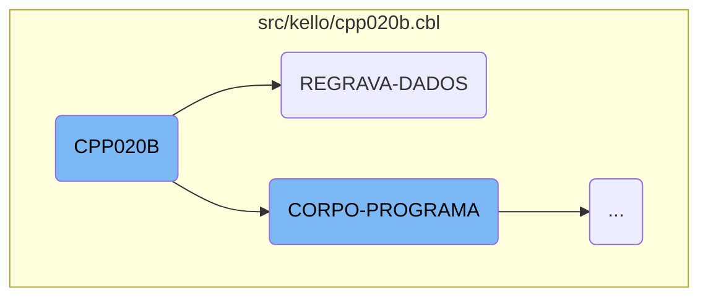
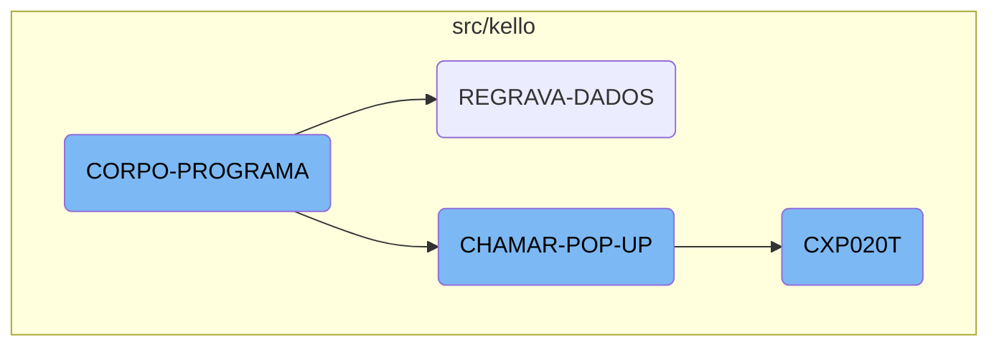

This document explains the flow and functionality of the <SwmToken path="src/kello/cpp020b.cbl" pos="417:3:3" line-data="               WHEN CPP020B-CENTRALIZA-TRUE">`CPP020B`</SwmToken> program. The program is responsible for various operations such as initializing the program, handling data validation, and managing <SwmToken path="src/kello/cpp020b.cbl" pos="499:3:5" line-data="       CHAMAR-POP-UP SECTION.">`POP-UP`</SwmToken> windows. It includes sections that orchestrate the overall logic by delegating tasks to specific subroutines based on evaluated conditions.

The <SwmToken path="src/kello/cpp020b.cbl" pos="417:3:3" line-data="               WHEN CPP020B-CENTRALIZA-TRUE">`CPP020B`</SwmToken> program starts by setting up the initial state and parameters. It then evaluates different conditions to decide which actions to perform. For example, it saves data, validates dates, and handles errors if any issues arise. The program also manages <SwmToken path="src/kello/cpp020b.cbl" pos="499:3:5" line-data="       CHAMAR-POP-UP SECTION.">`POP-UP`</SwmToken> windows by calling different external programs based on user options and processes their results to update the main program's state.

Here is a high level diagram of the flow, showing only the most important functions:

```mermaid
graph TD;
      subgraph src/kello
22a4522a51078aaff633e8bf058828aa00ab664132492e8a90d61b96b5736762(CPP020B):::mainFlowStyle --> 2798d64097950a67365ea54c9f4d3cbc76fa4f1b2155d54453e2c038e7e463a3(REGRAVA-DADOS)
end

subgraph src/kello
22a4522a51078aaff633e8bf058828aa00ab664132492e8a90d61b96b5736762(CPP020B):::mainFlowStyle --> 28858fb5e226021a4d827d900bd7dbb77285a8af3e19841b8fe4a2c94fdc8dd3(CORPO-PROGRAMA):::mainFlowStyle
end

subgraph src/kello
28858fb5e226021a4d827d900bd7dbb77285a8af3e19841b8fe4a2c94fdc8dd3(CORPO-PROGRAMA):::mainFlowStyle --> 2798d64097950a67365ea54c9f4d3cbc76fa4f1b2155d54453e2c038e7e463a3(REGRAVA-DADOS)
end

subgraph src/kello
28858fb5e226021a4d827d900bd7dbb77285a8af3e19841b8fe4a2c94fdc8dd3(CORPO-PROGRAMA):::mainFlowStyle --> 7358da6d70b13f3c0f9b3e5e6c3bb840fd677f7ac6881d285c5a45e1383a1155(CHAMAR-POP-UP):::mainFlowStyle
end

subgraph src/kello
7358da6d70b13f3c0f9b3e5e6c3bb840fd677f7ac6881d285c5a45e1383a1155(CHAMAR-POP-UP):::mainFlowStyle --> 50518e3031fd1bb8e53d707aa6046d787959e6027e111759e97ca65df1080b6b(CXP020T):::mainFlowStyle
end


      classDef mainFlowStyle color:#000000,fill:#7CB9F4
classDef rootsStyle color:#000000,fill:#00FFF4
classDef Style1 color:#000000,fill:#00FFAA
classDef Style2 color:#000000,fill:#FFFF00
classDef Style3 color:#000000,fill:#AA7CB9

%% Swimm:
%% graph TD;
%%       subgraph <SwmPath>[src/kello/](src/kello/)</SwmPath>
%% 22a4522a51078aaff633e8bf058828aa00ab664132492e8a90d61b96b5736762(CPP020B):::mainFlowStyle --> 2798d64097950a67365ea54c9f4d3cbc76fa4f1b2155d54453e2c038e7e463a3(REGRAVA-DADOS)
%% end
%% 
%% subgraph <SwmPath>[src/kello/](src/kello/)</SwmPath>
%% 22a4522a51078aaff633e8bf058828aa00ab664132492e8a90d61b96b5736762(CPP020B):::mainFlowStyle --> 28858fb5e226021a4d827d900bd7dbb77285a8af3e19841b8fe4a2c94fdc8dd3(CORPO-PROGRAMA):::mainFlowStyle
%% end
%% 
%% subgraph <SwmPath>[src/kello/](src/kello/)</SwmPath>
%% 28858fb5e226021a4d827d900bd7dbb77285a8af3e19841b8fe4a2c94fdc8dd3(CORPO-PROGRAMA):::mainFlowStyle --> 2798d64097950a67365ea54c9f4d3cbc76fa4f1b2155d54453e2c038e7e463a3(REGRAVA-DADOS)
%% end
%% 
%% subgraph <SwmPath>[src/kello/](src/kello/)</SwmPath>
%% 28858fb5e226021a4d827d900bd7dbb77285a8af3e19841b8fe4a2c94fdc8dd3(CORPO-PROGRAMA):::mainFlowStyle --> 7358da6d70b13f3c0f9b3e5e6c3bb840fd677f7ac6881d285c5a45e1383a1155(CHAMAR-POP-UP):::mainFlowStyle
%% end
%% 
%% subgraph <SwmPath>[src/kello/](src/kello/)</SwmPath>
%% 7358da6d70b13f3c0f9b3e5e6c3bb840fd677f7ac6881d285c5a45e1383a1155(CHAMAR-POP-UP):::mainFlowStyle --> 50518e3031fd1bb8e53d707aa6046d787959e6027e111759e97ca65df1080b6b(CXP020T):::mainFlowStyle
%% end
%% 
%% 
%%       classDef mainFlowStyle color:#000000,fill:#7CB9F4
%% classDef rootsStyle color:#000000,fill:#00FFF4
%% classDef Style1 color:#000000,fill:#00FFAA
%% classDef Style2 color:#000000,fill:#FFFF00
%% classDef Style3 color:#000000,fill:#AA7CB9
```



# Flow drill down

First, we'll zoom into this section of the flow:



<SwmSnippet path="/src/kello/cpp020b.cbl" line="212">

---

## Main Logic

The <SwmToken path="src/kello/cpp020b.cbl" pos="212:1:3" line-data="       MAIN-PROCESS SECTION.">`MAIN-PROCESS`</SwmToken> section initiates the program by performing the <SwmToken path="src/kello/cpp020b.cbl" pos="213:3:5" line-data="           PERFORM INICIALIZA-PROGRAMA.">`INICIALIZA-PROGRAMA`</SwmToken> section, which sets up the initial state and parameters for the program.

```cobol
       MAIN-PROCESS SECTION.
           PERFORM INICIALIZA-PROGRAMA.
```

---

</SwmSnippet>

<SwmSnippet path="/src/kello/cpp020b.cbl" line="1393">

---

## Data Validation

The <SwmToken path="src/kello/cpp020b.cbl" pos="1393:1:3" line-data="       REGRAVA-DADOS SECTION.">`REGRAVA-DADOS`</SwmToken> section handles the re-saving of data. It performs the <SwmToken path="src/kello/cpp020b.cbl" pos="1394:3:5" line-data="           PERFORM SALVAR-DADOS.">`SALVAR-DADOS`</SwmToken> section to save the current data, validates the date with <SwmToken path="src/kello/cpp020b.cbl" pos="1396:3:7" line-data="           PERFORM VALIDA-DATA-LIMITE">`VALIDA-DATA-LIMITE`</SwmToken>, and rewrites the record. If the record is invalid, it performs the <SwmToken path="src/kello/cpp020b.cbl" pos="1399:3:5" line-data="                   PERFORM ERRO-GRAVACAO">`ERRO-GRAVACAO`</SwmToken> section to handle the error. Additionally, it logs the operation details and performs further checks and operations based on the <SwmToken path="src/kello/cpp020b.cbl" pos="1413:3:5" line-data="           IF PORTADOR-CP20 = 12">`PORTADOR-CP20`</SwmToken> and <SwmToken path="src/kello/cpp020b.cbl" pos="441:1:5" line-data="                       TIPO-CONTA-CP20 = 1">`TIPO-CONTA-CP20`</SwmToken> values.

```cobol
       REGRAVA-DADOS SECTION.
           PERFORM SALVAR-DADOS.

           PERFORM VALIDA-DATA-LIMITE

           REWRITE REG-CPD020 INVALID KEY
                   PERFORM ERRO-GRAVACAO
           NOT INVALID KEY
                 MOVE USUARIO-W   TO LOG3-USUARIO
                 MOVE FUNCTION CURRENT-DATE TO WS-DATA-SYS
                 MOVE WS-DATA-CPU TO LOG3-DATA
                 ACCEPT WS-HORA-SYS FROM TIME
                 MOVE WS-HORA-SYS TO LOG3-HORAS
                 MOVE "I"         TO LOG3-OPERACAO
                 MOVE "CPD020"    TO LOG3-ARQUIVO
                 MOVE "CPP020B"    TO LOG3-PROGRAMA
                 MOVE REG-CPD020  TO LOG3-REGISTRO
                 WRITE REG-LOG003
                 END-WRITE
                 CONTINUE.
           IF PORTADOR-CP20 = 12
```

---

</SwmSnippet>

Now, lets zoom into this section of the flow:



<SwmSnippet path="/src/kello/cpp020b.cbl" line="415">

---

## <SwmToken path="src/kello/cpp020b.cbl" pos="415:1:3" line-data="       CORPO-PROGRAMA SECTION.">`CORPO-PROGRAMA`</SwmToken>

The <SwmToken path="src/kello/cpp020b.cbl" pos="415:1:3" line-data="       CORPO-PROGRAMA SECTION.">`CORPO-PROGRAMA`</SwmToken> section is the main control flow of the program. It evaluates various conditions and performs corresponding actions. For example, it calls <SwmToken path="src/kello/cpp020b.cbl" pos="420:3:5" line-data="                    PERFORM REGRAVA-DADOS">`REGRAVA-DADOS`</SwmToken> when <SwmToken path="src/kello/cpp020b.cbl" pos="419:3:9" line-data="               WHEN CPP020B-SAVE-FLG-TRUE">`CPP020B-SAVE-FLG-TRUE`</SwmToken> is true, and <SwmToken path="src/kello/cpp020b.cbl" pos="499:1:5" line-data="       CHAMAR-POP-UP SECTION.">`CHAMAR-POP-UP`</SwmToken> when <SwmToken path="src/kello/cpp020b.cbl" pos="476:3:11" line-data="               WHEN CPP020B-CHAMAR-POP-UP-TRUE">`CPP020B-CHAMAR-POP-UP-TRUE`</SwmToken> is true. This section orchestrates the overall logic by delegating tasks to specific subroutines based on the evaluated conditions.

```cobol
       CORPO-PROGRAMA SECTION.
           EVALUATE TRUE
               WHEN CPP020B-CENTRALIZA-TRUE
                    PERFORM CENTRALIZAR
               WHEN CPP020B-SAVE-FLG-TRUE
                    PERFORM REGRAVA-DADOS
               WHEN CPP020B-LOAD-FLG-TRUE
                    PERFORM CARREGAR-DADOS
                    refresh-object principal
                    MOVE "SET-POSICAO-CURSOR1" TO DS-PROCEDURE
               WHEN CPP020B-EXCLUI-FLG-TRUE
                    MOVE FORNEC-CP20   TO FORNEC-W
                    MOVE NR-DOCTO-CP20 TO DOCTO-W
                    MOVE 3 TO SITUACAO-CP20
                    PERFORM EXCLUI
               WHEN CPP020B-SUSPENDE-FLG-TRUE
                    IF CPP020B-SITUACAO = 0
                       MOVE 1 TO SITUACAO-CP20
                    ELSE
                       MOVE 0 TO SITUACAO-CP20
                    END-IF
```

---

</SwmSnippet>

<SwmSnippet path="/src/kello/cpp020b.cbl" line="494">

---

## <SwmToken path="src/kello/cpp020b.cbl" pos="499:1:5" line-data="       CHAMAR-POP-UP SECTION.">`CHAMAR-POP-UP`</SwmToken>

The <SwmToken path="src/kello/cpp020b.cbl" pos="499:1:5" line-data="       CHAMAR-POP-UP SECTION.">`CHAMAR-POP-UP`</SwmToken> section handles the logic for displaying various <SwmToken path="src/kello/cpp020b.cbl" pos="499:3:5" line-data="       CHAMAR-POP-UP SECTION.">`POP-UP`</SwmToken> windows based on the value of <SwmToken path="src/kello/cpp020b.cbl" pos="500:3:9" line-data="           EVALUATE CPP020B-OPCAO-POP-UP">`CPP020B-OPCAO-POP-UP`</SwmToken>. It calls different external programs and processes their results to update the main program's state. For instance, when the option is 4, it calls <SwmToken path="src/kello/cpp020b.cbl" pos="495:6:6" line-data="      *    CALL &quot;CXP020T&quot; USING PASSAR-PARAMETROS">`CXP020T`</SwmToken> and processes the returned parameters to update <SwmToken path="src/kello/cpp020b.cbl" pos="497:19:23" line-data="      *    MOVE PASSAR-STRING-1(52: 3) TO CPP020B-COD-APURACAO">`CPP020B-COD-APURACAO`</SwmToken> and other related fields.

```cobol
      *CHAMAR-APURACAO SECTION.
      *    CALL "CXP020T" USING PASSAR-PARAMETROS
      *    CANCEL "CXP020T"
      *    MOVE PASSAR-STRING-1(52: 3) TO CPP020B-COD-APURACAO
      *    PERFORM LE-COD-APURACAO.
       CHAMAR-POP-UP SECTION.
           EVALUATE CPP020B-OPCAO-POP-UP
             WHEN 1 PERFORM CARREGA-POP-UP-FORNEC
      *             CALL "CGP001T" USING PASSAR-PARAMETROS
      *             CANCEL "CGP001T"
      *             MOVE PASSAR-STRING-1(33: 6) TO CPP020B-COD-FORN
             WHEN 2 CALL "CAP019T" USING PARAMETROS-W PASSAR-PARAMETROS
                    CANCEL "CAP019T"
                    MOVE PASSAR-STRING-1(1: 30) TO
                         CPP020B-DESCR-TIPO-FORN
                    MOVE PASSAR-STRING-1(33: 2) TO CPP020B-TIPO-FORN
             WHEN 3 CALL "CAP018T" USING PARAMETROS-W PASSAR-PARAMETROS
                   CANCEL "CAP018T"
                   MOVE PASSAR-STRING-1(1: 30) TO CPP020B-DESCR-PORTADOR
                   MOVE PASSAR-STRING-1(33: 4) TO CPP020B-PORTADOR
             WHEN 4
```

---

</SwmSnippet>

<SwmSnippet path="/src/kello/cxp020t.cbl" line="72">

---

## <SwmToken path="src/kello/cxp020t.cbl" pos="74:9:9" line-data="           PERFORM CORPO-PROGRAMA UNTIL CXP020T-EXIT-FLG-TRUE.">`CXP020T`</SwmToken>

The <SwmToken path="src/kello/cxp020t.cbl" pos="74:9:9" line-data="           PERFORM CORPO-PROGRAMA UNTIL CXP020T-EXIT-FLG-TRUE.">`CXP020T`</SwmToken> program is called by <SwmToken path="src/kello/cpp020b.cbl" pos="499:1:5" line-data="       CHAMAR-POP-UP SECTION.">`CHAMAR-POP-UP`</SwmToken> and performs various operations such as initializing the program, processing the main logic in <SwmToken path="src/kello/cxp020t.cbl" pos="74:3:5" line-data="           PERFORM CORPO-PROGRAMA UNTIL CXP020T-EXIT-FLG-TRUE.">`CORPO-PROGRAMA`</SwmToken>, and finalizing the program. It includes sections for handling specific tasks like <SwmToken path="src/kello/cxp020t.cbl" pos="103:3:5" line-data="                    PERFORM LOCALIZA-PALAVRA">`LOCALIZA-PALAVRA`</SwmToken> and <SwmToken path="src/kello/cxp020t.cbl" pos="91:3:7" line-data="              PERFORM CARREGA-MENSAGEM-ERRO">`CARREGA-MENSAGEM-ERRO`</SwmToken>, which are crucial for the program's functionality. This program is integral to the flow as it provides detailed processing and updates required by the main program.

```cobol
       MAIN-PROCESS SECTION.
           PERFORM INICIALIZA-PROGRAMA.
           PERFORM CORPO-PROGRAMA UNTIL CXP020T-EXIT-FLG-TRUE.
           GO FINALIZAR-PROGRAMA.

       INICIALIZA-PROGRAMA SECTION.
           MOVE "00000" TO STRING-1(52: 5).
           INITIALIZE CXP020T-DATA-BLOCK
           INITIALIZE DS-CONTROL-BLOCK
           MOVE CXP020T-DATA-BLOCK-VERSION-NO
                                   TO DS-DATA-BLOCK-VERSION-NO
           MOVE CXP020T-VERSION-NO  TO DS-VERSION-NO
           MOVE EMPRESA-W          TO EMP-REC
           MOVE "CXD020"  TO ARQ-REC. MOVE EMPRESA-REF TO PATH-CXD020.
           OPEN INPUT CXD020
           IF ST-CXD020 <> "00"
              MOVE "ERRO ABERTURA CXD020: "  TO CXP020T-MENSAGEM-ERRO
              MOVE ST-CXD020 TO CXP020T-MENSAGEM-ERRO(23: 02)
              PERFORM LOAD-SCREENSET
              PERFORM CARREGA-MENSAGEM-ERRO
           ELSE PERFORM LOAD-SCREENSET.
```

---

</SwmSnippet>

# Where is this flow used?

This flow is used multiple times in the codebase as represented in the following diagram:

```mermaid
graph TD;
      subgraph src/kello
56bf80eb7919117d550d062bd598dc93e5f3a15ddf95def6aa421a4d087635b3(CPP051):::rootsStyle --> 4fd862bd3fcf2495fd1a1da122301ad0531e3af260c1e8e34675ef5589d567c9(CORPO-PROGRAMA)
end

subgraph src/kello
4fd862bd3fcf2495fd1a1da122301ad0531e3af260c1e8e34675ef5589d567c9(CORPO-PROGRAMA) --> f8c19bad4869672321fc40c7c7eb22c10762554c3ccfa9902b0700f8346dab72(CHAMA-ALTERACAO)
end

subgraph src/kello
f8c19bad4869672321fc40c7c7eb22c10762554c3ccfa9902b0700f8346dab72(CHAMA-ALTERACAO) --> 22a4522a51078aaff633e8bf058828aa00ab664132492e8a90d61b96b5736762(CPP020B):::mainFlowStyle
end

subgraph src/kello
df317370c27b47d5b49053a5d655227f726711fb9cff6bb077d3c93ab77f2d0f(CPP052):::rootsStyle --> 98ac1b83efb1db92457faea8a2808341788017ad18e03ace8947a8dc940f04da(CORPO-PROGRAMA)
end

subgraph src/kello
98ac1b83efb1db92457faea8a2808341788017ad18e03ace8947a8dc940f04da(CORPO-PROGRAMA) --> 9a88b84e9357db2b33841ac4e3250645088a185a4e6155481872801defdffdbf(CHAMA-ALTERACAO)
end

subgraph src/kello
9a88b84e9357db2b33841ac4e3250645088a185a4e6155481872801defdffdbf(CHAMA-ALTERACAO) --> 22a4522a51078aaff633e8bf058828aa00ab664132492e8a90d61b96b5736762(CPP020B):::mainFlowStyle
end

subgraph src/kello
60c76edec5b4ba2eaaf536b18e76e087083929a753f4f4d18b4a67e5fd30100c(MAIN-PROCESS):::rootsStyle --> 4fd862bd3fcf2495fd1a1da122301ad0531e3af260c1e8e34675ef5589d567c9(CORPO-PROGRAMA)
end

subgraph src/kello
60c76edec5b4ba2eaaf536b18e76e087083929a753f4f4d18b4a67e5fd30100c(MAIN-PROCESS):::rootsStyle --> 98ac1b83efb1db92457faea8a2808341788017ad18e03ace8947a8dc940f04da(CORPO-PROGRAMA)
end


      classDef mainFlowStyle color:#000000,fill:#7CB9F4
classDef rootsStyle color:#000000,fill:#00FFF4
classDef Style1 color:#000000,fill:#00FFAA
classDef Style2 color:#000000,fill:#FFFF00
classDef Style3 color:#000000,fill:#AA7CB9

%% Swimm:
%% graph TD;
%%       subgraph <SwmPath>[src/kello/](src/kello/)</SwmPath>
%% 56bf80eb7919117d550d062bd598dc93e5f3a15ddf95def6aa421a4d087635b3(CPP051):::rootsStyle --> 4fd862bd3fcf2495fd1a1da122301ad0531e3af260c1e8e34675ef5589d567c9(CORPO-PROGRAMA)
%% end
%% 
%% subgraph <SwmPath>[src/kello/](src/kello/)</SwmPath>
%% 4fd862bd3fcf2495fd1a1da122301ad0531e3af260c1e8e34675ef5589d567c9(CORPO-PROGRAMA) --> f8c19bad4869672321fc40c7c7eb22c10762554c3ccfa9902b0700f8346dab72(CHAMA-ALTERACAO)
%% end
%% 
%% subgraph <SwmPath>[src/kello/](src/kello/)</SwmPath>
%% f8c19bad4869672321fc40c7c7eb22c10762554c3ccfa9902b0700f8346dab72(CHAMA-ALTERACAO) --> 22a4522a51078aaff633e8bf058828aa00ab664132492e8a90d61b96b5736762(CPP020B):::mainFlowStyle
%% end
%% 
%% subgraph <SwmPath>[src/kello/](src/kello/)</SwmPath>
%% df317370c27b47d5b49053a5d655227f726711fb9cff6bb077d3c93ab77f2d0f(CPP052):::rootsStyle --> 98ac1b83efb1db92457faea8a2808341788017ad18e03ace8947a8dc940f04da(CORPO-PROGRAMA)
%% end
%% 
%% subgraph <SwmPath>[src/kello/](src/kello/)</SwmPath>
%% 98ac1b83efb1db92457faea8a2808341788017ad18e03ace8947a8dc940f04da(CORPO-PROGRAMA) --> 9a88b84e9357db2b33841ac4e3250645088a185a4e6155481872801defdffdbf(CHAMA-ALTERACAO)
%% end
%% 
%% subgraph <SwmPath>[src/kello/](src/kello/)</SwmPath>
%% 9a88b84e9357db2b33841ac4e3250645088a185a4e6155481872801defdffdbf(CHAMA-ALTERACAO) --> 22a4522a51078aaff633e8bf058828aa00ab664132492e8a90d61b96b5736762(CPP020B):::mainFlowStyle
%% end
%% 
%% subgraph <SwmPath>[src/kello/](src/kello/)</SwmPath>
%% 60c76edec5b4ba2eaaf536b18e76e087083929a753f4f4d18b4a67e5fd30100c(MAIN-PROCESS):::rootsStyle --> 4fd862bd3fcf2495fd1a1da122301ad0531e3af260c1e8e34675ef5589d567c9(CORPO-PROGRAMA)
%% end
%% 
%% subgraph <SwmPath>[src/kello/](src/kello/)</SwmPath>
%% 60c76edec5b4ba2eaaf536b18e76e087083929a753f4f4d18b4a67e5fd30100c(MAIN-PROCESS):::rootsStyle --> 98ac1b83efb1db92457faea8a2808341788017ad18e03ace8947a8dc940f04da(CORPO-PROGRAMA)
%% end
%% 
%% 
%%       classDef mainFlowStyle color:#000000,fill:#7CB9F4
%% classDef rootsStyle color:#000000,fill:#00FFF4
%% classDef Style1 color:#000000,fill:#00FFAA
%% classDef Style2 color:#000000,fill:#FFFF00
%% classDef Style3 color:#000000,fill:#AA7CB9
```



&nbsp;

*This is an auto-generated document by Swimm AI 🌊 and has not yet been verified by a human*

<SwmMeta version="3.0.0" repo-id="Z2l0aHViJTNBJTNBa2VsbG8lM0ElM0Fzd2ltbWlv" repo-name="kello"><sup>Powered by [Swimm](/)</sup></SwmMeta>
