In this document, we will explain the flow of the <SwmToken path="src/kello/cdcp110.cbl" pos="3:6:6" line-data="       PROGRAM-ID. CDCP110.">`CDCP110`</SwmToken> program. The program initiates the main process, evaluates various conditions, and performs corresponding tasks based on set flags.

The flow starts with the <SwmToken path="src/kello/cdcp110.cbl" pos="3:6:6" line-data="       PROGRAM-ID. CDCP110.">`CDCP110`</SwmToken> program initiating the main process. It first performs the initialization section and then repeatedly performs the main body section until a specific exit flag is set. Within the main body, it evaluates different conditions and performs tasks like centralizing data, printing reports, saving work, and calling <SwmToken path="src/kello/cdcp110.cbl" pos="392:5:7" line-data="               WHEN GS-POP-UP-CIDADE-TRUE">`POP-UP`</SwmToken> windows for various entities. If certain conditions are met, it prepares and calls another program, <SwmToken path="src/kello/cdcp110.cbl" pos="575:4:4" line-data="           CALL   &quot;CHP013T&quot; USING PARAMETROS-W PASSAR-STRING-1">`CHP013T`</SwmToken>, by moving specific data to a variable and using parameters.

# Flow drill down

```mermaid
graph TD;
      subgraph src/kello
ec399ca4edd76d5fa145386a8ddd871638f13b39e6077d2539e65fc3a47a7aa1(CDCP110):::mainFlowStyle --> 14b0939e8ef23972f3a6b7ded7fcb0440a9d034cb38470e51fc3a38a6f695aff(CORPO-PROGRAMA):::mainFlowStyle
end

subgraph src/kello
14b0939e8ef23972f3a6b7ded7fcb0440a9d034cb38470e51fc3a38a6f695aff(CORPO-PROGRAMA):::mainFlowStyle --> a385c2706e4a88c120597270d5cf6d9186ec286d2996c5ff52bd784f74866eb6(CHAMA-ALTERACAO):::mainFlowStyle
end

subgraph src/kello
a385c2706e4a88c120597270d5cf6d9186ec286d2996c5ff52bd784f74866eb6(CHAMA-ALTERACAO):::mainFlowStyle --> 5514f62aaff907a0b774499053e7df04a7e69dc181af65285bbd8b419e3c2ab9(CHP013T):::mainFlowStyle
end


      classDef mainFlowStyle color:#000000,fill:#7CB9F4
classDef rootsStyle color:#000000,fill:#00FFF4
classDef Style1 color:#000000,fill:#00FFAA
classDef Style2 color:#000000,fill:#FFFF00
classDef Style3 color:#000000,fill:#AA7CB9

%% Swimm:
%% graph TD;
%%       subgraph <SwmPath>[src/kello/](src/kello/)</SwmPath>
%% ec399ca4edd76d5fa145386a8ddd871638f13b39e6077d2539e65fc3a47a7aa1(CDCP110):::mainFlowStyle --> 14b0939e8ef23972f3a6b7ded7fcb0440a9d034cb38470e51fc3a38a6f695aff(CORPO-PROGRAMA):::mainFlowStyle
%% end
%% 
%% subgraph <SwmPath>[src/kello/](src/kello/)</SwmPath>
%% 14b0939e8ef23972f3a6b7ded7fcb0440a9d034cb38470e51fc3a38a6f695aff(CORPO-PROGRAMA):::mainFlowStyle --> a385c2706e4a88c120597270d5cf6d9186ec286d2996c5ff52bd784f74866eb6(CHAMA-ALTERACAO):::mainFlowStyle
%% end
%% 
%% subgraph <SwmPath>[src/kello/](src/kello/)</SwmPath>
%% a385c2706e4a88c120597270d5cf6d9186ec286d2996c5ff52bd784f74866eb6(CHAMA-ALTERACAO):::mainFlowStyle --> 5514f62aaff907a0b774499053e7df04a7e69dc181af65285bbd8b419e3c2ab9(CHP013T):::mainFlowStyle
%% end
%% 
%% 
%%       classDef mainFlowStyle color:#000000,fill:#7CB9F4
%% classDef rootsStyle color:#000000,fill:#00FFF4
%% classDef Style1 color:#000000,fill:#00FFAA
%% classDef Style2 color:#000000,fill:#FFFF00
%% classDef Style3 color:#000000,fill:#AA7CB9
```



<SwmSnippet path="/src/kello/cdcp110.cbl" line="229">

---

## <SwmToken path="src/kello/cdcp110.cbl" pos="3:6:6" line-data="       PROGRAM-ID. CDCP110.">`CDCP110`</SwmToken>

The <SwmToken path="src/kello/cdcp110.cbl" pos="3:6:6" line-data="       PROGRAM-ID. CDCP110.">`CDCP110`</SwmToken> function initiates the main process by performing the <SwmToken path="src/kello/cdcp110.cbl" pos="230:3:5" line-data="           PERFORM INICIALIZA-PROGRAMA.">`INICIALIZA-PROGRAMA`</SwmToken> section and then repeatedly performs the <SwmToken path="src/kello/cdcp110.cbl" pos="231:3:5" line-data="           PERFORM CORPO-PROGRAMA UNTIL GS-EXIT-FLG-TRUE.">`CORPO-PROGRAMA`</SwmToken> section until the <SwmToken path="src/kello/cdcp110.cbl" pos="231:9:15" line-data="           PERFORM CORPO-PROGRAMA UNTIL GS-EXIT-FLG-TRUE.">`GS-EXIT-FLG-TRUE`</SwmToken> flag is set.

```cobol
       MAIN-PROCESS SECTION.
           PERFORM INICIALIZA-PROGRAMA.
           PERFORM CORPO-PROGRAMA UNTIL GS-EXIT-FLG-TRUE.
```

---

</SwmSnippet>

<SwmSnippet path="/src/kello/cdcp110.cbl" line="349">

---

## <SwmToken path="src/kello/cdcp110.cbl" pos="349:1:3" line-data="       CORPO-PROGRAMA SECTION.">`CORPO-PROGRAMA`</SwmToken>

The <SwmToken path="src/kello/cdcp110.cbl" pos="349:1:3" line-data="       CORPO-PROGRAMA SECTION.">`CORPO-PROGRAMA`</SwmToken> function evaluates various conditions and performs corresponding sections based on the flags set. It handles tasks such as centralizing data, printing reports, saving work, loading lists, and calling <SwmToken path="src/kello/cdcp110.cbl" pos="392:5:7" line-data="               WHEN GS-POP-UP-CIDADE-TRUE">`POP-UP`</SwmToken> windows for different entities like cities, vendors, and clients.

```cobol
       CORPO-PROGRAMA SECTION.
           EVALUATE TRUE
               WHEN GS-CENTRALIZA-TRUE
                   PERFORM CENTRALIZAR
               WHEN GS-PRINTER-FLG-TRUE
                    COPY IMPRESSORA.CHAMA.
                    IF LNK-MAPEAMENTO <> SPACES
                       MOVE GS-ACP-CONTA         TO CONTA-REL
                       MOVE GS-DESC-CONTA        TO NOME-CONTA-REL
                       MOVE GS-FORMA-PAG         TO FORMA-PGTO-REL
                       MOVE GS-RECEBEDOR         TO RECEBEDOR-REL

                       IF GS-OPCAO = 1
                          PERFORM IMPRIME-RELATORIO
                       ELSE
                          PERFORM IMPRIME-RELATORIO2
                       END-IF
                    END-IF
               WHEN GS-GRAVA-WORK-FLG-TRUE
                    PERFORM GRAVA-WORK
                    IF GS-OPCAO = 1
```

---

</SwmSnippet>

<SwmSnippet path="/src/kello/cdcp110.cbl" line="562">

---

## <SwmToken path="src/kello/cdcp110.cbl" pos="562:1:3" line-data="       CHAMA-ALTERACAO SECTION.">`CHAMA-ALTERACAO`</SwmToken>

The <SwmToken path="src/kello/cdcp110.cbl" pos="562:1:3" line-data="       CHAMA-ALTERACAO SECTION.">`CHAMA-ALTERACAO`</SwmToken> function is responsible for preparing and calling the <SwmToken path="src/kello/cdcp110.cbl" pos="575:4:4" line-data="           CALL   &quot;CHP013T&quot; USING PARAMETROS-W PASSAR-STRING-1">`CHP013T`</SwmToken> program. It moves specific data to the <SwmToken path="src/kello/cdcp110.cbl" pos="566:15:19" line-data="           MOVE GS-LINDET(150: 8) TO PASSAR-STRING-1(1: 8)">`PASSAR-STRING-1`</SwmToken> variable and then calls <SwmToken path="src/kello/cdcp110.cbl" pos="575:4:4" line-data="           CALL   &quot;CHP013T&quot; USING PARAMETROS-W PASSAR-STRING-1">`CHP013T`</SwmToken> using the parameters.

```cobol
       CHAMA-ALTERACAO SECTION.
           IF GS-LINDET = SPACES
              MOVE ZEROS TO GS-LINDET.

           MOVE GS-LINDET(150: 8) TO PASSAR-STRING-1(1: 8)
                                     DATA-MOVTO-CH10
                                     DATA-MOVTO-WK
           MOVE GS-LINDET(158: 4) TO PASSAR-STRING-1(10: 4)
                                     SEQ-CH10
                                     SEQ-WK.
           MOVE USUARIO-W         TO PASSAR-STRING-1(20: 5)
           MOVE COD-USUARIO-W     TO PASSAR-STRING-1(26: 3)

           CALL   "CHP013T" USING PARAMETROS-W PASSAR-STRING-1
           CANCEL "CHP013T".
```

---

</SwmSnippet>

<SwmSnippet path="/src/kello/Chp013t.cbl" line="114">

---

## <SwmToken path="src/kello/cdcp110.cbl" pos="575:4:4" line-data="           CALL   &quot;CHP013T&quot; USING PARAMETROS-W PASSAR-STRING-1">`CHP013T`</SwmToken>

The <SwmToken path="src/kello/cdcp110.cbl" pos="575:4:4" line-data="           CALL   &quot;CHP013T&quot; USING PARAMETROS-W PASSAR-STRING-1">`CHP013T`</SwmToken> function starts by performing the <SwmToken path="src/kello/Chp013t.cbl" pos="115:3:5" line-data="           PERFORM INICIALIZA-PROGRAMA.">`INICIALIZA-PROGRAMA`</SwmToken> section and then repeatedly performs the <SwmToken path="src/kello/Chp013t.cbl" pos="116:3:5" line-data="           PERFORM CORPO-PROGRAMA UNTIL GS-EXIT-FLG-TRUE.">`CORPO-PROGRAMA`</SwmToken> section until the <SwmToken path="src/kello/Chp013t.cbl" pos="116:9:15" line-data="           PERFORM CORPO-PROGRAMA UNTIL GS-EXIT-FLG-TRUE.">`GS-EXIT-FLG-TRUE`</SwmToken> flag is set, similar to the <SwmToken path="src/kello/cdcp110.cbl" pos="3:6:6" line-data="       PROGRAM-ID. CDCP110.">`CDCP110`</SwmToken> function.

```cobol
       MAIN-PROCESS SECTION.
           PERFORM INICIALIZA-PROGRAMA.
           PERFORM CORPO-PROGRAMA UNTIL GS-EXIT-FLG-TRUE.
           GO FINALIZAR-PROGRAMA.
```

---

</SwmSnippet>

&nbsp;

*This is an auto-generated document by Swimm AI 🌊 and has not yet been verified by a human*

<SwmMeta version="3.0.0" repo-id="Z2l0aHViJTNBJTNBa2VsbG8lM0ElM0Fzd2ltbWlv" repo-name="kello"><sup>Powered by [Swimm](/)</sup></SwmMeta>
