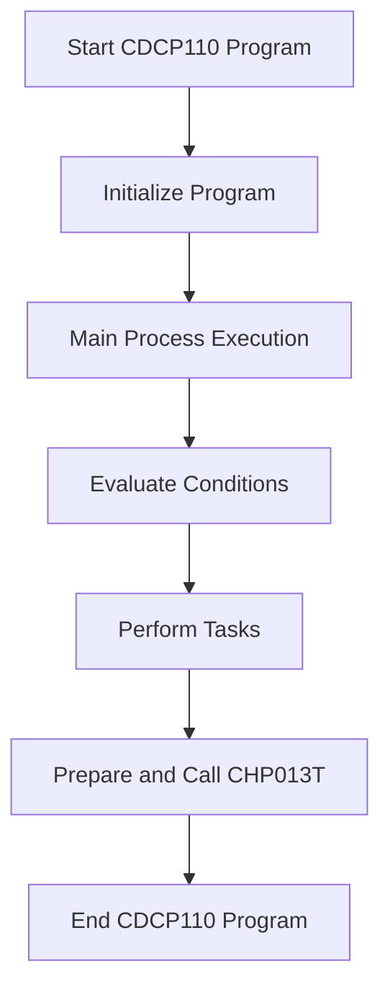

This document will cover the flow of the CDCP110 program, which includes:

1. Initializing the program
2. Main process execution
3. Evaluating conditions and performing tasks
4. Preparing and calling the CHP013T program.

Technical document: <SwmLink doc-title="Flow of CDCP110 Program">[Flow of CDCP110 Program](/.swm/flow-of-cdcp110-program.cmerbknb.sw.md)</SwmLink>

# Initializing the program

The CDCP110 program begins by initializing the necessary components and setting up the environment. This step ensures that all required resources and variables are prepared for the main process execution. Initialization is crucial as it sets the stage for the subsequent operations, ensuring that the program runs smoothly and without errors.

# Main process execution

After initialization, the CDCP110 program enters the main process execution phase. This phase involves repeatedly performing the core operations of the program until a specific exit condition is met. The main process is the heart of the program, where the bulk of the business logic is executed. It ensures that the program continues to run and perform its tasks until it is explicitly told to stop.

# Evaluating conditions and performing tasks

Within the main process, the program evaluates various conditions to determine which tasks need to be performed. These conditions are based on specific flags that are set during the program's execution. For example, if the centralization flag is set, the program will centralize data. If the printer flag is set, it will print reports. This step is crucial as it allows the program to dynamically respond to different scenarios and perform the appropriate actions based on the current state of the system.

# Preparing and calling the CHP013T program

If certain conditions are met, the CDCP110 program prepares to call another program, CHP013T. This involves moving specific data to a variable and using parameters to ensure that the correct information is passed to the CHP013T program. This step is essential for ensuring that the CHP013T program has all the necessary data to perform its operations effectively. By calling the CHP013T program, the CDCP110 program can delegate specific tasks to another program, allowing for modular and organized code execution.

&nbsp;

*This is an auto-generated document by Swimm AI 🌊 and has not yet been verified by a human*

<SwmMeta version="3.0.0" repo-id="Z2l0aHViJTNBJTNBa2VsbG8lM0ElM0Fzd2ltbWlv" repo-name="kello">Powered by [Swimm](/)</SwmMeta>
