This document explains the <SwmToken path="src/cop/cop040.cbl" pos="190:1:3" line-data="       MAIN-PROCESS SECTION.">`MAIN-PROCESS`</SwmToken> flow, which is a crucial part of the COBOL-85 application. The <SwmToken path="src/cop/cop040.cbl" pos="190:1:3" line-data="       MAIN-PROCESS SECTION.">`MAIN-PROCESS`</SwmToken> section initializes the program, repeatedly performs the <SwmToken path="src/cop/cop040.cbl" pos="192:3:5" line-data="           PERFORM CORPO-PROGRAMA UNTIL GS-EXIT-FLG-TRUE.">`CORPO-PROGRAMA`</SwmToken> section until a specific exit flag is set, and then finalizes the program. This structure ensures that the main operations of the program are executed in a loop until a condition for termination is met.

The <SwmToken path="src/cop/cop040.cbl" pos="190:1:3" line-data="       MAIN-PROCESS SECTION.">`MAIN-PROCESS`</SwmToken> starts by initializing the program. It then enters a loop where it performs the main body of the program (CORPO-PROGRAMA) repeatedly. This loop continues until a specific condition, known as the exit flag, is met. Once this condition is satisfied, the program exits the loop and proceeds to finalize the operations, effectively ending the program.

# Flow drill down

```mermaid
graph TD;
      subgraph src/cop
39392c79bb1401a6c4b89110427b2d3f1936ee58074eae87b77d2ec297c90e73(MAIN-PROCESS):::mainFlowStyle --> accce96d7b1cbb7d272e8c947e371a25614eaf564033435190a76c89a6e7728c(CORPO-PROGRAMA):::mainFlowStyle
end

subgraph src/cop
accce96d7b1cbb7d272e8c947e371a25614eaf564033435190a76c89a6e7728c(CORPO-PROGRAMA):::mainFlowStyle --> 4c3d76b02f99d65eb0426e760eb25787f0dcf06da4d67d3ea99ab404265a063b(CHAMAR-PRODUTO)
end

subgraph src/cop
accce96d7b1cbb7d272e8c947e371a25614eaf564033435190a76c89a6e7728c(CORPO-PROGRAMA):::mainFlowStyle --> a702e24282249f4210a70fed7bb530f53b4814046cd8e0cef7d6c45d7d497a2b(CHAMAR-TURMA)
end

subgraph src/cop
accce96d7b1cbb7d272e8c947e371a25614eaf564033435190a76c89a6e7728c(CORPO-PROGRAMA):::mainFlowStyle --> 64cb469e5b62ed996cae245a2bea9d669ad8005294167ec03844296910bd2648(CHAMAR-POP-UP)
end

subgraph src/cop
accce96d7b1cbb7d272e8c947e371a25614eaf564033435190a76c89a6e7728c(CORPO-PROGRAMA):::mainFlowStyle --> 238f70b56b357e9196bb0d70a1eb1e790410c675ee829070677e9f2f68935ddb(CHAMAR-EVENTO)
end

subgraph src/cop
accce96d7b1cbb7d272e8c947e371a25614eaf564033435190a76c89a6e7728c(CORPO-PROGRAMA):::mainFlowStyle --> 00ac3176ace73d52349ae058be0a6f391e2a4c1a6cd9708f19b009e54d5634be(CHAMAR-COMISSAO):::mainFlowStyle
end

subgraph src/cgp010x.cbl
00ac3176ace73d52349ae058be0a6f391e2a4c1a6cd9708f19b009e54d5634be(CHAMAR-COMISSAO):::mainFlowStyle --> 409cc29749cdedbc34599f78a27a0bfd4432f7f2be414d324694bef36ddc1d3d(CGP010X):::mainFlowStyle
end

subgraph src/cop
238f70b56b357e9196bb0d70a1eb1e790410c675ee829070677e9f2f68935ddb(CHAMAR-EVENTO) --> d995d2512448d49e05d5c9cd0f5966ac753cf4c313c9023eaade20361b09aa06(COP060X)
end

subgraph src/cop
a702e24282249f4210a70fed7bb530f53b4814046cd8e0cef7d6c45d7d497a2b(CHAMAR-TURMA) --> bf443c6ad7fde229752de7447a4ebf53c46fc982e50fca870483141b7ff5ed75(COP041X)
end

subgraph src/cop
4c3d76b02f99d65eb0426e760eb25787f0dcf06da4d67d3ea99ab404265a063b(CHAMAR-PRODUTO) --> c8ca1b1b900adab247b36e4d188b2b21f7b828c42b983a4ce5bf2bf564ece1ac(COP045)
end

subgraph src/cgp010x.cbl
409cc29749cdedbc34599f78a27a0bfd4432f7f2be414d324694bef36ddc1d3d(CGP010X):::mainFlowStyle --> 075d28cfa708166862be90f366794a75b587871efcdff0a3d11ab8941352723d(CORPO-PROGRAMA):::mainFlowStyle
end


      classDef mainFlowStyle color:#000000,fill:#7CB9F4
classDef rootsStyle color:#000000,fill:#00FFF4
classDef Style1 color:#000000,fill:#00FFAA
classDef Style2 color:#000000,fill:#FFFF00
classDef Style3 color:#000000,fill:#AA7CB9

%% Swimm:
%% graph TD;
%%       subgraph <SwmPath>[src/cop/](src/cop/)</SwmPath>
%% 39392c79bb1401a6c4b89110427b2d3f1936ee58074eae87b77d2ec297c90e73(MAIN-PROCESS):::mainFlowStyle --> accce96d7b1cbb7d272e8c947e371a25614eaf564033435190a76c89a6e7728c(CORPO-PROGRAMA):::mainFlowStyle
%% end
%% 
%% subgraph <SwmPath>[src/cop/](src/cop/)</SwmPath>
%% accce96d7b1cbb7d272e8c947e371a25614eaf564033435190a76c89a6e7728c(CORPO-PROGRAMA):::mainFlowStyle --> 4c3d76b02f99d65eb0426e760eb25787f0dcf06da4d67d3ea99ab404265a063b(CHAMAR-PRODUTO)
%% end
%% 
%% subgraph <SwmPath>[src/cop/](src/cop/)</SwmPath>
%% accce96d7b1cbb7d272e8c947e371a25614eaf564033435190a76c89a6e7728c(CORPO-PROGRAMA):::mainFlowStyle --> a702e24282249f4210a70fed7bb530f53b4814046cd8e0cef7d6c45d7d497a2b(CHAMAR-TURMA)
%% end
%% 
%% subgraph <SwmPath>[src/cop/](src/cop/)</SwmPath>
%% accce96d7b1cbb7d272e8c947e371a25614eaf564033435190a76c89a6e7728c(CORPO-PROGRAMA):::mainFlowStyle --> 64cb469e5b62ed996cae245a2bea9d669ad8005294167ec03844296910bd2648(CHAMAR-POP-UP)
%% end
%% 
%% subgraph <SwmPath>[src/cop/](src/cop/)</SwmPath>
%% accce96d7b1cbb7d272e8c947e371a25614eaf564033435190a76c89a6e7728c(CORPO-PROGRAMA):::mainFlowStyle --> 238f70b56b357e9196bb0d70a1eb1e790410c675ee829070677e9f2f68935ddb(CHAMAR-EVENTO)
%% end
%% 
%% subgraph <SwmPath>[src/cop/](src/cop/)</SwmPath>
%% accce96d7b1cbb7d272e8c947e371a25614eaf564033435190a76c89a6e7728c(CORPO-PROGRAMA):::mainFlowStyle --> 00ac3176ace73d52349ae058be0a6f391e2a4c1a6cd9708f19b009e54d5634be(CHAMAR-COMISSAO):::mainFlowStyle
%% end
%% 
%% subgraph <SwmPath>[src/cgp010x.cbl](src/cgp010x.cbl)</SwmPath>
%% 00ac3176ace73d52349ae058be0a6f391e2a4c1a6cd9708f19b009e54d5634be(CHAMAR-COMISSAO):::mainFlowStyle --> 409cc29749cdedbc34599f78a27a0bfd4432f7f2be414d324694bef36ddc1d3d(CGP010X):::mainFlowStyle
%% end
%% 
%% subgraph <SwmPath>[src/cop/](src/cop/)</SwmPath>
%% 238f70b56b357e9196bb0d70a1eb1e790410c675ee829070677e9f2f68935ddb(CHAMAR-EVENTO) --> d995d2512448d49e05d5c9cd0f5966ac753cf4c313c9023eaade20361b09aa06(COP060X)
%% end
%% 
%% subgraph <SwmPath>[src/cop/](src/cop/)</SwmPath>
%% a702e24282249f4210a70fed7bb530f53b4814046cd8e0cef7d6c45d7d497a2b(CHAMAR-TURMA) --> bf443c6ad7fde229752de7447a4ebf53c46fc982e50fca870483141b7ff5ed75(COP041X)
%% end
%% 
%% subgraph <SwmPath>[src/cop/](src/cop/)</SwmPath>
%% 4c3d76b02f99d65eb0426e760eb25787f0dcf06da4d67d3ea99ab404265a063b(CHAMAR-PRODUTO) --> c8ca1b1b900adab247b36e4d188b2b21f7b828c42b983a4ce5bf2bf564ece1ac(COP045)
%% end
%% 
%% subgraph <SwmPath>[src/cgp010x.cbl](src/cgp010x.cbl)</SwmPath>
%% 409cc29749cdedbc34599f78a27a0bfd4432f7f2be414d324694bef36ddc1d3d(CGP010X):::mainFlowStyle --> 075d28cfa708166862be90f366794a75b587871efcdff0a3d11ab8941352723d(CORPO-PROGRAMA):::mainFlowStyle
%% end
%% 
%% 
%%       classDef mainFlowStyle color:#000000,fill:#7CB9F4
%% classDef rootsStyle color:#000000,fill:#00FFF4
%% classDef Style1 color:#000000,fill:#00FFAA
%% classDef Style2 color:#000000,fill:#FFFF00
%% classDef Style3 color:#000000,fill:#AA7CB9
```



<SwmSnippet path="/src/cop/cop040.cbl" line="190">

---

## <SwmToken path="src/cop/cop040.cbl" pos="190:1:3" line-data="       MAIN-PROCESS SECTION.">`MAIN-PROCESS`</SwmToken>

The <SwmToken path="src/cop/cop040.cbl" pos="190:1:3" line-data="       MAIN-PROCESS SECTION.">`MAIN-PROCESS`</SwmToken> section initializes the program, repeatedly performs the <SwmToken path="src/cop/cop040.cbl" pos="192:3:5" line-data="           PERFORM CORPO-PROGRAMA UNTIL GS-EXIT-FLG-TRUE.">`CORPO-PROGRAMA`</SwmToken> section until a specific exit flag is set, and then finalizes the program. This structure ensures that the main operations of the program are executed in a loop until a condition for termination is met.

```cobol
       MAIN-PROCESS SECTION.
           PERFORM INICIALIZA-PROGRAMA.
           PERFORM CORPO-PROGRAMA UNTIL GS-EXIT-FLG-TRUE.
           GO FINALIZAR-PROGRAMA.
```

---

</SwmSnippet>

<SwmSnippet path="/src/cop/cop040.cbl" line="285">

---

## <SwmToken path="src/cop/cop040.cbl" pos="285:1:3" line-data="       CORPO-PROGRAMA SECTION.">`CORPO-PROGRAMA`</SwmToken>

The <SwmToken path="src/cop/cop040.cbl" pos="285:1:3" line-data="       CORPO-PROGRAMA SECTION.">`CORPO-PROGRAMA`</SwmToken> section handles various operations based on different flags. It includes operations like centralizing data, saving data, loading data, and calling other sections such as <SwmToken path="src/cop/cop040.cbl" pos="519:1:3" line-data="       CHAMAR-PRODUTO SECTION.">`CHAMAR-PRODUTO`</SwmToken>, <SwmToken path="src/cop/cop040.cbl" pos="515:1:3" line-data="       CHAMAR-TURMA SECTION.">`CHAMAR-TURMA`</SwmToken>, <SwmToken path="src/cop/cop040.cbl" pos="525:1:5" line-data="       CHAMAR-POP-UP SECTION.">`CHAMAR-POP-UP`</SwmToken>, <SwmToken path="src/cop/cop040.cbl" pos="505:1:3" line-data="       CHAMAR-EVENTO SECTION.">`CHAMAR-EVENTO`</SwmToken>, and <SwmToken path="src/cop/cop040.cbl" pos="512:1:3" line-data="       CHAMAR-COMISSAO SECTION.">`CHAMAR-COMISSAO`</SwmToken>. This section is crucial as it dictates the core functionalities and flow of the program based on the flags set.

```cobol
       CORPO-PROGRAMA SECTION.
           EVALUATE TRUE
               WHEN GS-CENTRALIZA-TRUE
                   PERFORM CENTRALIZAR
                   PERFORM PREENCHER-SELECTION-BOX
               WHEN GS-SAVE-FLG-TRUE
                    PERFORM SALVAR-DADOS
                    IF GS-TIPO-GRAVACAO = 1
                       PERFORM REGRAVA-DADOS
                    ELSE
                       PERFORM GRAVA-DADOS
                    END-IF
                    CLOSE    COD049
                    OPEN I-O COD049
                    MOVE GS-CONTRATO TO NR-CONTRATO-CO49
                    READ COD049 INVALID KEY
                         MOVE GS-CONTRATO  TO NR-CONTRATO-CO49
                         MOVE GS-ENCERRADO TO CANCELADO-CO49
                         MOVE GS-USUARIO-CADASTRO TO
                                              USUARIO-CADASTRO-CO49
                         MOVE GS-DATA-CADASTRO TO DATA-CADASTRO-CO49
```

---

</SwmSnippet>

<SwmSnippet path="/src/cop/cop040.cbl" line="519">

---

### <SwmToken path="src/cop/cop040.cbl" pos="519:1:3" line-data="       CHAMAR-PRODUTO SECTION.">`CHAMAR-PRODUTO`</SwmToken>

The <SwmToken path="src/cop/cop040.cbl" pos="519:1:3" line-data="       CHAMAR-PRODUTO SECTION.">`CHAMAR-PRODUTO`</SwmToken> section calls the <SwmToken path="src/cop/cop040.cbl" pos="522:4:4" line-data="           CALL   &quot;COP045&quot; USING PARAMETROS-W PASSAR-PARAMETROS">`COP045`</SwmToken> program using specific parameters. This section is responsible for handling product-related operations within the main program flow.

```cobol
       CHAMAR-PRODUTO SECTION.
           MOVE SPACES         TO PASSAR-STRING-1
           MOVE GS-CONTRATO    TO PASSAR-STRING-1(1: 4)
           CALL   "COP045" USING PARAMETROS-W PASSAR-PARAMETROS
           CANCEL "COP045".
```

---

</SwmSnippet>

<SwmSnippet path="/src/cop/cop040.cbl" line="515">

---

### <SwmToken path="src/cop/cop040.cbl" pos="515:1:3" line-data="       CHAMAR-TURMA SECTION.">`CHAMAR-TURMA`</SwmToken>

The <SwmToken path="src/cop/cop040.cbl" pos="515:1:3" line-data="       CHAMAR-TURMA SECTION.">`CHAMAR-TURMA`</SwmToken> section calls the <SwmToken path="src/cop/cop040.cbl" pos="517:4:4" line-data="           CALL   &quot;COP041X&quot; USING PARAMETROS-W PASSAR-PARAMETROS">`COP041X`</SwmToken> program using specific parameters. This section manages operations related to classes or groups within the main program flow.

```cobol
       CHAMAR-TURMA SECTION.
           MOVE PARAMETROS-W TO PASSAR-PARAMETROS
           CALL   "COP041X" USING PARAMETROS-W PASSAR-PARAMETROS
           CANCEL "COP041X".
```

---

</SwmSnippet>

<SwmSnippet path="/src/cop/cop040.cbl" line="525">

---

### <SwmToken path="src/cop/cop040.cbl" pos="525:1:5" line-data="       CHAMAR-POP-UP SECTION.">`CHAMAR-POP-UP`</SwmToken>

The <SwmToken path="src/cop/cop040.cbl" pos="525:1:5" line-data="       CHAMAR-POP-UP SECTION.">`CHAMAR-POP-UP`</SwmToken> section handles various <SwmToken path="src/cop/cop040.cbl" pos="525:3:5" line-data="       CHAMAR-POP-UP SECTION.">`POP-UP`</SwmToken> operations based on the value of <SwmToken path="src/cop/cop040.cbl" pos="526:3:9" line-data="           EVALUATE GS-OPCAO-POP-UP">`GS-OPCAO-POP-UP`</SwmToken>. It calls different programs and performs specific tasks depending on the option selected. This section is essential for managing user interactions through pop-ups.

```cobol
       CHAMAR-POP-UP SECTION.
           EVALUATE GS-OPCAO-POP-UP
             WHEN 1 MOVE GS-LINDET3 TO LINDET-W
                    PERFORM CARREGA-POP-UP-INSTITUICAO
             WHEN 2 MOVE GS-LINDET4 TO LINDET-W
                    PERFORM CARREGA-POP-UP-REPRES
             WHEN 3 CALL   "COP001T" USING PARAMETROS-W
                                           PASSAR-PARAMETROS
                    CANCEL "COP001T"
                    MOVE PASSAR-STRING-1(1: 30) TO GS-NOME-STATUS
                    MOVE PASSAR-STRING-1(33: 2) TO GS-STATUS
             WHEN 4 MOVE GS-LINDET1 TO LINDET-W
                    PERFORM CARREGA-POP-UP-CIDADE
             WHEN 5 CALL   "COP004T" USING PARAMETROS-W
                                           PASSAR-PARAMETROS
                    CANCEL "COP004T"
                    MOVE PASSAR-STRING-1(33: 2) TO GS-CAMPANHA
                    MOVE PASSAR-STRING-1(1: 30) TO GS-NOME-CAMPANHA
             WHEN 6 CALL   "LBP027T" USING PARAMETROS-W
                                           PASSAR-PARAMETROS
                    CANCEL "LBP027T"
```

---

</SwmSnippet>

<SwmSnippet path="/src/cop/cop040.cbl" line="505">

---

### <SwmToken path="src/cop/cop040.cbl" pos="505:1:3" line-data="       CHAMAR-EVENTO SECTION.">`CHAMAR-EVENTO`</SwmToken>

The <SwmToken path="src/cop/cop040.cbl" pos="505:1:3" line-data="       CHAMAR-EVENTO SECTION.">`CHAMAR-EVENTO`</SwmToken> section calls the <SwmToken path="src/cop/cop040.cbl" pos="510:4:4" line-data="           CALL   &quot;COP060X&quot; USING PARAMETROS-W PASSAR-PARAMETROS">`COP060X`</SwmToken> program using specific parameters. This section is responsible for handling event-related operations within the main program flow.

```cobol
       CHAMAR-EVENTO SECTION.
           MOVE GS-CONTRATO    TO PASSAR-STRING-1(1: 4)
           MOVE 000            TO PASSAR-STRING-1(5: 3)
           MOVE IMPRESSORA-W   TO PASSAR-STRING-1(9: 2)
           MOVE COD-USUARIO-W  TO PASSAR-STRING-1(11:3).
           CALL   "COP060X" USING PARAMETROS-W PASSAR-PARAMETROS
           CANCEL "COP060X".
```

---

</SwmSnippet>

<SwmSnippet path="/src/cop/cop040.cbl" line="512">

---

### <SwmToken path="src/cop/cop040.cbl" pos="512:1:3" line-data="       CHAMAR-COMISSAO SECTION.">`CHAMAR-COMISSAO`</SwmToken>

The <SwmToken path="src/cop/cop040.cbl" pos="512:1:3" line-data="       CHAMAR-COMISSAO SECTION.">`CHAMAR-COMISSAO`</SwmToken> section calls the <SwmToken path="src/cop/cop040.cbl" pos="513:4:4" line-data="           CALL   &quot;CGP010X&quot; USING PARAMETROS-W PASSAR-PARAMETROS">`CGP010X`</SwmToken> program using specific parameters. This section manages operations related to commissions within the main program flow.

```cobol
       CHAMAR-COMISSAO SECTION.
           CALL   "CGP010X" USING PARAMETROS-W PASSAR-PARAMETROS
           CANCEL "CGP010X".
```

---

</SwmSnippet>

<SwmSnippet path="/src/cgp010x.cbl" line="120">

---

## <SwmToken path="src/cop/cop040.cbl" pos="513:4:4" line-data="           CALL   &quot;CGP010X&quot; USING PARAMETROS-W PASSAR-PARAMETROS">`CGP010X`</SwmToken>

The <SwmToken path="src/cop/cop040.cbl" pos="513:4:4" line-data="           CALL   &quot;CGP010X&quot; USING PARAMETROS-W PASSAR-PARAMETROS">`CGP010X`</SwmToken> program is called by the <SwmToken path="src/cop/cop040.cbl" pos="512:1:3" line-data="       CHAMAR-COMISSAO SECTION.">`CHAMAR-COMISSAO`</SwmToken> section. It initializes the program and repeatedly performs its <SwmToken path="src/cgp010x.cbl" pos="122:3:5" line-data="           PERFORM CORPO-PROGRAMA UNTIL GS-EXIT-FLG-TRUE.">`CORPO-PROGRAMA`</SwmToken> section until a specific exit flag is set. This program handles detailed operations related to commissions.

```cobol
       MAIN-PROCESS SECTION.
           PERFORM INICIALIZA-PROGRAMA.
           PERFORM CORPO-PROGRAMA UNTIL GS-EXIT-FLG-TRUE.
```

---

</SwmSnippet>

<SwmSnippet path="/src/cop/cop060x.cbl" line="146">

---

## <SwmToken path="src/cop/cop040.cbl" pos="510:4:4" line-data="           CALL   &quot;COP060X&quot; USING PARAMETROS-W PASSAR-PARAMETROS">`COP060X`</SwmToken>

The <SwmToken path="src/cop/cop040.cbl" pos="510:4:4" line-data="           CALL   &quot;COP060X&quot; USING PARAMETROS-W PASSAR-PARAMETROS">`COP060X`</SwmToken> program is called by the <SwmToken path="src/cop/cop040.cbl" pos="505:1:3" line-data="       CHAMAR-EVENTO SECTION.">`CHAMAR-EVENTO`</SwmToken> section. It initializes the program and repeatedly performs its <SwmToken path="src/cop/cop040.cbl" pos="192:3:5" line-data="           PERFORM CORPO-PROGRAMA UNTIL GS-EXIT-FLG-TRUE.">`CORPO-PROGRAMA`</SwmToken> section until a specific exit flag is set. This program handles detailed operations related to events.

```cobol
           "ENDERECO                       REFERENCIA
      -    "  PESSOA-CONTATO                 UNIFORME             ORGANI
      -    "ZADOR   ".
```

---

</SwmSnippet>

<SwmSnippet path="/src/cop/cop041x.cbl" line="146">

---

## <SwmToken path="src/cop/cop040.cbl" pos="517:4:4" line-data="           CALL   &quot;COP041X&quot; USING PARAMETROS-W PASSAR-PARAMETROS">`COP041X`</SwmToken>

The <SwmToken path="src/cop/cop040.cbl" pos="517:4:4" line-data="           CALL   &quot;COP041X&quot; USING PARAMETROS-W PASSAR-PARAMETROS">`COP041X`</SwmToken> program is called by the <SwmToken path="src/cop/cop040.cbl" pos="515:1:3" line-data="       CHAMAR-TURMA SECTION.">`CHAMAR-TURMA`</SwmToken> section. It initializes the program and repeatedly performs its <SwmToken path="src/cop/cop040.cbl" pos="192:3:5" line-data="           PERFORM CORPO-PROGRAMA UNTIL GS-EXIT-FLG-TRUE.">`CORPO-PROGRAMA`</SwmToken> section until a specific exit flag is set. This program handles detailed operations related to classes or groups.

```cobol
       MAIN-PROCESS SECTION.
           MOVE STRING-1 TO PARAMETROS-W
           PERFORM INICIALIZA-PROGRAMA.
```

---

</SwmSnippet>

<SwmSnippet path="/src/cop/cop045.cbl" line="148">

---

## <SwmToken path="src/cop/cop040.cbl" pos="522:4:4" line-data="           CALL   &quot;COP045&quot; USING PARAMETROS-W PASSAR-PARAMETROS">`COP045`</SwmToken>

The <SwmToken path="src/cop/cop040.cbl" pos="522:4:4" line-data="           CALL   &quot;COP045&quot; USING PARAMETROS-W PASSAR-PARAMETROS">`COP045`</SwmToken> program is called by the <SwmToken path="src/cop/cop040.cbl" pos="519:1:3" line-data="       CHAMAR-PRODUTO SECTION.">`CHAMAR-PRODUTO`</SwmToken> section. It initializes the program and repeatedly performs its <SwmToken path="src/cop/cop045.cbl" pos="150:3:5" line-data="           PERFORM CORPO-PROGRAMA UNTIL GS-EXIT-FLG-TRUE.">`CORPO-PROGRAMA`</SwmToken> section until a specific exit flag is set. This program handles detailed operations related to products.

```cobol
       MAIN-PROCESS SECTION.
           PERFORM INICIALIZA-PROGRAMA.
           PERFORM CORPO-PROGRAMA UNTIL GS-EXIT-FLG-TRUE.
```

---

</SwmSnippet>

<SwmSnippet path="/src/cgp010x.cbl" line="184">

---

## <SwmToken path="src/cgp010x.cbl" pos="184:1:3" line-data="       CORPO-PROGRAMA SECTION.">`CORPO-PROGRAMA`</SwmToken> in <SwmToken path="src/cop/cop040.cbl" pos="513:4:4" line-data="           CALL   &quot;CGP010X&quot; USING PARAMETROS-W PASSAR-PARAMETROS">`CGP010X`</SwmToken>

The <SwmToken path="src/cgp010x.cbl" pos="184:1:3" line-data="       CORPO-PROGRAMA SECTION.">`CORPO-PROGRAMA`</SwmToken> section in <SwmToken path="src/cop/cop040.cbl" pos="513:4:4" line-data="           CALL   &quot;CGP010X&quot; USING PARAMETROS-W PASSAR-PARAMETROS">`CGP010X`</SwmToken> handles various operations based on different flags, similar to the <SwmToken path="src/cgp010x.cbl" pos="184:1:3" line-data="       CORPO-PROGRAMA SECTION.">`CORPO-PROGRAMA`</SwmToken> in <SwmPath>[src/cop/cop040.cbl](src/cop/cop040.cbl)</SwmPath>. It includes operations like centralizing data, saving data, loading data, and calling other sections. This section is crucial for managing the core functionalities and flow of the <SwmToken path="src/cop/cop040.cbl" pos="513:4:4" line-data="           CALL   &quot;CGP010X&quot; USING PARAMETROS-W PASSAR-PARAMETROS">`CGP010X`</SwmToken> program.

```cobol
       CORPO-PROGRAMA SECTION.
               EVALUATE TRUE
               WHEN GS-CENTRALIZA-TRUE
                    PERFORM CENTRALIZAR
               WHEN GS-SAVE-FLG-TRUE
                    PERFORM SALVAR-DADOS
                    PERFORM INSERE-ITEM
                    PERFORM LIMPAR-DADOS
      *             PERFORM INCREMENTA-CODIGO
                    MOVE "SET-POSICAO-CURSOR" TO DS-PROCEDURE
               WHEN GS-ACHAR-CODIGO-TRUE
                    IF GS-CLASSIFICACAO = SPACES
                       MOVE 0 TO GS-CLASSIFICACAO(1: 1)
                    END-IF
                    MOVE GS-CLASSIFICACAO(1: 1) TO CLASSIF-W
                    IF CLASSIF-W = 1 or 9
                       PERFORM ACHAR-CODIGO
                    ELSE
                       MOVE ZEROS TO GS-CODIGO
                    END-IF
               WHEN GS-LOAD-FLG-TRUE
```

---

</SwmSnippet>

&nbsp;

*This is an auto-generated document by Swimm AI 🌊 and has not yet been verified by a human*

<SwmMeta version="3.0.0" repo-id="Z2l0aHViJTNBJTNBa2VsbG8lM0ElM0Fzd2ltbWlv" repo-name="kello"><sup>Powered by [Swimm](/)</sup></SwmMeta>
