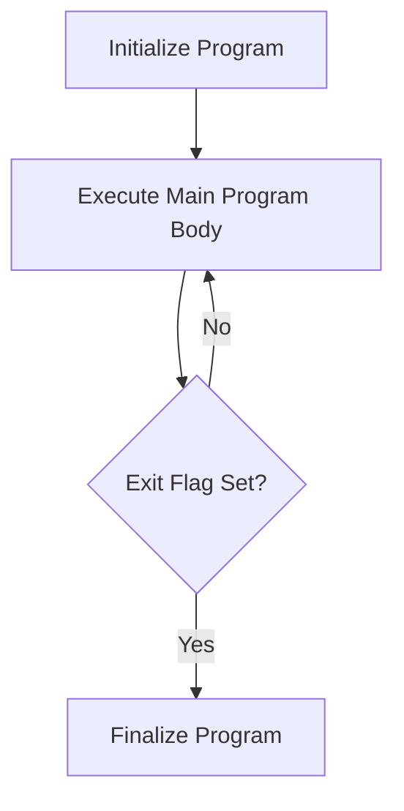

This document will cover the MAIN-PROCESS flow, which includes:

1. Initializing the program
2. Executing the main program body repeatedly
3. Finalizing the program.

Technical document: <SwmLink doc-title="MAIN-PROCESS Flow">[MAIN-PROCESS Flow](/.swm/main-process-flow.7ymp4gec.sw.md)</SwmLink>

# Initializing the Program

The MAIN-PROCESS flow begins with initializing the program. This step sets up all necessary configurations and prepares the system for the main operations. It ensures that all required resources are available and that the system is in a ready state to start processing.

# Executing the Main Program Body

After initialization, the program enters a loop where it repeatedly executes the main body of the program, known as CORPO-PROGRAMA. This section handles various operations based on different flags. For example, it may centralize data, save data, load data, or call other sections such as CHAMAR-PRODUTO, CHAMAR-TURMA, CHAMAR-POP-UP, CHAMAR-EVENTO, and CHAMAR-COMISSAO. Each of these sections manages specific business logic, such as handling product-related operations, managing classes or groups, dealing with pop-up interactions, managing events, and handling commissions.

# Finalizing the Program

The loop continues until a specific condition, known as the exit flag, is met. Once this condition is satisfied, the program exits the loop and proceeds to finalize the operations. This step ensures that all resources are properly released, and any necessary cleanup is performed, effectively ending the program.

&nbsp;

*This is an auto-generated document by Swimm AI 🌊 and has not yet been verified by a human*

<SwmMeta version="3.0.0" repo-id="Z2l0aHViJTNBJTNBa2VsbG8lM0ElM0Fzd2ltbWlv" repo-name="kello">Powered by [Swimm](/)</SwmMeta>
