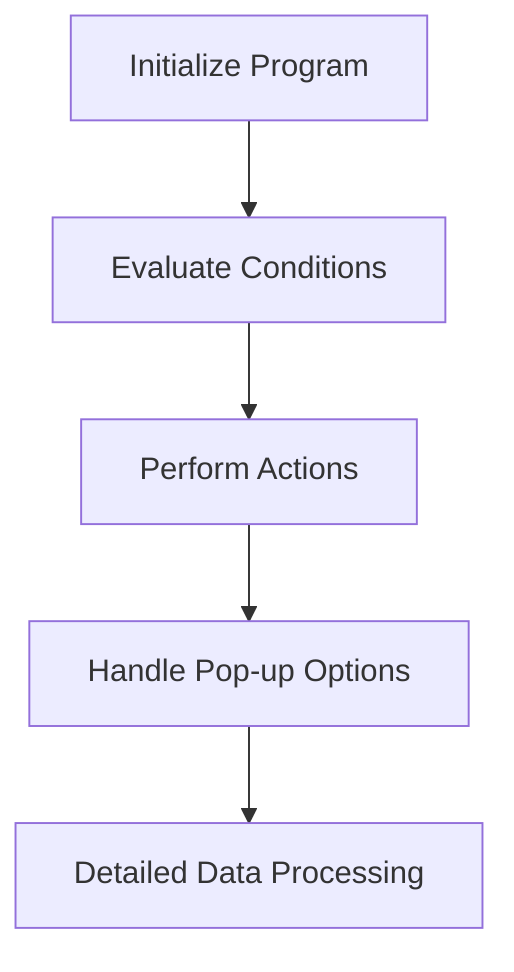

This document will cover the flow of managing accounts payable using the CPP020A program. We'll cover:

1. Initializing the program
2. Evaluating conditions and performing actions
3. Handling pop-up options
4. Detailed data processing

Technical document: <SwmLink doc-title="Overview of CPP020A">[Overview of CPP020A](/.swm/overview-of-cpp020a.d0qbjq6h.sw.md)</SwmLink>

# Initializing the program

The CPP020A program begins by initializing various parameters and variables necessary for managing accounts payable. This setup includes defining the scope of operations such as adding, modifying, suspending, and canceling entries. The initialization ensures that the program is ready to handle different types of accounts payable transactions efficiently.

# Evaluating conditions and performing actions

The main logic of the CPP020A program involves evaluating various conditions and performing corresponding actions. For example, if the condition to centralize data is met, the program will centralize the data. Similarly, if the condition to save data is met, the program will save the data. Other actions include loading data, handling exclusions, and suspensions. Each action is triggered based on specific flags that indicate the required operation.

# Handling pop-up options

The CPP020A program can call different pop-up options to load specific data and update the main program variables. Depending on the value of the pop-up option, the program will call various subprograms to fetch and display the required data. This feature allows users to interact with the program dynamically and make informed decisions based on the data presented in the pop-ups.

# Detailed data processing

The detailed processing of data is handled by another program, CXP020T. This program is responsible for initializing its own parameters, processing the main logic, and performing various sections like locating words, searching for words, and loading error messages. This ensures that all data-related operations are handled meticulously, providing accurate and reliable results for accounts payable management.

&nbsp;

*This is an auto-generated document by Swimm AI 🌊 and has not yet been verified by a human*

<SwmMeta version="3.0.0" repo-id="Z2l0aHViJTNBJTNBa2VsbG8lM0ElM0Fzd2ltbWlv" repo-name="kello">Powered by [Swimm](/)</SwmMeta>
