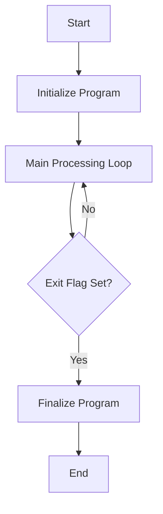

This document will cover the flow of the MTP001 program, which includes:

1. Initializing the program
2. Main processing loop
3. Finalizing the program.

Technical document: <SwmLink doc-title="MTP001 Program Flow">[MTP001 Program Flow](/.swm/mtp001-program-flow.gstk0piw.sw.md)</SwmLink>

# Initializing the Program

The MTP001 program begins by initializing its necessary components. This step ensures that all required resources and settings are prepared before the main processing begins. For the end user, this means that the program is setting up the environment to handle their data and requests efficiently.

# Main Processing Loop

Once initialized, the MTP001 program enters its main processing loop. This loop continuously performs various tasks until a specific exit flag is set. The tasks include:

- **Centralizing Data**: This task ensures that all relevant data is collected and organized in a central location. For the user, this means that their data is being aggregated for easier access and processing.
- **Validating and Saving Data**: The program checks the data for accuracy and completeness before saving it. This step is crucial for maintaining data integrity and ensuring that the user's information is correctly stored.
- **Calling External Programs**: The program may call other external programs (like MTP020) to perform specific tasks. This modular approach allows for specialized processing without overloading the main program. For the user, this means that the program can handle complex tasks by delegating them to specialized modules.
- **Printing Reports**: The program generates and prints reports based on the processed data. This feature provides the user with tangible outputs that summarize the data and its analysis.

The loop continues to perform these tasks until the exit flag is set, indicating that the processing is complete.

# Finalizing the Program

Once the exit flag is set, the MTP001 program proceeds to finalize its operations. This step involves cleaning up resources, saving any final data, and preparing the program to exit gracefully. For the end user, this means that the program ensures all tasks are completed and data is saved before shutting down, preventing any loss of information.

&nbsp;

*This is an auto-generated document by Swimm AI 🌊 and has not yet been verified by a human*

<SwmMeta version="3.0.0" repo-id="Z2l0aHViJTNBJTNBa2VsbG8lM0ElM0Fzd2ltbWlv" repo-name="kello">Powered by [Swimm](/)</SwmMeta>
