In this document, we will explain the flow of the <SwmToken path="src/kello/mtp001.cbl" pos="3:6:6" line-data="       PROGRAM-ID. MTP001.">`MTP001`</SwmToken> program. The <SwmToken path="src/kello/mtp001.cbl" pos="3:6:6" line-data="       PROGRAM-ID. MTP001.">`MTP001`</SwmToken> program initializes, performs the main processing loop, and finalizes the program. It interacts with other components like <SwmToken path="src/kello/mtp001.cbl" pos="153:3:5" line-data="           PERFORM CORPO-PROGRAMA UNTIL GS-EXIT-FLG-TRUE.">`CORPO-PROGRAMA`</SwmToken> and <SwmToken path="src/kello/mtp001.cbl" pos="296:4:4" line-data="                       CALL   &quot;MTP020&quot; USING PARAMETROS-W GS-CONTRATO">`MTP020`</SwmToken> to handle various tasks.

The flow starts with the <SwmToken path="src/kello/mtp001.cbl" pos="3:6:6" line-data="       PROGRAM-ID. MTP001.">`MTP001`</SwmToken> program initializing and entering a main processing loop. Within this loop, it performs various tasks based on certain conditions. These tasks include centralizing data, validating and saving data, calling external programs, and printing reports. The program continues this loop until a specific exit flag is set, at which point it finalizes and exits.

# Flow drill down

```mermaid
graph TD;
      subgraph src/kello
f7a83e6d942918d3af405bdf58cc96a2ded8620858dc9cde342fb173cdb6129b(MTP001):::mainFlowStyle --> 926c4c99af694f19fd8150cb8f6d6b408c091f61d04b1d4363d7798fccc2f45e(CORPO-PROGRAMA):::mainFlowStyle
end

subgraph src/kello
926c4c99af694f19fd8150cb8f6d6b408c091f61d04b1d4363d7798fccc2f45e(CORPO-PROGRAMA):::mainFlowStyle --> 5271969b0a4ae1c4a7f5fc881ba5baf54d84dcd23eb7aa756057676d831a411f(MTP020):::mainFlowStyle
end

subgraph src/kello
5271969b0a4ae1c4a7f5fc881ba5baf54d84dcd23eb7aa756057676d831a411f(MTP020):::mainFlowStyle --> 1fed7243349032561b3b201104ff3c9c682303de8082103a2b5db9c0e4dc44d1(CORPO-PROGRAMA):::mainFlowStyle
end


      classDef mainFlowStyle color:#000000,fill:#7CB9F4
classDef rootsStyle color:#000000,fill:#00FFF4
classDef Style1 color:#000000,fill:#00FFAA
classDef Style2 color:#000000,fill:#FFFF00
classDef Style3 color:#000000,fill:#AA7CB9

%% Swimm:
%% graph TD;
%%       subgraph <SwmPath>[src/kello/](src/kello/)</SwmPath>
%% f7a83e6d942918d3af405bdf58cc96a2ded8620858dc9cde342fb173cdb6129b(MTP001):::mainFlowStyle --> 926c4c99af694f19fd8150cb8f6d6b408c091f61d04b1d4363d7798fccc2f45e(CORPO-PROGRAMA):::mainFlowStyle
%% end
%% 
%% subgraph <SwmPath>[src/kello/](src/kello/)</SwmPath>
%% 926c4c99af694f19fd8150cb8f6d6b408c091f61d04b1d4363d7798fccc2f45e(CORPO-PROGRAMA):::mainFlowStyle --> 5271969b0a4ae1c4a7f5fc881ba5baf54d84dcd23eb7aa756057676d831a411f(MTP020):::mainFlowStyle
%% end
%% 
%% subgraph <SwmPath>[src/kello/](src/kello/)</SwmPath>
%% 5271969b0a4ae1c4a7f5fc881ba5baf54d84dcd23eb7aa756057676d831a411f(MTP020):::mainFlowStyle --> 1fed7243349032561b3b201104ff3c9c682303de8082103a2b5db9c0e4dc44d1(CORPO-PROGRAMA):::mainFlowStyle
%% end
%% 
%% 
%%       classDef mainFlowStyle color:#000000,fill:#7CB9F4
%% classDef rootsStyle color:#000000,fill:#00FFF4
%% classDef Style1 color:#000000,fill:#00FFAA
%% classDef Style2 color:#000000,fill:#FFFF00
%% classDef Style3 color:#000000,fill:#AA7CB9
```



<SwmSnippet path="/src/kello/mtp001.cbl" line="151">

---

## <SwmToken path="src/kello/mtp001.cbl" pos="3:6:6" line-data="       PROGRAM-ID. MTP001.">`MTP001`</SwmToken>

The <SwmToken path="src/kello/mtp001.cbl" pos="3:6:6" line-data="       PROGRAM-ID. MTP001.">`MTP001`</SwmToken> function initializes the program and performs the main processing loop until a specific exit flag is set. It then finalizes the program.

```cobol
       MAIN-PROCESS SECTION.
           PERFORM INICIALIZA-PROGRAMA.
           PERFORM CORPO-PROGRAMA UNTIL GS-EXIT-FLG-TRUE.
           GO FINALIZAR-PROGRAMA.
```

---

</SwmSnippet>

<SwmSnippet path="/src/kello/mtp001.cbl" line="280">

---

## <SwmToken path="src/kello/mtp001.cbl" pos="280:1:3" line-data="       CORPO-PROGRAMA SECTION.">`CORPO-PROGRAMA`</SwmToken> in <SwmToken path="src/kello/mtp001.cbl" pos="3:6:6" line-data="       PROGRAM-ID. MTP001.">`MTP001`</SwmToken>

The <SwmToken path="src/kello/mtp001.cbl" pos="280:1:3" line-data="       CORPO-PROGRAMA SECTION.">`CORPO-PROGRAMA`</SwmToken> section in <SwmToken path="src/kello/mtp001.cbl" pos="3:6:6" line-data="       PROGRAM-ID. MTP001.">`MTP001`</SwmToken> handles various conditional operations based on flags. It performs tasks such as centralizing data, validating and saving data, calling external programs, and printing reports.

```cobol
       CORPO-PROGRAMA SECTION.
           EVALUATE TRUE
               WHEN GS-CENTRALIZA-TRUE
                   PERFORM CENTRALIZAR
                   PERFORM CRIAR-LISTVIEW
               WHEN GS-SAVE-FLG-TRUE
                    PERFORM VALIDAR-PRODUZIDAS
                    IF GS-FLAG-CRITICA = 0
                       PERFORM SALVAR-DADOS
                       IF GS-TIPO-GRAVACAO = 1
                          PERFORM REGRAVA-DADOS
                       ELSE
                          PERFORM GRAVA-DADOS
                       END-IF
                    END-IF
                    IF GS-INDIVIDUAL = "S"
                       CALL   "MTP020" USING PARAMETROS-W GS-CONTRATO
                       CANCEL "MTP020"
                    END-IF
                    MOVE 0 TO GS-FLAG-CRITICA
                    PERFORM CARREGAR-DADOS
```

---

</SwmSnippet>

<SwmSnippet path="/src/kello/mtp020.cbl" line="180">

---

## <SwmToken path="src/kello/mtp001.cbl" pos="296:4:4" line-data="                       CALL   &quot;MTP020&quot; USING PARAMETROS-W GS-CONTRATO">`MTP020`</SwmToken>

The <SwmToken path="src/kello/mtp001.cbl" pos="296:4:4" line-data="                       CALL   &quot;MTP020&quot; USING PARAMETROS-W GS-CONTRATO">`MTP020`</SwmToken> function initializes the program and performs the main processing loop until a specific exit flag is set.

```cobol
       MAIN-PROCESS SECTION.
           PERFORM INICIALIZA-PROGRAMA.
           PERFORM CORPO-PROGRAMA UNTIL GS-EXIT-FLG-TRUE.
```

---

</SwmSnippet>

<SwmSnippet path="/src/kello/mtp020.cbl" line="325">

---

## <SwmToken path="src/kello/mtp020.cbl" pos="325:1:3" line-data="       CORPO-PROGRAMA SECTION.">`CORPO-PROGRAMA`</SwmToken> in <SwmToken path="src/kello/mtp001.cbl" pos="296:4:4" line-data="                       CALL   &quot;MTP020&quot; USING PARAMETROS-W GS-CONTRATO">`MTP020`</SwmToken>

The <SwmToken path="src/kello/mtp020.cbl" pos="325:1:3" line-data="       CORPO-PROGRAMA SECTION.">`CORPO-PROGRAMA`</SwmToken> section in <SwmToken path="src/kello/mtp001.cbl" pos="296:4:4" line-data="                       CALL   &quot;MTP020&quot; USING PARAMETROS-W GS-CONTRATO">`MTP020`</SwmToken> handles various conditional operations based on flags. It performs tasks such as centralizing data, creating list views, saving and re-saving data, clearing data, printing reports, and handling events.

```cobol
       CORPO-PROGRAMA SECTION.
           EVALUATE TRUE
               WHEN GS-CENTRALIZA-TRUE
                   PERFORM CENTRALIZAR
                   PERFORM CRIAR-LISTVIEW
               WHEN GS-SAVE-FLG-TRUE
                   PERFORM SALVAR-DADOS
                   IF GS-TIPO-GRAVACAO = 1
                      PERFORM REGRAVA-DADOS
                      MOVE ZEROS TO GS-QT-FITA
                      MOVE ZEROS TO GS-QT-DVD
                      MOVE ZEROS TO GS-QT-PORTA-FITA
                      MOVE ZEROS TO GS-VISITA
                      PERFORM SET-UP-FOR-REFRESH-SCREEN
                      PERFORM CALL-DIALOG-SYSTEM
                   ELSE
                      PERFORM GRAVA-DADOS
                   END-IF
                   PERFORM ATUALIZAR-MTD001
                   PERFORM LIMPAR-DADOS
                   IF GS-ANOMES-VISITA = 0
```

---

</SwmSnippet>

&nbsp;

*This is an auto-generated document by Swimm AI 🌊 and has not yet been verified by a human*

<SwmMeta version="3.0.0" repo-id="Z2l0aHViJTNBJTNBa2VsbG8lM0ElM0Fzd2ltbWlv" repo-name="kello"><sup>Powered by [Swimm](/)</sup></SwmMeta>
