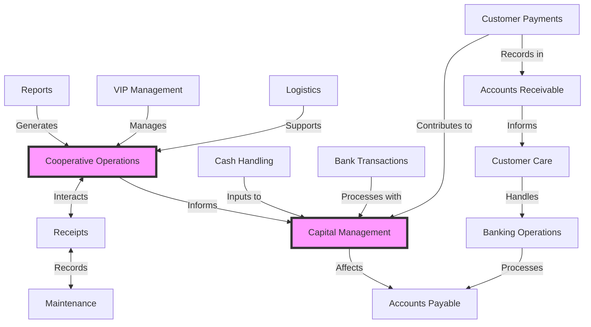

## Introduction

Kello is a CRM-like application designed to manage business operations, generate automatic reports, handle bank-specific EDI transactions, and create standard SBP payment slips. This document provides an overview of the system's main components, their interactions, and the overall flow of operations.

## System Diagram

The diagram shows a comprehensive system that integrates various business functions, from customer management and financial operations to logistics and reporting. It emphasizes the interconnected nature of these components, with Capital Management and Cooperative Operations serving as central hubs that interact with multiple other elements of the system.

### Main Components

1. Core Operations:

   - Cooperative Operations: This central component interacts with Reports, VIP Management, and Logistics, suggesting it handles core business processes and data management.

   - Capital Management: A key node that receives input from multiple components, likely managing financial resources and investments.

2. Financial Processes:

   - Cash Handling: Feeds into Capital Management, indicating management of physical cash transactions.

   - Bank Transactions: Connects to Capital Management, handling electronic banking operations.

   - Customer Payments: Linked to both Capital Management and Accounts Receivable, managing incoming payments.

   - Accounts Receivable and Accounts Payable: These components deal with money owed to and by the business respectively.

3. Customer Relations:

   - Customer Care: Connected to Accounts Receivable, suggesting it handles customer inquiries and support related to payments.

   - VIP Management: Feeds into Cooperative Operations, likely for managing high-value clients or partners.

4. Operational Components:

   - Logistics: Inputs into Cooperative Operations, probably managing supply chain and delivery processes.

   - Maintenance: Bidirectionally connected to Receipts, possibly handling equipment upkeep and related documentation.

   - Receipts: Interacts with Cooperative Operations and Maintenance, likely managing transaction records and documentation.

5. Reporting and Analysis:

   - Reports: Connects to Cooperative Operations, generating automatic reports as mentioned.

6. Banking Operations:

   - This component is linked to Customer Care and Accounts Payable, suggesting it handles specialized banking tasks, including the mentioned EDI transactions and SBP payment slip generation.

&nbsp;

<SwmMeta version="3.0.0" repo-id="Z2l0aHViJTNBJTNBa2VsbG8lM0ElM0Fzd2ltbWlv" repo-name="kello">Powered by [Swimm](https://app.swimm.io/)</SwmMeta>
