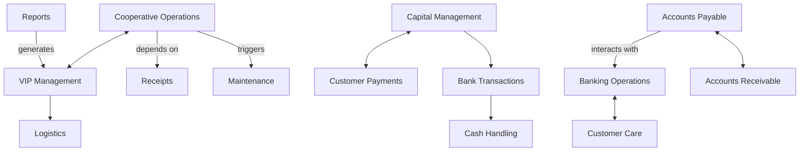

**Kello** is an advanced CRM-like application designed to manage and streamline core business operations, particularly within financial and customer-focused domains. Built with an emphasis on automating reporting, handling banking-specific EDI transactions, and generating standardized SBP payment slips, Kello provides a robust platform for businesses seeking to optimize operational efficiency.

&nbsp;

### Main Components & Their Interactions

- **One-sided Arrow (→)**: Flow of data or dependency from one component to another. Component directly depends on another.
- **Two-sided Arrow (↔)**: Bidirectional interaction, both components exchange data or collaborate equally in a process.
- **Dashed Arrow (---→)**: Relationship generates an outcome or triggers an event (e.g., a report being generated).

&nbsp;

- **Cooperative Operations**: This is the central hub, connecting several key functions such as:
  - **VIP Management**

  - **Logistics**

  - **Reports**

  - **Receipts**

  - **Maintenance**
- **Reports**: Likely serves to generate automatic reports for tracking the system’s operations, including transactions, payments, and other critical data.
- **VIP Management**: Suggests that the system has a specialized function for managing high-priority or exclusive customers, interacting directly with Cooperative Operations.
- **Logistics**: Handles the distribution and movement of goods or services, feeding data into Cooperative Operations to manage flows like inventory, deliveries, or services.
- **Receipts** and **Maintenance**:
  - **Receipts** could represent incoming payments or confirmations from transactions.

  - **Maintenance** deals with operational upkeep, ensuring everything functions smoothly.
- **Capital Management**: Manages the financial aspect of the business, possibly connected to investment tracking, operational expenses, and overall cash flow management. It is fed by components like:
  - **Cash Handling**

  - **Bank Transactions**

  - **Customer Payments**
- **Accounts Payable and Receivable**:
  - **Accounts Receivable** tracks money that customers owe the business, likely integrated with **Customer Payments**.

  - **Accounts Payable** is responsible for payments that the business owes to vendors or partners, connecting with **Banking Operations**.
- **Customer Payments** and **Customer Care**:
  - **Customer Payments** processes customer transactions, directly affecting **Accounts Receivable** and **Capital Management**.

  - **Customer Care** likely supports customer issues, feeding into banking and payment processes.
- **Bank Transactions**: Likely handles bank-specific electronic data interchange (EDI) for transactions, ensuring smooth financial interactions.
- **Cash Handling**: This could refer to managing cash flows, including deposits, withdrawals, and physical cash management processes, possibly feeding into **Capital Management**.
- **Banking Operations**: This part likely oversees direct integration with banks, facilitating payment slips and ensuring compliance with standard financial protocols (e.g., SBP payment slips).

&nbsp;

### Flow Summary:

- Operations within the system start with handling cash and customer transactions, flowing into **Accounts Receivable** and **Accounts Payable**, while **Capital Management** oversees the overall financial health.

- Information is routed through various departments like **Logistics**, **VIP Management**, and **Customer Care**, ensuring smooth business operations.

- Reports are generated to provide insights on the current state of business, and the banking system processes are tightly integrated with the financial management tools to handle EDI transactions and payment slips.

&nbsp;

<SwmMeta version="3.0.0" repo-id="Z2l0aHViJTNBJTNBa2VsbG8lM0ElM0Fzd2ltbWlv" repo-name="kello">Powered by [Swimm](https://app.swimm.io/)</SwmMeta>
