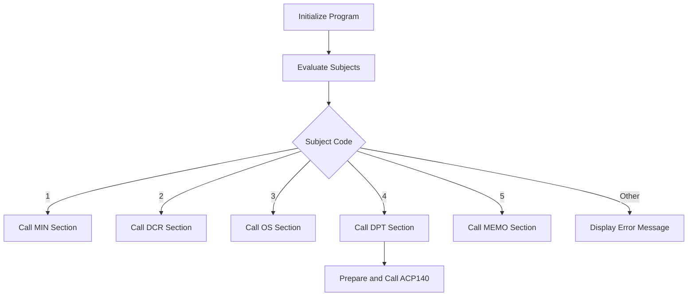

This document will cover the ACP100 Process, which includes:

1. Initializing the program
2. Evaluating subjects
3. Calling specific sections based on conditions.

Technical document: <SwmLink doc-title="Overview of ACP100 Process">[Overview of ACP100 Process](/.swm/overview-of-acp100-process.7n9shiiy.sw.md)</SwmLink>

# Initializing the Program

The ACP100 process begins by initializing the program. This involves setting up the necessary environment and parameters required for the program to run. This step ensures that all initial configurations are correctly set before moving on to the core logic of the program.

# Evaluating Subjects

After initialization, the program evaluates the subject code stored in AUX-ASSUNTO. This evaluation determines the next steps the program will take. Depending on the value of the subject code, the program will call different sections to perform specific tasks. For example, if the subject code is 1, it will call the MIN section; if it is 2, it will call the DCR section, and so on. If the subject code does not match any predefined values, an error message is set and displayed to the user.

# Calling Specific Sections Based on Conditions

Based on the evaluated subject code, the program calls specific sections to handle further processing. For instance, if the subject code is 4, the program will call the DPT section. This section prepares and calls the ACP140 program. It first moves the current date to WS-DATA-SYS and clears PASSAR-STRING-1. Then, it concatenates several fields into PASSAR-STRING-1 and calls the ACP140 program using this string. After the call, it cancels the ACP140 program. This step ensures that the appropriate actions are taken based on the subject code, leading to the correct processing of data.

&nbsp;

*This is an auto-generated document by Swimm AI 🌊 and has not yet been verified by a human*

<SwmMeta version="3.0.0" repo-id="Z2l0aHViJTNBJTNBa2VsbG8lM0ElM0Fzd2ltbWlv" repo-name="kello">Powered by [Swimm](/)</SwmMeta>
