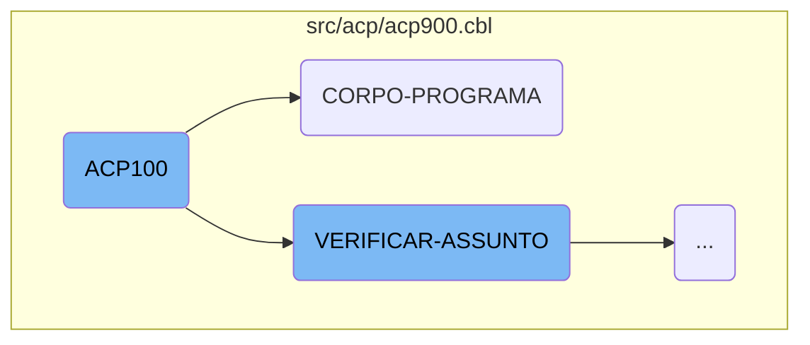

This document provides an overview of the <SwmToken path="src/acp/acp900.cbl" pos="3:6:6" line-data="       PROGRAM-ID. ACP100.">`ACP100`</SwmToken> process, which is the main entry point for initializing and executing the core logic of the program. It includes steps such as initializing the program, evaluating subjects, and calling specific sections based on conditions.

The <SwmToken path="src/acp/acp900.cbl" pos="3:6:6" line-data="       PROGRAM-ID. ACP100.">`ACP100`</SwmToken> process starts by initializing the program and then moves on to the core logic where it evaluates different conditions to decide what actions to take. These actions can include centralizing data, loading sequences, displaying data, and saving data. Depending on the subject code, it may call different sections to perform specific tasks. For example, if the subject code matches a certain value, it will call the department section, which prepares and calls another program (ACP140) to handle further processing.

Here is a high level diagram of the flow, showing only the most important functions:

```mermaid
graph TD;
      subgraph src/acp
78aed9315af162776d285a7118c139b976e3867aa010a74486340bba935b1943(ACP100):::mainFlowStyle --> 11ae7c33bf40efa150a62a66e2f0a78dc415eb5b0e9a591602cd4e3b9011ea32(CORPO-PROGRAMA)
end

subgraph src/acp
78aed9315af162776d285a7118c139b976e3867aa010a74486340bba935b1943(ACP100):::mainFlowStyle --> fbf43d7ff59c1d09ba719960ebc572d5f94e9e6331a7c4c4cec19ed0607bd7dc(VERIFICAR-ASSUNTO):::mainFlowStyle
end

subgraph src/acp
fbf43d7ff59c1d09ba719960ebc572d5f94e9e6331a7c4c4cec19ed0607bd7dc(VERIFICAR-ASSUNTO):::mainFlowStyle --> 74304efbdb49bbfd59c4e0d40b36bfce6bce9c90734702a91fc88f6a79106b8b(CHAMAR-DPT):::mainFlowStyle
end

subgraph src/acp
74304efbdb49bbfd59c4e0d40b36bfce6bce9c90734702a91fc88f6a79106b8b(CHAMAR-DPT):::mainFlowStyle --> 9536b31af5cff0cc75c58a78dd91e556df07434c89bdc7506a653c9d00a3dd44(ACP140):::mainFlowStyle
end

subgraph src/acp
9536b31af5cff0cc75c58a78dd91e556df07434c89bdc7506a653c9d00a3dd44(ACP140):::mainFlowStyle --> cc64e43afe48061e6d78c9b89c7534688ccbac799af9c4bfab75e9d233a5aa65(CORPO-PROGRAMA):::mainFlowStyle
end


      classDef mainFlowStyle color:#000000,fill:#7CB9F4
classDef rootsStyle color:#000000,fill:#00FFF4
classDef Style1 color:#000000,fill:#00FFAA
classDef Style2 color:#000000,fill:#FFFF00
classDef Style3 color:#000000,fill:#AA7CB9

%% Swimm:
%% graph TD;
%%       subgraph <SwmPath>[src/acp/](src/acp/)</SwmPath>
%% 78aed9315af162776d285a7118c139b976e3867aa010a74486340bba935b1943(ACP100):::mainFlowStyle --> 11ae7c33bf40efa150a62a66e2f0a78dc415eb5b0e9a591602cd4e3b9011ea32(CORPO-PROGRAMA)
%% end
%% 
%% subgraph <SwmPath>[src/acp/](src/acp/)</SwmPath>
%% 78aed9315af162776d285a7118c139b976e3867aa010a74486340bba935b1943(ACP100):::mainFlowStyle --> fbf43d7ff59c1d09ba719960ebc572d5f94e9e6331a7c4c4cec19ed0607bd7dc(VERIFICAR-ASSUNTO):::mainFlowStyle
%% end
%% 
%% subgraph <SwmPath>[src/acp/](src/acp/)</SwmPath>
%% fbf43d7ff59c1d09ba719960ebc572d5f94e9e6331a7c4c4cec19ed0607bd7dc(VERIFICAR-ASSUNTO):::mainFlowStyle --> 74304efbdb49bbfd59c4e0d40b36bfce6bce9c90734702a91fc88f6a79106b8b(CHAMAR-DPT):::mainFlowStyle
%% end
%% 
%% subgraph <SwmPath>[src/acp/](src/acp/)</SwmPath>
%% 74304efbdb49bbfd59c4e0d40b36bfce6bce9c90734702a91fc88f6a79106b8b(CHAMAR-DPT):::mainFlowStyle --> 9536b31af5cff0cc75c58a78dd91e556df07434c89bdc7506a653c9d00a3dd44(ACP140):::mainFlowStyle
%% end
%% 
%% subgraph <SwmPath>[src/acp/](src/acp/)</SwmPath>
%% 9536b31af5cff0cc75c58a78dd91e556df07434c89bdc7506a653c9d00a3dd44(ACP140):::mainFlowStyle --> cc64e43afe48061e6d78c9b89c7534688ccbac799af9c4bfab75e9d233a5aa65(CORPO-PROGRAMA):::mainFlowStyle
%% end
%% 
%% 
%%       classDef mainFlowStyle color:#000000,fill:#7CB9F4
%% classDef rootsStyle color:#000000,fill:#00FFF4
%% classDef Style1 color:#000000,fill:#00FFAA
%% classDef Style2 color:#000000,fill:#FFFF00
%% classDef Style3 color:#000000,fill:#AA7CB9
```



# Flow drill down

First, we'll zoom into this section of the flow:



<SwmSnippet path="/src/acp/acp900.cbl" line="224">

---

## <SwmToken path="src/acp/acp900.cbl" pos="3:6:6" line-data="       PROGRAM-ID. ACP100.">`ACP100`</SwmToken>

The <SwmToken path="src/acp/acp900.cbl" pos="3:6:6" line-data="       PROGRAM-ID. ACP100.">`ACP100`</SwmToken> function is the main entry point for the process. It initializes the program by performing the <SwmToken path="src/acp/acp900.cbl" pos="225:3:5" line-data="           PERFORM INICIALIZA-PROGRAMA.">`INICIALIZA-PROGRAMA`</SwmToken> section, which accepts parameters from the command line.

```cobol
       MAIN-PROCESS SECTION.
           PERFORM INICIALIZA-PROGRAMA.
```

---

</SwmSnippet>

<SwmSnippet path="/src/acp/acp900.cbl" line="342">

---

## <SwmToken path="src/acp/acp900.cbl" pos="342:1:3" line-data="       CORPO-PROGRAMA SECTION.">`CORPO-PROGRAMA`</SwmToken>

The <SwmToken path="src/acp/acp900.cbl" pos="342:1:3" line-data="       CORPO-PROGRAMA SECTION.">`CORPO-PROGRAMA`</SwmToken> section handles the core logic of the program. It uses an <SwmToken path="src/acp/acp900.cbl" pos="343:1:1" line-data="           EVALUATE TRUE">`EVALUATE`</SwmToken> statement to determine which specific operations to perform based on various conditions. These operations include centralizing data, loading sequences, displaying data, saving data, and more.

```cobol
       CORPO-PROGRAMA SECTION.
           EVALUATE TRUE
               WHEN CENTRALIZA-TRUE
                    PERFORM CENTRALIZAR
               WHEN GS-CARREGA-SB-TRUE
                    PERFORM CARREGAR-SB
               WHEN GS-CARREGA-SEQ-TRUE
                    PERFORM LIMPAR-DADOS
                    PERFORM CARREGA-ULT-SEQ
               WHEN GS-CARREGA-DISPLAY-TRUE
                    PERFORM CARREGAR-DISPLAY
               WHEN GS-CARREGA-HISTORICO-TRUE
                    PERFORM CARREGAR-HISTORICO
               WHEN GS-SAVE-FLG-TRUE
                    PERFORM SALVAR-DADOS
                    IF GS-TIPO-GRAVACAO = 1 PERFORM REGRAVA-DADOS
                    ELSE PERFORM GRAVA-DADOS
                    END-IF
                    PERFORM LIMPAR-DADOS
                    PERFORM VERIFICAR-ASSUNTO
               WHEN GS-EXCLUI-FLG-TRUE
```

---

</SwmSnippet>

Now, lets zoom into this section of the flow:

```mermaid
graph TD;
      subgraph src/acp
fbf43d7ff59c1d09ba719960ebc572d5f94e9e6331a7c4c4cec19ed0607bd7dc(VERIFICAR-ASSUNTO):::mainFlowStyle --> 74304efbdb49bbfd59c4e0d40b36bfce6bce9c90734702a91fc88f6a79106b8b(CHAMAR-DPT):::mainFlowStyle
end

subgraph src/acp
74304efbdb49bbfd59c4e0d40b36bfce6bce9c90734702a91fc88f6a79106b8b(CHAMAR-DPT):::mainFlowStyle --> 9536b31af5cff0cc75c58a78dd91e556df07434c89bdc7506a653c9d00a3dd44(ACP140):::mainFlowStyle
end

subgraph src/acp
9536b31af5cff0cc75c58a78dd91e556df07434c89bdc7506a653c9d00a3dd44(ACP140):::mainFlowStyle --> cc64e43afe48061e6d78c9b89c7534688ccbac799af9c4bfab75e9d233a5aa65(CORPO-PROGRAMA):::mainFlowStyle
end


      classDef mainFlowStyle color:#000000,fill:#7CB9F4
classDef rootsStyle color:#000000,fill:#00FFF4
classDef Style1 color:#000000,fill:#00FFAA
classDef Style2 color:#000000,fill:#FFFF00
classDef Style3 color:#000000,fill:#AA7CB9

%% Swimm:
%% graph TD;
%%       subgraph <SwmPath>[src/acp/](src/acp/)</SwmPath>
%% fbf43d7ff59c1d09ba719960ebc572d5f94e9e6331a7c4c4cec19ed0607bd7dc(VERIFICAR-ASSUNTO):::mainFlowStyle --> 74304efbdb49bbfd59c4e0d40b36bfce6bce9c90734702a91fc88f6a79106b8b(CHAMAR-DPT):::mainFlowStyle
%% end
%% 
%% subgraph <SwmPath>[src/acp/](src/acp/)</SwmPath>
%% 74304efbdb49bbfd59c4e0d40b36bfce6bce9c90734702a91fc88f6a79106b8b(CHAMAR-DPT):::mainFlowStyle --> 9536b31af5cff0cc75c58a78dd91e556df07434c89bdc7506a653c9d00a3dd44(ACP140):::mainFlowStyle
%% end
%% 
%% subgraph <SwmPath>[src/acp/](src/acp/)</SwmPath>
%% 9536b31af5cff0cc75c58a78dd91e556df07434c89bdc7506a653c9d00a3dd44(ACP140):::mainFlowStyle --> cc64e43afe48061e6d78c9b89c7534688ccbac799af9c4bfab75e9d233a5aa65(CORPO-PROGRAMA):::mainFlowStyle
%% end
%% 
%% 
%%       classDef mainFlowStyle color:#000000,fill:#7CB9F4
%% classDef rootsStyle color:#000000,fill:#00FFF4
%% classDef Style1 color:#000000,fill:#00FFAA
%% classDef Style2 color:#000000,fill:#FFFF00
%% classDef Style3 color:#000000,fill:#AA7CB9
```



<SwmSnippet path="/src/acp/acp900.cbl" line="400">

---

## Evaluating the Subject

The <SwmToken path="src/acp/acp900.cbl" pos="361:3:5" line-data="                    PERFORM VERIFICAR-ASSUNTO">`VERIFICAR-ASSUNTO`</SwmToken> function evaluates the subject code stored in <SwmToken path="src/acp/acp900.cbl" pos="400:3:5" line-data="           EVALUATE AUX-ASSUNTO">`AUX-ASSUNTO`</SwmToken>. Depending on the value, it performs different actions by calling specific sections like <SwmToken path="src/acp/acp900.cbl" pos="401:7:9" line-data="               WHEN 1  PERFORM CHAMAR-MIN">`CHAMAR-MIN`</SwmToken>, <SwmToken path="src/acp/acp900.cbl" pos="402:7:9" line-data="               WHEN 2  PERFORM CHAMAR-DCR">`CHAMAR-DCR`</SwmToken>, <SwmToken path="src/acp/acp900.cbl" pos="403:7:9" line-data="               WHEN 3  PERFORM CHAMAR-OS">`CHAMAR-OS`</SwmToken>, <SwmToken path="src/acp/acp900.cbl" pos="404:7:9" line-data="               WHEN 4  PERFORM CHAMAR-DPT">`CHAMAR-DPT`</SwmToken>, or <SwmToken path="src/acp/acp900.cbl" pos="405:7:9" line-data="               WHEN 5  PERFORM CHAMAR-MEMO">`CHAMAR-MEMO`</SwmToken>. If the subject code does not match any predefined values, it sets an error message and displays it using <SwmToken path="src/acp/acp900.cbl" pos="409:3:5" line-data="                          PERFORM EXIBIR-MENSAGEM.">`EXIBIR-MENSAGEM`</SwmToken>.

```cobol
           EVALUATE AUX-ASSUNTO
               WHEN 1  PERFORM CHAMAR-MIN
               WHEN 2  PERFORM CHAMAR-DCR
               WHEN 3  PERFORM CHAMAR-OS
               WHEN 4  PERFORM CHAMAR-DPT
               WHEN 5  PERFORM CHAMAR-MEMO
               WHEN OTHER MOVE "Problema com relação ao Assunto" TO
                          MENSAGEM
                          MOVE "C" TO TIPO-MSG
                          PERFORM EXIBIR-MENSAGEM.
```

---

</SwmSnippet>

<SwmSnippet path="/src/acp/acp900.cbl" line="432">

---

## Calling the Department

The <SwmToken path="src/acp/acp900.cbl" pos="432:1:3" line-data="       CHAMAR-DPT SECTION.">`CHAMAR-DPT`</SwmToken> function prepares and calls the <SwmToken path="src/acp/acp900.cbl" pos="436:4:4" line-data="           CALL &quot;ACP140&quot; USING PASSAR-STRING-1">`ACP140`</SwmToken> program. It first moves the current date to <SwmToken path="src/acp/acp900.cbl" pos="433:11:15" line-data="           MOVE FUNCTION CURRENT-DATE TO WS-DATA-SYS">`WS-DATA-SYS`</SwmToken> and clears <SwmToken path="src/acp/acp900.cbl" pos="434:7:11" line-data="           MOVE SPACES TO PASSAR-STRING-1">`PASSAR-STRING-1`</SwmToken>. Then, it concatenates several fields into <SwmToken path="src/acp/acp900.cbl" pos="434:7:11" line-data="           MOVE SPACES TO PASSAR-STRING-1">`PASSAR-STRING-1`</SwmToken> and calls the <SwmToken path="src/acp/acp900.cbl" pos="436:4:4" line-data="           CALL &quot;ACP140&quot; USING PASSAR-STRING-1">`ACP140`</SwmToken> program using this string. After the call, it cancels the <SwmToken path="src/acp/acp900.cbl" pos="436:4:4" line-data="           CALL &quot;ACP140&quot; USING PASSAR-STRING-1">`ACP140`</SwmToken> program.

```cobol
       CHAMAR-DPT SECTION.
           MOVE FUNCTION CURRENT-DATE TO WS-DATA-SYS
           MOVE SPACES TO PASSAR-STRING-1
           STRING TIPO-CADASTRO WS-DATA-CPU AUX-SEQ INTO PASSAR-STRING-1
           CALL "ACP140" USING PASSAR-STRING-1
           CANCEL "ACP140".
```

---

</SwmSnippet>

<SwmSnippet path="/src/acp/acp140.cbl" line="140">

---

## Main Processing in <SwmToken path="src/acp/acp900.cbl" pos="436:4:4" line-data="           CALL &quot;ACP140&quot; USING PASSAR-STRING-1">`ACP140`</SwmToken>

The <SwmToken path="src/acp/acp900.cbl" pos="436:4:4" line-data="           CALL &quot;ACP140&quot; USING PASSAR-STRING-1">`ACP140`</SwmToken> function starts with the <SwmToken path="src/acp/acp140.cbl" pos="140:1:3" line-data="       MAIN-PROCESS SECTION.">`MAIN-PROCESS`</SwmToken> section, which performs the <SwmToken path="src/acp/acp140.cbl" pos="141:3:5" line-data="           PERFORM INICIALIZA-PROGRAMA.">`INICIALIZA-PROGRAMA`</SwmToken> section to initialize the program.

```cobol
       MAIN-PROCESS SECTION.
           PERFORM INICIALIZA-PROGRAMA.
```

---

</SwmSnippet>

<SwmSnippet path="/src/acp/acp140.cbl" line="231">

---

## Program Body

The <SwmToken path="src/acp/acp140.cbl" pos="231:1:3" line-data="       CORPO-PROGRAMA SECTION.">`CORPO-PROGRAMA`</SwmToken> function handles the main logic of the program. It evaluates various conditions and performs corresponding actions such as centralizing data, saving data, clearing data, and setting up the screen for refresh. It also handles reading and processing records, as well as calling dialog systems.

```cobol
       CORPO-PROGRAMA SECTION.
           EVALUATE TRUE
               WHEN CENTRALIZA-TRUE
                    PERFORM CENTRALIZAR
               WHEN SAVE-FLG-TRUE
                    PERFORM SALVAR-DADOS
                    PERFORM LIMPAR-DADOS
                    MOVE ACP-NUMERO TO NUMERO-AC140
                    READ ACD140 INVALID KEY
                         PERFORM LIMPAR-DADOS
                         PERFORM PROCURAR-PROXIMO
                         MOVE "LIMPAR-LB" TO DS-PROCEDURE
                         PERFORM CALL-DIALOG-SYSTEM
                         PERFORM SET-UP-FOR-REFRESH-SCREEN
                         MOVE 1 TO GRAVA-W
                    NOT INVALID KEY
                         PERFORM MONTAR-DATA-BLOCK
                         PERFORM SET-UP-FOR-REFRESH-SCREEN
                    END-READ
                    PERFORM LIMPAR-DADOS
                    PERFORM PROCURAR-PROXIMO
```

---

</SwmSnippet>

&nbsp;

*This is an auto-generated document by Swimm AI 🌊 and has not yet been verified by a human*

<SwmMeta version="3.0.0" repo-id="Z2l0aHViJTNBJTNBa2VsbG8lM0ElM0Fzd2ltbWlv" repo-name="kello"><sup>Powered by [Swimm](/)</sup></SwmMeta>
