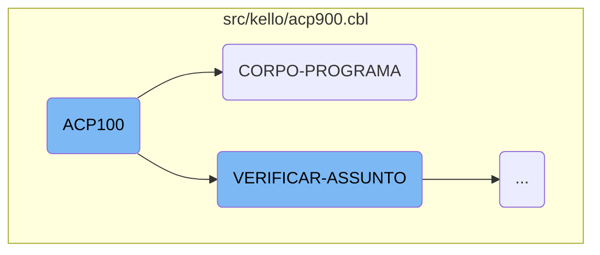

<SwmToken path="src/kello/acp900.cbl" pos="3:6:6" line-data="       PROGRAM-ID. ACP100.">`ACP100`</SwmToken> is a crucial component in the Kello Imagens system, responsible for initializing the program, evaluating various conditions, and performing corresponding actions. It ensures that the program's logic flows correctly based on the given inputs and states.

The <SwmToken path="src/kello/acp900.cbl" pos="3:6:6" line-data="       PROGRAM-ID. ACP100.">`ACP100`</SwmToken> process starts by initializing the program and accepting parameters from the command line. It then evaluates different conditions and performs specific actions based on those conditions. For example, it can centralize data, load sequences, save data, and verify subjects. Each condition triggers a specific section to be performed, ensuring the program operates smoothly. If a subject needs to be verified, it evaluates the subject and determines the appropriate action, such as calling a department or displaying an error message. This structured approach ensures that all necessary tasks are completed efficiently.

Here is a high level diagram of the flow, showing only the most important functions:

```mermaid
graph TD;
      subgraph src/kello
e5b34457118e42944e5615e42df5b58121d0ed38a1ae2d8a4a01614faaf302b3(ACP100):::mainFlowStyle --> b38a8f47259b2aa0c93b92bcaa9b45d9dc82a371a01162e87752352ffe96e634(CORPO-PROGRAMA)
end

subgraph src/kello
e5b34457118e42944e5615e42df5b58121d0ed38a1ae2d8a4a01614faaf302b3(ACP100):::mainFlowStyle --> e97d201b7bf01ba28ef7c1dbf3e0f8ade013759455e0276445e7379205c0f025(VERIFICAR-ASSUNTO):::mainFlowStyle
end

subgraph src/kello
e97d201b7bf01ba28ef7c1dbf3e0f8ade013759455e0276445e7379205c0f025(VERIFICAR-ASSUNTO):::mainFlowStyle --> f89cc48ea56c089d2e67512b1c66b7ff6981ad20f8746456e783537e4c4b8ebb(CHAMAR-DPT):::mainFlowStyle
end

subgraph src/kello
f89cc48ea56c089d2e67512b1c66b7ff6981ad20f8746456e783537e4c4b8ebb(CHAMAR-DPT):::mainFlowStyle --> 56954448ebfe20e73242e51df58bba1b7dfac8126ef3764e5f86e444ff3cdc0c(ACP140):::mainFlowStyle
end

subgraph src/kello
56954448ebfe20e73242e51df58bba1b7dfac8126ef3764e5f86e444ff3cdc0c(ACP140):::mainFlowStyle --> fe52a44c43e62f0e0f324fb05e66a820c3ee8e073b7ad5c4d534758b20ae82f6(CORPO-PROGRAMA):::mainFlowStyle
end


      classDef mainFlowStyle color:#000000,fill:#7CB9F4
classDef rootsStyle color:#000000,fill:#00FFF4
classDef Style1 color:#000000,fill:#00FFAA
classDef Style2 color:#000000,fill:#FFFF00
classDef Style3 color:#000000,fill:#AA7CB9

%% Swimm:
%% graph TD;
%%       subgraph <SwmPath>[src/kello/](src/kello/)</SwmPath>
%% e5b34457118e42944e5615e42df5b58121d0ed38a1ae2d8a4a01614faaf302b3(ACP100):::mainFlowStyle --> b38a8f47259b2aa0c93b92bcaa9b45d9dc82a371a01162e87752352ffe96e634(CORPO-PROGRAMA)
%% end
%% 
%% subgraph <SwmPath>[src/kello/](src/kello/)</SwmPath>
%% e5b34457118e42944e5615e42df5b58121d0ed38a1ae2d8a4a01614faaf302b3(ACP100):::mainFlowStyle --> e97d201b7bf01ba28ef7c1dbf3e0f8ade013759455e0276445e7379205c0f025(VERIFICAR-ASSUNTO):::mainFlowStyle
%% end
%% 
%% subgraph <SwmPath>[src/kello/](src/kello/)</SwmPath>
%% e97d201b7bf01ba28ef7c1dbf3e0f8ade013759455e0276445e7379205c0f025(VERIFICAR-ASSUNTO):::mainFlowStyle --> f89cc48ea56c089d2e67512b1c66b7ff6981ad20f8746456e783537e4c4b8ebb(CHAMAR-DPT):::mainFlowStyle
%% end
%% 
%% subgraph <SwmPath>[src/kello/](src/kello/)</SwmPath>
%% f89cc48ea56c089d2e67512b1c66b7ff6981ad20f8746456e783537e4c4b8ebb(CHAMAR-DPT):::mainFlowStyle --> 56954448ebfe20e73242e51df58bba1b7dfac8126ef3764e5f86e444ff3cdc0c(ACP140):::mainFlowStyle
%% end
%% 
%% subgraph <SwmPath>[src/kello/](src/kello/)</SwmPath>
%% 56954448ebfe20e73242e51df58bba1b7dfac8126ef3764e5f86e444ff3cdc0c(ACP140):::mainFlowStyle --> fe52a44c43e62f0e0f324fb05e66a820c3ee8e073b7ad5c4d534758b20ae82f6(CORPO-PROGRAMA):::mainFlowStyle
%% end
%% 
%% 
%%       classDef mainFlowStyle color:#000000,fill:#7CB9F4
%% classDef rootsStyle color:#000000,fill:#00FFF4
%% classDef Style1 color:#000000,fill:#00FFAA
%% classDef Style2 color:#000000,fill:#FFFF00
%% classDef Style3 color:#000000,fill:#AA7CB9
```



# Flow drill down

First, we'll zoom into this section of the flow:



<SwmSnippet path="/src/kello/acp900.cbl" line="224">

---

## <SwmToken path="src/kello/acp900.cbl" pos="3:6:6" line-data="       PROGRAM-ID. ACP100.">`ACP100`</SwmToken> Initialization

The <SwmToken path="src/kello/acp900.cbl" pos="3:6:6" line-data="       PROGRAM-ID. ACP100.">`ACP100`</SwmToken> function begins by performing the <SwmToken path="src/kello/acp900.cbl" pos="225:3:5" line-data="           PERFORM INICIALIZA-PROGRAMA.">`INICIALIZA-PROGRAMA`</SwmToken> section, which initializes the program by accepting parameters from the command line. This sets up the necessary environment for the subsequent operations.

```cobol
       MAIN-PROCESS SECTION.
           PERFORM INICIALIZA-PROGRAMA.
           PERFORM CORPO-PROGRAMA UNTIL GS-EXIT-FLG-TRUE.
           GO FINALIZAR-PROGRAMA.
       INICIALIZA-PROGRAMA SECTION.
           ACCEPT PARAMETROS-W FROM COMMAND-LINE.
```

---

</SwmSnippet>

<SwmSnippet path="/src/kello/acp900.cbl" line="342">

---

## <SwmToken path="src/kello/acp900.cbl" pos="342:1:3" line-data="       CORPO-PROGRAMA SECTION.">`CORPO-PROGRAMA`</SwmToken> Evaluation

The <SwmToken path="src/kello/acp900.cbl" pos="342:1:3" line-data="       CORPO-PROGRAMA SECTION.">`CORPO-PROGRAMA`</SwmToken> section evaluates various conditions and performs corresponding actions. It handles tasks such as centralizing data, loading sequences, saving data, and verifying subjects. Each condition triggers a specific section to be performed, ensuring that the program's logic flows correctly based on the given inputs and states.

```cobol
       CORPO-PROGRAMA SECTION.
           EVALUATE TRUE
               WHEN CENTRALIZA-TRUE
                    PERFORM CENTRALIZAR
               WHEN GS-CARREGA-SB-TRUE
                    PERFORM CARREGAR-SB
               WHEN GS-CARREGA-SEQ-TRUE
                    PERFORM LIMPAR-DADOS
                    PERFORM CARREGA-ULT-SEQ
               WHEN GS-CARREGA-DISPLAY-TRUE
                    PERFORM CARREGAR-DISPLAY
               WHEN GS-CARREGA-HISTORICO-TRUE
                    PERFORM CARREGAR-HISTORICO
               WHEN GS-SAVE-FLG-TRUE
                    PERFORM SALVAR-DADOS
                    IF GS-TIPO-GRAVACAO = 1 PERFORM REGRAVA-DADOS
                    ELSE PERFORM GRAVA-DADOS
                    END-IF
                    PERFORM LIMPAR-DADOS
                    PERFORM VERIFICAR-ASSUNTO
               WHEN GS-EXCLUI-FLG-TRUE
```

---

</SwmSnippet>

Now, lets zoom into this section of the flow:

```mermaid
graph TD;
      subgraph src/kello
e97d201b7bf01ba28ef7c1dbf3e0f8ade013759455e0276445e7379205c0f025(VERIFICAR-ASSUNTO):::mainFlowStyle --> f89cc48ea56c089d2e67512b1c66b7ff6981ad20f8746456e783537e4c4b8ebb(CHAMAR-DPT):::mainFlowStyle
end

subgraph src/kello
f89cc48ea56c089d2e67512b1c66b7ff6981ad20f8746456e783537e4c4b8ebb(CHAMAR-DPT):::mainFlowStyle --> 56954448ebfe20e73242e51df58bba1b7dfac8126ef3764e5f86e444ff3cdc0c(ACP140):::mainFlowStyle
end

subgraph src/kello
56954448ebfe20e73242e51df58bba1b7dfac8126ef3764e5f86e444ff3cdc0c(ACP140):::mainFlowStyle --> fe52a44c43e62f0e0f324fb05e66a820c3ee8e073b7ad5c4d534758b20ae82f6(CORPO-PROGRAMA):::mainFlowStyle
end


      classDef mainFlowStyle color:#000000,fill:#7CB9F4
classDef rootsStyle color:#000000,fill:#00FFF4
classDef Style1 color:#000000,fill:#00FFAA
classDef Style2 color:#000000,fill:#FFFF00
classDef Style3 color:#000000,fill:#AA7CB9

%% Swimm:
%% graph TD;
%%       subgraph <SwmPath>[src/kello/](src/kello/)</SwmPath>
%% e97d201b7bf01ba28ef7c1dbf3e0f8ade013759455e0276445e7379205c0f025(VERIFICAR-ASSUNTO):::mainFlowStyle --> f89cc48ea56c089d2e67512b1c66b7ff6981ad20f8746456e783537e4c4b8ebb(CHAMAR-DPT):::mainFlowStyle
%% end
%% 
%% subgraph <SwmPath>[src/kello/](src/kello/)</SwmPath>
%% f89cc48ea56c089d2e67512b1c66b7ff6981ad20f8746456e783537e4c4b8ebb(CHAMAR-DPT):::mainFlowStyle --> 56954448ebfe20e73242e51df58bba1b7dfac8126ef3764e5f86e444ff3cdc0c(ACP140):::mainFlowStyle
%% end
%% 
%% subgraph <SwmPath>[src/kello/](src/kello/)</SwmPath>
%% 56954448ebfe20e73242e51df58bba1b7dfac8126ef3764e5f86e444ff3cdc0c(ACP140):::mainFlowStyle --> fe52a44c43e62f0e0f324fb05e66a820c3ee8e073b7ad5c4d534758b20ae82f6(CORPO-PROGRAMA):::mainFlowStyle
%% end
%% 
%% 
%%       classDef mainFlowStyle color:#000000,fill:#7CB9F4
%% classDef rootsStyle color:#000000,fill:#00FFF4
%% classDef Style1 color:#000000,fill:#00FFAA
%% classDef Style2 color:#000000,fill:#FFFF00
%% classDef Style3 color:#000000,fill:#AA7CB9
```



<SwmSnippet path="/src/kello/acp900.cbl" line="400">

---

## Evaluating the Subject

The <SwmToken path="src/kello/acp900.cbl" pos="361:3:5" line-data="                    PERFORM VERIFICAR-ASSUNTO">`VERIFICAR-ASSUNTO`</SwmToken> function evaluates the value of <SwmToken path="src/kello/acp900.cbl" pos="400:3:5" line-data="           EVALUATE AUX-ASSUNTO">`AUX-ASSUNTO`</SwmToken> and determines the appropriate action to take. Depending on the value, it performs different routines such as <SwmToken path="src/kello/acp900.cbl" pos="401:7:9" line-data="               WHEN 1  PERFORM CHAMAR-MIN">`CHAMAR-MIN`</SwmToken>, <SwmToken path="src/kello/acp900.cbl" pos="402:7:9" line-data="               WHEN 2  PERFORM CHAMAR-DCR">`CHAMAR-DCR`</SwmToken>, <SwmToken path="src/kello/acp900.cbl" pos="403:7:9" line-data="               WHEN 3  PERFORM CHAMAR-OS">`CHAMAR-OS`</SwmToken>, <SwmToken path="src/kello/acp900.cbl" pos="404:7:9" line-data="               WHEN 4  PERFORM CHAMAR-DPT">`CHAMAR-DPT`</SwmToken>, or <SwmToken path="src/kello/acp900.cbl" pos="405:7:9" line-data="               WHEN 5  PERFORM CHAMAR-MEMO">`CHAMAR-MEMO`</SwmToken>. If none of the specified values match, it sets an error message and displays it using <SwmToken path="src/kello/acp900.cbl" pos="409:3:5" line-data="                          PERFORM EXIBIR-MENSAGEM.">`EXIBIR-MENSAGEM`</SwmToken>.

```cobol
           EVALUATE AUX-ASSUNTO
               WHEN 1  PERFORM CHAMAR-MIN
               WHEN 2  PERFORM CHAMAR-DCR
               WHEN 3  PERFORM CHAMAR-OS
               WHEN 4  PERFORM CHAMAR-DPT
               WHEN 5  PERFORM CHAMAR-MEMO
               WHEN OTHER MOVE "Problema com relação ao Assunto" TO
                          MENSAGEM
                          MOVE "C" TO TIPO-MSG
                          PERFORM EXIBIR-MENSAGEM.
```

---

</SwmSnippet>

<SwmSnippet path="/src/kello/acp900.cbl" line="432">

---

## Calling the Department

The <SwmToken path="src/kello/acp900.cbl" pos="432:1:3" line-data="       CHAMAR-DPT SECTION.">`CHAMAR-DPT`</SwmToken> function is responsible for preparing and calling the <SwmToken path="src/kello/acp900.cbl" pos="436:4:4" line-data="           CALL &quot;ACP140&quot; USING PASSAR-STRING-1">`ACP140`</SwmToken> program. It moves the current date to <SwmToken path="src/kello/acp900.cbl" pos="433:11:15" line-data="           MOVE FUNCTION CURRENT-DATE TO WS-DATA-SYS">`WS-DATA-SYS`</SwmToken>, clears <SwmToken path="src/kello/acp900.cbl" pos="434:7:11" line-data="           MOVE SPACES TO PASSAR-STRING-1">`PASSAR-STRING-1`</SwmToken>, and then constructs a string using <SwmToken path="src/kello/acp900.cbl" pos="435:3:5" line-data="           STRING TIPO-CADASTRO WS-DATA-CPU AUX-SEQ INTO PASSAR-STRING-1">`TIPO-CADASTRO`</SwmToken>, <SwmToken path="src/kello/acp900.cbl" pos="435:7:11" line-data="           STRING TIPO-CADASTRO WS-DATA-CPU AUX-SEQ INTO PASSAR-STRING-1">`WS-DATA-CPU`</SwmToken>, and <SwmToken path="src/kello/acp900.cbl" pos="435:13:15" line-data="           STRING TIPO-CADASTRO WS-DATA-CPU AUX-SEQ INTO PASSAR-STRING-1">`AUX-SEQ`</SwmToken>. This string is then used to call the <SwmToken path="src/kello/acp900.cbl" pos="436:4:4" line-data="           CALL &quot;ACP140&quot; USING PASSAR-STRING-1">`ACP140`</SwmToken> program, which handles further processing.

```cobol
       CHAMAR-DPT SECTION.
           MOVE FUNCTION CURRENT-DATE TO WS-DATA-SYS
           MOVE SPACES TO PASSAR-STRING-1
           STRING TIPO-CADASTRO WS-DATA-CPU AUX-SEQ INTO PASSAR-STRING-1
           CALL "ACP140" USING PASSAR-STRING-1
           CANCEL "ACP140".
```

---

</SwmSnippet>

<SwmSnippet path="/src/kello/acp140.cbl" line="231">

---

## Main Processing in <SwmToken path="src/kello/acp900.cbl" pos="436:4:4" line-data="           CALL &quot;ACP140&quot; USING PASSAR-STRING-1">`ACP140`</SwmToken>

The <SwmToken path="src/kello/acp140.cbl" pos="231:1:3" line-data="       CORPO-PROGRAMA SECTION.">`CORPO-PROGRAMA`</SwmToken> section in <SwmToken path="src/kello/acp900.cbl" pos="436:4:4" line-data="           CALL &quot;ACP140&quot; USING PASSAR-STRING-1">`ACP140`</SwmToken> handles the main processing logic. It evaluates various conditions and performs corresponding actions such as centralizing data, saving data, clearing data, and setting up the screen for refresh. It also handles reading records, processing suggestions, and performing data validations.

```cobol
       CORPO-PROGRAMA SECTION.
           EVALUATE TRUE
               WHEN CENTRALIZA-TRUE
                    PERFORM CENTRALIZAR
               WHEN SAVE-FLG-TRUE
                    PERFORM SALVAR-DADOS
                    PERFORM LIMPAR-DADOS
                    MOVE ACP-NUMERO TO NUMERO-AC140
                    READ ACD140 INVALID KEY
                         PERFORM LIMPAR-DADOS
                         PERFORM PROCURAR-PROXIMO
                         MOVE "LIMPAR-LB" TO DS-PROCEDURE
                         PERFORM CALL-DIALOG-SYSTEM
                         PERFORM SET-UP-FOR-REFRESH-SCREEN
                         MOVE 1 TO GRAVA-W
                    NOT INVALID KEY
                         PERFORM MONTAR-DATA-BLOCK
                         PERFORM SET-UP-FOR-REFRESH-SCREEN
                    END-READ
                    PERFORM LIMPAR-DADOS
                    PERFORM PROCURAR-PROXIMO
```

---

</SwmSnippet>

&nbsp;

*This is an auto-generated document by Swimm AI 🌊 and has not yet been verified by a human*

<SwmMeta version="3.0.0" repo-id="Z2l0aHViJTNBJTNBa2VsbG8lM0ElM0Fzd2ltbWlv" repo-name="kello"><sup>Powered by [Swimm](/)</sup></SwmMeta>
