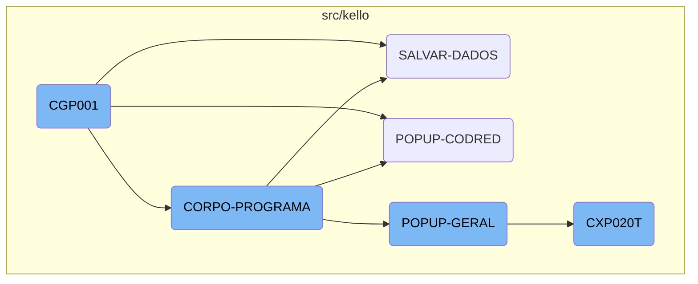
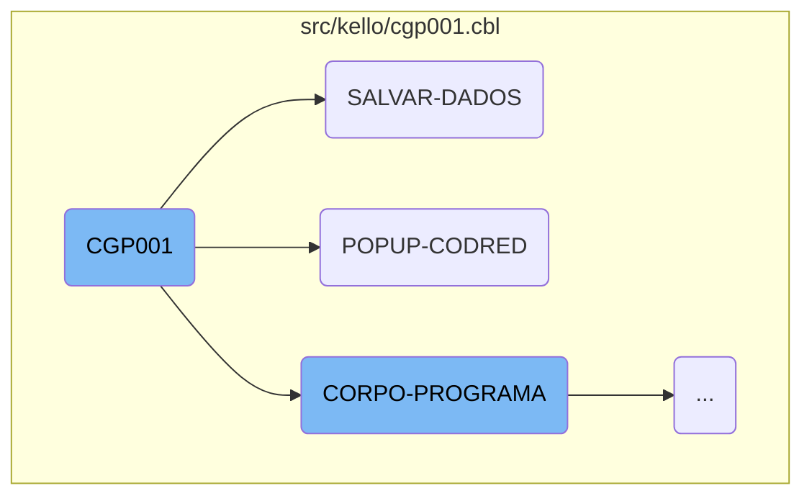
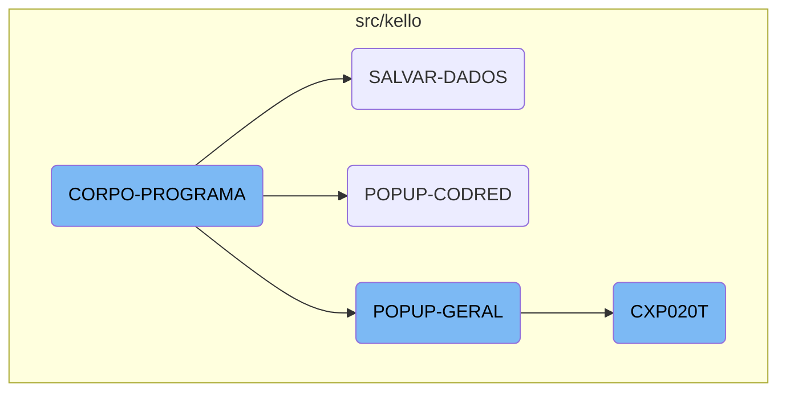

The <SwmToken path="src/kello/cgp001.cbl" pos="437:3:3" line-data="               WHEN CGP001-CENTRALIZA-TRUE">`CGP001`</SwmToken> program is a central component of the Kello Imagens system, responsible for various data operations and user interactions. It initializes the program, handles user inputs through popups, saves data, and performs validations.

The <SwmToken path="src/kello/cgp001.cbl" pos="437:3:3" line-data="               WHEN CGP001-CENTRALIZA-TRUE">`CGP001`</SwmToken> program starts by initializing the system and accepting parameters. It then evaluates different conditions to decide what actions to perform, such as saving data or displaying popups. When saving data, it moves information to specific fields and performs checks to ensure everything is correct. If any issues are found, it sets an error message. The program also handles user interactions by displaying popups and retrieving necessary data.

Here is a high level diagram of the flow, showing only the most important functions:



# Flow drill down

First, we'll zoom into this section of the flow:



<SwmSnippet path="/src/kello/cgp001.cbl" line="247">

---

## <SwmToken path="src/kello/cgp001.cbl" pos="437:3:3" line-data="               WHEN CGP001-CENTRALIZA-TRUE">`CGP001`</SwmToken> Function

The <SwmToken path="src/kello/cgp001.cbl" pos="437:3:3" line-data="               WHEN CGP001-CENTRALIZA-TRUE">`CGP001`</SwmToken> function starts by performing the <SwmToken path="src/kello/cgp001.cbl" pos="248:3:5" line-data="           PERFORM INICIALIZA-PROGRAMA.">`INICIALIZA-PROGRAMA`</SwmToken> section, which initializes the program by accepting parameters from the command line.

```cobol
       MAIN-PROCESS SECTION.
           PERFORM INICIALIZA-PROGRAMA.
```

---

</SwmSnippet>

<SwmSnippet path="/src/kello/cgp001.cbl" line="435">

---

The <SwmToken path="src/kello/cgp001.cbl" pos="435:1:3" line-data="       CORPO-PROGRAMA SECTION.">`CORPO-PROGRAMA`</SwmToken> section evaluates various conditions and performs corresponding actions, contributing to the main logic of the program.

```cobol
       CORPO-PROGRAMA SECTION.
           EVALUATE TRUE
```

---

</SwmSnippet>

<SwmSnippet path="/src/kello/cgp001.cbl" line="599">

---

The <SwmToken path="src/kello/cgp001.cbl" pos="599:1:3" line-data="       POPUP-CODRED SECTION.">`POPUP-CODRED`</SwmToken> section calls the <SwmToken path="src/kello/cgp001.cbl" pos="600:4:4" line-data="           CALL   &quot;CXP020T&quot; USING PARAMETROS-W PASSAR-PARAMETROS">`CXP020T`</SwmToken> program using specific parameters, facilitating the retrieval and display of reduced codes.

```cobol
       POPUP-CODRED SECTION.
           CALL   "CXP020T" USING PARAMETROS-W PASSAR-PARAMETROS
```

---

</SwmSnippet>

<SwmSnippet path="/src/kello/cgp001.cbl" line="1280">

---

## <SwmToken path="src/kello/cgp001.cbl" pos="1280:1:3" line-data="       SALVAR-DADOS SECTION.">`SALVAR-DADOS`</SwmToken> Function

The <SwmToken path="src/kello/cgp001.cbl" pos="1280:1:3" line-data="       SALVAR-DADOS SECTION.">`SALVAR-DADOS`</SwmToken> function begins by closing and reopening files <SwmToken path="src/kello/cgp001.cbl" pos="1281:3:3" line-data="           CLOSE    CGD001 CGD010">`CGD001`</SwmToken> and <SwmToken path="src/kello/cgp001.cbl" pos="1281:5:5" line-data="           CLOSE    CGD001 CGD010">`CGD010`</SwmToken> to prepare for data operations.

```cobol
       SALVAR-DADOS SECTION.
           CLOSE    CGD001 CGD010
```

---

</SwmSnippet>

<SwmSnippet path="/src/kello/cgp001.cbl" line="1285">

---

It moves various data fields from <SwmToken path="src/kello/cgp001.cbl" pos="1285:3:3" line-data="           MOVE CGP001-CODIGO        TO  CODIGO-CG01 CODIGO-CG02">`CGP001`</SwmToken> to corresponding fields in <SwmToken path="src/kello/cgp001.cbl" pos="1281:3:3" line-data="           CLOSE    CGD001 CGD010">`CGD001`</SwmToken> and performs validation checks. If no characteristics are declared, it sets an error message and loads the screen set.

```cobol
           MOVE CGP001-CODIGO        TO  CODIGO-CG01 CODIGO-CG02
                                         CODIGO-CG03 CODIGO-CG04
                                         CODIGO-CG05.
           MOVE CGP001-NOME          TO  NOME-CG01
           MOVE CGP001-NOME-RED      TO  NOME-RED-CG01
           IF CGP001-T-PES-FIS = ZEROS AND CGP001-T-PES-JUR = ZEROS
              AND CGP001-T-FUNC = ZEROS AND CGP001-T-REPRES = ZEROS
               AND CGP001-T-FOTOG = ZEROS AND CGP001-T-CINEG = ZEROS
                AND CGP001-T-VEND = ZEROS AND CGP001-T-IMPOSTO = ZEROS
                 AND CGP001-T-INVESTIDOR = ZEROS AND CGP001-T-OUTRO = 0
                   MOVE "Nenhuma característica foi declarada"
                        TO CGP001-MENSAGEM-ERRO
                   PERFORM LOAD-SCREENSET
```

---

</SwmSnippet>

<SwmSnippet path="/src/kello/cgp001.cbl" line="1320">

---

If the <SwmToken path="src/kello/cgp001.cbl" pos="1320:3:5" line-data="           IF GRAVA-W = 1">`GRAVA-W`</SwmToken> flag is set, it writes the record to <SwmToken path="src/kello/cgp001.cbl" pos="1321:5:5" line-data="              WRITE REG-CGD001 INVALID KEY">`CGD001`</SwmToken> and handles any invalid key errors by performing the <SwmToken path="src/kello/cgp001.cbl" pos="1325:3:5" line-data="                         PERFORM ERRO-GRAVACAO">`ERRO-GRAVACAO`</SwmToken> section.

```cobol
           IF GRAVA-W = 1
              WRITE REG-CGD001 INVALID KEY
```

---

</SwmSnippet>

<SwmSnippet path="/src/kello/cgp001.cbl" line="1386">

---

The function also checks various flags to determine if additional data-saving operations should be performed, such as saving to <SwmToken path="src/kello/cgp001.cbl" pos="91:5:5" line-data="           05  ST-CGD002             PIC XX       VALUE SPACES.">`CGD002`</SwmToken> if <SwmToken path="src/kello/cgp001.cbl" pos="1386:3:7" line-data="           IF CGP001-GRAVA-CGP002 = 1">`CGP001-GRAVA-CGP002`</SwmToken> is set.

```cobol
           IF CGP001-GRAVA-CGP002 = 1
              IF CGP001-T-PES-JUR-TRUE
```

---

</SwmSnippet>

<SwmSnippet path="/src/kello/cgp001.cbl" line="599">

---

## <SwmToken path="src/kello/cgp001.cbl" pos="599:1:3" line-data="       POPUP-CODRED SECTION.">`POPUP-CODRED`</SwmToken> Function

The <SwmToken path="src/kello/cgp001.cbl" pos="599:1:3" line-data="       POPUP-CODRED SECTION.">`POPUP-CODRED`</SwmToken> function calls the <SwmToken path="src/kello/cgp001.cbl" pos="600:4:4" line-data="           CALL   &quot;CXP020T&quot; USING PARAMETROS-W PASSAR-PARAMETROS">`CXP020T`</SwmToken> program using specific parameters, facilitating the retrieval and display of reduced codes.

```cobol
       POPUP-CODRED SECTION.
           CALL   "CXP020T" USING PARAMETROS-W PASSAR-PARAMETROS
```

---

</SwmSnippet>

<SwmSnippet path="/src/kello/cgp001.cbl" line="602">

---

After calling <SwmToken path="src/kello/cgp001.cbl" pos="600:4:4" line-data="           CALL   &quot;CXP020T&quot; USING PARAMETROS-W PASSAR-PARAMETROS">`CXP020T`</SwmToken>, it moves the retrieved reduced code to <SwmToken path="src/kello/cgp001.cbl" pos="602:17:21" line-data="           MOVE PASSAR-STRING-1(52: 5) TO CGP001-COD-REDUZIDO">`CGP001-COD-REDUZIDO`</SwmToken> and then to <SwmToken path="src/kello/cgp001.cbl" pos="603:11:15" line-data="           MOVE CGP001-COD-REDUZIDO    TO CODIGO-REDUZ-CX20.">`CODIGO-REDUZ-CX20`</SwmToken>.

```cobol
           MOVE PASSAR-STRING-1(52: 5) TO CGP001-COD-REDUZIDO
           MOVE CGP001-COD-REDUZIDO    TO CODIGO-REDUZ-CX20.
```

---

</SwmSnippet>

Now, lets zoom into this section of the flow:



<SwmSnippet path="/src/kello/cgp001.cbl" line="435">

---

## <SwmToken path="src/kello/cgp001.cbl" pos="435:1:3" line-data="       CORPO-PROGRAMA SECTION.">`CORPO-PROGRAMA`</SwmToken>

The <SwmToken path="src/kello/cgp001.cbl" pos="435:1:3" line-data="       CORPO-PROGRAMA SECTION.">`CORPO-PROGRAMA`</SwmToken> section is a central control structure that evaluates various conditions and performs corresponding actions. It handles different flags and executes specific sections based on the flag values. This section is crucial for orchestrating the flow of operations within the program.

```cobol
       CORPO-PROGRAMA SECTION.
           EVALUATE TRUE
               WHEN CGP001-CENTRALIZA-TRUE
                   PERFORM CENTRALIZAR
               WHEN CGP001-ACHAR-CODIGO-TRUE
                   PERFORM ACHAR-CODIGO
               WHEN CGP001-SAVE-FLG-TRUE
                   PERFORM SALVAR-DADOS
                   PERFORM INSERE-ITEM
                   PERFORM LIMPAR-DADOS
                   PERFORM INCREMENTA-CODIGO
                   MOVE "SET-POSICAO-CURSOR" TO DS-PROCEDURE
               WHEN CGP001-SALVA-BANCOS-TRUE
                   PERFORM SALVAR-DADOS-BANCOS
               WHEN CGP001-LOAD-FLG-TRUE
                   PERFORM CARREGAR-DADOS
                   MOVE "SET-POSICAO-CURSOR" TO DS-PROCEDURE
               WHEN CGP001-EXCLUI-FLG-TRUE
                   PERFORM EXCLUI-RECORD
                   PERFORM CARREGA-ULTIMOS
                   PERFORM ACHAR-CODIGO
```

---

</SwmSnippet>

<SwmSnippet path="/src/kello/cgp001.cbl" line="906">

---

## <SwmToken path="src/kello/cgp001.cbl" pos="906:1:3" line-data="       POPUP-GERAL SECTION.">`POPUP-GERAL`</SwmToken>

The <SwmToken path="src/kello/cgp001.cbl" pos="906:1:3" line-data="       POPUP-GERAL SECTION.">`POPUP-GERAL`</SwmToken> section manages different types of popups based on the value of <SwmToken path="src/kello/cgp001.cbl" pos="907:3:7" line-data="           EVALUATE CGP001-TIPO-POPUP">`CGP001-TIPO-POPUP`</SwmToken>. It calls various subprograms and processes the returned data accordingly. This section is essential for handling user interactions through popups.

```cobol
       POPUP-GERAL SECTION.
           EVALUATE CGP001-TIPO-POPUP
             WHEN 1 CALL   "CAP014T" USING PARAMETROS-W
                                           PASSAR-PARAMETROS
                    CANCEL "CAP014T"
                    MOVE PASSAR-STRING-1(36: 2) TO CGP001-DEPTO-FVR
                    PERFORM LER-DEPTO
             WHEN 2  CALL   "CXP020T" USING PARAMETROS-W
                                            PASSAR-PARAMETROS
                     CANCEL "CXP020T"
                     MOVE PASSAR-STRING-1(52: 5)
                                  TO CGP001-CONTA-APUR-RED-FVR
                     PERFORM LER-APURACAO
             WHEN 5  CALL   "REP002T" USING PARAMETROS-W
                                            PASSAR-PARAMETROS
                     CANCEL "REP002T"
                     MOVE PASSAR-STRING-1(22: 2) TO CGP001-FUNCAO-FC
                     PERFORM LER-FUNCAO
             WHEN 6  CALL   "REP006T" USING PARAMETROS-W
                                            PASSAR-PARAMETROS
                     CANCEL "REP006T"
```

---

</SwmSnippet>

<SwmSnippet path="/src/kello/cxp020t.cbl" line="72">

---

## <SwmToken path="src/kello/cxp020t.cbl" pos="74:9:9" line-data="           PERFORM CORPO-PROGRAMA UNTIL CXP020T-EXIT-FLG-TRUE.">`CXP020T`</SwmToken>

The <SwmToken path="src/kello/cxp020t.cbl" pos="74:9:9" line-data="           PERFORM CORPO-PROGRAMA UNTIL CXP020T-EXIT-FLG-TRUE.">`CXP020T`</SwmToken> section is responsible for initializing the program, executing the main process loop, and finalizing the program. It includes various subsections for specific tasks such as loading data, processing user input, and refreshing the screen. This section is vital for the overall functionality and user experience of the application.

```cobol
       MAIN-PROCESS SECTION.
           PERFORM INICIALIZA-PROGRAMA.
           PERFORM CORPO-PROGRAMA UNTIL CXP020T-EXIT-FLG-TRUE.
           GO FINALIZAR-PROGRAMA.

       INICIALIZA-PROGRAMA SECTION.
           MOVE "00000" TO STRING-1(52: 5).
           INITIALIZE CXP020T-DATA-BLOCK
           INITIALIZE DS-CONTROL-BLOCK
           MOVE CXP020T-DATA-BLOCK-VERSION-NO
                                   TO DS-DATA-BLOCK-VERSION-NO
           MOVE CXP020T-VERSION-NO  TO DS-VERSION-NO
           MOVE EMPRESA-W          TO EMP-REC
           MOVE "CXD020"  TO ARQ-REC. MOVE EMPRESA-REF TO PATH-CXD020.
           OPEN INPUT CXD020
           IF ST-CXD020 <> "00"
              MOVE "ERRO ABERTURA CXD020: "  TO CXP020T-MENSAGEM-ERRO
              MOVE ST-CXD020 TO CXP020T-MENSAGEM-ERRO(23: 02)
              PERFORM LOAD-SCREENSET
              PERFORM CARREGA-MENSAGEM-ERRO
           ELSE PERFORM LOAD-SCREENSET.
```

---

</SwmSnippet>

&nbsp;

*This is an auto-generated document by Swimm AI 🌊 and has not yet been verified by a human*

<SwmMeta version="3.0.0" repo-id="Z2l0aHViJTNBJTNBa2VsbG8lM0ElM0Fzd2ltbWlv" repo-name="kello"><sup>Powered by [Swimm](/)</sup></SwmMeta>
