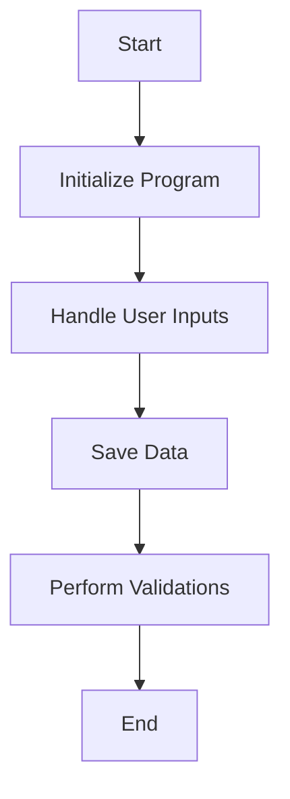

This document will cover the CGP001 Program Flow, which includes:

1. Initializing the Program
2. Handling User Inputs
3. Saving Data
4. Performing Validations

Technical document: <SwmLink doc-title="Overview of CGP001 Program Flow">[Overview of CGP001 Program Flow](/.swm/overview-of-cgp001-program-flow.1mpw4x97.sw.md)</SwmLink>

# Initializing the Program

The CGP001 program begins by initializing the system. This involves setting up necessary parameters and preparing the environment for subsequent operations. This step ensures that all required resources are available and correctly configured before any user interactions or data operations take place.

# Handling User Inputs

The program handles user inputs through various popups. These popups are used to gather necessary information from the user. For example, the POPUP-CODRED section retrieves and displays reduced codes, facilitating user interaction. This step is crucial for ensuring that the program can collect all required data from the user in an interactive and user-friendly manner.

# Saving Data

When saving data, the program moves information to specific fields and performs checks to ensure everything is correct. For instance, it transfers data from CGP001 to corresponding fields in CGD001. If any issues are found, such as missing characteristics, it sets an error message and prompts the user to correct the input. This step is essential for maintaining data integrity and ensuring that all necessary information is accurately recorded.

# Performing Validations

The program performs various validations to ensure data accuracy and consistency. For example, it checks if certain flags are set and performs corresponding actions, such as saving additional data or handling errors. These validations are crucial for preventing data corruption and ensuring that the program operates correctly under different conditions.

&nbsp;

*This is an auto-generated document by Swimm AI 🌊 and has not yet been verified by a human*

<SwmMeta version="3.0.0" repo-id="Z2l0aHViJTNBJTNBa2VsbG8lM0ElM0Fzd2ltbWlv" repo-name="kello">Powered by [Swimm](/)</SwmMeta>
