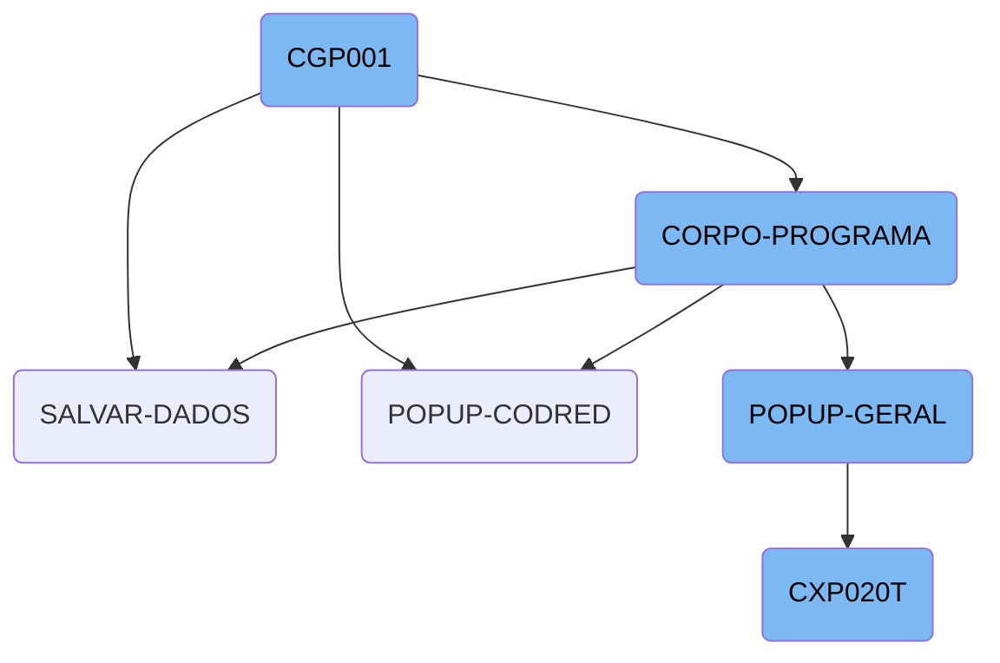
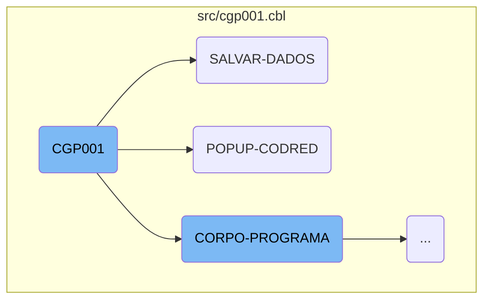
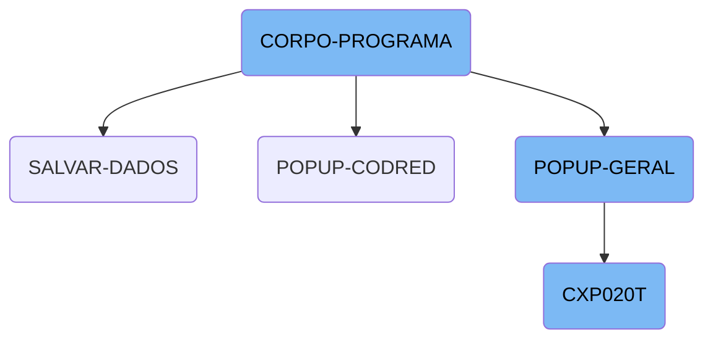

<SwmToken path="src/cgp001.cbl" pos="249:9:9" line-data="           PERFORM CORPO-PROGRAMA UNTIL CGP001-EXIT-FLG-TRUE.">`CGP001`</SwmToken> is a COBOL program that handles various business operations within the Kello Imagens system. It initializes by accepting <SwmToken path="src/cgp001.cbl" pos="253:9:11" line-data="           ACCEPT PARAMETROS-W FROM COMMAND-LINE.">`COMMAND-LINE`</SwmToken> parameters, processes data, manages popups, and performs various operations based on the current state of the program.

The <SwmToken path="src/cgp001.cbl" pos="249:9:9" line-data="           PERFORM CORPO-PROGRAMA UNTIL CGP001-EXIT-FLG-TRUE.">`CGP001`</SwmToken> program starts by initializing with parameters from the command line. It then enters the main program body, where it continuously evaluates conditions and performs corresponding operations until a specific exit flag is set. These operations include saving data, handling popups, and managing different business logic based on the current state. For example, it saves data by moving information between structures and writing records, and it handles popups by calling external programs and processing returned data.

Here is a high level diagram of the flow, showing only the most important functions:



# Flow drill down

First, we'll zoom into this section of the flow:



<SwmSnippet path="/src/cgp001.cbl" line="247">

---

## <SwmToken path="src/cgp001.cbl" pos="249:9:9" line-data="           PERFORM CORPO-PROGRAMA UNTIL CGP001-EXIT-FLG-TRUE.">`CGP001`</SwmToken> Initialization

The <SwmToken path="src/cgp001.cbl" pos="249:9:9" line-data="           PERFORM CORPO-PROGRAMA UNTIL CGP001-EXIT-FLG-TRUE.">`CGP001`</SwmToken> function begins with the <SwmToken path="src/cgp001.cbl" pos="247:1:3" line-data="       MAIN-PROCESS SECTION.">`MAIN-PROCESS`</SwmToken> section, which performs the <SwmToken path="src/cgp001.cbl" pos="248:3:5" line-data="           PERFORM INICIALIZA-PROGRAMA.">`INICIALIZA-PROGRAMA`</SwmToken> section. This section initializes the program by accepting parameters from the command line.

```cobol
       MAIN-PROCESS SECTION.
           PERFORM INICIALIZA-PROGRAMA.
           PERFORM CORPO-PROGRAMA UNTIL CGP001-EXIT-FLG-TRUE.
           GO FINALIZAR-PROGRAMA.

       INICIALIZA-PROGRAMA SECTION.
           ACCEPT PARAMETROS-W FROM COMMAND-LINE.
```

---

</SwmSnippet>

<SwmSnippet path="/src/cgp001.cbl" line="1280">

---

## Saving Data with <SwmToken path="src/cgp001.cbl" pos="1280:1:3" line-data="       SALVAR-DADOS SECTION.">`SALVAR-DADOS`</SwmToken>

The <SwmToken path="src/cgp001.cbl" pos="1280:1:3" line-data="       SALVAR-DADOS SECTION.">`SALVAR-DADOS`</SwmToken> function is responsible for saving data. It performs various operations such as closing and opening files, moving data from one structure to another, and writing records. It also handles error messages and logs operations.

```cobol
       SALVAR-DADOS SECTION.
           CLOSE    CGD001 CGD010
           OPEN I-O CGD001 CGD010
                    LOG002

           MOVE CGP001-CODIGO        TO  CODIGO-CG01 CODIGO-CG02
                                         CODIGO-CG03 CODIGO-CG04
                                         CODIGO-CG05.
           MOVE CGP001-NOME          TO  NOME-CG01
           MOVE CGP001-NOME-RED      TO  NOME-RED-CG01
           IF CGP001-T-PES-FIS = ZEROS AND CGP001-T-PES-JUR = ZEROS
              AND CGP001-T-FUNC = ZEROS AND CGP001-T-REPRES = ZEROS
               AND CGP001-T-FOTOG = ZEROS AND CGP001-T-CINEG = ZEROS
                AND CGP001-T-VEND = ZEROS AND CGP001-T-IMPOSTO = ZEROS
                 AND CGP001-T-INVESTIDOR = ZEROS AND CGP001-T-OUTRO = 0
                   MOVE "Nenhuma característica foi declarada"
                        TO CGP001-MENSAGEM-ERRO
                   PERFORM LOAD-SCREENSET
                   PERFORM CARREGA-MENSAGEM-ERRO
                   MOVE "EXIBE-ERRO" TO DS-PROCEDURE
                   PERFORM CALL-DIALOG-SYSTEM
```

---

</SwmSnippet>

<SwmSnippet path="/src/cgp001.cbl" line="1290">

---

### Handling Characteristics

This section checks if any characteristics have been declared. If none are found, it sets an error message and performs screen updates to display the error.

```cobol
           IF CGP001-T-PES-FIS = ZEROS AND CGP001-T-PES-JUR = ZEROS
              AND CGP001-T-FUNC = ZEROS AND CGP001-T-REPRES = ZEROS
               AND CGP001-T-FOTOG = ZEROS AND CGP001-T-CINEG = ZEROS
                AND CGP001-T-VEND = ZEROS AND CGP001-T-IMPOSTO = ZEROS
                 AND CGP001-T-INVESTIDOR = ZEROS AND CGP001-T-OUTRO = 0
                   MOVE "Nenhuma característica foi declarada"
                        TO CGP001-MENSAGEM-ERRO
                   PERFORM LOAD-SCREENSET
                   PERFORM CARREGA-MENSAGEM-ERRO
                   MOVE "EXIBE-ERRO" TO DS-PROCEDURE
                   PERFORM CALL-DIALOG-SYSTEM
                   MOVE "SET-POSICAO-CURSOR" TO DS-PROCEDURE
                   PERFORM CALL-DIALOG-SYSTEM.
```

---

</SwmSnippet>

<SwmSnippet path="/src/cgp001.cbl" line="599">

---

## Popup Handling with <SwmToken path="src/cgp001.cbl" pos="599:1:3" line-data="       POPUP-CODRED SECTION.">`POPUP-CODRED`</SwmToken>

The <SwmToken path="src/cgp001.cbl" pos="599:1:3" line-data="       POPUP-CODRED SECTION.">`POPUP-CODRED`</SwmToken> function handles the popup for reduced code. It calls the <SwmToken path="src/cgp001.cbl" pos="600:4:4" line-data="           CALL   &quot;CXP020T&quot; USING PARAMETROS-W PASSAR-PARAMETROS">`CXP020T`</SwmToken> program, processes the returned parameters, and updates the relevant fields with the reduced code and its description.

```cobol
       POPUP-CODRED SECTION.
           CALL   "CXP020T" USING PARAMETROS-W PASSAR-PARAMETROS
           CANCEL "CXP020T"
           MOVE PASSAR-STRING-1(52: 5) TO CGP001-COD-REDUZIDO
           MOVE CGP001-COD-REDUZIDO    TO CODIGO-REDUZ-CX20.
           READ CXD020 INVALID KEY
                MOVE "*****"    TO DESCRICAO-CX20.

           MOVE DESCRICAO-CX20  TO CGP001-DESC-COD-REDUZIDO.
```

---

</SwmSnippet>

Now, lets zoom into this section of the flow:



<SwmSnippet path="/src/cgp001.cbl" line="435">

---

## <SwmToken path="src/cgp001.cbl" pos="435:1:3" line-data="       CORPO-PROGRAMA SECTION.">`CORPO-PROGRAMA`</SwmToken>

<SwmToken path="src/cgp001.cbl" pos="435:1:3" line-data="       CORPO-PROGRAMA SECTION.">`CORPO-PROGRAMA`</SwmToken> is a central section that evaluates various conditions and performs corresponding operations. It handles tasks such as saving data, loading data, clearing data, and managing popups. Each condition triggers a specific set of operations, ensuring that the appropriate business logic is executed based on the current state.

```cobol
       CORPO-PROGRAMA SECTION.
           EVALUATE TRUE
               WHEN CGP001-CENTRALIZA-TRUE
                   PERFORM CENTRALIZAR
               WHEN CGP001-ACHAR-CODIGO-TRUE
                   PERFORM ACHAR-CODIGO
               WHEN CGP001-SAVE-FLG-TRUE
                   PERFORM SALVAR-DADOS
                   PERFORM INSERE-ITEM
                   PERFORM LIMPAR-DADOS
                   PERFORM INCREMENTA-CODIGO
                   MOVE "SET-POSICAO-CURSOR" TO DS-PROCEDURE
               WHEN CGP001-SALVA-BANCOS-TRUE
                   PERFORM SALVAR-DADOS-BANCOS
               WHEN CGP001-LOAD-FLG-TRUE
                   PERFORM CARREGAR-DADOS
                   MOVE "SET-POSICAO-CURSOR" TO DS-PROCEDURE
               WHEN CGP001-EXCLUI-FLG-TRUE
                   PERFORM EXCLUI-RECORD
                   PERFORM CARREGA-ULTIMOS
                   PERFORM ACHAR-CODIGO
```

---

</SwmSnippet>

<SwmSnippet path="/src/cgp001.cbl" line="906">

---

## <SwmToken path="src/cgp001.cbl" pos="906:1:3" line-data="       POPUP-GERAL SECTION.">`POPUP-GERAL`</SwmToken>

<SwmToken path="src/cgp001.cbl" pos="906:1:3" line-data="       POPUP-GERAL SECTION.">`POPUP-GERAL`</SwmToken> manages different types of popups based on the value of <SwmToken path="src/cgp001.cbl" pos="907:3:7" line-data="           EVALUATE CGP001-TIPO-POPUP">`CGP001-TIPO-POPUP`</SwmToken>. It calls various external programs and processes the returned data. This section ensures that the correct popup is displayed and the necessary data is retrieved and processed.

```cobol
       POPUP-GERAL SECTION.
           EVALUATE CGP001-TIPO-POPUP
             WHEN 1 CALL   "CAP014T" USING PARAMETROS-W
                                           PASSAR-PARAMETROS
                    CANCEL "CAP014T"
                    MOVE PASSAR-STRING-1(36: 2) TO CGP001-DEPTO-FVR
                    PERFORM LER-DEPTO
             WHEN 2  CALL   "CXP020T" USING PARAMETROS-W
                                            PASSAR-PARAMETROS
                     CANCEL "CXP020T"
                     MOVE PASSAR-STRING-1(52: 5)
                                  TO CGP001-CONTA-APUR-RED-FVR
                     PERFORM LER-APURACAO
             WHEN 5  CALL   "REP002T" USING PARAMETROS-W
                                            PASSAR-PARAMETROS
                     CANCEL "REP002T"
                     MOVE PASSAR-STRING-1(22: 2) TO CGP001-FUNCAO-FC
                     PERFORM LER-FUNCAO
             WHEN 6  CALL   "REP006T" USING PARAMETROS-W
                                            PASSAR-PARAMETROS
                     CANCEL "REP006T"
```

---

</SwmSnippet>

<SwmSnippet path="/src/cxp/cxp020t.cbl" line="2">

---

## <SwmToken path="src/cxp/cxp020t.cbl" pos="3:6:6" line-data="       PROGRAM-ID. CXP020T.">`CXP020T`</SwmToken>

<SwmToken path="src/cxp/cxp020t.cbl" pos="3:6:6" line-data="       PROGRAM-ID. CXP020T.">`CXP020T`</SwmToken> handles data processing and user interactions. It initializes the program, processes the main logic in <SwmToken path="src/cgp001.cbl" pos="249:3:5" line-data="           PERFORM CORPO-PROGRAMA UNTIL CGP001-EXIT-FLG-TRUE.">`CORPO-PROGRAMA`</SwmToken>, and finalizes the program. This section includes various operations such as centralizing data, locating words, and handling errors. It ensures that the data is processed correctly and the user interactions are managed efficiently.

```cobol
       IDENTIFICATION DIVISION.
       PROGRAM-ID. CXP020T.
      * AUTORA: MARELI AMÂNCIO VOLPATO
      * DATA: 28/08/1998
      * FUNCAO: CONSULTA POP-UP CONTAS APURACAO DE RESULTADOS
       ENVIRONMENT DIVISION.
       SPECIAL-NAMES.
       DECIMAL-POINT IS COMMA.
       class-control.
           Window             is class "wclass".

       INPUT-OUTPUT SECTION.
       FILE-CONTROL.
           COPY CXPX020.

       DATA DIVISION.
       FILE SECTION.
       COPY CXPW020.
       WORKING-STORAGE SECTION.
           COPY "CXP020T.CPB".
           COPY "CXP020T.CPY".
```

---

</SwmSnippet>

&nbsp;

*This is an auto-generated document by Swimm AI 🌊 and has not yet been verified by a human*

<SwmMeta version="3.0.0" repo-id="Z2l0aHViJTNBJTNBa2VsbG8lM0ElM0Fzd2ltbWlv" repo-name="kello"><sup>Powered by [Swimm](/)</sup></SwmMeta>
