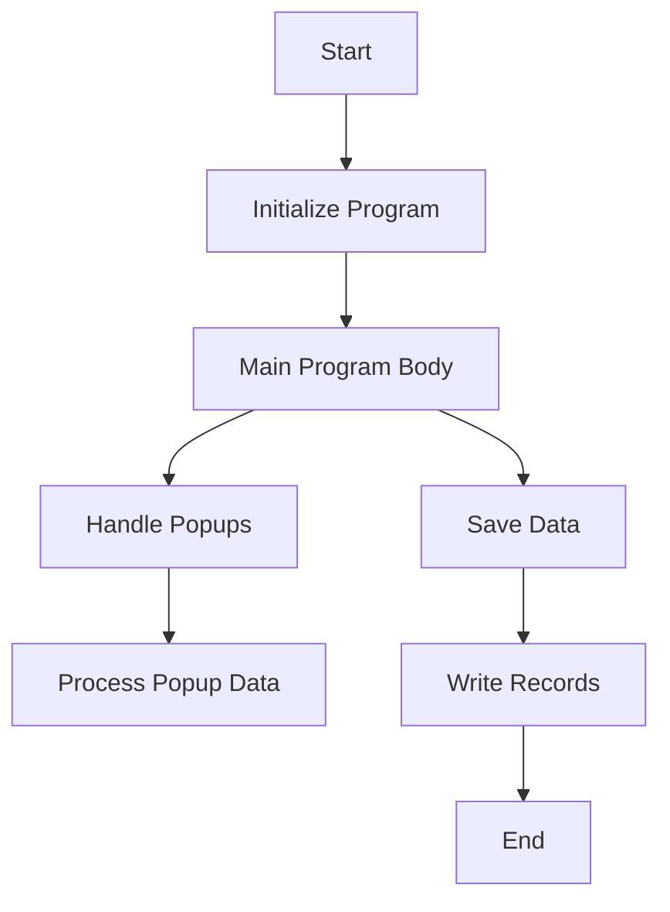

This document will cover the CGP001 Program, which includes:

1. Initializing the program
2. Handling popups
3. Saving data
4. Managing the main program body.

Technical document: <SwmLink doc-title="Overview of CGP001 Program">[Overview of CGP001 Program](/.swm/overview-of-cgp001-program.2spkjcq4.sw.md)</SwmLink>

# Initializing the Program

The CGP001 program begins by accepting parameters from the command line. This initialization step sets up the necessary environment for the program to run. It ensures that all required parameters are available and correctly formatted before proceeding to the main program body.

# Handling Popups

The program handles various popups that may appear during its execution. These popups are used to gather additional information from the user or to display important messages. For example, the POPUP-CODRED function calls an external program to retrieve reduced code information and updates the relevant fields with this data. This ensures that the user has the necessary information to proceed with their tasks.

# Saving Data

The SALVAR-DADOS function is responsible for saving data within the program. It performs operations such as closing and opening files, moving data between structures, and writing records. This function also handles error messages and logs operations to ensure data integrity and traceability. For instance, it checks if any characteristics have been declared and sets an error message if none are found, updating the screen to display this error.

# Managing the Main Program Body

The main program body, CORPO-PROGRAMA, continuously evaluates conditions and performs corresponding operations until a specific exit flag is set. This section handles tasks such as saving data, loading data, clearing data, and managing popups. Each condition triggers a specific set of operations, ensuring that the appropriate business logic is executed based on the current state. For example, if the save flag is true, it performs the SALVAR-DADOS function to save the data.

&nbsp;

*This is an auto-generated document by Swimm AI 🌊 and has not yet been verified by a human*

<SwmMeta version="3.0.0" repo-id="Z2l0aHViJTNBJTNBa2VsbG8lM0ElM0Fzd2ltbWlv" repo-name="kello">Powered by [Swimm](/)</SwmMeta>
