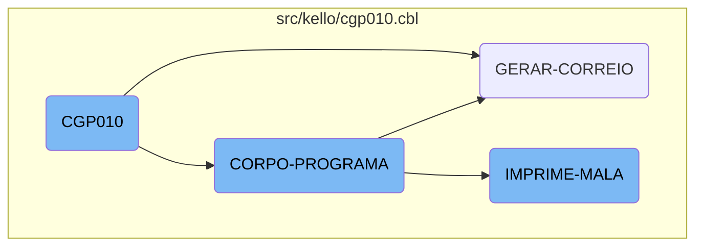
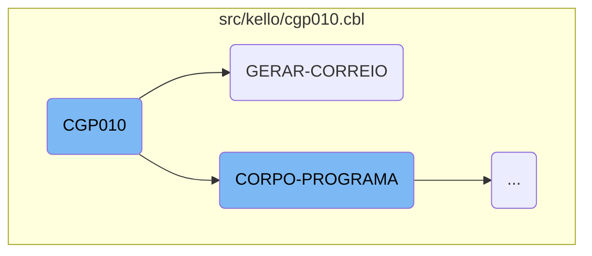
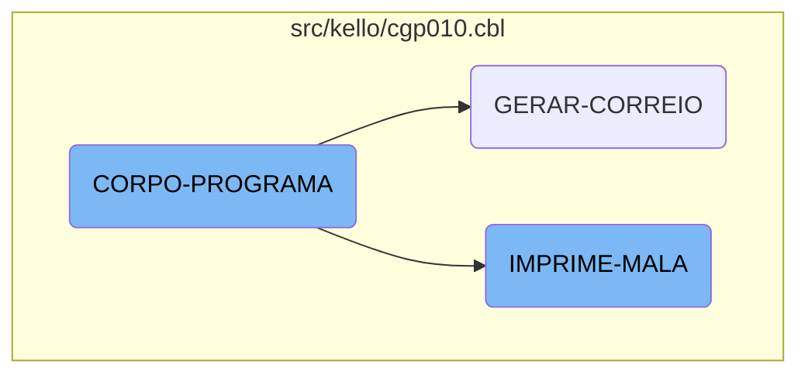

<SwmToken path="src/kello/cgp010.cbl" pos="3:6:6" line-data="       PROGRAM-ID. CGP010.">`CGP010`</SwmToken> is a crucial component of the Kello Imagens system, responsible for setting up the environment, initializing variables, and managing client data. It includes several key functions such as <SwmToken path="src/kello/cgp010.cbl" pos="637:3:5" line-data="                    PERFORM GERAR-CORREIO">`GERAR-CORREIO`</SwmToken>, <SwmToken path="src/kello/cgp010.cbl" pos="356:3:5" line-data="           PERFORM CORPO-PROGRAMA UNTIL GS-EXIT-FLG-TRUE.">`CORPO-PROGRAMA`</SwmToken>, and <SwmToken path="src/kello/cgp010.cbl" pos="625:3:5" line-data="                       PERFORM IMPRIME-MALA">`IMPRIME-MALA`</SwmToken>, each handling specific tasks related to data processing and output generation.

<SwmToken path="src/kello/cgp010.cbl" pos="3:6:6" line-data="       PROGRAM-ID. CGP010.">`CGP010`</SwmToken> starts by setting up the environment and initializing necessary variables. It then processes client data through various functions. <SwmToken path="src/kello/cgp010.cbl" pos="637:3:5" line-data="                    PERFORM GERAR-CORREIO">`GERAR-CORREIO`</SwmToken> generates mailing data, <SwmToken path="src/kello/cgp010.cbl" pos="356:3:5" line-data="           PERFORM CORPO-PROGRAMA UNTIL GS-EXIT-FLG-TRUE.">`CORPO-PROGRAMA`</SwmToken> manages the main workflow by evaluating conditions and performing actions, and <SwmToken path="src/kello/cgp010.cbl" pos="625:3:5" line-data="                       PERFORM IMPRIME-MALA">`IMPRIME-MALA`</SwmToken> handles the printing of mailing labels. Each function ensures that data is processed correctly and efficiently, supporting the overall business operations.

Here is a high level diagram of the flow, showing only the most important functions:



# Flow drill down

First, we'll zoom into this section of the flow:



<SwmSnippet path="/src/kello/cgp010.cbl" line="2">

---

## <SwmToken path="src/kello/cgp010.cbl" pos="3:6:6" line-data="       PROGRAM-ID. CGP010.">`CGP010`</SwmToken>

The <SwmToken path="src/kello/cgp010.cbl" pos="3:6:6" line-data="       PROGRAM-ID. CGP010.">`CGP010`</SwmToken> function is responsible for setting up the environment and initializing various variables and data structures required for the program's execution. It includes copying necessary files, defining file descriptors, and initializing variables that will be used throughout the program. This function lays the groundwork for subsequent operations by ensuring that all necessary resources are available and correctly initialized.

```cobol
       IDENTIFICATION DIVISION.
       PROGRAM-ID. CGP010.
      *AUTHOR: MARELI AMANCIO VOLPATO
      *DATA: 07/04/1999
      *DESCRIÇÃO: Cadastro de cliente
      *  Este cadastro terá 3 arquivos. Um arquivo simples contendo
      *  apenas o nome do comprador e código (cgd010), e o complemento
      *  deste arquivo o CGD011 e também o complemento do contrato o
      *  cgd012.
      *  O código do cliente terá uma classificação do tipo =
      *  0(contrato)   1(comum). O do tipo 0 são clientes relacionados
      *  com o recibo de vendas e o comum são os demais clientes.
       ENVIRONMENT DIVISION.
       SPECIAL-NAMES.
       DECIMAL-POINT IS COMMA.
       class-control.
           Window             is class "wclass".

       INPUT-OUTPUT SECTION.
       FILE-CONTROL.
           COPY CAPX004.
```

---

</SwmSnippet>

<SwmSnippet path="/src/kello/cgp010.cbl" line="2043">

---

## <SwmToken path="src/kello/cgp010.cbl" pos="637:3:5" line-data="                    PERFORM GERAR-CORREIO">`GERAR-CORREIO`</SwmToken>

The <SwmToken path="src/kello/cgp010.cbl" pos="637:3:5" line-data="                    PERFORM GERAR-CORREIO">`GERAR-CORREIO`</SwmToken> function handles the generation of mailing data. It opens the output file for mailing data, initializes counters, and processes each record to extract and format the necessary information. The function evaluates different conditions to determine how to handle each record, including reading from various data sources and performing string manipulations. It writes the formatted mailing data to the output file and ensures that all records are processed correctly before closing the file.

```cobol
           OPEN OUTPUT CORREIO

           MOVE ZEROS TO AUX-QTDE

           MOVE DET-CORREIO-1 TO REG-CORREIO
           WRITE REG-CORREIO

           EVALUATE GS-ORDEM-ESCOLHA
            WHEN 1 MOVE 1 TO GS-POSICAO
                   MOVE SPACES TO GS-LINNOME
                   MOVE "LER-LIST2" TO DS-PROCEDURE
                   PERFORM CALL-DIALOG-SYSTEM
                   PERFORM UNTIL GS-LINNOME = SPACES
                       ADD 1 TO AUX-QTDE
                       INITIALIZE DET-CNPJ-CPF
                                  DET-NOME
                                  DET-EMAIL
                                  DET-AOS-CUIDADOS
                                  DET-CONTATO
                                  DET-CEP-CORREIO
                                  DET-LOGRADOURO
```

---

</SwmSnippet>

Now, lets zoom into this section of the flow:



<SwmSnippet path="/src/kello/cgp010.cbl" line="541">

---

## <SwmToken path="src/kello/cgp010.cbl" pos="356:3:5" line-data="           PERFORM CORPO-PROGRAMA UNTIL GS-EXIT-FLG-TRUE.">`CORPO-PROGRAMA`</SwmToken>

The <SwmToken path="src/kello/cgp010.cbl" pos="356:3:5" line-data="           PERFORM CORPO-PROGRAMA UNTIL GS-EXIT-FLG-TRUE.">`CORPO-PROGRAMA`</SwmToken> function is a central part of the <SwmToken path="src/kello/cgp010.cbl" pos="3:6:6" line-data="       PROGRAM-ID. CGP010.">`CGP010`</SwmToken> flow. It evaluates various conditions and performs corresponding actions such as centralizing data, saving data, inserting items, and clearing data. It also handles reading records, setting cursor positions, and calling dialog systems. This function ensures that the correct procedures are executed based on the flags set in the system, making it a crucial component for managing the program's workflow.

```cobol
               EVALUATE TRUE
               WHEN GS-CENTRALIZA-TRUE
                   PERFORM CENTRALIZAR
               WHEN GS-SAVE-FLG-TRUE
                    PERFORM SALVAR-DADOS
                    PERFORM INSERE-ITEM
                    PERFORM LIMPAR-DADOS
      *             PERFORM INCREMENTA-CODIGO
                    MOVE "SENHA24"       TO PROGRAMA-CA004
                    MOVE COD-USUARIO-W   TO COD-USUARIO-CA004

                    READ CAD004 INVALID KEY
                        MOVE "DESABILITA-RECIBO" TO DS-PROCEDURE
                    NOT INVALID KEY
                        MOVE "HABILITA-RECIBO" TO DS-PROCEDURE
                    END-READ
                    PERFORM CALL-DIALOG-SYSTEM

                    MOVE "SET-POSICAO-CURSOR" TO DS-PROCEDURE
               WHEN GS-ACHAR-CODIGO-TRUE
                    IF GS-CLASSIFICACAO = SPACES
```

---

</SwmSnippet>

<SwmSnippet path="/src/kello/cgp010.cbl" line="2227">

---

## <SwmToken path="src/kello/cgp010.cbl" pos="625:3:5" line-data="                       PERFORM IMPRIME-MALA">`IMPRIME-MALA`</SwmToken>

The <SwmToken path="src/kello/cgp010.cbl" pos="625:3:5" line-data="                       PERFORM IMPRIME-MALA">`IMPRIME-MALA`</SwmToken> function is responsible for printing labels and handling the output of mailing data. It opens the output file, processes the data based on various conditions, and writes the formatted data to the output. This function ensures that the mailing labels are generated correctly and efficiently, supporting the business logic of managing and dispatching mail.

```cobol
           OPEN OUTPUT RELAT.

           MOVE 0  TO ETIQUETA QTDE-ETIQ
           MOVE 0  TO CONTADOR POSICAO


           IF GS-SO-REMETENTE = 1
              EVALUATE GS-OP-ETIQUETA
                   WHEN 1 MOVE NOME-CG30     TO AUX-NOME
                          MOVE ENDERECO-CG30 TO ENDERECO1-CG11
                          MOVE SPACES        TO BAIRRO1-CG11
                          MOVE CIDADE-CG30   TO CIDADE1-CG11
                          MOVE CEP-CG30      TO CEP1-CG11
                          MOVE ZEROS         TO CX-POSTAL1-CG11
                          PERFORM ETIQUETA-PADRAO

                          IF ETIQUETA = 1
                             WRITE REG-RELAT FROM DET-ETIQUETA1 AFTER 0
                             WRITE REG-RELAT FROM DET-ETIQUETA2
                             WRITE REG-RELAT FROM DET-ETIQUETA3
                             WRITE REG-RELAT FROM DET-ETIQUETA4
```

---

</SwmSnippet>

&nbsp;

*This is an auto-generated document by Swimm AI 🌊 and has not yet been verified by a human*

<SwmMeta version="3.0.0" repo-id="Z2l0aHViJTNBJTNBa2VsbG8lM0ElM0Fzd2ltbWlv" repo-name="kello"><sup>Powered by [Swimm](/)</sup></SwmMeta>
