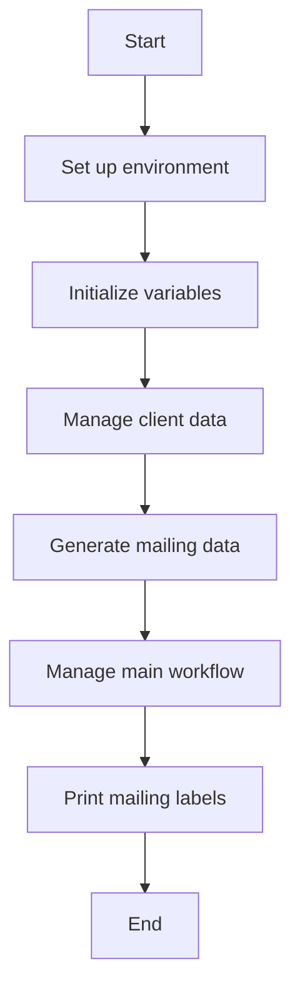

This document will cover the CGP010 component, which includes:

1. Setting up the environment
2. Initializing variables
3. Managing client data
4. Generating mailing data
5. Managing the main workflow
6. Printing mailing labels.

Technical document: <SwmLink doc-title="Overview of CGP010">[Overview of CGP010](/.swm/overview-of-cgp010.9iealp29.sw.md)</SwmLink>

# Setting up the environment

The CGP010 component begins by setting up the environment. This involves copying necessary files and defining file descriptors. This step ensures that all required resources are available for the program to run smoothly.

# Initializing variables

Next, CGP010 initializes various variables and data structures that will be used throughout the program. This includes setting initial values and preparing data structures for subsequent operations.

# Managing client data

CGP010 manages client data by processing records from different data sources. It ensures that client information is correctly read, stored, and updated as needed. This step is crucial for maintaining accurate and up-to-date client records.

# Generating mailing data

The GERAR-CORREIO function within CGP010 handles the generation of mailing data. It processes each client record to extract and format the necessary information for mailing. This includes evaluating conditions to determine how to handle each record and writing the formatted data to an output file.

# Managing the main workflow

The CORPO-PROGRAMA function is a central part of CGP010. It evaluates various conditions and performs corresponding actions such as centralizing data, saving data, inserting items, and clearing data. This function ensures that the correct procedures are executed based on the flags set in the system.

# Printing mailing labels

The IMPRIME-MALA function is responsible for printing mailing labels. It processes the data based on various conditions and writes the formatted data to the output. This step ensures that mailing labels are generated correctly and efficiently, supporting the business logic of managing and dispatching mail.

&nbsp;

*This is an auto-generated document by Swimm AI 🌊 and has not yet been verified by a human*

<SwmMeta version="3.0.0" repo-id="Z2l0aHViJTNBJTNBa2VsbG8lM0ElM0Fzd2ltbWlv" repo-name="kello">Powered by [Swimm](/)</SwmMeta>
