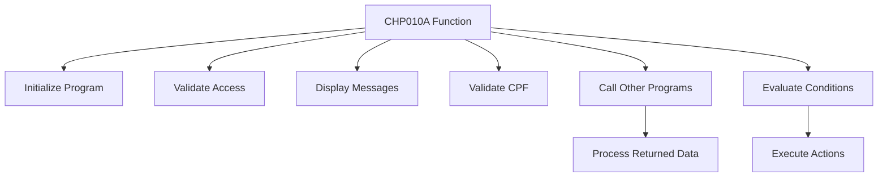

This document will cover the CHP010A function, which includes:

1. Initializing the program and validating access
2. Handling various operations such as displaying messages and validating CPF
3. Calling other programs and processing returned data
4. Evaluating conditions and executing corresponding actions.

Technical document: <SwmLink doc-title="Overview of CHP010A Function">[Overview of CHP010A Function](/.swm/overview-of-chp010a-function.jifth7mv.sw.md)</SwmLink>

# Initializing the Program and Validating Access

The CHP010A function begins by initializing the program. This involves setting up necessary parameters and ensuring that the system is ready for operation. Following initialization, the function validates access to ensure that only authorized users can proceed. This step is crucial for maintaining the security and integrity of the system.

# Handling Various Operations

Once access is validated, the CHP010A function handles several operations. These include displaying messages to the user and validating CPF (Cadastro de Pessoas Físicas), which is a Brazilian individual taxpayer registry identification. Displaying messages helps in guiding the user through the process, while CPF validation ensures that the data being processed is accurate and belongs to a legitimate user.

# Calling Other Programs and Processing Returned Data

One of the main sections of the CHP010A function is CHAMAR-APURACAO, which is responsible for calling another program, CXP020T. This program is called using specific parameters, and the returned data is processed accordingly. This step is essential for integrating different parts of the system and ensuring that the necessary data is available for further processing.

# Evaluating Conditions and Executing Actions

The CORPO-PROGRAMA section of the CHP010A function evaluates various conditions and performs actions based on the current state and user inputs. For example, it checks flags like GS-CENTRALIZA-TRUE, GS-SAVE-FLG-TRUE, and GS-EXCLUI-FLG-TRUE to determine the appropriate procedures to execute, such as CENTRALIZAR, SALVAR-DADOS, and EXCLUI. This ensures that the correct business logic is applied based on the user's actions and the system's state.

&nbsp;

*This is an auto-generated document by Swimm AI 🌊 and has not yet been verified by a human*

<SwmMeta version="3.0.0" repo-id="Z2l0aHViJTNBJTNBa2VsbG8lM0ElM0Fzd2ltbWlv" repo-name="kello">Powered by [Swimm](/)</SwmMeta>
