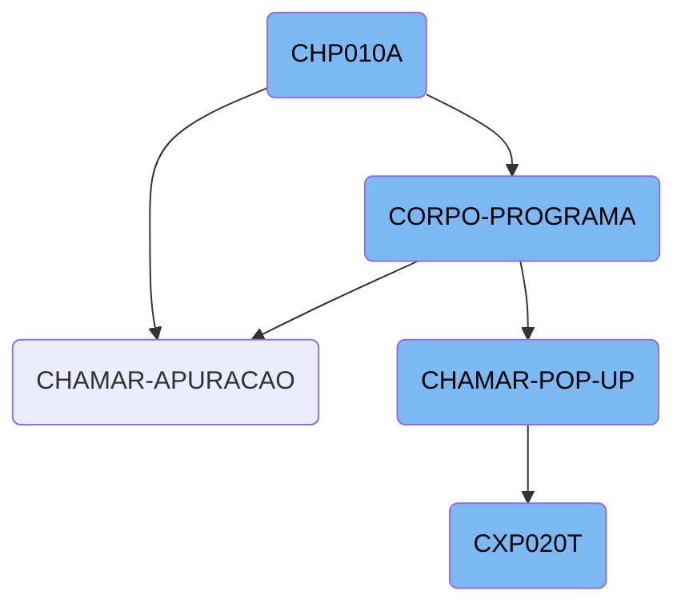
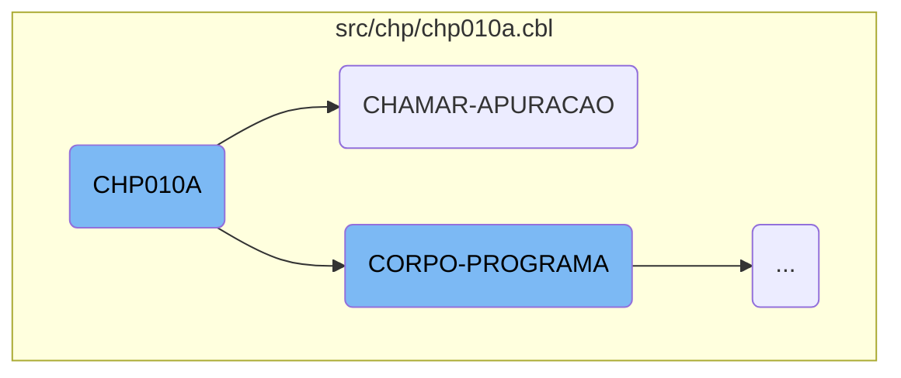
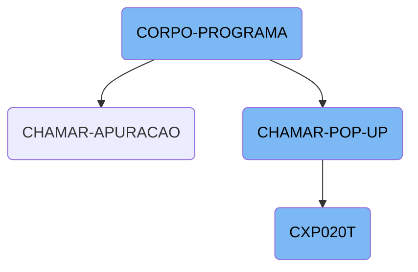

The <SwmToken path="src/chp/chp010a.cbl" pos="3:6:6" line-data="       PROGRAM-ID. CHP010A.">`CHP010A`</SwmToken> function is a critical component responsible for initializing the program, validating access, and managing various operations such as displaying messages, validating CPF, and invoking other programs. It includes key sections like <SwmToken path="src/chp/chp010a.cbl" pos="508:1:3" line-data="       CHAMAR-APURACAO SECTION.">`CHAMAR-APURACAO`</SwmToken>, which performs specific operations, and <SwmToken path="src/chp/chp010a.cbl" pos="363:1:3" line-data="       CORPO-PROGRAMA SECTION.">`CORPO-PROGRAMA`</SwmToken>, which evaluates conditions and executes corresponding actions.

The <SwmToken path="src/chp/chp010a.cbl" pos="3:6:6" line-data="       PROGRAM-ID. CHP010A.">`CHP010A`</SwmToken> function starts by initializing the program and validating access. It then moves on to handle different tasks such as displaying messages and validating CPF. One of its main sections, <SwmToken path="src/chp/chp010a.cbl" pos="508:1:3" line-data="       CHAMAR-APURACAO SECTION.">`CHAMAR-APURACAO`</SwmToken>, is responsible for calling another program, <SwmToken path="src/chp/chp010a.cbl" pos="509:4:4" line-data="           CALL &quot;CXP020T&quot; USING PARAMETROS-W PASSAR-PARAMETROS">`CXP020T`</SwmToken>, and processing the returned data. Another important section, <SwmToken path="src/chp/chp010a.cbl" pos="363:1:3" line-data="       CORPO-PROGRAMA SECTION.">`CORPO-PROGRAMA`</SwmToken>, evaluates various conditions and performs actions based on the current state and user inputs. This ensures that the appropriate business logic is executed.

Here is a high level diagram of the flow, showing only the most important functions:



# Flow drill down

First, we'll zoom into this section of the flow:



<SwmSnippet path="/src/chp/chp010a.cbl" line="508">

---

## <SwmToken path="src/chp/chp010a.cbl" pos="3:6:6" line-data="       PROGRAM-ID. CHP010A.">`CHP010A`</SwmToken>

The <SwmToken path="src/chp/chp010a.cbl" pos="3:6:6" line-data="       PROGRAM-ID. CHP010A.">`CHP010A`</SwmToken> function is responsible for initializing the program, validating access, and handling various sections such as displaying messages, validating CPF, and calling other programs. One of the key sections is <SwmToken path="src/chp/chp010a.cbl" pos="508:1:3" line-data="       CHAMAR-APURACAO SECTION.">`CHAMAR-APURACAO`</SwmToken>, which is called to perform specific operations.

```cobol
       CHAMAR-APURACAO SECTION.
           CALL "CXP020T" USING PARAMETROS-W PASSAR-PARAMETROS
```

---

</SwmSnippet>

<SwmSnippet path="/src/chp/chp010a.cbl" line="508">

---

## <SwmToken path="src/chp/chp010a.cbl" pos="508:1:3" line-data="       CHAMAR-APURACAO SECTION.">`CHAMAR-APURACAO`</SwmToken>

The <SwmToken path="src/chp/chp010a.cbl" pos="508:1:3" line-data="       CHAMAR-APURACAO SECTION.">`CHAMAR-APURACAO`</SwmToken> function calls the <SwmToken path="src/chp/chp010a.cbl" pos="509:4:4" line-data="           CALL &quot;CXP020T&quot; USING PARAMETROS-W PASSAR-PARAMETROS">`CXP020T`</SwmToken> program using specific parameters and then performs the <SwmToken path="src/chp/chp010a.cbl" pos="512:3:7" line-data="           PERFORM LE-COD-APURACAO.">`LE-COD-APURACAO`</SwmToken> section. This function is crucial for executing the <SwmToken path="src/chp/chp010a.cbl" pos="509:4:4" line-data="           CALL &quot;CXP020T&quot; USING PARAMETROS-W PASSAR-PARAMETROS">`CXP020T`</SwmToken> program and processing the returned data.

```cobol
       CHAMAR-APURACAO SECTION.
           CALL "CXP020T" USING PARAMETROS-W PASSAR-PARAMETROS
           CANCEL "CXP020T"
           MOVE PASSAR-STRING-1(52: 5) TO GS-COD-APURACAO
           PERFORM LE-COD-APURACAO.
```

---

</SwmSnippet>

Now, lets zoom into this section of the flow:



<SwmSnippet path="/src/chp/chp010a.cbl" line="363">

---

## <SwmToken path="src/chp/chp010a.cbl" pos="363:1:3" line-data="       CORPO-PROGRAMA SECTION.">`CORPO-PROGRAMA`</SwmToken>

The <SwmToken path="src/chp/chp010a.cbl" pos="363:1:3" line-data="       CORPO-PROGRAMA SECTION.">`CORPO-PROGRAMA`</SwmToken> function is a central control structure that evaluates various conditions and performs corresponding actions. It handles different flags such as <SwmToken path="src/chp/chp010a.cbl" pos="365:3:7" line-data="               WHEN GS-CENTRALIZA-TRUE">`GS-CENTRALIZA-TRUE`</SwmToken>, <SwmToken path="src/chp/chp010a.cbl" pos="367:3:9" line-data="               WHEN GS-SAVE-FLG-TRUE">`GS-SAVE-FLG-TRUE`</SwmToken>, and <SwmToken path="src/chp/chp010a.cbl" pos="374:3:9" line-data="               WHEN GS-EXCLUI-FLG-TRUE">`GS-EXCLUI-FLG-TRUE`</SwmToken>, among others, to execute specific procedures like <SwmToken path="src/chp/chp010a.cbl" pos="366:3:3" line-data="                   PERFORM CENTRALIZAR">`CENTRALIZAR`</SwmToken>, <SwmToken path="src/chp/chp010a.cbl" pos="368:3:5" line-data="                   PERFORM SALVAR-DADOS">`SALVAR-DADOS`</SwmToken>, and <SwmToken path="src/chp/chp010a.cbl" pos="374:5:5" line-data="               WHEN GS-EXCLUI-FLG-TRUE">`EXCLUI`</SwmToken>. This function ensures that the appropriate business logic is executed based on the current state and user actions.

```cobol
       CORPO-PROGRAMA SECTION.
           EVALUATE TRUE
               WHEN GS-CENTRALIZA-TRUE
                   PERFORM CENTRALIZAR
               WHEN GS-SAVE-FLG-TRUE
                   PERFORM SALVAR-DADOS
                   PERFORM REGRAVA-DADOS
                   PERFORM GRAVA-ANOTACAO
                   PERFORM LIMPAR-DADOS
                   MOVE "SET-POSICAO-CURSOR1" TO DS-PROCEDURE
                   MOVE "SET-POSICAO-CURSOR1" TO DS-PROCEDURE
               WHEN GS-EXCLUI-FLG-TRUE
                   MOVE USUARIO-W TO DIGITADOR-CH10
                   MOVE 3 TO SITUACAO-CH10
                   PERFORM EXCLUI
                   PERFORM LIMPAR-DADOS
               WHEN GS-DEVOLVIDO-FLG-TRUE
                    MOVE USUARIO-W TO DIGITADOR-CH10

                    PERFORM GRAVAR-DADOS-DEVOLVIDO
                    PERFORM CANCELA-DEVOLVIDO
```

---

</SwmSnippet>

<SwmSnippet path="/src/chp/chp010a.cbl" line="513">

---

## <SwmToken path="src/chp/chp010a.cbl" pos="513:1:5" line-data="       CHAMAR-POP-UP SECTION.">`CHAMAR-POP-UP`</SwmToken>

The <SwmToken path="src/chp/chp010a.cbl" pos="513:1:5" line-data="       CHAMAR-POP-UP SECTION.">`CHAMAR-POP-UP`</SwmToken> function is responsible for handling different <SwmToken path="src/chp/chp010a.cbl" pos="513:3:5" line-data="       CHAMAR-POP-UP SECTION.">`POP-UP`</SwmToken> options based on the value of <SwmToken path="src/chp/chp010a.cbl" pos="514:3:9" line-data="           EVALUATE GS-OPCAO-POP-UP">`GS-OPCAO-POP-UP`</SwmToken>. It performs actions such as loading client or vendor pop-ups, calling external programs like <SwmToken path="src/chp/chp010a.cbl" pos="517:8:8" line-data="             WHEN 3 CALL    &quot;CAP018T&quot; USING PARAMETROS-W">`CAP018T`</SwmToken> and <SwmToken path="src/chp/chp010a.cbl" pos="522:8:8" line-data="             WHEN 4 CALL   &quot;CXP020T&quot; USING PARAMETROS-W PASSAR-STRING-1">`CXP020T`</SwmToken>, and moving data between variables. This function facilitates user interactions by displaying relevant pop-ups and processing the selected options.

```cobol
       CHAMAR-POP-UP SECTION.
           EVALUATE GS-OPCAO-POP-UP
             WHEN 1 PERFORM CARREGA-POP-UP-CLIENTE
             WHEN 2 PERFORM CARREGA-POP-UP-VENDEDOR
             WHEN 3 CALL    "CAP018T" USING PARAMETROS-W
                                            PASSAR-PARAMETROS
                    CANCEL "CAP018T"
                    MOVE PASSAR-STRING-1(1: 30) TO GS-DESCR-PORTADOR
                    MOVE PASSAR-STRING-1(33: 4) TO GS-PORTADOR
             WHEN 4 CALL   "CXP020T" USING PARAMETROS-W PASSAR-STRING-1
                    CANCEL "CXP020T"
                    MOVE PASSAR-STRING-1(52: 5) TO GS-COD-APURACAO
                    PERFORM LE-COD-APURACAO
                    MOVE DESCRICAO-CX20 TO GS-DESCR-APURACAO
             WHEN 5 CALL   "CRP001T" USING PARAMETROS-W
                                           PASSAR-PARAMETROS
                    CANCEL "CRP001T"
                    MOVE PASSAR-STRING-1(1: 30) TO GS-DESCR-SITUACAO-TIT
                    MOVE PASSAR-STRING-1(33: 2) TO GS-SITUACAO-TIT
             WHEN 6 CALL   "CHP012T" USING PARAMETROS-W
                                           PASSAR-PARAMETROS
```

---

</SwmSnippet>

<SwmSnippet path="/src/cxp/cxp020t.cbl" line="72">

---

## <SwmToken path="src/cxp/cxp020t.cbl" pos="74:9:9" line-data="           PERFORM CORPO-PROGRAMA UNTIL CXP020T-EXIT-FLG-TRUE.">`CXP020T`</SwmToken>

The <SwmToken path="src/cxp/cxp020t.cbl" pos="74:9:9" line-data="           PERFORM CORPO-PROGRAMA UNTIL CXP020T-EXIT-FLG-TRUE.">`CXP020T`</SwmToken> function is a comprehensive section that initializes the program, processes the main logic, and finalizes the program. It includes sections like <SwmToken path="src/cxp/cxp020t.cbl" pos="73:3:5" line-data="           PERFORM INICIALIZA-PROGRAMA.">`INICIALIZA-PROGRAMA`</SwmToken>, <SwmToken path="src/cxp/cxp020t.cbl" pos="74:3:5" line-data="           PERFORM CORPO-PROGRAMA UNTIL CXP020T-EXIT-FLG-TRUE.">`CORPO-PROGRAMA`</SwmToken>, and <SwmToken path="src/cxp/cxp020t.cbl" pos="75:3:5" line-data="           GO FINALIZAR-PROGRAMA.">`FINALIZAR-PROGRAMA`</SwmToken>. The <SwmToken path="src/cxp/cxp020t.cbl" pos="74:3:5" line-data="           PERFORM CORPO-PROGRAMA UNTIL CXP020T-EXIT-FLG-TRUE.">`CORPO-PROGRAMA`</SwmToken> section within <SwmToken path="src/cxp/cxp020t.cbl" pos="74:9:9" line-data="           PERFORM CORPO-PROGRAMA UNTIL CXP020T-EXIT-FLG-TRUE.">`CXP020T`</SwmToken> evaluates conditions and performs actions such as <SwmToken path="src/chp/chp010a.cbl" pos="366:3:3" line-data="                   PERFORM CENTRALIZAR">`CENTRALIZAR`</SwmToken>, <SwmToken path="src/cxp/cxp020t.cbl" pos="103:3:5" line-data="                    PERFORM LOCALIZA-PALAVRA">`LOCALIZA-PALAVRA`</SwmToken>, and <SwmToken path="src/cxp/cxp020t.cbl" pos="91:3:7" line-data="              PERFORM CARREGA-MENSAGEM-ERRO">`CARREGA-MENSAGEM-ERRO`</SwmToken>. This function ensures the proper execution of the program's main logic and handles various business scenarios.

```cobol
       MAIN-PROCESS SECTION.
           PERFORM INICIALIZA-PROGRAMA.
           PERFORM CORPO-PROGRAMA UNTIL CXP020T-EXIT-FLG-TRUE.
           GO FINALIZAR-PROGRAMA.

       INICIALIZA-PROGRAMA SECTION.
           MOVE "00000" TO STRING-1(52: 5).
           INITIALIZE CXP020T-DATA-BLOCK
           INITIALIZE DS-CONTROL-BLOCK
           MOVE CXP020T-DATA-BLOCK-VERSION-NO
                                   TO DS-DATA-BLOCK-VERSION-NO
           MOVE CXP020T-VERSION-NO  TO DS-VERSION-NO
           MOVE EMPRESA-W          TO EMP-REC
           MOVE "CXD020"  TO ARQ-REC. MOVE EMPRESA-REF TO PATH-CXD020.
           OPEN INPUT CXD020
           IF ST-CXD020 <> "00"
              MOVE "ERRO ABERTURA CXD020: "  TO CXP020T-MENSAGEM-ERRO
              MOVE ST-CXD020 TO CXP020T-MENSAGEM-ERRO(23: 02)
              PERFORM LOAD-SCREENSET
              PERFORM CARREGA-MENSAGEM-ERRO
           ELSE PERFORM LOAD-SCREENSET.
```

---

</SwmSnippet>

# Where is this flow used?

This flow is used multiple times in the codebase as represented in the following diagram:

(Note - these are only some of the entry points of this flow)

```mermaid
graph TD;
      subgraph src/chp
407f2b8ed1363027b346f43447c12226c435ac71a035da8c7530e7697b6bcc1c(CHP052):::rootsStyle --> b5f2aa9338fb6cd48377a835bd56b05af20cb3264dea3bbba9fd7abe4211a0be(CORPO-PROGRAMA)
end

subgraph src/chp
b5f2aa9338fb6cd48377a835bd56b05af20cb3264dea3bbba9fd7abe4211a0be(CORPO-PROGRAMA) --> 499f17db26363bed3142bf7fb6582c9c88f7273afe1e05fd3b386534cb0053a0(CHAMA-ALTERACAO)
end

subgraph src/chp
499f17db26363bed3142bf7fb6582c9c88f7273afe1e05fd3b386534cb0053a0(CHAMA-ALTERACAO) --> 59ad1cd84b5ce1f0a7736c9a6b7be6d5e30e1ab0a3947cb7abfc89ce1d2e5d58(CHP010A):::mainFlowStyle
end

subgraph src/chp
779e2973c9822b516f43dce0f1a73dd5df4ae11736fcc95b780dca5606b98ca3(CHP056):::rootsStyle --> cc1a706a2c475369efcd97ef9ba66510b4b5fe270bddf5d9374d815c980877a1(CORPO-PROGRAMA)
end

subgraph src/chp
cc1a706a2c475369efcd97ef9ba66510b4b5fe270bddf5d9374d815c980877a1(CORPO-PROGRAMA) --> 917757e764c62abf9bf77c0b51410ed6506bab33dd46d2a585f94f72f8836c3e(CHAMA-ALTERACAO)
end

subgraph src/chp
917757e764c62abf9bf77c0b51410ed6506bab33dd46d2a585f94f72f8836c3e(CHAMA-ALTERACAO) --> 59ad1cd84b5ce1f0a7736c9a6b7be6d5e30e1ab0a3947cb7abfc89ce1d2e5d58(CHP010A):::mainFlowStyle
end

subgraph src/chp
1facaee6ea66e06e8f20666f79331dc0e573b66e912383118bd39365b46ffb2c(CHP051):::rootsStyle --> 374c8280270292136513d994cd0c89a76bd240b41944c70374870f12ae287a1b(CORPO-PROGRAMA)
end

subgraph src/chp
374c8280270292136513d994cd0c89a76bd240b41944c70374870f12ae287a1b(CORPO-PROGRAMA) --> b36ebcae263c156d5cf9cad946f41c08a2e632a626fcfdb6c6d2be106f3288b5(CHAMA-ALTERACAO)
end

subgraph src/chp
b36ebcae263c156d5cf9cad946f41c08a2e632a626fcfdb6c6d2be106f3288b5(CHAMA-ALTERACAO) --> 59ad1cd84b5ce1f0a7736c9a6b7be6d5e30e1ab0a3947cb7abfc89ce1d2e5d58(CHP010A):::mainFlowStyle
end

subgraph src/chp
d639eee6a303f136621c6d6b4e1c37379b89a57e0ae622ef12909b673af48f4f(CHP070):::rootsStyle --> 9f3bde18ff4837de77feeb77d58a97f066b2b4b362e2a125ae39aaa7d62ffe64(CORPO-PROGRAMA)
end

subgraph src/chp
9f3bde18ff4837de77feeb77d58a97f066b2b4b362e2a125ae39aaa7d62ffe64(CORPO-PROGRAMA) --> 7d5855ce5b1d9c2208974d89e14f1e31ace22f58a2f03a500f1d52da306fb6d4(CHAMA-ALTERACAO)
end

subgraph src/chp
7d5855ce5b1d9c2208974d89e14f1e31ace22f58a2f03a500f1d52da306fb6d4(CHAMA-ALTERACAO) --> 59ad1cd84b5ce1f0a7736c9a6b7be6d5e30e1ab0a3947cb7abfc89ce1d2e5d58(CHP010A):::mainFlowStyle
end

subgraph src/chp
60c76edec5b4ba2eaaf536b18e76e087083929a753f4f4d18b4a67e5fd30100c(MAIN-PROCESS):::rootsStyle --> b5f2aa9338fb6cd48377a835bd56b05af20cb3264dea3bbba9fd7abe4211a0be(CORPO-PROGRAMA)
end


      classDef mainFlowStyle color:#000000,fill:#7CB9F4
classDef rootsStyle color:#000000,fill:#00FFF4
classDef Style1 color:#000000,fill:#00FFAA
classDef Style2 color:#000000,fill:#FFFF00
classDef Style3 color:#000000,fill:#AA7CB9

%% Swimm:
%% graph TD;
%%       subgraph <SwmPath>[src/chp/](src/chp/)</SwmPath>
%% 407f2b8ed1363027b346f43447c12226c435ac71a035da8c7530e7697b6bcc1c(CHP052):::rootsStyle --> b5f2aa9338fb6cd48377a835bd56b05af20cb3264dea3bbba9fd7abe4211a0be(CORPO-PROGRAMA)
%% end
%% 
%% subgraph <SwmPath>[src/chp/](src/chp/)</SwmPath>
%% b5f2aa9338fb6cd48377a835bd56b05af20cb3264dea3bbba9fd7abe4211a0be(CORPO-PROGRAMA) --> 499f17db26363bed3142bf7fb6582c9c88f7273afe1e05fd3b386534cb0053a0(CHAMA-ALTERACAO)
%% end
%% 
%% subgraph <SwmPath>[src/chp/](src/chp/)</SwmPath>
%% 499f17db26363bed3142bf7fb6582c9c88f7273afe1e05fd3b386534cb0053a0(CHAMA-ALTERACAO) --> 59ad1cd84b5ce1f0a7736c9a6b7be6d5e30e1ab0a3947cb7abfc89ce1d2e5d58(CHP010A):::mainFlowStyle
%% end
%% 
%% subgraph <SwmPath>[src/chp/](src/chp/)</SwmPath>
%% 779e2973c9822b516f43dce0f1a73dd5df4ae11736fcc95b780dca5606b98ca3(CHP056):::rootsStyle --> cc1a706a2c475369efcd97ef9ba66510b4b5fe270bddf5d9374d815c980877a1(CORPO-PROGRAMA)
%% end
%% 
%% subgraph <SwmPath>[src/chp/](src/chp/)</SwmPath>
%% cc1a706a2c475369efcd97ef9ba66510b4b5fe270bddf5d9374d815c980877a1(CORPO-PROGRAMA) --> 917757e764c62abf9bf77c0b51410ed6506bab33dd46d2a585f94f72f8836c3e(CHAMA-ALTERACAO)
%% end
%% 
%% subgraph <SwmPath>[src/chp/](src/chp/)</SwmPath>
%% 917757e764c62abf9bf77c0b51410ed6506bab33dd46d2a585f94f72f8836c3e(CHAMA-ALTERACAO) --> 59ad1cd84b5ce1f0a7736c9a6b7be6d5e30e1ab0a3947cb7abfc89ce1d2e5d58(CHP010A):::mainFlowStyle
%% end
%% 
%% subgraph <SwmPath>[src/chp/](src/chp/)</SwmPath>
%% 1facaee6ea66e06e8f20666f79331dc0e573b66e912383118bd39365b46ffb2c(CHP051):::rootsStyle --> 374c8280270292136513d994cd0c89a76bd240b41944c70374870f12ae287a1b(CORPO-PROGRAMA)
%% end
%% 
%% subgraph <SwmPath>[src/chp/](src/chp/)</SwmPath>
%% 374c8280270292136513d994cd0c89a76bd240b41944c70374870f12ae287a1b(CORPO-PROGRAMA) --> b36ebcae263c156d5cf9cad946f41c08a2e632a626fcfdb6c6d2be106f3288b5(CHAMA-ALTERACAO)
%% end
%% 
%% subgraph <SwmPath>[src/chp/](src/chp/)</SwmPath>
%% b36ebcae263c156d5cf9cad946f41c08a2e632a626fcfdb6c6d2be106f3288b5(CHAMA-ALTERACAO) --> 59ad1cd84b5ce1f0a7736c9a6b7be6d5e30e1ab0a3947cb7abfc89ce1d2e5d58(CHP010A):::mainFlowStyle
%% end
%% 
%% subgraph <SwmPath>[src/chp/](src/chp/)</SwmPath>
%% d639eee6a303f136621c6d6b4e1c37379b89a57e0ae622ef12909b673af48f4f(CHP070):::rootsStyle --> 9f3bde18ff4837de77feeb77d58a97f066b2b4b362e2a125ae39aaa7d62ffe64(CORPO-PROGRAMA)
%% end
%% 
%% subgraph <SwmPath>[src/chp/](src/chp/)</SwmPath>
%% 9f3bde18ff4837de77feeb77d58a97f066b2b4b362e2a125ae39aaa7d62ffe64(CORPO-PROGRAMA) --> 7d5855ce5b1d9c2208974d89e14f1e31ace22f58a2f03a500f1d52da306fb6d4(CHAMA-ALTERACAO)
%% end
%% 
%% subgraph <SwmPath>[src/chp/](src/chp/)</SwmPath>
%% 7d5855ce5b1d9c2208974d89e14f1e31ace22f58a2f03a500f1d52da306fb6d4(CHAMA-ALTERACAO) --> 59ad1cd84b5ce1f0a7736c9a6b7be6d5e30e1ab0a3947cb7abfc89ce1d2e5d58(CHP010A):::mainFlowStyle
%% end
%% 
%% subgraph <SwmPath>[src/chp/](src/chp/)</SwmPath>
%% 60c76edec5b4ba2eaaf536b18e76e087083929a753f4f4d18b4a67e5fd30100c(MAIN-PROCESS):::rootsStyle --> b5f2aa9338fb6cd48377a835bd56b05af20cb3264dea3bbba9fd7abe4211a0be(CORPO-PROGRAMA)
%% end
%% 
%% 
%%       classDef mainFlowStyle color:#000000,fill:#7CB9F4
%% classDef rootsStyle color:#000000,fill:#00FFF4
%% classDef Style1 color:#000000,fill:#00FFAA
%% classDef Style2 color:#000000,fill:#FFFF00
%% classDef Style3 color:#000000,fill:#AA7CB9
```



&nbsp;

*This is an auto-generated document by Swimm AI 🌊 and has not yet been verified by a human*

<SwmMeta version="3.0.0" repo-id="Z2l0aHViJTNBJTNBa2VsbG8lM0ElM0Fzd2ltbWlv" repo-name="kello"><sup>Powered by [Swimm](/)</sup></SwmMeta>
