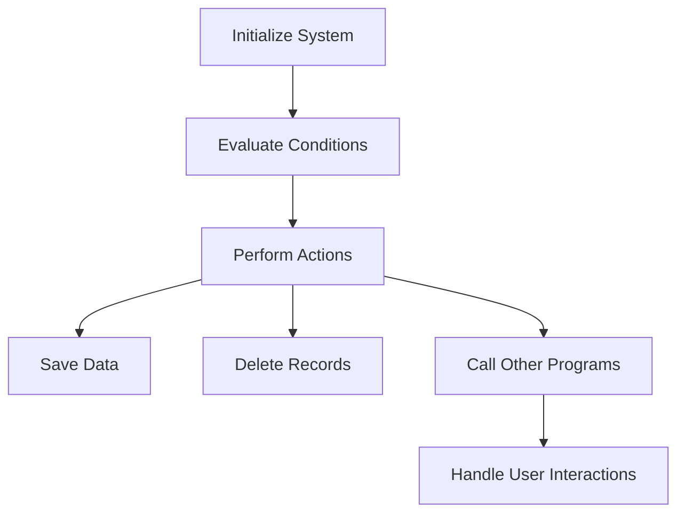

This document will cover the CHP010A Program, which includes:

1. Initializing the system
2. Evaluating conditions
3. Performing actions based on conditions

Technical document: <SwmLink doc-title="Overview of CHP010A Program">[Overview of CHP010A Program](/.swm/overview-of-chp010a-program.o0r3zcbu.sw.md)</SwmLink>

# Initializing the System

The CHP010A program begins by initializing the system. This step is crucial as it sets up the necessary environment for the program to run smoothly. Initialization involves setting up initial values, preparing data structures, and ensuring that all required resources are available. This step ensures that the system is in a known state before any further actions are taken.

# Evaluating Conditions

After initialization, the program evaluates various conditions to determine the next steps. This involves checking the current state of the application and deciding what actions need to be taken. For example, the program might check if certain flags are set, indicating that specific actions like saving data or deleting records need to be performed. This step ensures that the program responds appropriately to the current state of the application.

# Performing Actions Based on Conditions

Based on the evaluated conditions, the program performs various actions. These actions can include saving data, deleting records, or calling other programs. For instance, if a save flag is set, the program will execute the necessary steps to save the data. If a delete flag is set, it will perform the steps to delete the records. Additionally, the program can call other programs to handle more complex tasks or user interactions. This step ensures that the program takes the necessary actions to maintain data integrity and provide a seamless user experience.

# Handling User Interactions

The program also handles user interactions through pop-ups. Depending on the user's actions, the program can load client or vendor data, or call other programs to process the user's requests. This step is crucial for providing a responsive and interactive user experience. By handling user interactions efficiently, the program ensures that users can perform their tasks without unnecessary delays or complications.

&nbsp;

*This is an auto-generated document by Swimm AI 🌊 and has not yet been verified by a human*

<SwmMeta version="3.0.0" repo-id="Z2l0aHViJTNBJTNBa2VsbG8lM0ElM0Fzd2ltbWlv" repo-name="kello">Powered by [Swimm](/)</SwmMeta>
