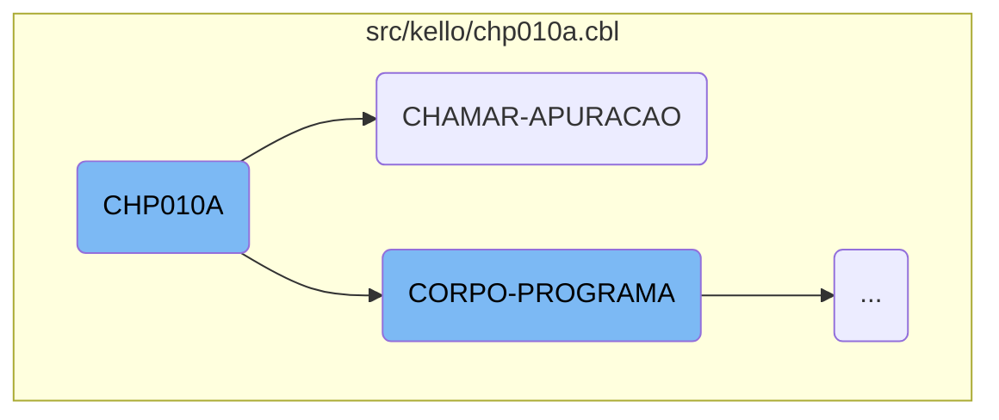
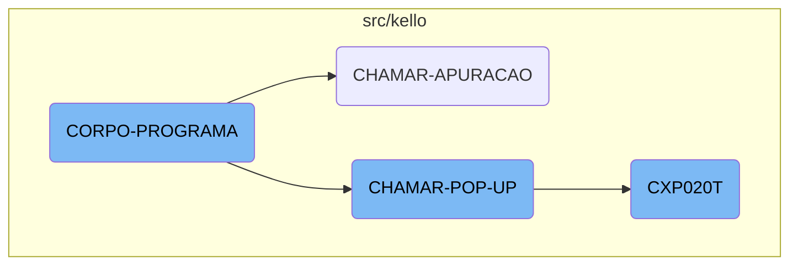

The <SwmToken path="src/kello/chp010a.cbl" pos="3:6:6" line-data="       PROGRAM-ID. CHP010A.">`CHP010A`</SwmToken> program is a crucial component of the Kello Imagens system, responsible for initializing the program, evaluating conditions, and performing various actions based on the state of the application. It interacts with other sections and programs to ensure smooth business operations.

The <SwmToken path="src/kello/chp010a.cbl" pos="3:6:6" line-data="       PROGRAM-ID. CHP010A.">`CHP010A`</SwmToken> program starts by initializing the system and then moves on to evaluate different conditions. Depending on these conditions, it performs actions like saving data, deleting records, or calling other programs. For example, it can call the <SwmToken path="src/kello/chp010a.cbl" pos="509:4:4" line-data="           CALL &quot;CXP020T&quot; USING PARAMETROS-W PASSAR-PARAMETROS">`CXP020T`</SwmToken> program to process data or handle user interactions through pop-ups. The flow ensures that all necessary steps are taken to maintain data integrity and provide a seamless user experience.

Here is a high level diagram of the flow, showing only the most important functions:

```mermaid
graph TD;
      subgraph src/kello
91243c6995cd591614b7a134cd79aa6751368012e8e58179f19f85cebd92e4bd(CHP010A):::mainFlowStyle --> 055ce2e035c7dea078732c65ad67cafe8ed54c5c145e7de88db0dd2a4263c139(CHAMAR-APURACAO)
end

subgraph src/kello
91243c6995cd591614b7a134cd79aa6751368012e8e58179f19f85cebd92e4bd(CHP010A):::mainFlowStyle --> 2b0af61319bb1bcd05756fcc17c794dc5aed212c130ba6000e2f68fbc43c1d52(CORPO-PROGRAMA):::mainFlowStyle
end

subgraph src/kello
2b0af61319bb1bcd05756fcc17c794dc5aed212c130ba6000e2f68fbc43c1d52(CORPO-PROGRAMA):::mainFlowStyle --> 055ce2e035c7dea078732c65ad67cafe8ed54c5c145e7de88db0dd2a4263c139(CHAMAR-APURACAO)
end

subgraph src/kello
2b0af61319bb1bcd05756fcc17c794dc5aed212c130ba6000e2f68fbc43c1d52(CORPO-PROGRAMA):::mainFlowStyle --> aa52f098ea64406607410ec93359fed55a621382be771bbc47748958e8686b6c(CHAMAR-POP-UP):::mainFlowStyle
end

subgraph src/kello
aa52f098ea64406607410ec93359fed55a621382be771bbc47748958e8686b6c(CHAMAR-POP-UP):::mainFlowStyle --> 50518e3031fd1bb8e53d707aa6046d787959e6027e111759e97ca65df1080b6b(CXP020T):::mainFlowStyle
end


      classDef mainFlowStyle color:#000000,fill:#7CB9F4
classDef rootsStyle color:#000000,fill:#00FFF4
classDef Style1 color:#000000,fill:#00FFAA
classDef Style2 color:#000000,fill:#FFFF00
classDef Style3 color:#000000,fill:#AA7CB9

%% Swimm:
%% graph TD;
%%       subgraph <SwmPath>[src/kello/](src/kello/)</SwmPath>
%% 91243c6995cd591614b7a134cd79aa6751368012e8e58179f19f85cebd92e4bd(CHP010A):::mainFlowStyle --> 055ce2e035c7dea078732c65ad67cafe8ed54c5c145e7de88db0dd2a4263c139(CHAMAR-APURACAO)
%% end
%% 
%% subgraph <SwmPath>[src/kello/](src/kello/)</SwmPath>
%% 91243c6995cd591614b7a134cd79aa6751368012e8e58179f19f85cebd92e4bd(CHP010A):::mainFlowStyle --> 2b0af61319bb1bcd05756fcc17c794dc5aed212c130ba6000e2f68fbc43c1d52(CORPO-PROGRAMA):::mainFlowStyle
%% end
%% 
%% subgraph <SwmPath>[src/kello/](src/kello/)</SwmPath>
%% 2b0af61319bb1bcd05756fcc17c794dc5aed212c130ba6000e2f68fbc43c1d52(CORPO-PROGRAMA):::mainFlowStyle --> 055ce2e035c7dea078732c65ad67cafe8ed54c5c145e7de88db0dd2a4263c139(CHAMAR-APURACAO)
%% end
%% 
%% subgraph <SwmPath>[src/kello/](src/kello/)</SwmPath>
%% 2b0af61319bb1bcd05756fcc17c794dc5aed212c130ba6000e2f68fbc43c1d52(CORPO-PROGRAMA):::mainFlowStyle --> aa52f098ea64406607410ec93359fed55a621382be771bbc47748958e8686b6c(CHAMAR-POP-UP):::mainFlowStyle
%% end
%% 
%% subgraph <SwmPath>[src/kello/](src/kello/)</SwmPath>
%% aa52f098ea64406607410ec93359fed55a621382be771bbc47748958e8686b6c(CHAMAR-POP-UP):::mainFlowStyle --> 50518e3031fd1bb8e53d707aa6046d787959e6027e111759e97ca65df1080b6b(CXP020T):::mainFlowStyle
%% end
%% 
%% 
%%       classDef mainFlowStyle color:#000000,fill:#7CB9F4
%% classDef rootsStyle color:#000000,fill:#00FFF4
%% classDef Style1 color:#000000,fill:#00FFAA
%% classDef Style2 color:#000000,fill:#FFFF00
%% classDef Style3 color:#000000,fill:#AA7CB9
```



# Flow drill down

First, we'll zoom into this section of the flow:



<SwmSnippet path="/src/kello/chp010a.cbl" line="172">

---

## <SwmToken path="src/kello/chp010a.cbl" pos="3:6:6" line-data="       PROGRAM-ID. CHP010A.">`CHP010A`</SwmToken>

The <SwmToken path="src/kello/chp010a.cbl" pos="3:6:6" line-data="       PROGRAM-ID. CHP010A.">`CHP010A`</SwmToken> function begins with the <SwmToken path="src/kello/chp010a.cbl" pos="172:1:3" line-data="       MAIN-PROCESS SECTION.">`MAIN-PROCESS`</SwmToken> section, which initializes the program by performing the <SwmToken path="src/kello/chp010a.cbl" pos="173:3:5" line-data="           PERFORM INICIALIZA-PROGRAMA.">`INICIALIZA-PROGRAMA`</SwmToken> section.

```cobol
       MAIN-PROCESS SECTION.
           PERFORM INICIALIZA-PROGRAMA.
```

---

</SwmSnippet>

<SwmSnippet path="/src/kello/chp010a.cbl" line="363">

---

The <SwmToken path="src/kello/chp010a.cbl" pos="363:1:3" line-data="       CORPO-PROGRAMA SECTION.">`CORPO-PROGRAMA`</SwmToken> section is evaluated to determine the next steps in the program's flow.

```cobol
       CORPO-PROGRAMA SECTION.
           EVALUATE TRUE
```

---

</SwmSnippet>

<SwmSnippet path="/src/kello/chp010a.cbl" line="508">

---

The <SwmToken path="src/kello/chp010a.cbl" pos="508:1:3" line-data="       CHAMAR-APURACAO SECTION.">`CHAMAR-APURACAO`</SwmToken> section calls the <SwmToken path="src/kello/chp010a.cbl" pos="509:4:4" line-data="           CALL &quot;CXP020T&quot; USING PARAMETROS-W PASSAR-PARAMETROS">`CXP020T`</SwmToken> program using parameters defined earlier in the code.

```cobol
       CHAMAR-APURACAO SECTION.
           CALL "CXP020T" USING PARAMETROS-W PASSAR-PARAMETROS
```

---

</SwmSnippet>

<SwmSnippet path="/src/kello/chp010a.cbl" line="511">

---

After calling <SwmToken path="src/kello/chp010a.cbl" pos="509:4:4" line-data="           CALL &quot;CXP020T&quot; USING PARAMETROS-W PASSAR-PARAMETROS">`CXP020T`</SwmToken>, the <SwmToken path="src/kello/chp010a.cbl" pos="508:1:3" line-data="       CHAMAR-APURACAO SECTION.">`CHAMAR-APURACAO`</SwmToken> section moves a substring of <SwmToken path="src/kello/chp010a.cbl" pos="511:3:7" line-data="           MOVE PASSAR-STRING-1(52: 5) TO GS-COD-APURACAO">`PASSAR-STRING-1`</SwmToken> to <SwmToken path="src/kello/chp010a.cbl" pos="511:17:21" line-data="           MOVE PASSAR-STRING-1(52: 5) TO GS-COD-APURACAO">`GS-COD-APURACAO`</SwmToken> and performs the <SwmToken path="src/kello/chp010a.cbl" pos="512:3:7" line-data="           PERFORM LE-COD-APURACAO.">`LE-COD-APURACAO`</SwmToken> section.

```cobol
           MOVE PASSAR-STRING-1(52: 5) TO GS-COD-APURACAO
           PERFORM LE-COD-APURACAO.
```

---

</SwmSnippet>

Now, lets zoom into this section of the flow:



<SwmSnippet path="/src/kello/chp010a.cbl" line="363">

---

## <SwmToken path="src/kello/chp010a.cbl" pos="363:1:3" line-data="       CORPO-PROGRAMA SECTION.">`CORPO-PROGRAMA`</SwmToken>

The <SwmToken path="src/kello/chp010a.cbl" pos="363:1:3" line-data="       CORPO-PROGRAMA SECTION.">`CORPO-PROGRAMA`</SwmToken> section is a central part of the business logic. It evaluates various conditions and performs corresponding actions. For example, it handles data saving, deletion, and validation based on different flags. This section ensures that the appropriate procedures are called depending on the state of the application.

```cobol
       CORPO-PROGRAMA SECTION.
           EVALUATE TRUE
               WHEN GS-CENTRALIZA-TRUE
                   PERFORM CENTRALIZAR
               WHEN GS-SAVE-FLG-TRUE
                   PERFORM SALVAR-DADOS
                   PERFORM REGRAVA-DADOS
                   PERFORM GRAVA-ANOTACAO
                   PERFORM LIMPAR-DADOS
                   MOVE "SET-POSICAO-CURSOR1" TO DS-PROCEDURE
                   MOVE "SET-POSICAO-CURSOR1" TO DS-PROCEDURE
               WHEN GS-EXCLUI-FLG-TRUE
                   MOVE USUARIO-W TO DIGITADOR-CH10
                   MOVE 3 TO SITUACAO-CH10
                   PERFORM EXCLUI
                   PERFORM LIMPAR-DADOS
               WHEN GS-DEVOLVIDO-FLG-TRUE
                    MOVE USUARIO-W TO DIGITADOR-CH10

                    PERFORM GRAVAR-DADOS-DEVOLVIDO
                    PERFORM CANCELA-DEVOLVIDO
```

---

</SwmSnippet>

<SwmSnippet path="/src/kello/chp010a.cbl" line="513">

---

## <SwmToken path="src/kello/chp010a.cbl" pos="513:1:5" line-data="       CHAMAR-POP-UP SECTION.">`CHAMAR-POP-UP`</SwmToken>

The <SwmToken path="src/kello/chp010a.cbl" pos="513:1:5" line-data="       CHAMAR-POP-UP SECTION.">`CHAMAR-POP-UP`</SwmToken> section is responsible for handling different <SwmToken path="src/kello/chp010a.cbl" pos="513:3:5" line-data="       CHAMAR-POP-UP SECTION.">`POP-UP`</SwmToken> options. It evaluates the <SwmToken path="src/kello/chp010a.cbl" pos="514:3:9" line-data="           EVALUATE GS-OPCAO-POP-UP">`GS-OPCAO-POP-UP`</SwmToken> variable and performs actions such as loading client or vendor data, or calling other programs like <SwmToken path="src/kello/chp010a.cbl" pos="522:8:8" line-data="             WHEN 4 CALL   &quot;CXP020T&quot; USING PARAMETROS-W PASSAR-STRING-1">`CXP020T`</SwmToken>. This section is crucial for managing user interactions through pop-ups.

```cobol
       CHAMAR-POP-UP SECTION.
           EVALUATE GS-OPCAO-POP-UP
             WHEN 1 PERFORM CARREGA-POP-UP-CLIENTE
             WHEN 2 PERFORM CARREGA-POP-UP-VENDEDOR
             WHEN 3 CALL    "CAP018T" USING PARAMETROS-W
                                            PASSAR-PARAMETROS
                    CANCEL "CAP018T"
                    MOVE PASSAR-STRING-1(1: 30) TO GS-DESCR-PORTADOR
                    MOVE PASSAR-STRING-1(33: 4) TO GS-PORTADOR
             WHEN 4 CALL   "CXP020T" USING PARAMETROS-W PASSAR-STRING-1
                    CANCEL "CXP020T"
                    MOVE PASSAR-STRING-1(52: 5) TO GS-COD-APURACAO
                    PERFORM LE-COD-APURACAO
                    MOVE DESCRICAO-CX20 TO GS-DESCR-APURACAO
             WHEN 5 CALL   "CRP001T" USING PARAMETROS-W
                                           PASSAR-PARAMETROS
                    CANCEL "CRP001T"
                    MOVE PASSAR-STRING-1(1: 30) TO GS-DESCR-SITUACAO-TIT
                    MOVE PASSAR-STRING-1(33: 2) TO GS-SITUACAO-TIT
             WHEN 6 CALL   "CHP012T" USING PARAMETROS-W
                                           PASSAR-PARAMETROS
```

---

</SwmSnippet>

<SwmSnippet path="/src/kello/cxp020t.cbl" line="72">

---

## <SwmToken path="src/kello/cxp020t.cbl" pos="74:9:9" line-data="           PERFORM CORPO-PROGRAMA UNTIL CXP020T-EXIT-FLG-TRUE.">`CXP020T`</SwmToken>

The <SwmToken path="src/kello/cxp020t.cbl" pos="74:9:9" line-data="           PERFORM CORPO-PROGRAMA UNTIL CXP020T-EXIT-FLG-TRUE.">`CXP020T`</SwmToken> program is involved in detailed data processing. It initializes the program, processes data in the <SwmToken path="src/kello/cxp020t.cbl" pos="74:3:5" line-data="           PERFORM CORPO-PROGRAMA UNTIL CXP020T-EXIT-FLG-TRUE.">`CORPO-PROGRAMA`</SwmToken> section, and handles various tasks like word localization and error message display. This program is essential for the backend processing of data and ensuring data integrity.

```cobol
       MAIN-PROCESS SECTION.
           PERFORM INICIALIZA-PROGRAMA.
           PERFORM CORPO-PROGRAMA UNTIL CXP020T-EXIT-FLG-TRUE.
           GO FINALIZAR-PROGRAMA.

       INICIALIZA-PROGRAMA SECTION.
           MOVE "00000" TO STRING-1(52: 5).
           INITIALIZE CXP020T-DATA-BLOCK
           INITIALIZE DS-CONTROL-BLOCK
           MOVE CXP020T-DATA-BLOCK-VERSION-NO
                                   TO DS-DATA-BLOCK-VERSION-NO
           MOVE CXP020T-VERSION-NO  TO DS-VERSION-NO
           MOVE EMPRESA-W          TO EMP-REC
           MOVE "CXD020"  TO ARQ-REC. MOVE EMPRESA-REF TO PATH-CXD020.
           OPEN INPUT CXD020
           IF ST-CXD020 <> "00"
              MOVE "ERRO ABERTURA CXD020: "  TO CXP020T-MENSAGEM-ERRO
              MOVE ST-CXD020 TO CXP020T-MENSAGEM-ERRO(23: 02)
              PERFORM LOAD-SCREENSET
              PERFORM CARREGA-MENSAGEM-ERRO
           ELSE PERFORM LOAD-SCREENSET.
```

---

</SwmSnippet>

# Where is this flow used?

This flow is used multiple times in the codebase as represented in the following diagram:

(Note - these are only some of the entry points of this flow)

```mermaid
graph TD;
      subgraph src/kello
407f2b8ed1363027b346f43447c12226c435ac71a035da8c7530e7697b6bcc1c(CHP052):::rootsStyle --> 6101b3683deab42bded98d29369a454dd3560bf41a3e2fe8e3af64187e6545dc(CORPO-PROGRAMA)
end

subgraph src/kello
6101b3683deab42bded98d29369a454dd3560bf41a3e2fe8e3af64187e6545dc(CORPO-PROGRAMA) --> 47a4bfbd459253849b35ffcfca6418c967e5cf86f9cfb3c58d315babb2ae3707(CHAMA-ALTERACAO)
end

subgraph src/kello
47a4bfbd459253849b35ffcfca6418c967e5cf86f9cfb3c58d315babb2ae3707(CHAMA-ALTERACAO) --> 91243c6995cd591614b7a134cd79aa6751368012e8e58179f19f85cebd92e4bd(CHP010A):::mainFlowStyle
end

subgraph src/kello
779e2973c9822b516f43dce0f1a73dd5df4ae11736fcc95b780dca5606b98ca3(CHP056):::rootsStyle --> 571dd907b0b24efbe23f3e4ae06a7c842e64b0b47cd03578656d0ca913668fe0(CORPO-PROGRAMA)
end

subgraph src/kello
571dd907b0b24efbe23f3e4ae06a7c842e64b0b47cd03578656d0ca913668fe0(CORPO-PROGRAMA) --> b80bace866b42ffcc36f7ca73fac6e42a1b504cde0945e8b2c8c0157894c1e29(CHAMA-ALTERACAO)
end

subgraph src/kello
b80bace866b42ffcc36f7ca73fac6e42a1b504cde0945e8b2c8c0157894c1e29(CHAMA-ALTERACAO) --> 91243c6995cd591614b7a134cd79aa6751368012e8e58179f19f85cebd92e4bd(CHP010A):::mainFlowStyle
end

subgraph src/kello
1facaee6ea66e06e8f20666f79331dc0e573b66e912383118bd39365b46ffb2c(CHP051):::rootsStyle --> b76ef484d394b51431d0f052ff637428a84bd08e0dccdac8fc23b7efc9e25b5d(CORPO-PROGRAMA)
end

subgraph src/kello
b76ef484d394b51431d0f052ff637428a84bd08e0dccdac8fc23b7efc9e25b5d(CORPO-PROGRAMA) --> 6d0fe9d6e39f3584bbcb96deca7957951c5d2dece3817eba2784819157bbafd3(CHAMA-ALTERACAO)
end

subgraph src/kello
6d0fe9d6e39f3584bbcb96deca7957951c5d2dece3817eba2784819157bbafd3(CHAMA-ALTERACAO) --> 91243c6995cd591614b7a134cd79aa6751368012e8e58179f19f85cebd92e4bd(CHP010A):::mainFlowStyle
end

subgraph src/kello
d639eee6a303f136621c6d6b4e1c37379b89a57e0ae622ef12909b673af48f4f(CHP070):::rootsStyle --> a3e022f10694af6076c9db64453d891c9521cebe8a462afecddb6067f3a36299(CORPO-PROGRAMA)
end

subgraph src/kello
a3e022f10694af6076c9db64453d891c9521cebe8a462afecddb6067f3a36299(CORPO-PROGRAMA) --> 75af3a244670d33775a3b8b756a5374666f5b1e1fce236173310ec1787ada96f(CHAMA-ALTERACAO)
end

subgraph src/kello
75af3a244670d33775a3b8b756a5374666f5b1e1fce236173310ec1787ada96f(CHAMA-ALTERACAO) --> 91243c6995cd591614b7a134cd79aa6751368012e8e58179f19f85cebd92e4bd(CHP010A):::mainFlowStyle
end

subgraph src/kello
60c76edec5b4ba2eaaf536b18e76e087083929a753f4f4d18b4a67e5fd30100c(MAIN-PROCESS):::rootsStyle --> 6101b3683deab42bded98d29369a454dd3560bf41a3e2fe8e3af64187e6545dc(CORPO-PROGRAMA)
end


      classDef mainFlowStyle color:#000000,fill:#7CB9F4
classDef rootsStyle color:#000000,fill:#00FFF4
classDef Style1 color:#000000,fill:#00FFAA
classDef Style2 color:#000000,fill:#FFFF00
classDef Style3 color:#000000,fill:#AA7CB9

%% Swimm:
%% graph TD;
%%       subgraph <SwmPath>[src/kello/](src/kello/)</SwmPath>
%% 407f2b8ed1363027b346f43447c12226c435ac71a035da8c7530e7697b6bcc1c(CHP052):::rootsStyle --> 6101b3683deab42bded98d29369a454dd3560bf41a3e2fe8e3af64187e6545dc(CORPO-PROGRAMA)
%% end
%% 
%% subgraph <SwmPath>[src/kello/](src/kello/)</SwmPath>
%% 6101b3683deab42bded98d29369a454dd3560bf41a3e2fe8e3af64187e6545dc(CORPO-PROGRAMA) --> 47a4bfbd459253849b35ffcfca6418c967e5cf86f9cfb3c58d315babb2ae3707(CHAMA-ALTERACAO)
%% end
%% 
%% subgraph <SwmPath>[src/kello/](src/kello/)</SwmPath>
%% 47a4bfbd459253849b35ffcfca6418c967e5cf86f9cfb3c58d315babb2ae3707(CHAMA-ALTERACAO) --> 91243c6995cd591614b7a134cd79aa6751368012e8e58179f19f85cebd92e4bd(CHP010A):::mainFlowStyle
%% end
%% 
%% subgraph <SwmPath>[src/kello/](src/kello/)</SwmPath>
%% 779e2973c9822b516f43dce0f1a73dd5df4ae11736fcc95b780dca5606b98ca3(CHP056):::rootsStyle --> 571dd907b0b24efbe23f3e4ae06a7c842e64b0b47cd03578656d0ca913668fe0(CORPO-PROGRAMA)
%% end
%% 
%% subgraph <SwmPath>[src/kello/](src/kello/)</SwmPath>
%% 571dd907b0b24efbe23f3e4ae06a7c842e64b0b47cd03578656d0ca913668fe0(CORPO-PROGRAMA) --> b80bace866b42ffcc36f7ca73fac6e42a1b504cde0945e8b2c8c0157894c1e29(CHAMA-ALTERACAO)
%% end
%% 
%% subgraph <SwmPath>[src/kello/](src/kello/)</SwmPath>
%% b80bace866b42ffcc36f7ca73fac6e42a1b504cde0945e8b2c8c0157894c1e29(CHAMA-ALTERACAO) --> 91243c6995cd591614b7a134cd79aa6751368012e8e58179f19f85cebd92e4bd(CHP010A):::mainFlowStyle
%% end
%% 
%% subgraph <SwmPath>[src/kello/](src/kello/)</SwmPath>
%% 1facaee6ea66e06e8f20666f79331dc0e573b66e912383118bd39365b46ffb2c(CHP051):::rootsStyle --> b76ef484d394b51431d0f052ff637428a84bd08e0dccdac8fc23b7efc9e25b5d(CORPO-PROGRAMA)
%% end
%% 
%% subgraph <SwmPath>[src/kello/](src/kello/)</SwmPath>
%% b76ef484d394b51431d0f052ff637428a84bd08e0dccdac8fc23b7efc9e25b5d(CORPO-PROGRAMA) --> 6d0fe9d6e39f3584bbcb96deca7957951c5d2dece3817eba2784819157bbafd3(CHAMA-ALTERACAO)
%% end
%% 
%% subgraph <SwmPath>[src/kello/](src/kello/)</SwmPath>
%% 6d0fe9d6e39f3584bbcb96deca7957951c5d2dece3817eba2784819157bbafd3(CHAMA-ALTERACAO) --> 91243c6995cd591614b7a134cd79aa6751368012e8e58179f19f85cebd92e4bd(CHP010A):::mainFlowStyle
%% end
%% 
%% subgraph <SwmPath>[src/kello/](src/kello/)</SwmPath>
%% d639eee6a303f136621c6d6b4e1c37379b89a57e0ae622ef12909b673af48f4f(CHP070):::rootsStyle --> a3e022f10694af6076c9db64453d891c9521cebe8a462afecddb6067f3a36299(CORPO-PROGRAMA)
%% end
%% 
%% subgraph <SwmPath>[src/kello/](src/kello/)</SwmPath>
%% a3e022f10694af6076c9db64453d891c9521cebe8a462afecddb6067f3a36299(CORPO-PROGRAMA) --> 75af3a244670d33775a3b8b756a5374666f5b1e1fce236173310ec1787ada96f(CHAMA-ALTERACAO)
%% end
%% 
%% subgraph <SwmPath>[src/kello/](src/kello/)</SwmPath>
%% 75af3a244670d33775a3b8b756a5374666f5b1e1fce236173310ec1787ada96f(CHAMA-ALTERACAO) --> 91243c6995cd591614b7a134cd79aa6751368012e8e58179f19f85cebd92e4bd(CHP010A):::mainFlowStyle
%% end
%% 
%% subgraph <SwmPath>[src/kello/](src/kello/)</SwmPath>
%% 60c76edec5b4ba2eaaf536b18e76e087083929a753f4f4d18b4a67e5fd30100c(MAIN-PROCESS):::rootsStyle --> 6101b3683deab42bded98d29369a454dd3560bf41a3e2fe8e3af64187e6545dc(CORPO-PROGRAMA)
%% end
%% 
%% 
%%       classDef mainFlowStyle color:#000000,fill:#7CB9F4
%% classDef rootsStyle color:#000000,fill:#00FFF4
%% classDef Style1 color:#000000,fill:#00FFAA
%% classDef Style2 color:#000000,fill:#FFFF00
%% classDef Style3 color:#000000,fill:#AA7CB9
```



&nbsp;

*This is an auto-generated document by Swimm AI 🌊 and has not yet been verified by a human*

<SwmMeta version="3.0.0" repo-id="Z2l0aHViJTNBJTNBa2VsbG8lM0ElM0Fzd2ltbWlv" repo-name="kello"><sup>Powered by [Swimm](/)</sup></SwmMeta>
