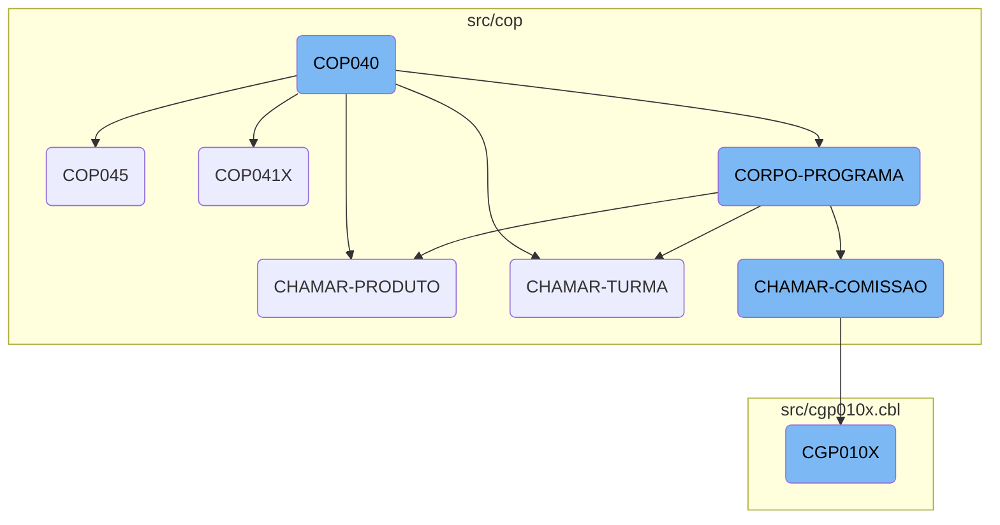
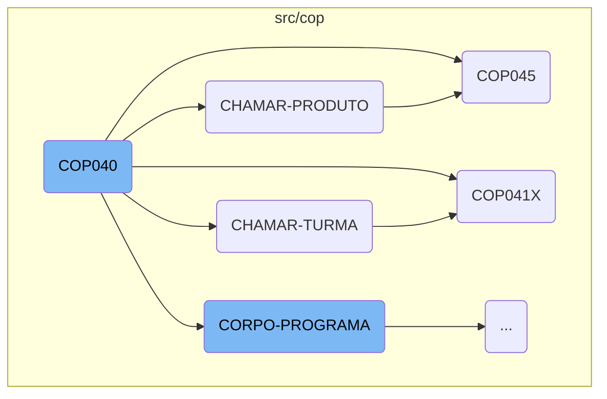
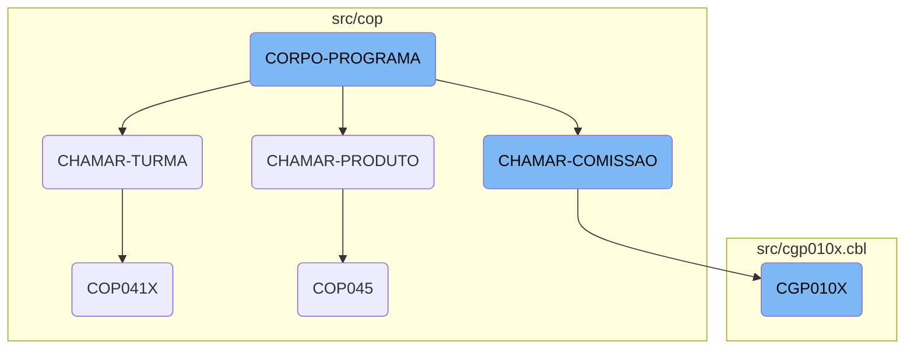

The <SwmToken path="src/cop/cop040.cbl" pos="3:6:6" line-data="       PROGRAM-ID. COP040.">`COP040`</SwmToken> process is a central part of the business operations management system. It initializes the program, performs core logic repeatedly, and calls various other sections to handle specific tasks. This ensures modularity and separation of concerns, making the system more maintainable and scalable.

The <SwmToken path="src/cop/cop040.cbl" pos="3:6:6" line-data="       PROGRAM-ID. COP040.">`COP040`</SwmToken> process starts by initializing the program and then enters a loop where it performs the main program logic. This logic includes evaluating conditions and performing actions like centralizing data, saving records, and calling other sections. These sections handle specific tasks such as managing products, classes, and commissions. By breaking down the tasks into smaller sections, the system can efficiently manage different aspects of business operations.

Here is a high level diagram of the flow, showing only the most important functions:



# Flow drill down

First, we'll zoom into this section of the flow:



<SwmSnippet path="/src/cop/cop040.cbl" line="190">

---

## Main Process

The <SwmToken path="src/cop/cop040.cbl" pos="3:6:6" line-data="       PROGRAM-ID. COP040.">`COP040`</SwmToken> function starts with the <SwmToken path="src/cop/cop040.cbl" pos="190:1:3" line-data="       MAIN-PROCESS SECTION.">`MAIN-PROCESS`</SwmToken> section, which initializes the program and then performs the <SwmToken path="src/cop/cop040.cbl" pos="192:3:5" line-data="           PERFORM CORPO-PROGRAMA UNTIL GS-EXIT-FLG-TRUE.">`CORPO-PROGRAMA`</SwmToken> section until the exit flag is true. This is the main loop of the function, ensuring that the core logic is repeatedly executed as needed.

```cobol
       MAIN-PROCESS SECTION.
           PERFORM INICIALIZA-PROGRAMA.
           PERFORM CORPO-PROGRAMA UNTIL GS-EXIT-FLG-TRUE.
```

---

</SwmSnippet>

<SwmSnippet path="/src/cop/cop040.cbl" line="512">

---

## Calling Other Sections

Within the <SwmToken path="src/cop/cop040.cbl" pos="192:3:5" line-data="           PERFORM CORPO-PROGRAMA UNTIL GS-EXIT-FLG-TRUE.">`CORPO-PROGRAMA`</SwmToken> section, the <SwmToken path="src/cop/cop040.cbl" pos="3:6:6" line-data="       PROGRAM-ID. COP040.">`COP040`</SwmToken> function calls several other sections such as <SwmToken path="src/cop/cop040.cbl" pos="512:1:3" line-data="       CHAMAR-COMISSAO SECTION.">`CHAMAR-COMISSAO`</SwmToken>, <SwmToken path="src/cop/cop040.cbl" pos="515:1:3" line-data="       CHAMAR-TURMA SECTION.">`CHAMAR-TURMA`</SwmToken>, and <SwmToken path="src/cop/cop040.cbl" pos="519:1:3" line-data="       CHAMAR-PRODUTO SECTION.">`CHAMAR-PRODUTO`</SwmToken>. These calls are crucial as they delegate specific tasks to other functions, ensuring modularity and separation of concerns.

```cobol
       CHAMAR-COMISSAO SECTION.
           CALL   "CGP010X" USING PARAMETROS-W PASSAR-PARAMETROS
           CANCEL "CGP010X".
       CHAMAR-TURMA SECTION.
           MOVE PARAMETROS-W TO PASSAR-PARAMETROS
           CALL   "COP041X" USING PARAMETROS-W PASSAR-PARAMETROS
```

---

</SwmSnippet>

<SwmSnippet path="/src/cop/cop040.cbl" line="519">

---

### <SwmToken path="src/cop/cop040.cbl" pos="519:1:3" line-data="       CHAMAR-PRODUTO SECTION.">`CHAMAR-PRODUTO`</SwmToken>

The <SwmToken path="src/cop/cop040.cbl" pos="519:1:3" line-data="       CHAMAR-PRODUTO SECTION.">`CHAMAR-PRODUTO`</SwmToken> section is responsible for preparing and calling the <SwmToken path="src/cop/cop040.cbl" pos="522:4:4" line-data="           CALL   &quot;COP045&quot; USING PARAMETROS-W PASSAR-PARAMETROS">`COP045`</SwmToken> function. It moves necessary data into <SwmToken path="src/cop/cop040.cbl" pos="520:7:11" line-data="           MOVE SPACES         TO PASSAR-STRING-1">`PASSAR-STRING-1`</SwmToken> and then calls <SwmToken path="src/cop/cop040.cbl" pos="522:4:4" line-data="           CALL   &quot;COP045&quot; USING PARAMETROS-W PASSAR-PARAMETROS">`COP045`</SwmToken> using the parameters.

```cobol
       CHAMAR-PRODUTO SECTION.
           MOVE SPACES         TO PASSAR-STRING-1
           MOVE GS-CONTRATO    TO PASSAR-STRING-1(1: 4)
           CALL   "COP045" USING PARAMETROS-W PASSAR-PARAMETROS
           CANCEL "COP045".
```

---

</SwmSnippet>

<SwmSnippet path="/src/cop/cop040.cbl" line="515">

---

### <SwmToken path="src/cop/cop040.cbl" pos="515:1:3" line-data="       CHAMAR-TURMA SECTION.">`CHAMAR-TURMA`</SwmToken>

The <SwmToken path="src/cop/cop040.cbl" pos="515:1:3" line-data="       CHAMAR-TURMA SECTION.">`CHAMAR-TURMA`</SwmToken> section prepares parameters and calls the <SwmToken path="src/cop/cop040.cbl" pos="517:4:4" line-data="           CALL   &quot;COP041X&quot; USING PARAMETROS-W PASSAR-PARAMETROS">`COP041X`</SwmToken> function. This section is essential for handling tasks related to 'turma' (class or group).

```cobol
       CHAMAR-TURMA SECTION.
           MOVE PARAMETROS-W TO PASSAR-PARAMETROS
           CALL   "COP041X" USING PARAMETROS-W PASSAR-PARAMETROS
           CANCEL "COP041X".
```

---

</SwmSnippet>

<SwmSnippet path="/src/cop/cop045.cbl" line="148">

---

### <SwmToken path="src/cop/cop040.cbl" pos="522:4:4" line-data="           CALL   &quot;COP045&quot; USING PARAMETROS-W PASSAR-PARAMETROS">`COP045`</SwmToken>

The <SwmToken path="src/cop/cop040.cbl" pos="522:4:4" line-data="           CALL   &quot;COP045&quot; USING PARAMETROS-W PASSAR-PARAMETROS">`COP045`</SwmToken> function starts with the <SwmToken path="src/cop/cop045.cbl" pos="148:1:3" line-data="       MAIN-PROCESS SECTION.">`MAIN-PROCESS`</SwmToken> section, which initializes the program and then performs the <SwmToken path="src/cop/cop045.cbl" pos="150:3:5" line-data="           PERFORM CORPO-PROGRAMA UNTIL GS-EXIT-FLG-TRUE.">`CORPO-PROGRAMA`</SwmToken> section until the exit flag is true. This structure is similar to <SwmToken path="src/cop/cop040.cbl" pos="3:6:6" line-data="       PROGRAM-ID. COP040.">`COP040`</SwmToken>, ensuring that the core logic is repeatedly executed.

```cobol
       MAIN-PROCESS SECTION.
           PERFORM INICIALIZA-PROGRAMA.
           PERFORM CORPO-PROGRAMA UNTIL GS-EXIT-FLG-TRUE.
```

---

</SwmSnippet>

<SwmSnippet path="/src/cop/cop041x.cbl" line="146">

---

### <SwmToken path="src/cop/cop040.cbl" pos="517:4:4" line-data="           CALL   &quot;COP041X&quot; USING PARAMETROS-W PASSAR-PARAMETROS">`COP041X`</SwmToken>

The <SwmToken path="src/cop/cop040.cbl" pos="517:4:4" line-data="           CALL   &quot;COP041X&quot; USING PARAMETROS-W PASSAR-PARAMETROS">`COP041X`</SwmToken> function also follows a similar structure with a <SwmToken path="src/cop/cop041x.cbl" pos="146:1:3" line-data="       MAIN-PROCESS SECTION.">`MAIN-PROCESS`</SwmToken> section that initializes the program and performs the <SwmToken path="src/cop/cop040.cbl" pos="192:3:5" line-data="           PERFORM CORPO-PROGRAMA UNTIL GS-EXIT-FLG-TRUE.">`CORPO-PROGRAMA`</SwmToken> section until the exit flag is true. This ensures consistent execution of the core logic.

```cobol
       MAIN-PROCESS SECTION.
           MOVE STRING-1 TO PARAMETROS-W
           PERFORM INICIALIZA-PROGRAMA.
```

---

</SwmSnippet>

Now, lets zoom into this section of the flow:



<SwmSnippet path="/src/cop/cop040.cbl" line="285">

---

## <SwmToken path="src/cop/cop040.cbl" pos="285:1:3" line-data="       CORPO-PROGRAMA SECTION.">`CORPO-PROGRAMA`</SwmToken>

The <SwmToken path="src/cop/cop040.cbl" pos="285:1:3" line-data="       CORPO-PROGRAMA SECTION.">`CORPO-PROGRAMA`</SwmToken> section is a central part of the business logic, handling various operations based on different conditions. It evaluates multiple flags and performs corresponding actions such as centralizing data, saving records, loading data, and calling other sections like <SwmToken path="src/cop/cop040.cbl" pos="512:1:3" line-data="       CHAMAR-COMISSAO SECTION.">`CHAMAR-COMISSAO`</SwmToken>, <SwmToken path="src/cop/cop040.cbl" pos="515:1:3" line-data="       CHAMAR-TURMA SECTION.">`CHAMAR-TURMA`</SwmToken>, and <SwmToken path="src/cop/cop040.cbl" pos="519:1:3" line-data="       CHAMAR-PRODUTO SECTION.">`CHAMAR-PRODUTO`</SwmToken>. This section ensures that the appropriate business processes are executed based on the current state and user inputs.

```cobol
       CORPO-PROGRAMA SECTION.
           EVALUATE TRUE
               WHEN GS-CENTRALIZA-TRUE
                   PERFORM CENTRALIZAR
                   PERFORM PREENCHER-SELECTION-BOX
               WHEN GS-SAVE-FLG-TRUE
                    PERFORM SALVAR-DADOS
                    IF GS-TIPO-GRAVACAO = 1
                       PERFORM REGRAVA-DADOS
                    ELSE
                       PERFORM GRAVA-DADOS
                    END-IF
                    CLOSE    COD049
                    OPEN I-O COD049
                    MOVE GS-CONTRATO TO NR-CONTRATO-CO49
                    READ COD049 INVALID KEY
                         MOVE GS-CONTRATO  TO NR-CONTRATO-CO49
                         MOVE GS-ENCERRADO TO CANCELADO-CO49
                         MOVE GS-USUARIO-CADASTRO TO
                                              USUARIO-CADASTRO-CO49
                         MOVE GS-DATA-CADASTRO TO DATA-CADASTRO-CO49
```

---

</SwmSnippet>

<SwmSnippet path="/src/cop/cop040.cbl" line="511">

---

## <SwmToken path="src/cop/cop040.cbl" pos="512:1:3" line-data="       CHAMAR-COMISSAO SECTION.">`CHAMAR-COMISSAO`</SwmToken>

The <SwmToken path="src/cop/cop040.cbl" pos="512:1:3" line-data="       CHAMAR-COMISSAO SECTION.">`CHAMAR-COMISSAO`</SwmToken> section is responsible for calling the <SwmToken path="src/cop/cop040.cbl" pos="513:4:4" line-data="           CALL   &quot;CGP010X&quot; USING PARAMETROS-W PASSAR-PARAMETROS">`CGP010X`</SwmToken> program using specific parameters. This section facilitates the transition to the commission-related processes, ensuring that the necessary data is passed and the appropriate program is executed.

```cobol
           CANCEL "COP060X".
       CHAMAR-COMISSAO SECTION.
           CALL   "CGP010X" USING PARAMETROS-W PASSAR-PARAMETROS
           CANCEL "CGP010X".
```

---

</SwmSnippet>

<SwmSnippet path="/src/cgp010x.cbl" line="120">

---

## <SwmToken path="src/cop/cop040.cbl" pos="513:4:4" line-data="           CALL   &quot;CGP010X&quot; USING PARAMETROS-W PASSAR-PARAMETROS">`CGP010X`</SwmToken>

The <SwmToken path="src/cop/cop040.cbl" pos="513:4:4" line-data="           CALL   &quot;CGP010X&quot; USING PARAMETROS-W PASSAR-PARAMETROS">`CGP010X`</SwmToken> program handles various operations related to commissions. It initializes the program, processes data, and performs multiple actions such as reading and writing records, handling errors, and refreshing objects. This program is called by the <SwmToken path="src/cop/cop040.cbl" pos="512:1:3" line-data="       CHAMAR-COMISSAO SECTION.">`CHAMAR-COMISSAO`</SwmToken> section and plays a crucial role in managing commission-related data and processes.

```cobol
       MAIN-PROCESS SECTION.
           PERFORM INICIALIZA-PROGRAMA.
           PERFORM CORPO-PROGRAMA UNTIL GS-EXIT-FLG-TRUE.
           GO FINALIZAR-PROGRAMA.

       INICIALIZA-PROGRAMA SECTION.
      *    ACCEPT PARAMETROS-W FROM COMMAND-LINE.
           COPY "CBDATA1.CPY".
           MOVE ZEROS TO PAGE-COUNT ERRO-W.
           INITIALIZE GS-DATA-BLOCK
           INITIALIZE DS-CONTROL-BLOCK
           MOVE GS-DATA-BLOCK-VERSION-NO
                                   TO DS-DATA-BLOCK-VERSION-NO
           MOVE GS-VERSION-NO      TO DS-VERSION-NO
           MOVE EMPRESA-W          TO EMP-REC
           MOVE NOME-EMPRESA-W     TO EMPRESA-REL
           MOVE "CGD010" TO ARQ-REC.  MOVE EMPRESA-REF TO PATH-CGD010.
           MOVE "CGD011" TO ARQ-REC.  MOVE EMPRESA-REF TO PATH-CGD011.
           MOVE "CGD012" TO ARQ-REC.  MOVE EMPRESA-REF TO PATH-CGD012.
           MOVE "CAD010" TO ARQ-REC.  MOVE EMPRESA-REF TO PATH-CAD010.
           MOVE "IED011" TO ARQ-REC.  MOVE EMPRESA-REF TO PATH-IED011.
```

---

</SwmSnippet>

&nbsp;

*This is an auto-generated document by Swimm AI 🌊 and has not yet been verified by a human*

<SwmMeta version="3.0.0" repo-id="Z2l0aHViJTNBJTNBa2VsbG8lM0ElM0Fzd2ltbWlv" repo-name="kello"><sup>Powered by [Swimm](/)</sup></SwmMeta>
