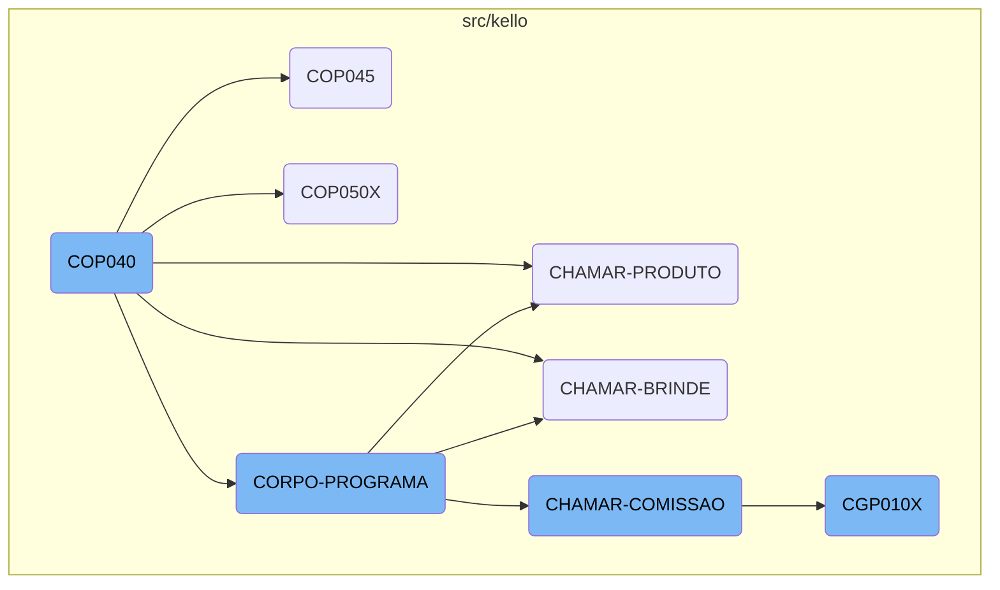
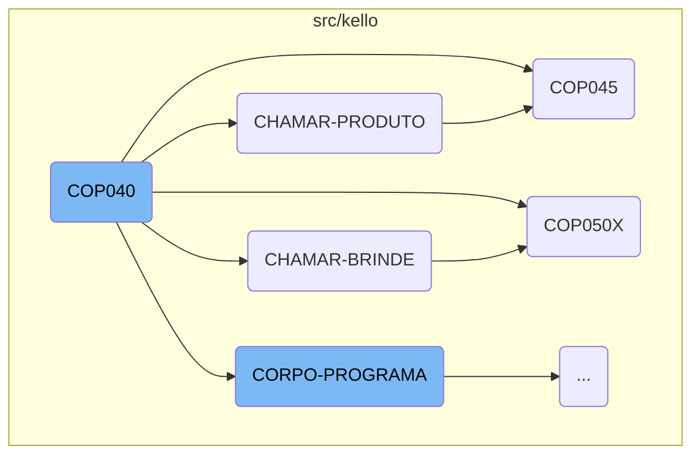
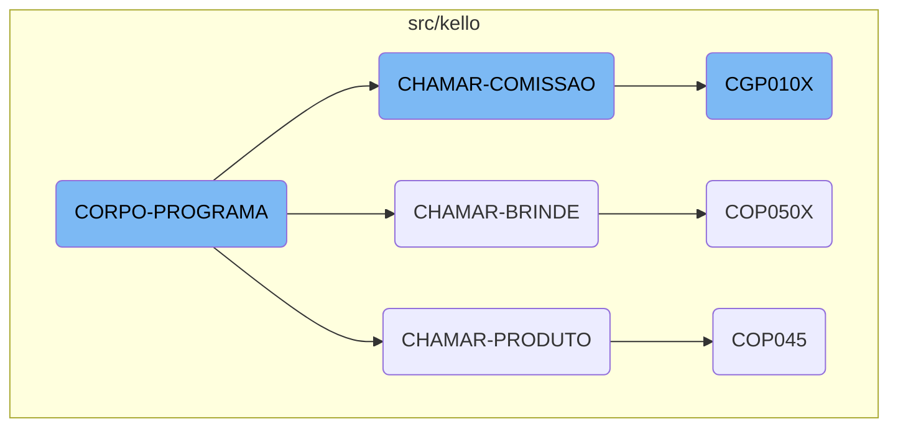

The <SwmToken path="src/kello/cop040.cbl" pos="3:6:6" line-data="       PROGRAM-ID. COP040.">`COP040`</SwmToken> program is a central component of the Kello Imagens business operations management system. It serves as the main entry point for the flow, initializing the program and repeatedly performing the <SwmToken path="src/kello/cop040.cbl" pos="192:3:5" line-data="           PERFORM CORPO-PROGRAMA UNTIL GS-EXIT-FLG-TRUE.">`CORPO-PROGRAMA`</SwmToken> section until a termination flag is set. This document provides an overview of the <SwmToken path="src/kello/cop040.cbl" pos="3:6:6" line-data="       PROGRAM-ID. COP040.">`COP040`</SwmToken> program, its main sections, and how it interacts with other components.

The <SwmToken path="src/kello/cop040.cbl" pos="3:6:6" line-data="       PROGRAM-ID. COP040.">`COP040`</SwmToken> program starts by initializing the system and then repeatedly runs the main body of the program (CORPO-PROGRAMA) until it's told to stop. During this process, it performs various tasks such as handling products, gifts, and commissions by calling other programs like <SwmToken path="src/kello/cop040.cbl" pos="522:4:4" line-data="           CALL   &quot;COP045&quot; USING PARAMETROS-W PASSAR-PARAMETROS">`COP045`</SwmToken> and <SwmToken path="src/kello/cop040.cbl" pos="503:4:4" line-data="           CALL   &quot;COP050X&quot; USING PARAMETROS-W PASSAR-PARAMETROS">`COP050X`</SwmToken>. It also manages data operations and evaluates different conditions to decide what actions to take, ensuring that the system runs smoothly and efficiently.

Here is a high level diagram of the flow, showing only the most important functions:



# Flow drill down

First, we'll zoom into this section of the flow:



<SwmSnippet path="/src/kello/cop040.cbl" line="190">

---

## <SwmToken path="src/kello/cop040.cbl" pos="3:6:6" line-data="       PROGRAM-ID. COP040.">`COP040`</SwmToken>

The <SwmToken path="src/kello/cop040.cbl" pos="3:6:6" line-data="       PROGRAM-ID. COP040.">`COP040`</SwmToken> function is the main entry point of the flow. It initializes the program and repeatedly performs the <SwmToken path="src/kello/cop040.cbl" pos="192:3:5" line-data="           PERFORM CORPO-PROGRAMA UNTIL GS-EXIT-FLG-TRUE.">`CORPO-PROGRAMA`</SwmToken> section until a termination flag is set.

```cobol
       MAIN-PROCESS SECTION.
           PERFORM INICIALIZA-PROGRAMA.
           PERFORM CORPO-PROGRAMA UNTIL GS-EXIT-FLG-TRUE.
```

---

</SwmSnippet>

<SwmSnippet path="/src/kello/cop040.cbl" line="519">

---

## <SwmToken path="src/kello/cop040.cbl" pos="519:1:3" line-data="       CHAMAR-PRODUTO SECTION.">`CHAMAR-PRODUTO`</SwmToken>

The <SwmToken path="src/kello/cop040.cbl" pos="519:1:3" line-data="       CHAMAR-PRODUTO SECTION.">`CHAMAR-PRODUTO`</SwmToken> function prepares and calls the <SwmToken path="src/kello/cop040.cbl" pos="522:4:4" line-data="           CALL   &quot;COP045&quot; USING PARAMETROS-W PASSAR-PARAMETROS">`COP045`</SwmToken> program. It moves necessary data into <SwmToken path="src/kello/cop040.cbl" pos="520:7:11" line-data="           MOVE SPACES         TO PASSAR-STRING-1">`PASSAR-STRING-1`</SwmToken> and then calls <SwmToken path="src/kello/cop040.cbl" pos="522:4:4" line-data="           CALL   &quot;COP045&quot; USING PARAMETROS-W PASSAR-PARAMETROS">`COP045`</SwmToken> using the parameters.

```cobol
       CHAMAR-PRODUTO SECTION.
           MOVE SPACES         TO PASSAR-STRING-1
           MOVE GS-CONTRATO    TO PASSAR-STRING-1(1: 4)
           CALL   "COP045" USING PARAMETROS-W PASSAR-PARAMETROS
           CANCEL "COP045".
```

---

</SwmSnippet>

<SwmSnippet path="/src/kello/cop045.cbl" line="148">

---

## <SwmToken path="src/kello/cop040.cbl" pos="522:4:4" line-data="           CALL   &quot;COP045&quot; USING PARAMETROS-W PASSAR-PARAMETROS">`COP045`</SwmToken>

The <SwmToken path="src/kello/cop040.cbl" pos="522:4:4" line-data="           CALL   &quot;COP045&quot; USING PARAMETROS-W PASSAR-PARAMETROS">`COP045`</SwmToken> function is responsible for handling product-related operations. It initializes the program and performs the main processing loop until a termination flag is set.

```cobol
       MAIN-PROCESS SECTION.
           PERFORM INICIALIZA-PROGRAMA.
           PERFORM CORPO-PROGRAMA UNTIL GS-EXIT-FLG-TRUE.
           GO FINALIZAR-PROGRAMA.
```

---

</SwmSnippet>

<SwmSnippet path="/src/kello/cop040.cbl" line="498">

---

## <SwmToken path="src/kello/cop040.cbl" pos="498:1:3" line-data="       CHAMAR-BRINDE SECTION.">`CHAMAR-BRINDE`</SwmToken>

The <SwmToken path="src/kello/cop040.cbl" pos="498:1:3" line-data="       CHAMAR-BRINDE SECTION.">`CHAMAR-BRINDE`</SwmToken> function prepares and calls the <SwmToken path="src/kello/cop040.cbl" pos="503:4:4" line-data="           CALL   &quot;COP050X&quot; USING PARAMETROS-W PASSAR-PARAMETROS">`COP050X`</SwmToken> program. It moves necessary data into <SwmToken path="src/kello/cop040.cbl" pos="499:9:13" line-data="           MOVE GS-CONTRATO    TO PASSAR-STRING-1(1: 4)">`PASSAR-STRING-1`</SwmToken> and then calls <SwmToken path="src/kello/cop040.cbl" pos="503:4:4" line-data="           CALL   &quot;COP050X&quot; USING PARAMETROS-W PASSAR-PARAMETROS">`COP050X`</SwmToken> using the parameters.

```cobol
       CHAMAR-BRINDE SECTION.
           MOVE GS-CONTRATO    TO PASSAR-STRING-1(1: 4)
           MOVE 0000           TO PASSAR-STRING-1(5: 4)
           MOVE IMPRESSORA-W   TO PASSAR-STRING-1(9: 2)
           MOVE COD-USUARIO-W  TO PASSAR-STRING-1(11: 3)
           CALL   "COP050X" USING PARAMETROS-W PASSAR-PARAMETROS
           CANCEL "COP050X".
```

---

</SwmSnippet>

<SwmSnippet path="/src/kello/cop050x.cbl" line="177">

---

## <SwmToken path="src/kello/cop040.cbl" pos="503:4:4" line-data="           CALL   &quot;COP050X&quot; USING PARAMETROS-W PASSAR-PARAMETROS">`COP050X`</SwmToken>

The <SwmToken path="src/kello/cop040.cbl" pos="503:4:4" line-data="           CALL   &quot;COP050X&quot; USING PARAMETROS-W PASSAR-PARAMETROS">`COP050X`</SwmToken> function is responsible for handling gift-related operations. It initializes the program and performs the main processing loop until a termination flag is set.

```cobol
       MAIN-PROCESS SECTION.
           PERFORM INICIALIZA-PROGRAMA.
           PERFORM CORPO-PROGRAMA UNTIL GS-EXIT-FLG-TRUE.
```

---

</SwmSnippet>

Now, lets zoom into this section of the flow:



<SwmSnippet path="/src/kello/cop040.cbl" line="285">

---

## <SwmToken path="src/kello/cop040.cbl" pos="285:1:3" line-data="       CORPO-PROGRAMA SECTION.">`CORPO-PROGRAMA`</SwmToken>

The <SwmToken path="src/kello/cop040.cbl" pos="285:1:3" line-data="       CORPO-PROGRAMA SECTION.">`CORPO-PROGRAMA`</SwmToken> section is a central part of the business logic. It evaluates various conditions and performs corresponding actions such as centralizing data, saving records, loading data, and handling different flags. This section ensures that the appropriate operations are executed based on the state of the system.

```cobol
       CORPO-PROGRAMA SECTION.
           EVALUATE TRUE
               WHEN GS-CENTRALIZA-TRUE
                   PERFORM CENTRALIZAR
                   PERFORM PREENCHER-SELECTION-BOX
               WHEN GS-SAVE-FLG-TRUE
                    PERFORM SALVAR-DADOS
                    IF GS-TIPO-GRAVACAO = 1
                       PERFORM REGRAVA-DADOS
                    ELSE
                       PERFORM GRAVA-DADOS
                    END-IF
                    CLOSE    COD049
                    OPEN I-O COD049
                    MOVE GS-CONTRATO TO NR-CONTRATO-CO49
                    READ COD049 INVALID KEY
                         MOVE GS-CONTRATO  TO NR-CONTRATO-CO49
                         MOVE GS-ENCERRADO TO CANCELADO-CO49
                         MOVE GS-USUARIO-CADASTRO TO
                                              USUARIO-CADASTRO-CO49
                         MOVE GS-DATA-CADASTRO TO DATA-CADASTRO-CO49
```

---

</SwmSnippet>

<SwmSnippet path="/src/kello/cop040.cbl" line="297">

---

### Handling Data Operations

This part of the <SwmToken path="src/kello/cop040.cbl" pos="192:3:5" line-data="           PERFORM CORPO-PROGRAMA UNTIL GS-EXIT-FLG-TRUE.">`CORPO-PROGRAMA`</SwmToken> handles opening, reading, writing, and closing the <SwmToken path="src/kello/cop040.cbl" pos="297:3:3" line-data="                    CLOSE    COD049">`COD049`</SwmToken> file. It moves data between global storage and the file, ensuring that the contract information is correctly updated and saved.

```cobol
                    CLOSE    COD049
                    OPEN I-O COD049
                    MOVE GS-CONTRATO TO NR-CONTRATO-CO49
                    READ COD049 INVALID KEY
                         MOVE GS-CONTRATO  TO NR-CONTRATO-CO49
                         MOVE GS-ENCERRADO TO CANCELADO-CO49
                         MOVE GS-USUARIO-CADASTRO TO
                                              USUARIO-CADASTRO-CO49
                         MOVE GS-DATA-CADASTRO TO DATA-CADASTRO-CO49
                         MOVE GS-HORA-CADASTRO TO HORA-CADASTRO-CO49
                         MOVE GS-PREPOSTO      TO PREPOSTO-CO49
                         WRITE REG-COD049
                         END-WRITE
                    NOT INVALID KEY
                         MOVE GS-CONTRATO  TO NR-CONTRATO-CO49
                         MOVE GS-ENCERRADO TO CANCELADO-CO49
                         IF USUARIO-CADASTRO-CO49 = SPACES
                            MOVE GS-USUARIO-CADASTRO TO
                                 USUARIO-CADASTRO-CO49
                            MOVE ZEROS TO DATA-CADASTRO-CO49
                                          HORA-CADASTRO-CO49
```

---

</SwmSnippet>

<SwmSnippet path="/src/kello/cop040.cbl" line="332">

---

### Managing Flags

This segment of the <SwmToken path="src/kello/cop040.cbl" pos="192:3:5" line-data="           PERFORM CORPO-PROGRAMA UNTIL GS-EXIT-FLG-TRUE.">`CORPO-PROGRAMA`</SwmToken> evaluates various flags and performs corresponding actions. For example, it calls different sections like <SwmToken path="src/kello/cop040.cbl" pos="333:3:5" line-data="                    PERFORM CARREGAR-DADOS">`CARREGAR-DADOS`</SwmToken>, <SwmToken path="src/kello/cop040.cbl" pos="334:5:5" line-data="               WHEN GS-EXCLUI-FLG-TRUE">`EXCLUI`</SwmToken>, <SwmToken path="src/kello/cop040.cbl" pos="498:1:3" line-data="       CHAMAR-BRINDE SECTION.">`CHAMAR-BRINDE`</SwmToken>, and <SwmToken path="src/kello/cop040.cbl" pos="512:1:3" line-data="       CHAMAR-COMISSAO SECTION.">`CHAMAR-COMISSAO`</SwmToken> based on the flags set in the system. This ensures that the correct procedures are followed for each specific condition.

```cobol
               WHEN GS-LOAD-FLG-TRUE
                    PERFORM CARREGAR-DADOS
               WHEN GS-EXCLUI-FLG-TRUE
                    PERFORM EXCLUI
                    PERFORM LIMPAR-DADOS
               WHEN GS-CLR-FLG-TRUE
                    PERFORM LIMPAR-DADOS
               WHEN GS-PRINTER-FLG-TRUE
                    COPY IMPRESSORA.CHAMA.
                    IF LNK-MAPEAMENTO <> SPACES
                       PERFORM IMPRIME-RELATORIO
                    END-IF
               WHEN GS-LE-INSTITUICAO-TRUE
                    PERFORM LE-INSTITUICAO
               WHEN GS-LE-REPRES-TRUE
                    PERFORM LE-REPRES
               WHEN GS-LE-CIDADE-TRUE
                    PERFORM LE-CIDADE
               WHEN GS-LE-STATUS-TRUE
                    PERFORM LE-STATUS
               WHEN GS-LE-PREPOSTO-TRUE
```

---

</SwmSnippet>

<SwmSnippet path="/src/kello/cop040.cbl" line="511">

---

## <SwmToken path="src/kello/cop040.cbl" pos="512:1:3" line-data="       CHAMAR-COMISSAO SECTION.">`CHAMAR-COMISSAO`</SwmToken>

The <SwmToken path="src/kello/cop040.cbl" pos="512:1:3" line-data="       CHAMAR-COMISSAO SECTION.">`CHAMAR-COMISSAO`</SwmToken> section is responsible for calling the <SwmToken path="src/kello/cop040.cbl" pos="513:4:4" line-data="           CALL   &quot;CGP010X&quot; USING PARAMETROS-W PASSAR-PARAMETROS">`CGP010X`</SwmToken> program using specific parameters. This section handles the commission-related operations by invoking the external program and passing the necessary data.

```cobol
           CANCEL "COP060X".
       CHAMAR-COMISSAO SECTION.
           CALL   "CGP010X" USING PARAMETROS-W PASSAR-PARAMETROS
           CANCEL "CGP010X".
```

---

</SwmSnippet>

<SwmSnippet path="/src/kello/cgp010x.cbl" line="2">

---

## <SwmToken path="src/kello/cgp010x.cbl" pos="3:6:6" line-data="       PROGRAM-ID. CGP010X.">`CGP010X`</SwmToken>

The <SwmToken path="src/kello/cgp010x.cbl" pos="3:6:6" line-data="       PROGRAM-ID. CGP010X.">`CGP010X`</SwmToken> program is a comprehensive module that includes various sections and operations. It handles tasks such as initializing the program, processing data, managing errors, and generating reports. This program is called by <SwmToken path="src/kello/cop040.cbl" pos="512:1:3" line-data="       CHAMAR-COMISSAO SECTION.">`CHAMAR-COMISSAO`</SwmToken> to perform commission-related operations.

```cobol
       IDENTIFICATION DIVISION.
       PROGRAM-ID. CGP010X.
      *AUTHOR: MARELI AMANCIO VOLPATO
      *DATA: 07/04/1999
      *DESCRIÇÃO: Cadastro de cliente
      *  Este cadastro terá 3 arquivos. Um arquivo simples contendo
      *  apenas o nome do comprador e código (cgd010), e o complemento
      *  deste arquivo o CGD011 e também o complemento do contrato o
      *  cgd012.
      *  O código do cliente terá uma classificação do tipo =
      *  0(contrato)   1(comum). O do tipo 0 são clientes relacionados
      *  com o recibo de vendas e o comum são os demais clientes.
       ENVIRONMENT DIVISION.
       SPECIAL-NAMES.
       DECIMAL-POINT IS COMMA.
       class-control.
           Window             is class "wclass".

       INPUT-OUTPUT SECTION.
       FILE-CONTROL.
           COPY CGPX010.
```

---

</SwmSnippet>

&nbsp;

*This is an auto-generated document by Swimm AI 🌊 and has not yet been verified by a human*

<SwmMeta version="3.0.0" repo-id="Z2l0aHViJTNBJTNBa2VsbG8lM0ElM0Fzd2ltbWlv" repo-name="kello"><sup>Powered by [Swimm](/)</sup></SwmMeta>
