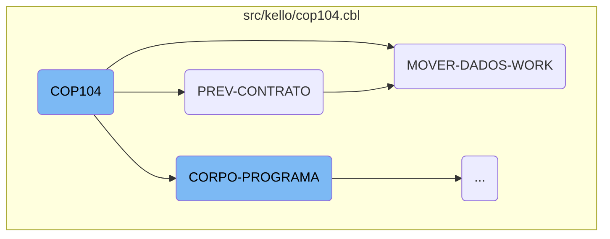

The <SwmToken path="src/kello/cop104.cbl" pos="3:6:6" line-data="       PROGRAM-ID. COP104.">`COP104`</SwmToken> program is a core component of the Kello Imagens business operations management system. It handles the initialization, main processing, and finalization of the program, ensuring that all necessary data is processed and prepared for further operations.

The <SwmToken path="src/kello/cop104.cbl" pos="3:6:6" line-data="       PROGRAM-ID. COP104.">`COP104`</SwmToken> program starts by initializing the environment and accepting parameters from the command line. It then moves into the main processing section, where it handles tasks such as predicting contract data, moving data to the work area, and processing sales and production data. Throughout this process, it ensures that all relevant data is accurately handled and prepared for output or further processing. Finally, the program concludes by performing any necessary cleanup and finalization tasks.

Here is a high level diagram of the flow, showing only the most important functions:

```mermaid
graph TD;
      subgraph src/kello/cop104.cbl
3a4a4faa6795791472a31e1ba186e440b1e48ba9ec32c1c1c83dd353041fe289(COP104):::mainFlowStyle --> 1279bb1d1250b6db325ea6bcf372a2ccd1efac71d69708a48d13d22886bfbe17(PREV-CONTRATO)
end

subgraph src/kello/cop104.cbl
3a4a4faa6795791472a31e1ba186e440b1e48ba9ec32c1c1c83dd353041fe289(COP104):::mainFlowStyle --> 75b08bfa42d1aa6a7a6d53cd5b1e2fad30d020f269cae77981aac97bcef2cc94(MOVER-DADOS-WORK)
end

subgraph src/kello/cop104.cbl
3a4a4faa6795791472a31e1ba186e440b1e48ba9ec32c1c1c83dd353041fe289(COP104):::mainFlowStyle --> 732f73c8db1979e53a3a633916a37f326be6b523c6882e77a9540e09e88af690(CORPO-PROGRAMA):::mainFlowStyle
end

subgraph src/kello/cop104.cbl
732f73c8db1979e53a3a633916a37f326be6b523c6882e77a9540e09e88af690(CORPO-PROGRAMA):::mainFlowStyle --> 9015da90b25fc23bfeb0043644a9ea5537e24602302b59e03aa2e138ee7f5e9e(GRAVA-WORK):::mainFlowStyle
end

subgraph src/kello/cop104.cbl
9015da90b25fc23bfeb0043644a9ea5537e24602302b59e03aa2e138ee7f5e9e(GRAVA-WORK):::mainFlowStyle --> 1279bb1d1250b6db325ea6bcf372a2ccd1efac71d69708a48d13d22886bfbe17(PREV-CONTRATO)
end

subgraph src/kello/cop104.cbl
9015da90b25fc23bfeb0043644a9ea5537e24602302b59e03aa2e138ee7f5e9e(GRAVA-WORK):::mainFlowStyle --> 060f9e0002cbe4001dc4c23f3ec2d6c653f305180e1990c230214f3bf4ad37dd(DATA-VENDA-PRODUCAO):::mainFlowStyle
end


      classDef mainFlowStyle color:#000000,fill:#7CB9F4
classDef rootsStyle color:#000000,fill:#00FFF4
classDef Style1 color:#000000,fill:#00FFAA
classDef Style2 color:#000000,fill:#FFFF00
classDef Style3 color:#000000,fill:#AA7CB9

%% Swimm:
%% graph TD;
%%       subgraph <SwmPath>[src/kello/cop104.cbl](src/kello/cop104.cbl)</SwmPath>
%% 3a4a4faa6795791472a31e1ba186e440b1e48ba9ec32c1c1c83dd353041fe289(COP104):::mainFlowStyle --> 1279bb1d1250b6db325ea6bcf372a2ccd1efac71d69708a48d13d22886bfbe17(PREV-CONTRATO)
%% end
%% 
%% subgraph <SwmPath>[src/kello/cop104.cbl](src/kello/cop104.cbl)</SwmPath>
%% 3a4a4faa6795791472a31e1ba186e440b1e48ba9ec32c1c1c83dd353041fe289(COP104):::mainFlowStyle --> 75b08bfa42d1aa6a7a6d53cd5b1e2fad30d020f269cae77981aac97bcef2cc94(MOVER-DADOS-WORK)
%% end
%% 
%% subgraph <SwmPath>[src/kello/cop104.cbl](src/kello/cop104.cbl)</SwmPath>
%% 3a4a4faa6795791472a31e1ba186e440b1e48ba9ec32c1c1c83dd353041fe289(COP104):::mainFlowStyle --> 732f73c8db1979e53a3a633916a37f326be6b523c6882e77a9540e09e88af690(CORPO-PROGRAMA):::mainFlowStyle
%% end
%% 
%% subgraph <SwmPath>[src/kello/cop104.cbl](src/kello/cop104.cbl)</SwmPath>
%% 732f73c8db1979e53a3a633916a37f326be6b523c6882e77a9540e09e88af690(CORPO-PROGRAMA):::mainFlowStyle --> 9015da90b25fc23bfeb0043644a9ea5537e24602302b59e03aa2e138ee7f5e9e(GRAVA-WORK):::mainFlowStyle
%% end
%% 
%% subgraph <SwmPath>[src/kello/cop104.cbl](src/kello/cop104.cbl)</SwmPath>
%% 9015da90b25fc23bfeb0043644a9ea5537e24602302b59e03aa2e138ee7f5e9e(GRAVA-WORK):::mainFlowStyle --> 1279bb1d1250b6db325ea6bcf372a2ccd1efac71d69708a48d13d22886bfbe17(PREV-CONTRATO)
%% end
%% 
%% subgraph <SwmPath>[src/kello/cop104.cbl](src/kello/cop104.cbl)</SwmPath>
%% 9015da90b25fc23bfeb0043644a9ea5537e24602302b59e03aa2e138ee7f5e9e(GRAVA-WORK):::mainFlowStyle --> 060f9e0002cbe4001dc4c23f3ec2d6c653f305180e1990c230214f3bf4ad37dd(DATA-VENDA-PRODUCAO):::mainFlowStyle
%% end
%% 
%% 
%%       classDef mainFlowStyle color:#000000,fill:#7CB9F4
%% classDef rootsStyle color:#000000,fill:#00FFF4
%% classDef Style1 color:#000000,fill:#00FFAA
%% classDef Style2 color:#000000,fill:#FFFF00
%% classDef Style3 color:#000000,fill:#AA7CB9
```



# Flow drill down

First, we'll zoom into this section of the flow:



<SwmSnippet path="/src/kello/cop104.cbl" line="653">

---

## <SwmToken path="src/kello/cop104.cbl" pos="3:6:6" line-data="       PROGRAM-ID. COP104.">`COP104`</SwmToken>

The <SwmToken path="src/kello/cop104.cbl" pos="3:6:6" line-data="       PROGRAM-ID. COP104.">`COP104`</SwmToken> function initializes the program and handles the main processing flow. It starts by accepting parameters from the command line and then proceeds to various sections like <SwmToken path="src/kello/cop104.cbl" pos="654:3:5" line-data="           PERFORM INICIALIZA-PROGRAMA.">`INICIALIZA-PROGRAMA`</SwmToken>, <SwmToken path="src/kello/cop104.cbl" pos="790:3:5" line-data="                    PERFORM EXIBIR-MENSAGEM">`EXIBIR-MENSAGEM`</SwmToken>, and <SwmToken path="src/kello/cop104.cbl" pos="655:3:5" line-data="           PERFORM CORPO-PROGRAMA UNTIL GS-EXIT-FLG-TRUE.">`CORPO-PROGRAMA`</SwmToken>. These sections set up the environment, display messages, and handle the core logic of the program.

```cobol
       MAIN-PROCESS SECTION.
           PERFORM INICIALIZA-PROGRAMA.
           PERFORM CORPO-PROGRAMA UNTIL GS-EXIT-FLG-TRUE.
           GO FINALIZAR-PROGRAMA.

       INICIALIZA-PROGRAMA SECTION.
           ACCEPT PARAMETROS-W FROM COMMAND-LINE.
           COPY "CBDATA1.CPY".
           MOVE DATA-INV TO DATA-MOVTO-W.
           CALL "GRIDAT2" USING DATA-INV.
           MOVE DATA-INV       TO DATA-DIA-I.
           MOVE ZEROS TO ERRO-W.
           INITIALIZE GS-DATA-BLOCK
           INITIALIZE DS-CONTROL-BLOCK
           MOVE GS-DATA-BLOCK-VERSION-NO
                                   TO DS-DATA-BLOCK-VERSION-NO
           MOVE GS-VERSION-NO  TO DS-VERSION-NO
           MOVE EMPRESA-W          TO EMP-REC
           MOVE NOME-EMPRESA-W     TO EMPRESA-REL
           MOVE "CAD004"  TO ARQ-REC. MOVE EMPRESA-REF TO PATH-CAD004.
           MOVE "CGD001"  TO ARQ-REC. MOVE EMPRESA-REF TO PATH-CGD001.
```

---

</SwmSnippet>

<SwmSnippet path="/src/kello/cop104.cbl" line="1320">

---

## <SwmToken path="src/kello/cop104.cbl" pos="1320:1:3" line-data="       PREV-CONTRATO SECTION.">`PREV-CONTRATO`</SwmToken>

The <SwmToken path="src/kello/cop104.cbl" pos="1320:1:3" line-data="       PREV-CONTRATO SECTION.">`PREV-CONTRATO`</SwmToken> function is responsible for predicting contract data. It moves initial and final month-year values, starts reading records from the <SwmToken path="src/kello/cop104.cbl" pos="1339:3:3" line-data="           START COD040 KEY IS NOT &lt; ALT1-CO40 INVALID KEY">`COD040`</SwmToken> file, and processes each record to update contract information. If certain conditions are met, it calls the <SwmToken path="src/kello/cop104.cbl" pos="1359:1:5" line-data="       MOVER-DADOS-WORK SECTION.">`MOVER-DADOS-WORK`</SwmToken> function to move data to the work area.

```cobol
       PREV-CONTRATO SECTION.
*          IF USUARIO-W = "ANDER"
*             DISPLAY "PREVISAO DE CONTRATO = " AT 0130
*          END-IF
*
*          STOP " "

           MOVE GS-MESANO-INI  TO MESANO-W
           MOVE MESANO-W(1: 2) TO MESANO-I(5: 2)
           MOVE MESANO-W(3: 4) TO MESANO-I(1: 4)
           MOVE MESANO-I       TO MESANO-INI
           MOVE GS-MESANO-FIM  TO MESANO-W
           MOVE MESANO-W(1: 2) TO MESANO-I(5: 2)
           MOVE MESANO-W(3: 4) TO MESANO-I(1: 4)
           MOVE MESANO-I       TO MESANO-FIM


           MOVE MESANO-INI     TO MESANO-PREV-CO40
           MOVE ZEROS          TO NR-CONTRATO-CO40
           START COD040 KEY IS NOT < ALT1-CO40 INVALID KEY
                 MOVE "10" TO ST-COD040.
```

---

</SwmSnippet>

<SwmSnippet path="/src/kello/cop104.cbl" line="1359">

---

## <SwmToken path="src/kello/cop104.cbl" pos="1359:1:5" line-data="       MOVER-DADOS-WORK SECTION.">`MOVER-DADOS-WORK`</SwmToken>

The <SwmToken path="src/kello/cop104.cbl" pos="1359:1:5" line-data="       MOVER-DADOS-WORK SECTION.">`MOVER-DADOS-WORK`</SwmToken> function initializes the work area and processes contract data. It reads various records, updates fields like city, region, and representative, and performs calculations for commissions and sponsorships. The function ensures that all relevant data is moved to the work area and prepares it for further processing or output.

```cobol
       MOVER-DADOS-WORK SECTION.
           INITIALIZE REG-WORK.
      *    IF STATUS-CO40 < 50
      *       CONTINUE
      *    ELSE
              PERFORM PESQUISAR-STATUS
              IF ACHEI = "S"
                 MOVE CIDADE-CO40        TO CIDADE
                 READ CAD010 INVALID KEY
                      MOVE SPACES TO NOME-CID
                      MOVE SPACES TO UF-CID
                      MOVE ZEROS  TO REGIAO-CID
                 END-READ
                 IF GS-UF = SPACES OR UF-CID
                    IF GS-REGIAO = ZEROS OR REGIAO-CID
                       MOVE MESANO-PREV-CO40   TO MESANO-WK
                       MOVE NR-CONTRATO-CO40   TO CONTRATO-WK
                       MOVE NOME-CID           TO CIDADE-WK
                       MOVE REGIAO-CID         TO CODIGO-REG
                       READ CAD012 INVALID KEY
                            MOVE SPACES TO NOME-REG
```

---

</SwmSnippet>

Now, lets zoom into this section of the flow:

```mermaid
graph TD;
      subgraph src/kello/cop104.cbl
732f73c8db1979e53a3a633916a37f326be6b523c6882e77a9540e09e88af690(CORPO-PROGRAMA):::mainFlowStyle --> 9015da90b25fc23bfeb0043644a9ea5537e24602302b59e03aa2e138ee7f5e9e(GRAVA-WORK):::mainFlowStyle
end

subgraph src/kello/cop104.cbl
9015da90b25fc23bfeb0043644a9ea5537e24602302b59e03aa2e138ee7f5e9e(GRAVA-WORK):::mainFlowStyle --> 1279bb1d1250b6db325ea6bcf372a2ccd1efac71d69708a48d13d22886bfbe17(PREV-CONTRATO)
end

subgraph src/kello/cop104.cbl
9015da90b25fc23bfeb0043644a9ea5537e24602302b59e03aa2e138ee7f5e9e(GRAVA-WORK):::mainFlowStyle --> 060f9e0002cbe4001dc4c23f3ec2d6c653f305180e1990c230214f3bf4ad37dd(DATA-VENDA-PRODUCAO):::mainFlowStyle
end

subgraph src/kello/cop104.cbl
1279bb1d1250b6db325ea6bcf372a2ccd1efac71d69708a48d13d22886bfbe17(PREV-CONTRATO) --> 75b08bfa42d1aa6a7a6d53cd5b1e2fad30d020f269cae77981aac97bcef2cc94(MOVER-DADOS-WORK)
end


      classDef mainFlowStyle color:#000000,fill:#7CB9F4
classDef rootsStyle color:#000000,fill:#00FFF4
classDef Style1 color:#000000,fill:#00FFAA
classDef Style2 color:#000000,fill:#FFFF00
classDef Style3 color:#000000,fill:#AA7CB9

%% Swimm:
%% graph TD;
%%       subgraph <SwmPath>[src/kello/cop104.cbl](src/kello/cop104.cbl)</SwmPath>
%% 732f73c8db1979e53a3a633916a37f326be6b523c6882e77a9540e09e88af690(CORPO-PROGRAMA):::mainFlowStyle --> 9015da90b25fc23bfeb0043644a9ea5537e24602302b59e03aa2e138ee7f5e9e(GRAVA-WORK):::mainFlowStyle
%% end
%% 
%% subgraph <SwmPath>[src/kello/cop104.cbl](src/kello/cop104.cbl)</SwmPath>
%% 9015da90b25fc23bfeb0043644a9ea5537e24602302b59e03aa2e138ee7f5e9e(GRAVA-WORK):::mainFlowStyle --> 1279bb1d1250b6db325ea6bcf372a2ccd1efac71d69708a48d13d22886bfbe17(PREV-CONTRATO)
%% end
%% 
%% subgraph <SwmPath>[src/kello/cop104.cbl](src/kello/cop104.cbl)</SwmPath>
%% 9015da90b25fc23bfeb0043644a9ea5537e24602302b59e03aa2e138ee7f5e9e(GRAVA-WORK):::mainFlowStyle --> 060f9e0002cbe4001dc4c23f3ec2d6c653f305180e1990c230214f3bf4ad37dd(DATA-VENDA-PRODUCAO):::mainFlowStyle
%% end
%% 
%% subgraph <SwmPath>[src/kello/cop104.cbl](src/kello/cop104.cbl)</SwmPath>
%% 1279bb1d1250b6db325ea6bcf372a2ccd1efac71d69708a48d13d22886bfbe17(PREV-CONTRATO) --> 75b08bfa42d1aa6a7a6d53cd5b1e2fad30d020f269cae77981aac97bcef2cc94(MOVER-DADOS-WORK)
%% end
%% 
%% 
%%       classDef mainFlowStyle color:#000000,fill:#7CB9F4
%% classDef rootsStyle color:#000000,fill:#00FFF4
%% classDef Style1 color:#000000,fill:#00FFAA
%% classDef Style2 color:#000000,fill:#FFFF00
%% classDef Style3 color:#000000,fill:#AA7CB9
```



<SwmSnippet path="/src/kello/cop104.cbl" line="776">

---

## <SwmToken path="src/kello/cop104.cbl" pos="776:1:3" line-data="       CORPO-PROGRAMA SECTION.">`CORPO-PROGRAMA`</SwmToken>

The <SwmToken path="src/kello/cop104.cbl" pos="776:1:3" line-data="       CORPO-PROGRAMA SECTION.">`CORPO-PROGRAMA`</SwmToken> section is a central control structure that evaluates various conditions and performs corresponding actions. It handles tasks such as centralizing data, verifying status, printing reports, and managing user interactions. This section ensures that the appropriate operations are executed based on the current state and user inputs.

```cobol
       CORPO-PROGRAMA SECTION.
           EVALUATE TRUE
               WHEN GS-CENTRALIZA-TRUE
                    PERFORM CENTRALIZAR
                    PERFORM VERIFICAR-SENHA-STATUS
               WHEN GS-PRINTER-FLG-TRUE
                    COPY IMPRESSORA.CHAMA.
                    IF LNK-MAPEAMENTO <> SPACES
                       PERFORM IMPRIME-RELATORIO
                    END-IF
               WHEN GS-GRAVA-WORK-FLG-TRUE
                    MOVE "Deseja Realmente Carregar os Dados ?" TO
                    MENSAGEM
                    MOVE "Q" TO TIPO-MSG
                    PERFORM EXIBIR-MENSAGEM
                    IF RESP-MSG = "S"
                       PERFORM GRAVA-WORK
                       PERFORM ZERA-VARIAVEIS
                       PERFORM CARREGA-LISTA
                    END-IF
               WHEN GS-CARREGA-LISTA-FLG-TRUE
```

---

</SwmSnippet>

<SwmSnippet path="/src/kello/cop104.cbl" line="977">

---

## <SwmToken path="src/kello/cop104.cbl" pos="977:1:3" line-data="       GRAVA-WORK SECTION.">`GRAVA-WORK`</SwmToken>

The <SwmToken path="src/kello/cop104.cbl" pos="977:1:3" line-data="       GRAVA-WORK SECTION.">`GRAVA-WORK`</SwmToken> section is responsible for handling work file operations. It checks the status of the work file, performs necessary file operations like opening, closing, and deleting, and then evaluates the filter options to determine the next steps, such as calling <SwmToken path="src/kello/cop104.cbl" pos="1011:1:5" line-data="       DATA-VENDA-PRODUCAO SECTION.">`DATA-VENDA-PRODUCAO`</SwmToken> or <SwmToken path="src/kello/cop104.cbl" pos="1320:1:3" line-data="       PREV-CONTRATO SECTION.">`PREV-CONTRATO`</SwmToken>.

```cobol
       GRAVA-WORK SECTION.
           IF ST-WORK NOT = "35"
              CLOSE       WORK
              DELETE FILE WORK.

           ACCEPT VARIA-W FROM TIME
           OPEN OUTPUT WORK
           CLOSE       WORK
           OPEN I-O    WORK

           MOVE "TELA-AGUARDA" TO DS-PROCEDURE
           PERFORM CALL-DIALOG-SYSTEM

*          IF USUARIO-W = "ANDER"
*             DISPLAY ERASE AT 0101
*             DISPLAY "GS-OP-FILTRO = " AT 0101
*             DISPLAY  GS-OP-FILTRO     AT 0125
*
*             DISPLAY "GS-BRINDE    = " AT 0201
*             DISPLAY  GS-BRINDES       AT 0225
*
```

---

</SwmSnippet>

<SwmSnippet path="/src/kello/cop104.cbl" line="1011">

---

## <SwmToken path="src/kello/cop104.cbl" pos="1011:1:5" line-data="       DATA-VENDA-PRODUCAO SECTION.">`DATA-VENDA-PRODUCAO`</SwmToken>

The <SwmToken path="src/kello/cop104.cbl" pos="1011:1:5" line-data="       DATA-VENDA-PRODUCAO SECTION.">`DATA-VENDA-PRODUCAO`</SwmToken> section processes sales and production data. It initializes records, handles date conversions, opens and manages auxiliary files, and evaluates data options to perform specific tasks like calculating commissions, updating records, and preparing data for reports. This section ensures accurate data handling and integration with other system components.

```cobol
       DATA-VENDA-PRODUCAO SECTION.
*          IF USUARIO-W = "ANDER"
*             DISPLAY "DATA VENDA PRODUCAO = " AT 0130
*          END-IF

           INITIALIZE REG-RCD100

           MOVE GS-DATA-INI TO DATA-INV
           CALL "GRIDAT2" USING DATA-INV
           MOVE DATA-INV    TO VECTO-INI
           MOVE GS-DATA-FIM TO DATA-INV
           CALL "GRIDAT2" USING DATA-INV
           MOVE DATA-INV    TO VECTO-FIM

           OPEN OUTPUT AUXILIAR AUXILIAR2
           CLOSE       AUXILIAR AUXILIAR2
           OPEN I-O    AUXILIAR AUXILIAR2

*          IF USUARIO-W = "ANDER"
*             DISPLAY "GS-OP-DATA = " AT 0301
*             DISPLAY GS-OP-DATA      AT 0325
```

---

</SwmSnippet>

&nbsp;

*This is an auto-generated document by Swimm AI 🌊 and has not yet been verified by a human*

<SwmMeta version="3.0.0" repo-id="Z2l0aHViJTNBJTNBa2VsbG8lM0ElM0Fzd2ltbWlv" repo-name="kello"><sup>Powered by [Swimm](/)</sup></SwmMeta>
