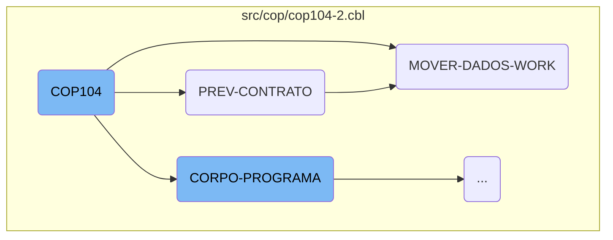

This document explains the <SwmToken path="src/cop/cop104-2.cbl" pos="3:6:6" line-data="       PROGRAM-ID. COP104.">`COP104`</SwmToken> program, which is the main entry point of the application. It initializes the program, accepts parameters from the command line, and orchestrates various sections to ensure the correct execution of the program.

The <SwmToken path="src/cop/cop104-2.cbl" pos="3:6:6" line-data="       PROGRAM-ID. COP104.">`COP104`</SwmToken> program starts by initializing itself and accepting parameters from the command line. It then performs different sections in a specific order. First, it initializes the program, then it processes the main body of the program repeatedly until a certain condition is met. During this process, it handles contract-related data, moves and calculates necessary data, and performs file operations and data processing. Each section is responsible for specific tasks, such as reading records, processing data, and handling file operations, ensuring that the program runs smoothly and efficiently.

Here is a high level diagram of the flow, showing only the most important functions:

```mermaid
graph TD;
      subgraph src/cop/cop104-2.cbl
a7366aae2af3fde1f55a1271e9e6efb1a6b94e23884b60b5036487bbef3d893c(COP104):::mainFlowStyle --> 39787942ad5fe73b2eac5d32676a4f47a3e7c3e4f10249504282b6f10c91d1af(PREV-CONTRATO)
end

subgraph src/cop/cop104-2.cbl
a7366aae2af3fde1f55a1271e9e6efb1a6b94e23884b60b5036487bbef3d893c(COP104):::mainFlowStyle --> 08c3708dad512f3a9bfc7cb7702f7dd63bca0fa4e445518cb68d28ebf2f5e22d(MOVER-DADOS-WORK)
end

subgraph src/cop/cop104-2.cbl
a7366aae2af3fde1f55a1271e9e6efb1a6b94e23884b60b5036487bbef3d893c(COP104):::mainFlowStyle --> 00cbd2733869967f82f78cd8f6a362e85e8ed61a81e9b9350bea74f67e37e18d(CORPO-PROGRAMA):::mainFlowStyle
end

subgraph src/cop/cop104-2.cbl
00cbd2733869967f82f78cd8f6a362e85e8ed61a81e9b9350bea74f67e37e18d(CORPO-PROGRAMA):::mainFlowStyle --> 7c94f4df450f2ff336ef8551e276b242a6e7c0719602c93269a61a832e21cf4f(GRAVA-WORK):::mainFlowStyle
end

subgraph src/cop/cop104-2.cbl
7c94f4df450f2ff336ef8551e276b242a6e7c0719602c93269a61a832e21cf4f(GRAVA-WORK):::mainFlowStyle --> 39787942ad5fe73b2eac5d32676a4f47a3e7c3e4f10249504282b6f10c91d1af(PREV-CONTRATO)
end

subgraph src/cop/cop104-2.cbl
7c94f4df450f2ff336ef8551e276b242a6e7c0719602c93269a61a832e21cf4f(GRAVA-WORK):::mainFlowStyle --> 002c9d346d1fa3bf848fa260ba9a2c4ecbaefc60ba0c7218cece05c713cb6fdb(DATA-VENDA-PRODUCAO):::mainFlowStyle
end


      classDef mainFlowStyle color:#000000,fill:#7CB9F4
classDef rootsStyle color:#000000,fill:#00FFF4
classDef Style1 color:#000000,fill:#00FFAA
classDef Style2 color:#000000,fill:#FFFF00
classDef Style3 color:#000000,fill:#AA7CB9

%% Swimm:
%% graph TD;
%%       subgraph <SwmPath>[src/cop/cop104-2.cbl](src/cop/cop104-2.cbl)</SwmPath>
%% a7366aae2af3fde1f55a1271e9e6efb1a6b94e23884b60b5036487bbef3d893c(COP104):::mainFlowStyle --> 39787942ad5fe73b2eac5d32676a4f47a3e7c3e4f10249504282b6f10c91d1af(PREV-CONTRATO)
%% end
%% 
%% subgraph <SwmPath>[src/cop/cop104-2.cbl](src/cop/cop104-2.cbl)</SwmPath>
%% a7366aae2af3fde1f55a1271e9e6efb1a6b94e23884b60b5036487bbef3d893c(COP104):::mainFlowStyle --> 08c3708dad512f3a9bfc7cb7702f7dd63bca0fa4e445518cb68d28ebf2f5e22d(MOVER-DADOS-WORK)
%% end
%% 
%% subgraph <SwmPath>[src/cop/cop104-2.cbl](src/cop/cop104-2.cbl)</SwmPath>
%% a7366aae2af3fde1f55a1271e9e6efb1a6b94e23884b60b5036487bbef3d893c(COP104):::mainFlowStyle --> 00cbd2733869967f82f78cd8f6a362e85e8ed61a81e9b9350bea74f67e37e18d(CORPO-PROGRAMA):::mainFlowStyle
%% end
%% 
%% subgraph <SwmPath>[src/cop/cop104-2.cbl](src/cop/cop104-2.cbl)</SwmPath>
%% 00cbd2733869967f82f78cd8f6a362e85e8ed61a81e9b9350bea74f67e37e18d(CORPO-PROGRAMA):::mainFlowStyle --> 7c94f4df450f2ff336ef8551e276b242a6e7c0719602c93269a61a832e21cf4f(GRAVA-WORK):::mainFlowStyle
%% end
%% 
%% subgraph <SwmPath>[src/cop/cop104-2.cbl](src/cop/cop104-2.cbl)</SwmPath>
%% 7c94f4df450f2ff336ef8551e276b242a6e7c0719602c93269a61a832e21cf4f(GRAVA-WORK):::mainFlowStyle --> 39787942ad5fe73b2eac5d32676a4f47a3e7c3e4f10249504282b6f10c91d1af(PREV-CONTRATO)
%% end
%% 
%% subgraph <SwmPath>[src/cop/cop104-2.cbl](src/cop/cop104-2.cbl)</SwmPath>
%% 7c94f4df450f2ff336ef8551e276b242a6e7c0719602c93269a61a832e21cf4f(GRAVA-WORK):::mainFlowStyle --> 002c9d346d1fa3bf848fa260ba9a2c4ecbaefc60ba0c7218cece05c713cb6fdb(DATA-VENDA-PRODUCAO):::mainFlowStyle
%% end
%% 
%% 
%%       classDef mainFlowStyle color:#000000,fill:#7CB9F4
%% classDef rootsStyle color:#000000,fill:#00FFF4
%% classDef Style1 color:#000000,fill:#00FFAA
%% classDef Style2 color:#000000,fill:#FFFF00
%% classDef Style3 color:#000000,fill:#AA7CB9
```



# Flow drill down

First, we'll zoom into this section of the flow:



<SwmSnippet path="/src/cop/cop104-2.cbl" line="642">

---

## <SwmToken path="src/cop/cop104-2.cbl" pos="3:6:6" line-data="       PROGRAM-ID. COP104.">`COP104`</SwmToken>

The <SwmToken path="src/cop/cop104-2.cbl" pos="3:6:6" line-data="       PROGRAM-ID. COP104.">`COP104`</SwmToken> function is the main entry point of the program. It initializes the program, accepts parameters from the command line, and performs various sections such as displaying messages, verifying status, and centralizing data. This function orchestrates the overall flow and ensures that the necessary sections are executed in sequence.

```cobol
       MAIN-PROCESS SECTION.
           PERFORM INICIALIZA-PROGRAMA.
           PERFORM CORPO-PROGRAMA UNTIL GS-EXIT-FLG-TRUE.
           GO FINALIZAR-PROGRAMA.

       INICIALIZA-PROGRAMA SECTION.
           ACCEPT PARAMETROS-W FROM COMMAND-LINE.
           COPY "CBDATA1.CPY".
           MOVE DATA-INV TO DATA-MOVTO-W.
           CALL "GRIDAT2" USING DATA-INV.
           MOVE DATA-INV       TO DATA-DIA-I.
           MOVE ZEROS TO ERRO-W.
           INITIALIZE GS-DATA-BLOCK
           INITIALIZE DS-CONTROL-BLOCK
           MOVE GS-DATA-BLOCK-VERSION-NO
                                   TO DS-DATA-BLOCK-VERSION-NO
           MOVE GS-VERSION-NO  TO DS-VERSION-NO
           MOVE EMPRESA-W          TO EMP-REC
           MOVE NOME-EMPRESA-W     TO EMPRESA-REL
           MOVE "CAD004"  TO ARQ-REC. MOVE EMPRESA-REF TO PATH-CAD004.
           MOVE "CGD001"  TO ARQ-REC. MOVE EMPRESA-REF TO PATH-CGD001.
```

---

</SwmSnippet>

<SwmSnippet path="/src/cop/cop104-2.cbl" line="1214">

---

## <SwmToken path="src/cop/cop104-2.cbl" pos="1214:1:3" line-data="       PREV-CONTRATO SECTION.">`PREV-CONTRATO`</SwmToken>

The <SwmToken path="src/cop/cop104-2.cbl" pos="1214:1:3" line-data="       PREV-CONTRATO SECTION.">`PREV-CONTRATO`</SwmToken> function is responsible for handling contract-related data. It moves initial and final month-year values, starts reading records from the <SwmToken path="src/cop/cop104-2.cbl" pos="1227:3:3" line-data="           START COD040 KEY IS NOT &lt; ALT1-CO40 INVALID KEY">`COD040`</SwmToken> file, and performs operations until a specific condition is met. This function ensures that contract data is processed and moved to the appropriate sections.

```cobol
       PREV-CONTRATO SECTION.
           MOVE GS-MESANO-INI  TO MESANO-W
           MOVE MESANO-W(1: 2) TO MESANO-I(5: 2)
           MOVE MESANO-W(3: 4) TO MESANO-I(1: 4)
           MOVE MESANO-I       TO MESANO-INI
           MOVE GS-MESANO-FIM  TO MESANO-W
           MOVE MESANO-W(1: 2) TO MESANO-I(5: 2)
           MOVE MESANO-W(3: 4) TO MESANO-I(1: 4)
           MOVE MESANO-I       TO MESANO-FIM


           MOVE MESANO-INI     TO MESANO-PREV-CO40
           MOVE ZEROS          TO NR-CONTRATO-CO40
           START COD040 KEY IS NOT < ALT1-CO40 INVALID KEY
                 MOVE "10" TO ST-COD040.

           PERFORM UNTIL ST-COD040 = "10"
                 READ COD040 NEXT RECORD AT END
                      MOVE "10" TO ST-COD040
                 NOT AT END
                      MOVE NR-CONTRATO-CO40 TO GS-EXIBE-CONTRATO
```

---

</SwmSnippet>

<SwmSnippet path="/src/cop/cop104-2.cbl" line="1247">

---

## <SwmToken path="src/cop/cop104-2.cbl" pos="1247:1:5" line-data="       MOVER-DADOS-WORK SECTION.">`MOVER-DADOS-WORK`</SwmToken>

The <SwmToken path="src/cop/cop104-2.cbl" pos="1247:1:5" line-data="       MOVER-DADOS-WORK SECTION.">`MOVER-DADOS-WORK`</SwmToken> function initializes the work register and performs various data movements and calculations. It reads data from multiple files, processes city and region information, calculates commissions, and prepares data for further processing. This function is crucial for ensuring that all necessary data is moved and calculated correctly for subsequent operations.

```cobol
       MOVER-DADOS-WORK SECTION.
           INITIALIZE REG-WORK.
      *    IF STATUS-CO40 < 50
      *       CONTINUE
      *    ELSE
              PERFORM PESQUISAR-STATUS
              IF ACHEI = "S"
                 MOVE CIDADE-CO40        TO CIDADE
                 READ CAD010 INVALID KEY
                      MOVE SPACES TO NOME-CID
                      MOVE SPACES TO UF-CID
                      MOVE ZEROS  TO REGIAO-CID
                 END-READ
                 IF GS-UF = SPACES OR UF-CID
                    IF GS-REGIAO = ZEROS OR REGIAO-CID
                       MOVE MESANO-PREV-CO40   TO MESANO-WK
                       MOVE NR-CONTRATO-CO40   TO CONTRATO-WK
                       MOVE NOME-CID           TO CIDADE-WK
                       MOVE REGIAO-CID         TO CODIGO-REG
                       READ CAD012 INVALID KEY
                            MOVE SPACES TO NOME-REG
```

---

</SwmSnippet>

Now, lets zoom into this section of the flow:

```mermaid
graph TD;
      subgraph src/cop/cop104-2.cbl
00cbd2733869967f82f78cd8f6a362e85e8ed61a81e9b9350bea74f67e37e18d(CORPO-PROGRAMA):::mainFlowStyle --> 7c94f4df450f2ff336ef8551e276b242a6e7c0719602c93269a61a832e21cf4f(GRAVA-WORK):::mainFlowStyle
end

subgraph src/cop/cop104-2.cbl
7c94f4df450f2ff336ef8551e276b242a6e7c0719602c93269a61a832e21cf4f(GRAVA-WORK):::mainFlowStyle --> 39787942ad5fe73b2eac5d32676a4f47a3e7c3e4f10249504282b6f10c91d1af(PREV-CONTRATO)
end

subgraph src/cop/cop104-2.cbl
7c94f4df450f2ff336ef8551e276b242a6e7c0719602c93269a61a832e21cf4f(GRAVA-WORK):::mainFlowStyle --> 002c9d346d1fa3bf848fa260ba9a2c4ecbaefc60ba0c7218cece05c713cb6fdb(DATA-VENDA-PRODUCAO):::mainFlowStyle
end

subgraph src/cop/cop104-2.cbl
39787942ad5fe73b2eac5d32676a4f47a3e7c3e4f10249504282b6f10c91d1af(PREV-CONTRATO) --> 08c3708dad512f3a9bfc7cb7702f7dd63bca0fa4e445518cb68d28ebf2f5e22d(MOVER-DADOS-WORK)
end


      classDef mainFlowStyle color:#000000,fill:#7CB9F4
classDef rootsStyle color:#000000,fill:#00FFF4
classDef Style1 color:#000000,fill:#00FFAA
classDef Style2 color:#000000,fill:#FFFF00
classDef Style3 color:#000000,fill:#AA7CB9

%% Swimm:
%% graph TD;
%%       subgraph <SwmPath>[src/cop/cop104-2.cbl](src/cop/cop104-2.cbl)</SwmPath>
%% 00cbd2733869967f82f78cd8f6a362e85e8ed61a81e9b9350bea74f67e37e18d(CORPO-PROGRAMA):::mainFlowStyle --> 7c94f4df450f2ff336ef8551e276b242a6e7c0719602c93269a61a832e21cf4f(GRAVA-WORK):::mainFlowStyle
%% end
%% 
%% subgraph <SwmPath>[src/cop/cop104-2.cbl](src/cop/cop104-2.cbl)</SwmPath>
%% 7c94f4df450f2ff336ef8551e276b242a6e7c0719602c93269a61a832e21cf4f(GRAVA-WORK):::mainFlowStyle --> 39787942ad5fe73b2eac5d32676a4f47a3e7c3e4f10249504282b6f10c91d1af(PREV-CONTRATO)
%% end
%% 
%% subgraph <SwmPath>[src/cop/cop104-2.cbl](src/cop/cop104-2.cbl)</SwmPath>
%% 7c94f4df450f2ff336ef8551e276b242a6e7c0719602c93269a61a832e21cf4f(GRAVA-WORK):::mainFlowStyle --> 002c9d346d1fa3bf848fa260ba9a2c4ecbaefc60ba0c7218cece05c713cb6fdb(DATA-VENDA-PRODUCAO):::mainFlowStyle
%% end
%% 
%% subgraph <SwmPath>[src/cop/cop104-2.cbl](src/cop/cop104-2.cbl)</SwmPath>
%% 39787942ad5fe73b2eac5d32676a4f47a3e7c3e4f10249504282b6f10c91d1af(PREV-CONTRATO) --> 08c3708dad512f3a9bfc7cb7702f7dd63bca0fa4e445518cb68d28ebf2f5e22d(MOVER-DADOS-WORK)
%% end
%% 
%% 
%%       classDef mainFlowStyle color:#000000,fill:#7CB9F4
%% classDef rootsStyle color:#000000,fill:#00FFF4
%% classDef Style1 color:#000000,fill:#00FFAA
%% classDef Style2 color:#000000,fill:#FFFF00
%% classDef Style3 color:#000000,fill:#AA7CB9
```



<SwmSnippet path="/src/cop/cop104-2.cbl" line="765">

---

## <SwmToken path="src/cop/cop104-2.cbl" pos="765:1:3" line-data="       CORPO-PROGRAMA SECTION.">`CORPO-PROGRAMA`</SwmToken>

The <SwmToken path="src/cop/cop104-2.cbl" pos="765:1:3" line-data="       CORPO-PROGRAMA SECTION.">`CORPO-PROGRAMA`</SwmToken> section evaluates different conditions and performs corresponding actions. For example, if <SwmToken path="src/cop/cop104-2.cbl" pos="772:3:11" line-data="               WHEN GS-GRAVA-WORK-FLG-TRUE">`GS-GRAVA-WORK-FLG-TRUE`</SwmToken> is true, it displays a message and, based on the user's response, performs the <SwmToken path="src/cop/cop104-2.cbl" pos="772:5:7" line-data="               WHEN GS-GRAVA-WORK-FLG-TRUE">`GRAVA-WORK`</SwmToken> section. This section is crucial for determining the flow of operations based on various flags.

```cobol
       CORPO-PROGRAMA SECTION.
           EVALUATE TRUE
               WHEN GS-CENTRALIZA-TRUE
                    PERFORM CENTRALIZAR
                    PERFORM VERIFICAR-SENHA-STATUS
               WHEN GS-PRINTER-FLG-TRUE
                    PERFORM IMPRIME-RELATORIO
               WHEN GS-GRAVA-WORK-FLG-TRUE
                    MOVE "Deseja Realmente Carregar os Dados ?" TO
                    MENSAGEM
                    MOVE "Q" TO TIPO-MSG
                    PERFORM EXIBIR-MENSAGEM
                    IF RESP-MSG = "S"
                       PERFORM GRAVA-WORK
                       PERFORM ZERA-VARIAVEIS
                       PERFORM CARREGA-LISTA
                    END-IF
               WHEN GS-CARREGA-LISTA-FLG-TRUE
                    PERFORM ZERA-VARIAVEIS
                    PERFORM CARREGA-LISTA
               WHEN GS-LE-REGIAO-TRUE
```

---

</SwmSnippet>

<SwmSnippet path="/src/cop/cop104-2.cbl" line="960">

---

## <SwmToken path="src/cop/cop104-2.cbl" pos="960:1:3" line-data="       GRAVA-WORK SECTION.">`GRAVA-WORK`</SwmToken>

The <SwmToken path="src/cop/cop104-2.cbl" pos="960:1:3" line-data="       GRAVA-WORK SECTION.">`GRAVA-WORK`</SwmToken> section handles file operations and data processing. It first checks the status of <SwmToken path="src/cop/cop104-2.cbl" pos="961:3:5" line-data="           IF ST-WORK NOT = &quot;35&quot;">`ST-WORK`</SwmToken>, performs file operations like closing, deleting, and opening the work file, and then evaluates <SwmToken path="src/cop/cop104-2.cbl" pos="973:3:7" line-data="           EVALUATE GS-OP-FILTRO">`GS-OP-FILTRO`</SwmToken> to decide whether to perform <SwmToken path="src/cop/cop104-2.cbl" pos="974:7:11" line-data="               WHEN 1 PERFORM DATA-VENDA-PRODUCAO">`DATA-VENDA-PRODUCAO`</SwmToken> or <SwmToken path="src/cop/cop104-2.cbl" pos="975:7:9" line-data="               WHEN 2 PERFORM PREV-CONTRATO">`PREV-CONTRATO`</SwmToken>.

```cobol
       GRAVA-WORK SECTION.
           IF ST-WORK NOT = "35"
              CLOSE       WORK
              DELETE FILE WORK.

           ACCEPT VARIA-W FROM TIME
           OPEN OUTPUT WORK
           CLOSE       WORK
           OPEN I-O    WORK

           MOVE "TELA-AGUARDA" TO DS-PROCEDURE
           PERFORM CALL-DIALOG-SYSTEM

           EVALUATE GS-OP-FILTRO
               WHEN 1 PERFORM DATA-VENDA-PRODUCAO
               WHEN 2 PERFORM PREV-CONTRATO
           END-EVALUATE


           MOVE "TELA-AGUARDA2" TO DS-PROCEDURE.
           PERFORM CALL-DIALOG-SYSTEM.
```

---

</SwmSnippet>

<SwmSnippet path="/src/cop/cop104-2.cbl" line="982">

---

### <SwmToken path="src/cop/cop104-2.cbl" pos="982:1:5" line-data="       DATA-VENDA-PRODUCAO SECTION.">`DATA-VENDA-PRODUCAO`</SwmToken>

The <SwmToken path="src/cop/cop104-2.cbl" pos="982:1:5" line-data="       DATA-VENDA-PRODUCAO SECTION.">`DATA-VENDA-PRODUCAO`</SwmToken> section processes sales and production data. It initializes records, performs date conversions, opens auxiliary files, and evaluates <SwmToken path="src/cop/cop104-2.cbl" pos="996:3:7" line-data="           EVALUATE GS-OP-DATA">`GS-OP-DATA`</SwmToken> to determine whether to process by sales or production. It reads and processes records from auxiliary files, calculates various metrics, and writes the results to the work file.

```cobol
       DATA-VENDA-PRODUCAO SECTION.
           INITIALIZE REG-RCD100

           MOVE GS-DATA-INI TO DATA-INV
           CALL "GRIDAT2" USING DATA-INV
           MOVE DATA-INV    TO VECTO-INI
           MOVE GS-DATA-FIM TO DATA-INV
           CALL "GRIDAT2" USING DATA-INV
           MOVE DATA-INV    TO VECTO-FIM

           OPEN OUTPUT AUXILIAR AUXILIAR2
           CLOSE       AUXILIAR AUXILIAR2
           OPEN I-O    AUXILIAR AUXILIAR2

           EVALUATE GS-OP-DATA
               WHEN 1 PERFORM POR-VENDA
               WHEN 2 PERFORM POR-PRODUCAO
           END-EVALUATE

           CLOSE       AUXILIAR AUXILIAR2
           OPEN INPUT  AUXILIAR AUXILIAR2
```

---

</SwmSnippet>

&nbsp;

*This is an auto-generated document by Swimm AI 🌊 and has not yet been verified by a human*

<SwmMeta version="3.0.0" repo-id="Z2l0aHViJTNBJTNBa2VsbG8lM0ElM0Fzd2ltbWlv" repo-name="kello"><sup>Powered by [Swimm](/)</sup></SwmMeta>
