The <SwmToken path="src/kello/Cópia de cop104.cbl" pos="3:6:6" line-data="       PROGRAM-ID. COP104.">`COP104`</SwmToken> program is a crucial part of the Kello Imagens system, responsible for initializing the program, processing contract data, transferring data to the working storage area, and handling various data operations. The flow begins with setting up necessary parameters and proceeds through multiple stages to ensure data is correctly prepared and processed.

The <SwmToken path="src/kello/Cópia de cop104.cbl" pos="3:6:6" line-data="       PROGRAM-ID. COP104.">`COP104`</SwmToken> program starts by setting up the necessary parameters and initializing the program. It then processes contract data, ensuring that all contract information is correctly prepared. Next, it transfers data to the working storage area, preparing it for further operations. The program evaluates various conditions and performs corresponding actions, such as displaying messages, loading data, and handling work file operations. Finally, it processes date ranges and performs data operations based on specific criteria, ensuring that all data is correctly processed and stored.

Here is a high level diagram of the flow, showing only the most important functions:


# Flow drill down

First, we'll zoom into this section of the flow:

```mermaid
graph TD;
      subgraph "src/kello/Cópia de cop104.cbl"
f0c0eb2d78b154ffa63d065764f054ae847afab889c9ad85278d507bc702792a(COP104):::mainFlowStyle --> 130f82945ee5757ce5c7ce0a9460e3068dc2a5eb2b49357df15e91eb534cf595(PREV-CONTRATO)
end

subgraph "src/kello/Cópia de cop104.cbl"
f0c0eb2d78b154ffa63d065764f054ae847afab889c9ad85278d507bc702792a(COP104):::mainFlowStyle --> 40878ae2e7d7d912f374fed95330fc1d75b5034febd010b4eff1e17a8de64910(MOVER-DADOS-WORK)
end

subgraph "src/kello/Cópia de cop104.cbl"
f0c0eb2d78b154ffa63d065764f054ae847afab889c9ad85278d507bc702792a(COP104):::mainFlowStyle --> a9e18a9a2648d2cf24695d20a18427dfe2609cb08804f0bcb57a07f019e89f33(CORPO-PROGRAMA):::mainFlowStyle
end

subgraph "src/kello/Cópia de cop104.cbl"
a9e18a9a2648d2cf24695d20a18427dfe2609cb08804f0bcb57a07f019e89f33(CORPO-PROGRAMA):::mainFlowStyle --> 4r8wj(...)
end

subgraph "src/kello/Cópia de cop104.cbl"
130f82945ee5757ce5c7ce0a9460e3068dc2a5eb2b49357df15e91eb534cf595(PREV-CONTRATO) --> 40878ae2e7d7d912f374fed95330fc1d75b5034febd010b4eff1e17a8de64910(MOVER-DADOS-WORK)
end


      classDef mainFlowStyle color:#000000,fill:#7CB9F4
classDef rootsStyle color:#000000,fill:#00FFF4
classDef Style1 color:#000000,fill:#00FFAA
classDef Style2 color:#000000,fill:#FFFF00
classDef Style3 color:#000000,fill:#AA7CB9
```



<SwmSnippet path="/src/kello/Cópia de cop104.cbl" line="640">

---

## <SwmToken path="src/kello/Cópia de cop104.cbl" pos="3:6:6" line-data="       PROGRAM-ID. COP104.">`COP104`</SwmToken>

The <SwmToken path="src/kello/Cópia de cop104.cbl" pos="3:6:6" line-data="       PROGRAM-ID. COP104.">`COP104`</SwmToken> function initializes the program and sets up the necessary parameters. This is the starting point of the flow where the program begins its execution.

```cobol
       MAIN-PROCESS SECTION.
           PERFORM INICIALIZA-PROGRAMA.
           PERFORM CORPO-PROGRAMA UNTIL GS-EXIT-FLG-TRUE.
           GO FINALIZAR-PROGRAMA.

       INICIALIZA-PROGRAMA SECTION.
```

---

</SwmSnippet>

<SwmSnippet path="/src/kello/Cópia de cop104.cbl" line="1212">

---

## <SwmToken path="src/kello/Cópia de cop104.cbl" pos="1212:1:3" line-data="       PREV-CONTRATO SECTION.">`PREV-CONTRATO`</SwmToken>

The <SwmToken path="src/kello/Cópia de cop104.cbl" pos="1212:1:3" line-data="       PREV-CONTRATO SECTION.">`PREV-CONTRATO`</SwmToken> function processes contract data by moving initial and final month-year values, and iterating through records to update contract information. It ensures that the contract data is correctly prepared for further processing.

```cobol
       PREV-CONTRATO SECTION.
           MOVE GS-MESANO-INI  TO MESANO-W
           MOVE MESANO-W(1: 2) TO MESANO-I(5: 2)
           MOVE MESANO-W(3: 4) TO MESANO-I(1: 4)
           MOVE MESANO-I       TO MESANO-INI
           MOVE GS-MESANO-FIM  TO MESANO-W
           MOVE MESANO-W(1: 2) TO MESANO-I(5: 2)
           MOVE MESANO-W(3: 4) TO MESANO-I(1: 4)
           MOVE MESANO-I       TO MESANO-FIM


           MOVE MESANO-INI     TO MESANO-PREV-CO40
           MOVE ZEROS          TO NR-CONTRATO-CO40
           START COD040 KEY IS NOT < ALT1-CO40 INVALID KEY
                 MOVE "10" TO ST-COD040.

           PERFORM UNTIL ST-COD040 = "10"
                 READ COD040 NEXT RECORD AT END
                      MOVE "10" TO ST-COD040
                 NOT AT END
                      MOVE NR-CONTRATO-CO40 TO GS-EXIBE-CONTRATO
```

---

</SwmSnippet>

<SwmSnippet path="/src/kello/Cópia de cop104.cbl" line="1245">

---

## <SwmToken path="src/kello/Cópia de cop104.cbl" pos="1245:1:5" line-data="       MOVER-DADOS-WORK SECTION.">`MOVER-DADOS-WORK`</SwmToken>

The <SwmToken path="src/kello/Cópia de cop104.cbl" pos="1245:1:5" line-data="       MOVER-DADOS-WORK SECTION.">`MOVER-DADOS-WORK`</SwmToken> function transfers data to the working storage area. It initializes the working storage, searches for status, and moves various pieces of data such as city, region, and representative information. This function is crucial for preparing the data for subsequent operations.

```cobol
       MOVER-DADOS-WORK SECTION.
           INITIALIZE REG-WORK.
      *    IF STATUS-CO40 < 50
      *       CONTINUE
      *    ELSE
              PERFORM PESQUISAR-STATUS
              IF ACHEI = "S"
                 MOVE CIDADE-CO40        TO CIDADE
                 READ CAD010 INVALID KEY
                      MOVE SPACES TO NOME-CID
                      MOVE SPACES TO UF-CID
                      MOVE ZEROS  TO REGIAO-CID
                 END-READ
                 IF GS-UF = SPACES OR UF-CID
                    IF GS-REGIAO = ZEROS OR REGIAO-CID
                       MOVE MESANO-PREV-CO40   TO MESANO-WK
                       MOVE NR-CONTRATO-CO40   TO CONTRATO-WK
                       MOVE NOME-CID           TO CIDADE-WK
                       MOVE REGIAO-CID         TO CODIGO-REG
                       READ CAD012 INVALID KEY
                            MOVE SPACES TO NOME-REG
```

---

</SwmSnippet>

Now, lets zoom into this section of the flow:


<SwmSnippet path="/src/kello/Cópia de cop104.cbl" line="764">

---

## <SwmToken path="src/kello/Cópia de cop104.cbl" pos="642:3:5" line-data="           PERFORM CORPO-PROGRAMA UNTIL GS-EXIT-FLG-TRUE.">`CORPO-PROGRAMA`</SwmToken>

The <SwmToken path="src/kello/Cópia de cop104.cbl" pos="642:3:5" line-data="           PERFORM CORPO-PROGRAMA UNTIL GS-EXIT-FLG-TRUE.">`CORPO-PROGRAMA`</SwmToken> section evaluates various conditions and performs corresponding actions. For example, if <SwmToken path="src/kello/Cópia de cop104.cbl" pos="770:3:11" line-data="               WHEN GS-GRAVA-WORK-FLG-TRUE">`GS-GRAVA-WORK-FLG-TRUE`</SwmToken> is true, it displays a message asking for confirmation to load data and, upon confirmation, performs the <SwmToken path="src/kello/Cópia de cop104.cbl" pos="770:5:7" line-data="               WHEN GS-GRAVA-WORK-FLG-TRUE">`GRAVA-WORK`</SwmToken> section.

```cobol
           EVALUATE TRUE
               WHEN GS-CENTRALIZA-TRUE
                    PERFORM CENTRALIZAR
                    PERFORM VERIFICAR-SENHA-STATUS
               WHEN GS-PRINTER-FLG-TRUE
                    PERFORM IMPRIME-RELATORIO
               WHEN GS-GRAVA-WORK-FLG-TRUE
                    MOVE "Deseja Realmente Carregar os Dados ?" TO
                    MENSAGEM
                    MOVE "Q" TO TIPO-MSG
                    PERFORM EXIBIR-MENSAGEM
                    IF RESP-MSG = "S"
                       PERFORM GRAVA-WORK
                       PERFORM ZERA-VARIAVEIS
                       PERFORM CARREGA-LISTA
                    END-IF
               WHEN GS-CARREGA-LISTA-FLG-TRUE
                    PERFORM ZERA-VARIAVEIS
                    PERFORM CARREGA-LISTA
               WHEN GS-LE-REGIAO-TRUE
                    PERFORM LE-REGIAO
```

---

</SwmSnippet>

<SwmSnippet path="/src/kello/Cópia de cop104.cbl" line="958">

---

## <SwmToken path="src/kello/Cópia de cop104.cbl" pos="958:1:3" line-data="       GRAVA-WORK SECTION.">`GRAVA-WORK`</SwmToken>

The <SwmToken path="src/kello/Cópia de cop104.cbl" pos="958:1:3" line-data="       GRAVA-WORK SECTION.">`GRAVA-WORK`</SwmToken> section handles the work file operations. It checks the status of <SwmToken path="src/kello/Cópia de cop104.cbl" pos="959:3:5" line-data="           IF ST-WORK NOT = &quot;35&quot;">`ST-WORK`</SwmToken>, performs file operations like closing, deleting, and reopening the work file, and then evaluates <SwmToken path="src/kello/Cópia de cop104.cbl" pos="971:3:7" line-data="           EVALUATE GS-OP-FILTRO">`GS-OP-FILTRO`</SwmToken> to decide whether to perform <SwmToken path="src/kello/Cópia de cop104.cbl" pos="972:7:11" line-data="               WHEN 1 PERFORM DATA-VENDA-PRODUCAO">`DATA-VENDA-PRODUCAO`</SwmToken> or <SwmToken path="src/kello/Cópia de cop104.cbl" pos="973:7:9" line-data="               WHEN 2 PERFORM PREV-CONTRATO">`PREV-CONTRATO`</SwmToken>.

```cobol
       GRAVA-WORK SECTION.
           IF ST-WORK NOT = "35"
              CLOSE       WORK
              DELETE FILE WORK.

           ACCEPT VARIA-W FROM TIME
           OPEN OUTPUT WORK
           CLOSE       WORK
           OPEN I-O    WORK

           MOVE "TELA-AGUARDA" TO DS-PROCEDURE
           PERFORM CALL-DIALOG-SYSTEM

           EVALUATE GS-OP-FILTRO
               WHEN 1 PERFORM DATA-VENDA-PRODUCAO
               WHEN 2 PERFORM PREV-CONTRATO
           END-EVALUATE


           MOVE "TELA-AGUARDA2" TO DS-PROCEDURE.
           PERFORM CALL-DIALOG-SYSTEM.
```

---

</SwmSnippet>

<SwmSnippet path="/src/kello/Cópia de cop104.cbl" line="980">

---

## <SwmToken path="src/kello/Cópia de cop104.cbl" pos="980:1:5" line-data="       DATA-VENDA-PRODUCAO SECTION.">`DATA-VENDA-PRODUCAO`</SwmToken>

The <SwmToken path="src/kello/Cópia de cop104.cbl" pos="980:1:5" line-data="       DATA-VENDA-PRODUCAO SECTION.">`DATA-VENDA-PRODUCAO`</SwmToken> section initializes records, processes date ranges, and performs various data operations based on <SwmToken path="src/kello/Cópia de cop104.cbl" pos="994:3:7" line-data="           EVALUATE GS-OP-DATA">`GS-OP-DATA`</SwmToken>. It reads and processes records from auxiliary files, calculates values, and writes the results to the work file.

```cobol
       DATA-VENDA-PRODUCAO SECTION.
           INITIALIZE REG-RCD100

           MOVE GS-DATA-INI TO DATA-INV
           CALL "GRIDAT2" USING DATA-INV
           MOVE DATA-INV    TO VECTO-INI
           MOVE GS-DATA-FIM TO DATA-INV
           CALL "GRIDAT2" USING DATA-INV
           MOVE DATA-INV    TO VECTO-FIM

           OPEN OUTPUT AUXILIAR AUXILIAR2
           CLOSE       AUXILIAR AUXILIAR2
           OPEN I-O    AUXILIAR AUXILIAR2

           EVALUATE GS-OP-DATA
               WHEN 1 PERFORM POR-VENDA
               WHEN 2 PERFORM POR-PRODUCAO
           END-EVALUATE

           CLOSE       AUXILIAR AUXILIAR2
           OPEN INPUT  AUXILIAR AUXILIAR2
```

---

</SwmSnippet>

&nbsp;

*This is an auto-generated document by Swimm AI 🌊 and has not yet been verified by a human*

<SwmMeta version="3.0.0" repo-id="Z2l0aHViJTNBJTNBa2VsbG8lM0ElM0Fzd2ltbWlv" repo-name="kello"><sup>Powered by [Swimm](/)</sup></SwmMeta>
