The <SwmToken path="src/cop/Cópia de cop104.cbl" pos="3:6:6" line-data="       PROGRAM-ID. COP104.">`COP104`</SwmToken> program is a COBOL-85 application designed to manage business operations. It initializes by accepting parameters from the command line and then processes various sections to handle contract data, move data to working storage, and perform calculations. The program ensures data integrity and prepares information for further processing.

The <SwmToken path="src/cop/Cópia de cop104.cbl" pos="3:6:6" line-data="       PROGRAM-ID. COP104.">`COP104`</SwmToken> program starts by setting up with some initial parameters. It then goes through different steps to handle contract information, move data around, and do some calculations. Each step makes sure the data is correct and ready for the next part of the process.

Here is a high level diagram of the flow, showing only the most important functions:

```mermaid
graph TD;
      subgraph "src/cop/Cópia de cop104.cbl"
6a0b9eb4ad17660890285916d639ee606f7936142706181e10cf13cd4e37b233(COP104):::mainFlowStyle --> 5b2a3bebd862130a524a8edcb1e7c878044fe7a3b39f5b6ed6b46e8cbae15a14(PREV-CONTRATO)
end

subgraph "src/cop/Cópia de cop104.cbl"
6a0b9eb4ad17660890285916d639ee606f7936142706181e10cf13cd4e37b233(COP104):::mainFlowStyle --> 2086786e230c68610fb6ab46cf2903c4b41dfc6a4b2d1daa4838ac05959261c8(MOVER-DADOS-WORK)
end

subgraph "src/cop/Cópia de cop104.cbl"
6a0b9eb4ad17660890285916d639ee606f7936142706181e10cf13cd4e37b233(COP104):::mainFlowStyle --> bfb5039a73d694d827123a22b756cfdb4571cba5616474977e58a8050d4286f2(CORPO-PROGRAMA):::mainFlowStyle
end

subgraph "src/cop/Cópia de cop104.cbl"
bfb5039a73d694d827123a22b756cfdb4571cba5616474977e58a8050d4286f2(CORPO-PROGRAMA):::mainFlowStyle --> b5e1c985324bbe04fe36e9fd4e12a64890605f752c7e0a3b22e9c2116ae9f452(GRAVA-WORK):::mainFlowStyle
end

subgraph "src/cop/Cópia de cop104.cbl"
b5e1c985324bbe04fe36e9fd4e12a64890605f752c7e0a3b22e9c2116ae9f452(GRAVA-WORK):::mainFlowStyle --> 5b2a3bebd862130a524a8edcb1e7c878044fe7a3b39f5b6ed6b46e8cbae15a14(PREV-CONTRATO)
end

subgraph "src/cop/Cópia de cop104.cbl"
b5e1c985324bbe04fe36e9fd4e12a64890605f752c7e0a3b22e9c2116ae9f452(GRAVA-WORK):::mainFlowStyle --> 8099cb2f02926938e9fa40458ac1cfa51d644cec8757d066f8e7d7cd64aa4bf2(DATA-VENDA-PRODUCAO):::mainFlowStyle
end


      classDef mainFlowStyle color:#000000,fill:#7CB9F4
classDef rootsStyle color:#000000,fill:#00FFF4
classDef Style1 color:#000000,fill:#00FFAA
classDef Style2 color:#000000,fill:#FFFF00
classDef Style3 color:#000000,fill:#AA7CB9
```



# Flow drill down

First, we'll zoom into this section of the flow:


<SwmSnippet path="/src/cop/Cópia de cop104.cbl" line="641">

---

## <SwmToken path="src/cop/Cópia de cop104.cbl" pos="3:6:6" line-data="       PROGRAM-ID. COP104.">`COP104`</SwmToken> Initialization

The <SwmToken path="src/cop/Cópia de cop104.cbl" pos="3:6:6" line-data="       PROGRAM-ID. COP104.">`COP104`</SwmToken> function begins by performing the <SwmToken path="src/cop/Cópia de cop104.cbl" pos="641:3:5" line-data="           PERFORM INICIALIZA-PROGRAMA.">`INICIALIZA-PROGRAMA`</SwmToken> section, which initializes the program by accepting parameters from the command line.

```cobol
           PERFORM INICIALIZA-PROGRAMA.
           PERFORM CORPO-PROGRAMA UNTIL GS-EXIT-FLG-TRUE.
           GO FINALIZAR-PROGRAMA.

       INICIALIZA-PROGRAMA SECTION.
           ACCEPT PARAMETROS-W FROM COMMAND-LINE.
```

---

</SwmSnippet>

<SwmSnippet path="/src/cop/Cópia de cop104.cbl" line="1212">

---

## <SwmToken path="src/cop/Cópia de cop104.cbl" pos="1212:1:3" line-data="       PREV-CONTRATO SECTION.">`PREV-CONTRATO`</SwmToken>

The <SwmToken path="src/cop/Cópia de cop104.cbl" pos="1212:1:3" line-data="       PREV-CONTRATO SECTION.">`PREV-CONTRATO`</SwmToken> section processes contract data by moving initial and final month-year values, starting a key-based search on <SwmToken path="src/cop/Cópia de cop104.cbl" pos="1225:3:3" line-data="           START COD040 KEY IS NOT &lt; ALT1-CO40 INVALID KEY">`COD040`</SwmToken>, and iterating through records to move relevant data to the working storage.

```cobol
       PREV-CONTRATO SECTION.
           MOVE GS-MESANO-INI  TO MESANO-W
           MOVE MESANO-W(1: 2) TO MESANO-I(5: 2)
           MOVE MESANO-W(3: 4) TO MESANO-I(1: 4)
           MOVE MESANO-I       TO MESANO-INI
           MOVE GS-MESANO-FIM  TO MESANO-W
           MOVE MESANO-W(1: 2) TO MESANO-I(5: 2)
           MOVE MESANO-W(3: 4) TO MESANO-I(1: 4)
           MOVE MESANO-I       TO MESANO-FIM


           MOVE MESANO-INI     TO MESANO-PREV-CO40
           MOVE ZEROS          TO NR-CONTRATO-CO40
           START COD040 KEY IS NOT < ALT1-CO40 INVALID KEY
                 MOVE "10" TO ST-COD040.

           PERFORM UNTIL ST-COD040 = "10"
                 READ COD040 NEXT RECORD AT END
                      MOVE "10" TO ST-COD040
                 NOT AT END
                      MOVE NR-CONTRATO-CO40 TO GS-EXIBE-CONTRATO
```

---

</SwmSnippet>

<SwmSnippet path="/src/cop/Cópia de cop104.cbl" line="1223">

---

### Data Movement in <SwmToken path="src/cop/Cópia de cop104.cbl" pos="973:7:9" line-data="               WHEN 2 PERFORM PREV-CONTRATO">`PREV-CONTRATO`</SwmToken>

Within <SwmToken path="src/cop/Cópia de cop104.cbl" pos="973:7:9" line-data="               WHEN 2 PERFORM PREV-CONTRATO">`PREV-CONTRATO`</SwmToken>, the code moves the initial month-year to <SwmToken path="src/cop/Cópia de cop104.cbl" pos="1223:9:13" line-data="           MOVE MESANO-INI     TO MESANO-PREV-CO40">`MESANO-PREV-CO40`</SwmToken>, starts a search on <SwmToken path="src/cop/Cópia de cop104.cbl" pos="1225:3:3" line-data="           START COD040 KEY IS NOT &lt; ALT1-CO40 INVALID KEY">`COD040`</SwmToken>, and iterates through records, moving contract numbers and calling dialog systems as needed.

```cobol
           MOVE MESANO-INI     TO MESANO-PREV-CO40
           MOVE ZEROS          TO NR-CONTRATO-CO40
           START COD040 KEY IS NOT < ALT1-CO40 INVALID KEY
                 MOVE "10" TO ST-COD040.

           PERFORM UNTIL ST-COD040 = "10"
                 READ COD040 NEXT RECORD AT END
                      MOVE "10" TO ST-COD040
                 NOT AT END
                      MOVE NR-CONTRATO-CO40 TO GS-EXIBE-CONTRATO
                      MOVE "TELA-AGUARDA1"  TO DS-PROCEDURE
                      PERFORM CALL-DIALOG-SYSTEM
                      IF MESANO-PREV-CO40 > MESANO-FIM
                         MOVE "10" TO ST-COD040
                      ELSE
                         IF GS-REPRESENTANTE = 0 OR REPRESENTANTE-CO40
                            PERFORM MOVER-DADOS-WORK
                         END-IF
                      END-IF
                 END-READ
           END-PERFORM.
```

---

</SwmSnippet>

<SwmSnippet path="/src/cop/Cópia de cop104.cbl" line="1245">

---

## <SwmToken path="src/cop/Cópia de cop104.cbl" pos="1245:1:5" line-data="       MOVER-DADOS-WORK SECTION.">`MOVER-DADOS-WORK`</SwmToken>

The <SwmToken path="src/cop/Cópia de cop104.cbl" pos="1245:1:5" line-data="       MOVER-DADOS-WORK SECTION.">`MOVER-DADOS-WORK`</SwmToken> section initializes the working storage and performs various data movements and calculations. It reads records, checks conditions, and moves data to appropriate fields, ensuring that all necessary information is prepared for further processing.

```cobol
       MOVER-DADOS-WORK SECTION.
           INITIALIZE REG-WORK.
      *    IF STATUS-CO40 < 50
      *       CONTINUE
      *    ELSE
              PERFORM PESQUISAR-STATUS
              IF ACHEI = "S"
                 MOVE CIDADE-CO40        TO CIDADE
                 READ CAD010 INVALID KEY
                      MOVE SPACES TO NOME-CID
                      MOVE SPACES TO UF-CID
                      MOVE ZEROS  TO REGIAO-CID
                 END-READ
                 IF GS-UF = SPACES OR UF-CID
                    IF GS-REGIAO = ZEROS OR REGIAO-CID
                       MOVE MESANO-PREV-CO40   TO MESANO-WK
                       MOVE NR-CONTRATO-CO40   TO CONTRATO-WK
                       MOVE NOME-CID           TO CIDADE-WK
                       MOVE REGIAO-CID         TO CODIGO-REG
                       READ CAD012 INVALID KEY
                            MOVE SPACES TO NOME-REG
```

---

</SwmSnippet>

<SwmSnippet path="/src/cop/Cópia de cop104.cbl" line="1246">

---

### Data Initialization and Movement

The <SwmToken path="src/cop/Cópia de cop104.cbl" pos="1239:3:7" line-data="                            PERFORM MOVER-DADOS-WORK">`MOVER-DADOS-WORK`</SwmToken> section starts by initializing <SwmToken path="src/cop/Cópia de cop104.cbl" pos="1246:3:5" line-data="           INITIALIZE REG-WORK.">`REG-WORK`</SwmToken> and performing a status search. If the status is found, it moves city data and reads additional records to populate the working storage.

```cobol
           INITIALIZE REG-WORK.
      *    IF STATUS-CO40 < 50
      *       CONTINUE
      *    ELSE
              PERFORM PESQUISAR-STATUS
              IF ACHEI = "S"
                 MOVE CIDADE-CO40        TO CIDADE
                 READ CAD010 INVALID KEY
                      MOVE SPACES TO NOME-CID
                      MOVE SPACES TO UF-CID
                      MOVE ZEROS  TO REGIAO-CID
                 END-READ
                 IF GS-UF = SPACES OR UF-CID
                    IF GS-REGIAO = ZEROS OR REGIAO-CID
                       MOVE MESANO-PREV-CO40   TO MESANO-WK
                       MOVE NR-CONTRATO-CO40   TO CONTRATO-WK
                       MOVE NOME-CID           TO CIDADE-WK
                       MOVE REGIAO-CID         TO CODIGO-REG
                       READ CAD012 INVALID KEY
```

---

</SwmSnippet>

<SwmSnippet path="/src/cop/Cópia de cop104.cbl" line="1287">

---

### Calculations and Finalization

Further in <SwmToken path="src/cop/Cópia de cop104.cbl" pos="1239:3:7" line-data="                            PERFORM MOVER-DADOS-WORK">`MOVER-DADOS-WORK`</SwmToken>, the code performs various calculations, such as computing the total cost and commission values. It also prepares data for screen display and writes the final working record.

```cobol

                       MOVE IDENTIFICACAO-CO40 TO IDENTIFICACAO-WK

                       INITIALIZE REG-MTD020
                                  QT-FORM-WK-ATUAL
                       MOVE NR-CONTRATO-CO40   TO CONTRATO-MTG
                       START MTD020 KEY IS NOT LESS ALBUM-MTG INVALID
                                                                     KEY
                            MOVE "10" TO ST-MTD020
                       END-START
                       PERFORM UNTIL ST-MTD020 = "10"
                            READ MTD020 NEXT AT END
                                 MOVE "10" TO ST-MTD020
                            NOT AT END
                                 IF NR-CONTRATO-CO40 <> CONTRATO-MTG
                                    MOVE "10" TO ST-MTD020
                                 ELSE
                                    IF NAO-GEROU-ALBUM-MTG <> 1
                                       ADD 1 TO QT-FORM-WK-ATUAL
                                    END-IF
                                 END-IF
```

---

</SwmSnippet>

Now, lets zoom into this section of the flow:


<SwmSnippet path="/src/cop/Cópia de cop104.cbl" line="763">

---

## <SwmToken path="src/cop/Cópia de cop104.cbl" pos="763:1:3" line-data="       CORPO-PROGRAMA SECTION.">`CORPO-PROGRAMA`</SwmToken>

The <SwmToken path="src/cop/Cópia de cop104.cbl" pos="763:1:3" line-data="       CORPO-PROGRAMA SECTION.">`CORPO-PROGRAMA`</SwmToken> section is a central control structure that evaluates various conditions and performs corresponding operations. It handles tasks such as centralizing data, verifying password status, printing reports, and managing data loading operations. This section ensures that the appropriate actions are taken based on the flags set in the system, making it a crucial part of the business logic.

```cobol
       CORPO-PROGRAMA SECTION.
           EVALUATE TRUE
               WHEN GS-CENTRALIZA-TRUE
                    PERFORM CENTRALIZAR
                    PERFORM VERIFICAR-SENHA-STATUS
               WHEN GS-PRINTER-FLG-TRUE
                    PERFORM IMPRIME-RELATORIO
               WHEN GS-GRAVA-WORK-FLG-TRUE
                    MOVE "Deseja Realmente Carregar os Dados ?" TO
                    MENSAGEM
                    MOVE "Q" TO TIPO-MSG
                    PERFORM EXIBIR-MENSAGEM
                    IF RESP-MSG = "S"
                       PERFORM GRAVA-WORK
                       PERFORM ZERA-VARIAVEIS
                       PERFORM CARREGA-LISTA
                    END-IF
               WHEN GS-CARREGA-LISTA-FLG-TRUE
                    PERFORM ZERA-VARIAVEIS
                    PERFORM CARREGA-LISTA
               WHEN GS-LE-REGIAO-TRUE
```

---

</SwmSnippet>

<SwmSnippet path="/src/cop/Cópia de cop104.cbl" line="958">

---

### <SwmToken path="src/cop/Cópia de cop104.cbl" pos="958:1:3" line-data="       GRAVA-WORK SECTION.">`GRAVA-WORK`</SwmToken>

The <SwmToken path="src/cop/Cópia de cop104.cbl" pos="958:1:3" line-data="       GRAVA-WORK SECTION.">`GRAVA-WORK`</SwmToken> section is responsible for handling work file operations. It checks the status of the work file, performs necessary file operations like opening, closing, and deleting, and then evaluates the filter operation to determine the next steps. This section is essential for managing temporary data storage and ensuring data integrity during processing.

```cobol
       GRAVA-WORK SECTION.
           IF ST-WORK NOT = "35"
              CLOSE       WORK
              DELETE FILE WORK.

           ACCEPT VARIA-W FROM TIME
           OPEN OUTPUT WORK
           CLOSE       WORK
           OPEN I-O    WORK

           MOVE "TELA-AGUARDA" TO DS-PROCEDURE
           PERFORM CALL-DIALOG-SYSTEM

           EVALUATE GS-OP-FILTRO
               WHEN 1 PERFORM DATA-VENDA-PRODUCAO
               WHEN 2 PERFORM PREV-CONTRATO
           END-EVALUATE


           MOVE "TELA-AGUARDA2" TO DS-PROCEDURE.
           PERFORM CALL-DIALOG-SYSTEM.
```

---

</SwmSnippet>

<SwmSnippet path="/src/cop/Cópia de cop104.cbl" line="980">

---

### <SwmToken path="src/cop/Cópia de cop104.cbl" pos="980:1:5" line-data="       DATA-VENDA-PRODUCAO SECTION.">`DATA-VENDA-PRODUCAO`</SwmToken>

The <SwmToken path="src/cop/Cópia de cop104.cbl" pos="980:1:5" line-data="       DATA-VENDA-PRODUCAO SECTION.">`DATA-VENDA-PRODUCAO`</SwmToken> section processes sales and production data. It initializes records, handles date conversions, opens and closes auxiliary files, and evaluates data operations. This section also reads and processes various records, calculates commissions, and prepares data for further processing. It plays a vital role in transforming raw data into meaningful business information.

```cobol
       DATA-VENDA-PRODUCAO SECTION.
           INITIALIZE REG-RCD100

           MOVE GS-DATA-INI TO DATA-INV
           CALL "GRIDAT2" USING DATA-INV
           MOVE DATA-INV    TO VECTO-INI
           MOVE GS-DATA-FIM TO DATA-INV
           CALL "GRIDAT2" USING DATA-INV
           MOVE DATA-INV    TO VECTO-FIM

           OPEN OUTPUT AUXILIAR AUXILIAR2
           CLOSE       AUXILIAR AUXILIAR2
           OPEN I-O    AUXILIAR AUXILIAR2

           EVALUATE GS-OP-DATA
               WHEN 1 PERFORM POR-VENDA
               WHEN 2 PERFORM POR-PRODUCAO
           END-EVALUATE

           CLOSE       AUXILIAR AUXILIAR2
           OPEN INPUT  AUXILIAR AUXILIAR2
```

---

</SwmSnippet>

&nbsp;

*This is an auto-generated document by Swimm AI 🌊 and has not yet been verified by a human*

<SwmMeta version="3.0.0" repo-id="Z2l0aHViJTNBJTNBa2VsbG8lM0ElM0Fzd2ltbWlv" repo-name="kello"><sup>Powered by [Swimm](/)</sup></SwmMeta>
