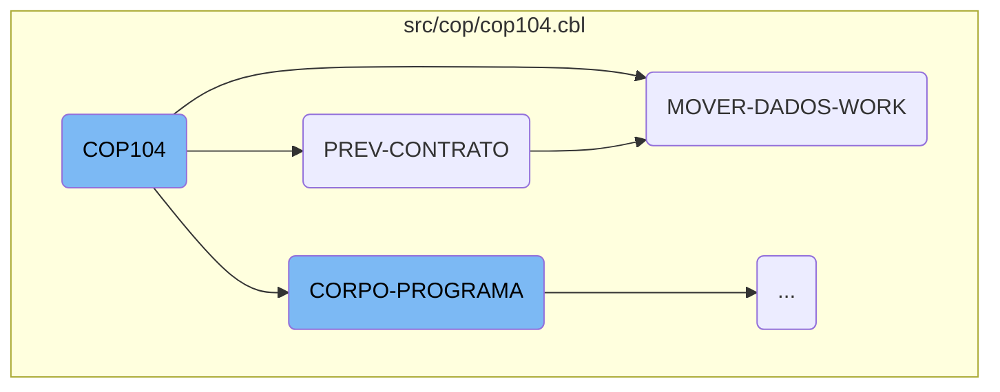

This document explains the <SwmToken path="src/cop/cop104.cbl" pos="3:6:6" line-data="       PROGRAM-ID. COP104.">`COP104`</SwmToken> program, which is a key component in the Kello Imagens business operations management system. The program is responsible for initializing the system, handling contract predictions, moving and transforming data, evaluating conditions, and processing sales and production data.

The <SwmToken path="src/cop/cop104.cbl" pos="3:6:6" line-data="       PROGRAM-ID. COP104.">`COP104`</SwmToken> program starts by initializing the system and setting up necessary parameters. It then handles contract predictions by processing contract data and updating statuses. Next, it moves and transforms data into the work register, ensuring data consistency. The program evaluates various conditions to determine which operations to execute, such as centralizing data, printing reports, and saving work data. Finally, it processes sales and production data by performing calculations and data movements to prepare the data for further processing.

Here is a high level diagram of the flow, showing only the most important functions:

```mermaid
graph TD;
      subgraph src/cop/cop104.cbl
a7a1d0cb8083fb2fad3032d396c83bd83e7f400b3dd6735619119ec965454ae8(COP104):::mainFlowStyle --> 9d21cf8a23375c909f39e592039fd53fdb1e959543cf7f84aba55c06fdfd26c2(PREV-CONTRATO)
end

subgraph src/cop/cop104.cbl
a7a1d0cb8083fb2fad3032d396c83bd83e7f400b3dd6735619119ec965454ae8(COP104):::mainFlowStyle --> c516c418a646420f4aa41365a94675909de811ef9c67c3cac6ace2167a7fdcfe(MOVER-DADOS-WORK)
end

subgraph src/cop/cop104.cbl
a7a1d0cb8083fb2fad3032d396c83bd83e7f400b3dd6735619119ec965454ae8(COP104):::mainFlowStyle --> 57fa2c5d027fa3549a3997e5625239ff3d2691c8fb6aafe670beab87d130e1ff(CORPO-PROGRAMA):::mainFlowStyle
end

subgraph src/cop/cop104.cbl
57fa2c5d027fa3549a3997e5625239ff3d2691c8fb6aafe670beab87d130e1ff(CORPO-PROGRAMA):::mainFlowStyle --> 93113ae1f7789d4af43c608d785e3a46b7ec07a7d39cea8e89436283e5bca7a7(GRAVA-WORK):::mainFlowStyle
end

subgraph src/cop/cop104.cbl
93113ae1f7789d4af43c608d785e3a46b7ec07a7d39cea8e89436283e5bca7a7(GRAVA-WORK):::mainFlowStyle --> 9d21cf8a23375c909f39e592039fd53fdb1e959543cf7f84aba55c06fdfd26c2(PREV-CONTRATO)
end

subgraph src/cop/cop104.cbl
93113ae1f7789d4af43c608d785e3a46b7ec07a7d39cea8e89436283e5bca7a7(GRAVA-WORK):::mainFlowStyle --> 4c2cb8b8f75940a4ac8c8654931700be8839866f5bf7073de13470ce5fceccfb(DATA-VENDA-PRODUCAO):::mainFlowStyle
end


      classDef mainFlowStyle color:#000000,fill:#7CB9F4
classDef rootsStyle color:#000000,fill:#00FFF4
classDef Style1 color:#000000,fill:#00FFAA
classDef Style2 color:#000000,fill:#FFFF00
classDef Style3 color:#000000,fill:#AA7CB9

%% Swimm:
%% graph TD;
%%       subgraph <SwmPath>[src/cop/cop104.cbl](src/cop/cop104.cbl)</SwmPath>
%% a7a1d0cb8083fb2fad3032d396c83bd83e7f400b3dd6735619119ec965454ae8(COP104):::mainFlowStyle --> 9d21cf8a23375c909f39e592039fd53fdb1e959543cf7f84aba55c06fdfd26c2(PREV-CONTRATO)
%% end
%% 
%% subgraph <SwmPath>[src/cop/cop104.cbl](src/cop/cop104.cbl)</SwmPath>
%% a7a1d0cb8083fb2fad3032d396c83bd83e7f400b3dd6735619119ec965454ae8(COP104):::mainFlowStyle --> c516c418a646420f4aa41365a94675909de811ef9c67c3cac6ace2167a7fdcfe(MOVER-DADOS-WORK)
%% end
%% 
%% subgraph <SwmPath>[src/cop/cop104.cbl](src/cop/cop104.cbl)</SwmPath>
%% a7a1d0cb8083fb2fad3032d396c83bd83e7f400b3dd6735619119ec965454ae8(COP104):::mainFlowStyle --> 57fa2c5d027fa3549a3997e5625239ff3d2691c8fb6aafe670beab87d130e1ff(CORPO-PROGRAMA):::mainFlowStyle
%% end
%% 
%% subgraph <SwmPath>[src/cop/cop104.cbl](src/cop/cop104.cbl)</SwmPath>
%% 57fa2c5d027fa3549a3997e5625239ff3d2691c8fb6aafe670beab87d130e1ff(CORPO-PROGRAMA):::mainFlowStyle --> 93113ae1f7789d4af43c608d785e3a46b7ec07a7d39cea8e89436283e5bca7a7(GRAVA-WORK):::mainFlowStyle
%% end
%% 
%% subgraph <SwmPath>[src/cop/cop104.cbl](src/cop/cop104.cbl)</SwmPath>
%% 93113ae1f7789d4af43c608d785e3a46b7ec07a7d39cea8e89436283e5bca7a7(GRAVA-WORK):::mainFlowStyle --> 9d21cf8a23375c909f39e592039fd53fdb1e959543cf7f84aba55c06fdfd26c2(PREV-CONTRATO)
%% end
%% 
%% subgraph <SwmPath>[src/cop/cop104.cbl](src/cop/cop104.cbl)</SwmPath>
%% 93113ae1f7789d4af43c608d785e3a46b7ec07a7d39cea8e89436283e5bca7a7(GRAVA-WORK):::mainFlowStyle --> 4c2cb8b8f75940a4ac8c8654931700be8839866f5bf7073de13470ce5fceccfb(DATA-VENDA-PRODUCAO):::mainFlowStyle
%% end
%% 
%% 
%%       classDef mainFlowStyle color:#000000,fill:#7CB9F4
%% classDef rootsStyle color:#000000,fill:#00FFF4
%% classDef Style1 color:#000000,fill:#00FFAA
%% classDef Style2 color:#000000,fill:#FFFF00
%% classDef Style3 color:#000000,fill:#AA7CB9
```



# Flow drill down

First, we'll zoom into this section of the flow:



<SwmSnippet path="/src/cop/cop104.cbl" line="653">

---

## <SwmToken path="src/cop/cop104.cbl" pos="3:6:6" line-data="       PROGRAM-ID. COP104.">`COP104`</SwmToken>

The <SwmToken path="src/cop/cop104.cbl" pos="3:6:6" line-data="       PROGRAM-ID. COP104.">`COP104`</SwmToken> function is the main entry point of the flow. It initializes the program and sets up the necessary parameters.

```cobol
       MAIN-PROCESS SECTION.
           PERFORM INICIALIZA-PROGRAMA.
```

---

</SwmSnippet>

<SwmSnippet path="/src/cop/cop104.cbl" line="1320">

---

## <SwmToken path="src/cop/cop104.cbl" pos="1320:1:3" line-data="       PREV-CONTRATO SECTION.">`PREV-CONTRATO`</SwmToken>

The <SwmToken path="src/cop/cop104.cbl" pos="1320:1:3" line-data="       PREV-CONTRATO SECTION.">`PREV-CONTRATO`</SwmToken> function handles the contract prediction logic. It processes the contract data, performs necessary calculations, and updates the status based on the contract's timeline.

```cobol
       PREV-CONTRATO SECTION.
*          IF USUARIO-W = "ANDER"
*             DISPLAY "PREVISAO DE CONTRATO = " AT 0130
*          END-IF
*
*          STOP " "

           MOVE GS-MESANO-INI  TO MESANO-W
           MOVE MESANO-W(1: 2) TO MESANO-I(5: 2)
           MOVE MESANO-W(3: 4) TO MESANO-I(1: 4)
           MOVE MESANO-I       TO MESANO-INI
           MOVE GS-MESANO-FIM  TO MESANO-W
           MOVE MESANO-W(1: 2) TO MESANO-I(5: 2)
           MOVE MESANO-W(3: 4) TO MESANO-I(1: 4)
           MOVE MESANO-I       TO MESANO-FIM


           MOVE MESANO-INI     TO MESANO-PREV-CO40
           MOVE ZEROS          TO NR-CONTRATO-CO40
           START COD040 KEY IS NOT < ALT1-CO40 INVALID KEY
                 MOVE "10" TO ST-COD040.
```

---

</SwmSnippet>

<SwmSnippet path="/src/cop/cop104.cbl" line="1359">

---

## <SwmToken path="src/cop/cop104.cbl" pos="1359:1:5" line-data="       MOVER-DADOS-WORK SECTION.">`MOVER-DADOS-WORK`</SwmToken>

The <SwmToken path="src/cop/cop104.cbl" pos="1359:1:5" line-data="       MOVER-DADOS-WORK SECTION.">`MOVER-DADOS-WORK`</SwmToken> function is responsible for moving and transforming data into the work register. It performs various calculations, updates records, and ensures data consistency.

```cobol
       MOVER-DADOS-WORK SECTION.
           INITIALIZE REG-WORK.
      *    IF STATUS-CO40 < 50
      *       CONTINUE
      *    ELSE
              PERFORM PESQUISAR-STATUS
              IF ACHEI = "S"
                 MOVE CIDADE-CO40        TO CIDADE
                 READ CAD010 INVALID KEY
                      MOVE SPACES TO NOME-CID
                      MOVE SPACES TO UF-CID
                      MOVE ZEROS  TO REGIAO-CID
                 END-READ
                 IF GS-UF = SPACES OR UF-CID
                    IF GS-REGIAO = ZEROS OR REGIAO-CID
                       MOVE MESANO-PREV-CO40   TO MESANO-WK
                       MOVE NR-CONTRATO-CO40   TO CONTRATO-WK
                       MOVE NOME-CID           TO CIDADE-WK
                       MOVE REGIAO-CID         TO CODIGO-REG
                       READ CAD012 INVALID KEY
                            MOVE SPACES TO NOME-REG
```

---

</SwmSnippet>

Now, lets zoom into this section of the flow:

```mermaid
graph TD;
      subgraph src/cop/cop104.cbl
57fa2c5d027fa3549a3997e5625239ff3d2691c8fb6aafe670beab87d130e1ff(CORPO-PROGRAMA):::mainFlowStyle --> 93113ae1f7789d4af43c608d785e3a46b7ec07a7d39cea8e89436283e5bca7a7(GRAVA-WORK):::mainFlowStyle
end

subgraph src/cop/cop104.cbl
93113ae1f7789d4af43c608d785e3a46b7ec07a7d39cea8e89436283e5bca7a7(GRAVA-WORK):::mainFlowStyle --> 9d21cf8a23375c909f39e592039fd53fdb1e959543cf7f84aba55c06fdfd26c2(PREV-CONTRATO)
end

subgraph src/cop/cop104.cbl
93113ae1f7789d4af43c608d785e3a46b7ec07a7d39cea8e89436283e5bca7a7(GRAVA-WORK):::mainFlowStyle --> 4c2cb8b8f75940a4ac8c8654931700be8839866f5bf7073de13470ce5fceccfb(DATA-VENDA-PRODUCAO):::mainFlowStyle
end

subgraph src/cop/cop104.cbl
9d21cf8a23375c909f39e592039fd53fdb1e959543cf7f84aba55c06fdfd26c2(PREV-CONTRATO) --> c516c418a646420f4aa41365a94675909de811ef9c67c3cac6ace2167a7fdcfe(MOVER-DADOS-WORK)
end


      classDef mainFlowStyle color:#000000,fill:#7CB9F4
classDef rootsStyle color:#000000,fill:#00FFF4
classDef Style1 color:#000000,fill:#00FFAA
classDef Style2 color:#000000,fill:#FFFF00
classDef Style3 color:#000000,fill:#AA7CB9

%% Swimm:
%% graph TD;
%%       subgraph <SwmPath>[src/cop/cop104.cbl](src/cop/cop104.cbl)</SwmPath>
%% 57fa2c5d027fa3549a3997e5625239ff3d2691c8fb6aafe670beab87d130e1ff(CORPO-PROGRAMA):::mainFlowStyle --> 93113ae1f7789d4af43c608d785e3a46b7ec07a7d39cea8e89436283e5bca7a7(GRAVA-WORK):::mainFlowStyle
%% end
%% 
%% subgraph <SwmPath>[src/cop/cop104.cbl](src/cop/cop104.cbl)</SwmPath>
%% 93113ae1f7789d4af43c608d785e3a46b7ec07a7d39cea8e89436283e5bca7a7(GRAVA-WORK):::mainFlowStyle --> 9d21cf8a23375c909f39e592039fd53fdb1e959543cf7f84aba55c06fdfd26c2(PREV-CONTRATO)
%% end
%% 
%% subgraph <SwmPath>[src/cop/cop104.cbl](src/cop/cop104.cbl)</SwmPath>
%% 93113ae1f7789d4af43c608d785e3a46b7ec07a7d39cea8e89436283e5bca7a7(GRAVA-WORK):::mainFlowStyle --> 4c2cb8b8f75940a4ac8c8654931700be8839866f5bf7073de13470ce5fceccfb(DATA-VENDA-PRODUCAO):::mainFlowStyle
%% end
%% 
%% subgraph <SwmPath>[src/cop/cop104.cbl](src/cop/cop104.cbl)</SwmPath>
%% 9d21cf8a23375c909f39e592039fd53fdb1e959543cf7f84aba55c06fdfd26c2(PREV-CONTRATO) --> c516c418a646420f4aa41365a94675909de811ef9c67c3cac6ace2167a7fdcfe(MOVER-DADOS-WORK)
%% end
%% 
%% 
%%       classDef mainFlowStyle color:#000000,fill:#7CB9F4
%% classDef rootsStyle color:#000000,fill:#00FFF4
%% classDef Style1 color:#000000,fill:#00FFAA
%% classDef Style2 color:#000000,fill:#FFFF00
%% classDef Style3 color:#000000,fill:#AA7CB9
```



<SwmSnippet path="/src/cop/cop104.cbl" line="776">

---

## <SwmToken path="src/cop/cop104.cbl" pos="776:1:3" line-data="       CORPO-PROGRAMA SECTION.">`CORPO-PROGRAMA`</SwmToken>

The <SwmToken path="src/cop/cop104.cbl" pos="776:1:3" line-data="       CORPO-PROGRAMA SECTION.">`CORPO-PROGRAMA`</SwmToken> section evaluates various conditions and performs corresponding actions. It checks flags like <SwmToken path="src/cop/cop104.cbl" pos="778:3:7" line-data="               WHEN GS-CENTRALIZA-TRUE">`GS-CENTRALIZA-TRUE`</SwmToken>, <SwmToken path="src/cop/cop104.cbl" pos="781:3:9" line-data="               WHEN GS-PRINTER-FLG-TRUE">`GS-PRINTER-FLG-TRUE`</SwmToken>, and <SwmToken path="src/cop/cop104.cbl" pos="786:3:11" line-data="               WHEN GS-GRAVA-WORK-FLG-TRUE">`GS-GRAVA-WORK-FLG-TRUE`</SwmToken> to determine which operations to execute, such as centralizing data, verifying password status, printing reports, and saving work data.

```cobol
       CORPO-PROGRAMA SECTION.
           EVALUATE TRUE
               WHEN GS-CENTRALIZA-TRUE
                    PERFORM CENTRALIZAR
                    PERFORM VERIFICAR-SENHA-STATUS
               WHEN GS-PRINTER-FLG-TRUE
                    COPY IMPRESSORA.CHAMA.
                    IF LNK-MAPEAMENTO <> SPACES
                       PERFORM IMPRIME-RELATORIO
                    END-IF
               WHEN GS-GRAVA-WORK-FLG-TRUE
                    MOVE "Deseja Realmente Carregar os Dados ?" TO
                    MENSAGEM
                    MOVE "Q" TO TIPO-MSG
                    PERFORM EXIBIR-MENSAGEM
                    IF RESP-MSG = "S"
                       PERFORM GRAVA-WORK
                       PERFORM ZERA-VARIAVEIS
                       PERFORM CARREGA-LISTA
                    END-IF
               WHEN GS-CARREGA-LISTA-FLG-TRUE
```

---

</SwmSnippet>

<SwmSnippet path="/src/cop/cop104.cbl" line="977">

---

## <SwmToken path="src/cop/cop104.cbl" pos="977:1:3" line-data="       GRAVA-WORK SECTION.">`GRAVA-WORK`</SwmToken>

The <SwmToken path="src/cop/cop104.cbl" pos="977:1:3" line-data="       GRAVA-WORK SECTION.">`GRAVA-WORK`</SwmToken> section handles the preparation and saving of work data. It checks the status of the work, opens and closes the work file, and evaluates the filter operation to determine whether to perform <SwmToken path="src/cop/cop104.cbl" pos="1011:1:5" line-data="       DATA-VENDA-PRODUCAO SECTION.">`DATA-VENDA-PRODUCAO`</SwmToken> or <SwmToken path="src/cop/cop104.cbl" pos="1320:1:3" line-data="       PREV-CONTRATO SECTION.">`PREV-CONTRATO`</SwmToken>.

```cobol
       GRAVA-WORK SECTION.
           IF ST-WORK NOT = "35"
              CLOSE       WORK
              DELETE FILE WORK.

           ACCEPT VARIA-W FROM TIME
           OPEN OUTPUT WORK
           CLOSE       WORK
           OPEN I-O    WORK

           MOVE "TELA-AGUARDA" TO DS-PROCEDURE
           PERFORM CALL-DIALOG-SYSTEM

*          IF USUARIO-W = "ANDER"
*             DISPLAY ERASE AT 0101
*             DISPLAY "GS-OP-FILTRO = " AT 0101
*             DISPLAY  GS-OP-FILTRO     AT 0125
*
*             DISPLAY "GS-BRINDE    = " AT 0201
*             DISPLAY  GS-BRINDES       AT 0225
*
```

---

</SwmSnippet>

<SwmSnippet path="/src/cop/cop104.cbl" line="1011">

---

## <SwmToken path="src/cop/cop104.cbl" pos="1011:1:5" line-data="       DATA-VENDA-PRODUCAO SECTION.">`DATA-VENDA-PRODUCAO`</SwmToken>

The <SwmToken path="src/cop/cop104.cbl" pos="1011:1:5" line-data="       DATA-VENDA-PRODUCAO SECTION.">`DATA-VENDA-PRODUCAO`</SwmToken> section processes sales and production data. It initializes records, sets date ranges, opens auxiliary files, evaluates data operations, and performs various calculations and data movements to prepare the sales and production data for further processing.

```cobol
       DATA-VENDA-PRODUCAO SECTION.
*          IF USUARIO-W = "ANDER"
*             DISPLAY "DATA VENDA PRODUCAO = " AT 0130
*          END-IF

           INITIALIZE REG-RCD100

           MOVE GS-DATA-INI TO DATA-INV
           CALL "GRIDAT2" USING DATA-INV
           MOVE DATA-INV    TO VECTO-INI
           MOVE GS-DATA-FIM TO DATA-INV
           CALL "GRIDAT2" USING DATA-INV
           MOVE DATA-INV    TO VECTO-FIM

           OPEN OUTPUT AUXILIAR AUXILIAR2
           CLOSE       AUXILIAR AUXILIAR2
           OPEN I-O    AUXILIAR AUXILIAR2

*          IF USUARIO-W = "ANDER"
*             DISPLAY "GS-OP-DATA = " AT 0301
*             DISPLAY GS-OP-DATA      AT 0325
```

---

</SwmSnippet>

&nbsp;

*This is an auto-generated document by Swimm AI 🌊 and has not yet been verified by a human*

<SwmMeta version="3.0.0" repo-id="Z2l0aHViJTNBJTNBa2VsbG8lM0ElM0Fzd2ltbWlv" repo-name="kello"><sup>Powered by [Swimm](/)</sup></SwmMeta>
